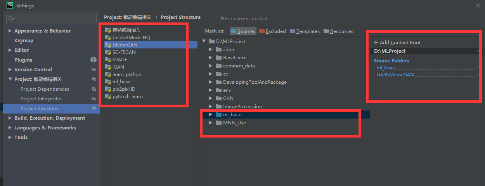

python里面列表乘以一个数，不是数乘，而是扩大列表尺寸？？？这又是什么反常语法
[1] * 2 = [2, 2]
反常语法

1、变量后面注释 `#type: Image.Image`


2、使用isinstance指定


python的max，min,等类似函数   
里面可以直接传入多个相同类型的数，注意类型一样，不一样可能转换，转化不了就报错  
然后后面还可以加一个明明参数key=xxx, 就是函数或者lambda表达式，表示对比较列表中的元素先做某种处理之后在比较，注意最后返回的还是原始  
这种方式是有利于提示时空效率的  
max()

## yield语法

使用了yield的函数不再是普通的函数，执行函数后会从yield位置返回，python会记录函数的状态，包括方法内部的临时变量，当再次执行函数时，代码从 yield b 的下一条语句继续执行，直到再次遇到yield，
进一步的这样的函数可以被看成一种生成器，也可以看成迭代器，可以调用next() 方法，不用自己写，可以放到迭代语句中

例子

```
def fab(max):
    n, a, b = 0, 0, 1
    while n < max:
        yield b
        # print b
        a, b = b, a + b
        n = n + 1
```

要以此生成多个斐波那契数时，使用yield, 可以更方便的使用。 更深层的说，这就是一种有状态方法，不同于我们一般的无状态方法，yield对应的方法会记录运行过程中的一些状态

也可以手动调用 fab(5) 的 next() 方法（因为 fab(5) 是一个 generator 对象，该对象具有 next() 方法），这样我们就可以更清楚地看到 fab 的执行流程：

清单 6. 执行流程

参数解析器的使用：  
parser = argparse.ArgumentParser()  
这个玩意真不咋地，好几个坑的地方  
1、定义的参数里面的减号-可以自动替换成下划线_  我用得着你多此一举，都最后结果别人找不到谁对应谁，find操作也不好找  
2、参数不用输全就可以起作用，这多此一举吧，说不定别人根本就不想设置这个参数呢？？？  
3、在pycharm 里面，同样的输入，调试和运行解析的到参数经验不一样，找不到原因？？？？

# 注意python的 and or

这和其它语言的逻辑运算不同，逻辑运算返回真/假  
这个是返回的对象  
or返回遇到的第一个非空对象，包括字符串非空  
andand 在布尔上下文中从左到右演算表达式的值，如果布尔上下文中的所有值都为真，那么 and 返回最后一个值。  
如果布尔上下文中的某个值为假，则 and 返回第一个假值

# zip()

函数用于将可迭代的对象作为参数，将对象中对应的元素打包成一个个元组，然后返回由这些元组组成的列表  
zip( iterable, ...) 注意里面的迭代器可以是多个，不是只能2个  
如果各个迭代器的元素个数不一致，则返回列表长度与最短的对象相同，利用 * 号操作符，可以将元组解压为列表  
另外在 Python 3.x 中为了减少内存，zip() 返回的是一个对象。如需展示列表，需手动 list() 转换

# 导入包 导入模块

同一个项目目录下的，文件夹上右键，make source as 或者打开项目结构 子目录选中 右键 source 项目目录不同 把它们的共同父目录作为项目根目录，重新打开，或者在项目结构那里，先删除content
root，再加上共同根目录即可  


any 判断迭代器是否包含至少一个元素为true all 判断迭代器是否所有元素都为true

动态导入模块， lib = importlib.import_module(模块x相对路径)
然后可以使用x内部的所有类，包括x中的import语句里面的哪些模块类 lib.C #取出class C lib.C.c #取出class C 中的c 方法 或者lib.__dict__.items()
方法模块内部所有的类名字和类对象形成的dict对

捕获异常

```python

try:
    ...
except Exception as e:  # Exception就是异常根父类
    ...
    raise e   
```

# 文件相关

创建目录 os.makedirs

获取父目录路径 os.path.dirname('...') # 注意写的是名字，实际上就是路径 os.path.split(path)[0]
获取路径中的文件名

# 带后缀

os.path.basename(path)
或者 os.path.split(path)[1]

# 不带后缀

os.path.splitext(带后缀的文件名)[0]
获取后缀 os.path.splitext(path)[1] # 带有一个.

os.walk 遍历整个目录树，包含自己 for root, dir_list, file_list in os.walk(path)
第一个是文件夹，第二个是文件夹下面的文件夹名字列表，第三个是文件夹下面的文件的名字列表 
如果想要只处理一级目录下的，那么只处理它的第一组返回值就行了

# 图片相关

# PIL

for PIL import Image 打开图片文件,支持PNG，透明度在第4通道 Image.open(path)

与numpy互相转换 numpy.array(im)
Image.fromarray(img.astype('uint8')).convert('RGB')

# 注意PIL支持的数据格式为只能是np.uint8

显示图片 plt.figure("dog")
plt.imshow(src)
plt.show()

保存图片 im.save(path)

## PIL访问图片size

长宽直接访问 通道数用np.ndim(image)

PIL转换成tensor
transforms.ToTensor()(x)

# 关于python的self

要理解python 的self，self就是python的对象的根，可以看成c++里面的对象指针。python的成员就是绑定到这个self上，这个绑定是动态的，然后并且python在类内部也没有隐藏这个机制，都需要手动绑定，所以方法要主动传入self，添加成员要手动绑定到self。

# 3、继承和多态

和Java不同，Python采用多继承。
**鸭子类型**： 由于Python是动态语言，和静态语言不同的是，传入的对象并不需要是某个类的子类（属于某一类族），只需要它具有那些需要调用的方法即可。这就是Python的鸭子类型，"
一个对象只要看起来像鸭子，走起路来像鸭子，就可以被看做是鸭子"。

注意父类成员和之类成员之间的继承关系
- Python里面的继承只会继承类成员，不会继承实例成员。
- Python不主动调用父类初始化，要手动调用，方式如下
1、super().__init__(处理self的其它参数)

还有两种语法规定的形式，难以理解，不管它
2、父类名.__init__(self,其它参数)
3、super(子类名, self).__init__()

- 要注意的一点，如果子类没有`__init__` 方法，创建对象时编译器会自动调用父类的初始化方法，如果不按父类的`__init()__`来创建对象，会错误，创建了就覆盖了，只调用子类的初始化方法。

# 字符串

判断子串 a in b 字符串结尾 开始 a.endswith(b),a.startsWith(b)

# 成员 属性 方法 相关

获取属性名字和值列表 self.__dict__

正则式： 语法和java差不多 在re包中 一般使用查找 re.findall(pattern, path)
返回列表 还可以使用分组，具体待查

python里面的一切接对象，函数也是对象，那么如何创建使用函数对象：
创建：
m = 方法名，不加括号
调用
m(参数)

区别于类对象
类对象创建的时候要加括号

切片操作
::两个冒号，大概表示每隔xx个切片

# dict
a.update(b) # 把b的键值对更新到a中
python字典遍历的几种方法
（1）遍历key值
a = {'a': '1', 'b': '2', 'c': '3'}
>>> for key in a:
print(key+':'+a[key])
a:1
b:2
c:3
默认遍历的是key
>>> for key in a.keys():
print(key+':'+a[key])

（2）遍历value值
>>> for value in a.values():
print(value)
（3）遍历字典项
>>> for kv in a.items():
print(kv)
('a', '1')
('b', '2')
('c', '3')
（4）遍历字典健值
>>> for key,value in a.items():
print(key+':'+value)

 
小技巧:
