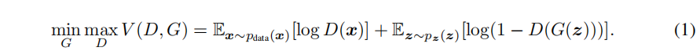
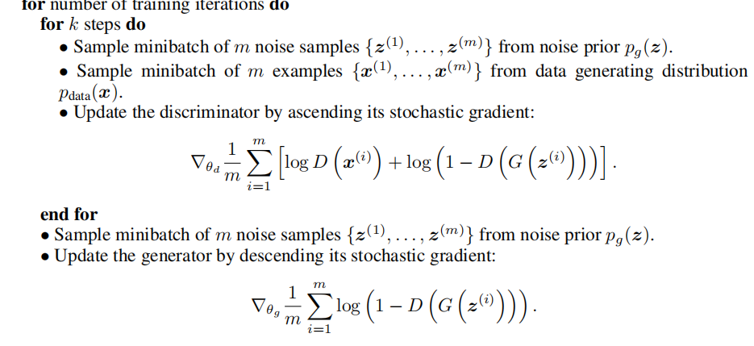
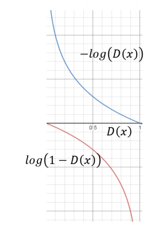
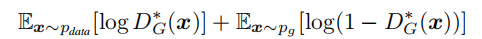
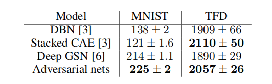
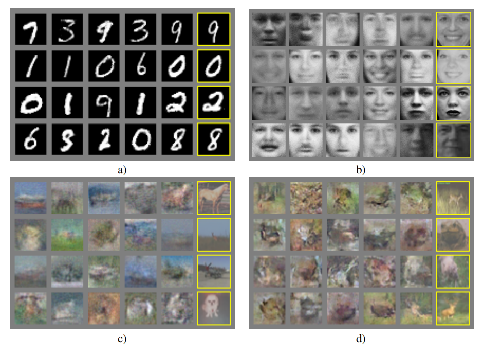
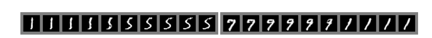

Generative Adversarial Nets
总结：
1、注意，GAN是一个框架，不绑定到具体的算法模型，也就是生成器和判别器可以用不同的算法模型，应该是差不多是一个函数拟合器就行了，目前的MLP，CNN，Transformer都有了。本文中生成器判别器都是使用的是MLP
2、文中说了，可以给不同的层传入信息，文中的例子只对输入层传入信息，典型的StyleGAN就不同的层传入信息。

# 译文：
## 摘要
我们提出一种新的框架，通过一个对抗过程估计生成模型，在框架里面我们"**同时地**训练两个模型：一个生成模型用来获取数据分布，一个判别器D估计一个样本是来自训练数据集而不是G的概率。（分类就是估计概率）。 这个框架对应于两个游戏者的最大最小游戏。在任意函数G和D的空间，一个唯一的解决方案存在，就是G覆盖了训练数据分布时，然后D在分布的任意位置都等于1/2.本例中生成器和判别器定义为多层感知机，整个系统可以使用反向传播训练。这里不需要...略。

## 引言：
深度学习的前景是发现丰富的层次化模型[2]，它们代表了在人工智能应用程序中遇到的数据类型上的概率分布，如自然图像、包含语音的音频波形和自然语言语料库中的符号。到目前为止，在深度学习方面最显著的成功都涉及到鉴别性的模型，通常是那些将高维、丰富的感官输入映射到类标签[14,22]的模型。这些惊人的成功主要是基于反向传播和dropout out算法，使用具有特别良好梯度的分段线性单位[19,9,10]（注：激活函数）。深度生成模型没有受到这么大的影响，由于在极大似然估计和相关策略中出现的，许多的棘手的概率计算（注：指太多？），以及在生成上下文中难以利用分段线性单元的益处。我们提出了一种新的生成模型估计程序，它避开了这些困难。（注：看得出，作者也是了解了以前的文献的，并知道了其缺陷的）

在提出的生成模型中，生成模型与它的对手对抗，一个判别器模型，它学习一个样本是来自模型分布或者数据分布。生成模型可以被认为是类似于一个造假者团队，试图制造假货币并在没有被检测到的情况下使用它，而鉴别模型类似于警察，试图检测假币。在这个游戏中的竞争驱动两队改进他们的方法，直到仿冒品与真正的物品不可分别。

**这个模型可以为多种模型和优化方法产生指定的训练方法。**
本文中，我们探索一个特定的例子，生成模型是通过往多层感知机中传入随机噪声取样构成，判别器也是多层感知机。我们称这个特定的例子为对抗网络。在这种情况下，**我们可以只使用已经非常成功的反向传播和dropout[17]技术训练两个模型**，并且只使用正向传播训练生成模型的样本。不需要近似推断或者马克吐温链。

## 2、相关工作
具有潜在变量的有向图形模型的另一种选择是具有潜在变量的无向图形模型，如限制玻尔兹曼机器(RBMs)[27,16]、深玻尔兹曼机器(DBMs)[26]及其众多变体。 ...略
深度信念网络 ... 略
略
最近的，略。。。由于对抗网络不需要反馈循环，它们能够更好的利用分段线性单元，这提高了反向传播的性能。。。。略

## 对抗网络
当两个模型都是多层感知机是对抗模型框架可以被最直接的使用。为了学习的生成器的在数据x上的分布p_g，我们定义一个先验p_z(z),然后提出一个映射到数据空间的G(z:θ_g)，G是一个可微分的多层感知机，参数是θ_g。我们也定义一个多层感知器组成的判别器D(x;θ_d), 输出一个标量，代表x来自训练数据的概率。我们训练D最大化将正确的标签分配给训练样本或者生成样本的概率。我们同时训练G最小化log(1-D(x)). (注意，这里面提到的先验p_z(z)，是不是把它理解成耦合的特征向量=潜空间的向量，那么这样的数据是比较符合正态分布的)

换句话说，D和G玩下面有值函数V(G,D)的双人极大极小游戏。

下一节中，我们为对抗网络提出一个理论分析，本质上表明，训练准则允许人们恢复数据分布，只要G和D有足够的容量，在非参数限制下。有关该方法的更不那么正式、更有教学意义的解释，请见图1。在实践中，我们必须使用一种迭代的数值方法来实现这个游戏。在训练的内部循环中完成最优化D以完成训练在计算上是不可能的，并且在有限的数据集上会导致过拟合。相反，我们在优化D k步，和优化G1步交替进行。这导致只要G保持变化足够慢，D就保持在最优解附近。（注：这里意思我的推测就是说，从数学原理上说，详见下一节，最大化的D相当于Pg与Pdata分布之间的距离，要让D足够接近最值，然后G相对D要走慢一些，不然D就不是距离度量了，然后作者后面k取的1，也就是说1:1的更新速度不算快，从直观上里面，D画出分界线，G寻找漏洞，速度差不多吗？）这个策略类似于xxx论文中的方式，略。该程序在算法1中正式提出。
算法流程

## 4 理论结果分析
真实数据分布$P_{data}$,生成数据分布$P_G$, 注意$P_G$不是G，G是一个函数，也就是映射，将其它分布的数据z，映射为x，x服从分布$P_G$, 然后再通过某种度量，比如KL散度，来度量$P_G$与$P_data$之间的差别，让这个度量值越小，分布$P_G$也就越接近$P_data$，也就意味着我们找到了真实数据分布𝑃𝑑𝑎𝑡𝑎(𝑥)的近似解，也就意味着我们能够生成各种各样符合真实分布规律的数据。

GAN的目标函数：
$V(G,D) = E_{x\text{\textasciitilde}P_{data}}log(D(x)) + E_{x\text{\textasciitilde}P_G}log(1-D(x))$

把它们转换成积分的形式：

$$
\begin{aligned}
 V(G,D) &= \int \limits_x P_{data}(x) log(D(x)) dx  + \int\limits_xP_G(x)log(1-D(x))dx \\
   &=\int\limits_xP_{data}(x)log(D(x)) + P_G(x)log(1-D(x)) dx \tag{1}
\end{aligned}  
$$
注意这个转换不是从单个样本，或者训练集有限样本角度做等价转换，而是从总体角度做等价转换，有点极限的意思。

里面的积分区间x表示的是目标图像分布的总体，或者生成器分布的总体，p_g(x)和p_data(x)现在指的不是单个样本个体的概率（1/n)，而是这个样本的概率（样本对应所有个体在总体中的概率），这样的样本即在data中存在，也在g中存在，不要以为在另一个中是0。

然后求使得这个积分最大的D(x),
对于每个x，映射到一个$y=D^*(x)$，这个$D^*$是使得被积式$P_{data}(x)log(D(x)) + P_G(x)log(1-D(x)) （1）$ 最大的$D^*$，注意D(x)是一个函数，而且可以是一个特殊的函数，对于非函数参数f(x:θ),θ可能导致f(x)部分区域变大，部分区域变小，所以不一定存在处处$f(x:θ^*) >= f(x:θ^{other})$，但是对于函数参数来说，D(x)可以处处使用不同的值，那么就能满足处处最大了.每个x处对应的被积表达式的式子取最大值，自然的积分就是最大值咯。

积分表达式内部$p_{data}(x)，p_G(x)$此时是常数，求D(x)不需要求到x这一层，所以上市可以化简为$f(z) = alog(z) + blog(1-z)$形式求最值，求1阶零点$D^*$ , 再求2阶导<0，可以得到$D^*(x) = \frac{P_data(x)}{P_data(x) + P_G(x)}$

这就是最值点，将最值点代入原来的积分式(1),得到：
$$
\begin{aligned}
V(G, D^*)  &= \int\limits_x P_{data}(x)log(\frac{P_{data}(x)}{P_{data}(x) + P_G(x)}) + P_G(x)log(\frac{P_G(x)}{P_{data}(x) +P_G(x)}) dx \\
分子分母同时除以2 \\
&=\int\limits_x P_{data}(x) log(\frac{P_{data}(x) / 2}{(P_{data}(x) + P_G(x))/2}) + P_G(x)log( \frac {P_G(x) / 2} {(P_{data}(x) +P_G(x)) / 2}) dx  \\
&= 2log1/2 + \int\limits_x P_{data}(x) log(\frac{P_{data}(x) }{(P_{data}(x) + P_G(x))/2}) + P_G(x)log\frac{P_G(x) }{(P_{data}(x) +P_G(x) / 2}) dx  \\
积分拆回去 \\
&=-2log2 + \int\limits_x P_{data}(x) log\frac{P_{data}(x) }{(P_{data}(x) + P_G(x))/2}dx + \int\limits_xP_G(x)log\frac{P_G(x) }{(P_{data}(x) +P_G(x)) / 2} dx \\
&=-2log2 + KL(P_{data} || \frac{P_{data} + P_G}{2}) + KL(P_{G} || \frac{P_{data} + P_G}{2}) \\
&=-log4+2JSD(P_{data}|| P_G)
\end{aligned}
$$
最后变成了jsd距离  小点，上面可以看出最小值是-log4
自此，知道了求使得V最大的D的，得到的结果为$D^*$,将$D^*$带回去得到的V就是表示$P_G$与$P_{data}$之间的JS距离 训练过程中更新D参数的时候，就是在把D往$D^*上$面靠
然后，再回到生成器上面，生成器最小化V，就是最小化JS距离。  

要注意到的是，上面是理论上的，是精确的计算，实际训练训练过程中是难以达成或者不可能的，很多地方是做的近似计算。具体的说就是  
1、更新D时，对于一个固定的G，更新几步D得到的不是最终的D*的，而是一个近似的$D^*$,想要得到最终的$D^*$几乎是不可能的。  
2、更新G时，得到G1，如果连续更新G，此时$D^*(x) = \frac{P_data(x)}{P_data(x) + P_G(x)}$是上一次的最优D，V=V(G, D^*)表示的也是上一次的距离，而不是当前$P_{G1}$和$P_{data}$之间的距离度量$JSD(P_{data}|| P_G)$了，这时候G的前进方向就会错误了，所以通常是更新K次D，对应更新一次G，原始论文k取的是1，这里应该也是一种近似，即上次得到的D*接近于这次的分布距离，所以取1:1没大问题。

# 目标函数的优化
考虑训练过程中的训练速度问题，原来的目标函数有两项$log(D(x)) 和 log(1-D(x)) $  均值函数E就相当于除以n，不影响了
因为一开始那段时间训练生成器时，训练几次之后，D(x)会易于区分真假X，对真实x，输出接近1，对与生成的x，输出接近0的.   
在训练生成器时，只会用到第二项，如图 对于第二项，如图   
  
一开始D(x)接近0，它的导数小，这会导致生成器开始阶段训练速度慢。
训练判别器时，两项都会用到，第一项对于真实x，接近与1，导数不大不小，对于生成数据，一样的，导数小
所以，综上，原来的第二项，在开始阶段，对于训练生成器和判别器都不友好，所以有人提出改进的目标函数，把第二项换成−log(D(x))，它同样能满足目标函数的需求。再推一篇上面的过程？(待学习) 第二种 GAN 被叫做 NSGAN（Non-saturating GAN）

## 算法1的收敛性:
如果G和D有足够的容量，在算法的每一步中，D可以到达给定G时的最优的D*，然后$p_g$被更新来改进表达式

然后$p_g$收敛到p_{data}

证明：
考虑$V(G,D) = U(p_g, D)$是上式得到最终的结果{p_g}时对应的函数，注意U（p_g, D)在p_g上是凸的。

在实践中，对抗性网络通过函数$G(z;θ_g)$代表了一个有限的$p_g$分布族，我们优化了$θ_g$，而不是$p_g$本身。使用多层感知器来定义G，在参数空间中引入了多个临界点。尽管它们缺乏理论保证，但是多层感知器在实践中的出色性能表明，它们是一个合理的可用模型。

## 5、实验
我们训练了一系列的对抗性网络数据集，包括MNIST[23]，多伦多人脸数据库(TFD)[28]，和CIFAR-10[21]。生成器使用relu激活[19,9]和sigmoid激活的混合物，而鉴别器网使用最大的[10]激活。dropout[17]应用于鉴别网的训练。虽然我们的理论框架允许在生成器的中间层使用辍学和其他噪声，但我们只使用噪声作为对生成器网络的最底层的输入。

下面这两段是讲的做评估，看不懂，关系不大，现在应该是已经不用了，作者也说了当时没有成熟的评估方法，所以用的这种
我们通过G来填充一个Gaussian Parzen window到样本来估计p_g分布下的数据集概率。（看不懂：意思就是G生成样本吧）。高斯分布的σ参数通过在验证集上做交叉验证得到。布鲁鲁等人引入了这一程序， 它用于各种生成模型中模型确切的释然不可获取的情况[25,3,5]。试验结果详见表1。  
  
这种估计似然的方法有很大的方差，在高维空间中表现得很好，但它是我们所知最好的最佳方法。可以采样但不估计释然的生成模型的进展直接激发了对如何评估这些模型的进一步研究。在图2和图3中，我们显示了训练后从生成器网采集的样本。虽然我们没有声称这些样本比现有方法生成的样本更好，但我们相信这些样本至少与文献中更好的生成模型有竞争力，并强调了对抗性框架的潜力。（注：大佬境界就是不一样啊，根本不对比做成第一，直接提出框架，说我这个有潜力！）

图2：来自模型的样本的可视化。最右的列显示了邻近样本的最近的训练示例，以证明模型没有记住训练集。样品是公平的随机抽取的，而不是精心挑选的。与大多数其他深度生成模型的可视化不同，这些图像显示了来自模型分布的实际样本，而不是给定的隐藏单位样本的条件均值。此外，由于采样过程不依赖于马尔可夫链混合，这些样本不相关。a)MNISTb)TFDc)CIFAR-10（全连接型号）d）CIFAR-10（卷积鉴别器和“反卷积”生成器）

图3：全模型z空间坐标间线性插值得到的数字。
线性插值这里就有了

## 6、优缺点
这个框架相对于其它框架有有点也有缺点。确定是$p_g(x)$没有显示的表示，并且D必须与G进行良好的同步，尤其是，没有更新D的情况下不能更新过多的G，来避免头盔情形。（注：这和前面的数学分析一致了，就是更新了G，上次的$D^*$对应的V就不是好的分布距离的度量了,即G将太多的z值折叠到相同的x值，无法有足够的多样性来建立p_data模型,直观上看就是D确定了一个分界，但是这个分界不精确，包含了很多非目标方向，g是从各个非目标方向收缩到目标区域，如果g更新过多，那么g就直接去掉了这些非目标方向，最后收到到目标区域时导致多样性缺失。）正如玻尔兹曼机器的负链必须在学习步骤之间保持最新状态一样。其优点是从来不需要马尔可夫链，只使用传播来获得梯度，在学习过程中不需要推理，并且可以在模型中加入各种函数。表2总结了生成对抗网络与其他生成建模方法的比较。

上述的优点主要是计算性的。对抗性模型也可能从生成器网络获得一些统计优势，没有直接从训练集样本更新，而是只有用鉴别器的梯度流更新。这意味着输入的组件不会直接复制到生成器的参数中。（注：就是学习整个数据集，不是单个样本，具有平滑的多样性）对抗性网络的另一个优点是，它们可以代表非常尖锐的，甚至退化的分布，而基于马尔可夫链的方法要求分布有些模糊，以便链能够在模态之间混合。

## 7、工作结论和未来的工作
这个框架允许进行许多直接的扩展：
1.通过输入中加入条件c可以得到条件生成模型p(x|c)。
2.学习到的近似推理可以通过训练一个辅助网络来预测给定x的z。这类似于由唤醒-睡眠算法[15]训练的推理网，但其优点是，在生成器网完成训练后，推理网可以被训练成一个固定的生成器网。
3.通过训练一组共享参数的条件模型，我们可以近似地建模所有的条件p(x_S|x_{S'})，其中S是x的索引的一个子集。从本质上说，我们可以使用对抗性网络来实现确定性MP-DBM[11]的随机扩展。
4.半监督学习：当标记数据有限时，来自鉴别器或推理网的特征可以提高分类器的性能。
5.效率提高：通过划分G和D协调的更好方法或在训练过程中确定z样本的更好分布，可以大大加快训练。
本文证明了对抗性建模框架的可行性，表明这些研究方向是有用的。