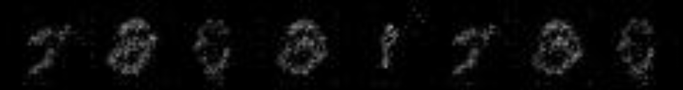

1、线性生成器配置如下

# 生成器每一层尺寸

layers = [4 * 4, 7 * 7, 14 * 14, 28 * 28]你 
增加bn，增加网络深度，隐变量维度不变，效果

增加bn，其余不变，效果

最终这个点还是bn的效果 看了网上说bn的作用是防止梯度爆炸和防止过拟合，这里加了bn之后梯度一般在±0.1之内，不加的话梯度范围会到10^±4，也就是大了3个数量级，应该就是这个原因导致了生成器梯度移动过多，最后出现模式崩溃
bn在adain, stylegan中表现出效果，除了上面说的作用之外，BN对GAN似乎有额外的作用，但具体是什么说不上

