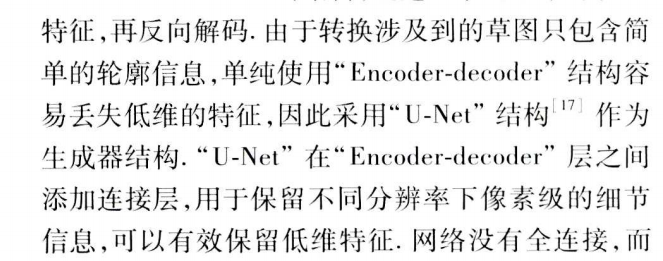

# 数据

模拟手绘图像获取：
参考哪些用到素描图像合成真实图像的，比如
https://xueshu.baidu.com/usercenter/paper/show?paperid=184k0mh01p1306w0506y0ee08h495481&site=xueshu_se

抖音团队的，生成剪纸数据的方法：
剪纸图片和普通照片的一大区别是线条。剪纸往往只有少量流畅的线条，把物体的各部分之间分得明明白白；但普通照片却很难做到这一点。
于是，算法团队想到了一种类似的画面——漫画。
他们找到了开源漫画人像数据集中的图片，经过形变、美妆、边缘检测、图片二值化、色调变化等一系列基于传统图像算法的操作，批量自动生成了剪纸画面。

加上工程操作：除了人像剪纸部分，画面上周边的装饰和发光特效素材都由设计师绘制，之后由交互工程师来整合到一起，实现用户眨眼就开始播放的效果。

草图数据集是有的，包括草图-图像配对的，见上面的论文里面
注意用户手绘草图有一定的随意性，相对标准草图会有变形，噪声等，需要模拟到

一个思路，生成的时候低分辨率的图像作为预览，用户确认是再生成高分辨率的图像
交互式编辑的一种思路

网络结构：
草图信息丢失问题，其它论文大多采用unet的结构，即编码器解码器之间增加连接

# 模型压缩
抖音团队提到的
算法团队采用了模型剪枝和蒸馏技术，在保证效果的前提下把手机算力和内存占用降到最低；同时降低美术素材大小，合并部分素材；在道具运行过程中，降低序列帧的预加载，在运行结束后及时关掉占大量算力的算法，不断优化后保证在不同手机上运行的流畅程度。

「新春萌漫」项目的算法团队曾经做过一个日漫道具的模型，当时参考的是机器学习顶会ICLR 2020上的技术成果U-GAT-IT。

GAN需要大量的数据

其它：
抖音团队的一篇博客
https://mp.weixin.qq.com/s/T-AQ5au92hd5BUzbfwPZ_A   
这样抠图的效果依靠显著物体分割算法来实现，先把图中的物体拆分出来，再进行后处理，提升边缘分割精度。

除了生活中常见的各类物体之外，你会发现一些特殊的个体，比如表情包，一样可以被分割出来。这是因为额外增加了2000张手绘图片数据集，这样不管是实体的物件还是画出来的卡通形象，都能有良好的分割效果。

上面这些抖音道具的研发们，都来自**字节跳动智能创作团队**。除了这些春节道具之外，他们还联动抖音多媒体设计师团队做过许多广受欢迎的互动道具，并且技术能力已经通过火山引擎实现了商业化，可以向第三方厂商提供服务。
