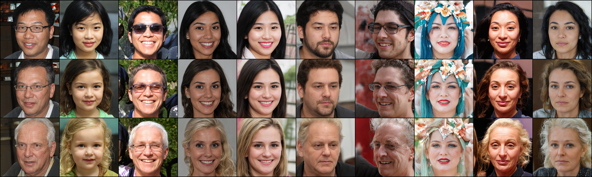
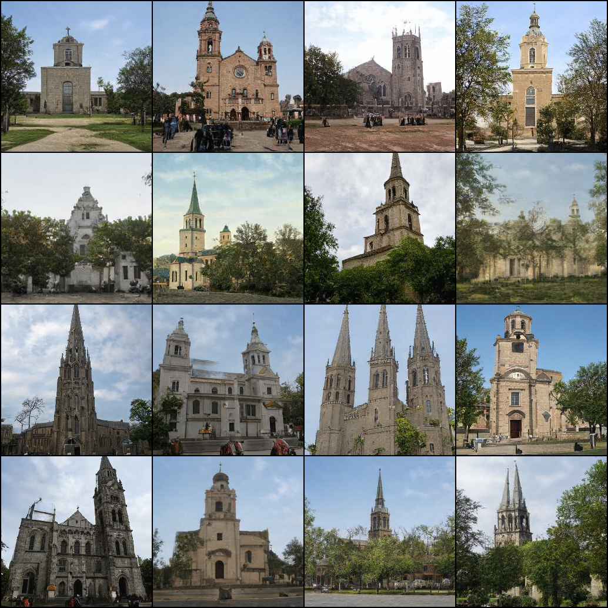

# StyleGAN 2 in PyTorch

Implementation of Analyzing and Improving the Image Quality of StyleGAN (https://arxiv.org/abs/1912.04958) in PyTorch

## Notice

I have tried to match official implementation as close as possible, but maybe there are some details I missed. So please use this implementation with care.

## Requirements

I have tested on:

- PyTorch 1.3.1
- CUDA 10.1/10.2

## Usage

First create lmdb datasets:

> python prepare_data.py --out LMDB_PATH --n_worker N_WORKER --size SIZE1,SIZE2,SIZE3,... DATASET_PATH

This will convert images to jpeg and pre-resizes it. This implementation does not use progressive growing, but you can create multiple resolution datasets using size arguments with comma separated lists, for the cases that you want to try another resolutions later.
这个命令会把图像转换为jpeg并且预先调整尺寸。这个实现不使用渐进式的增长，但是你可以使用带有逗号分隔符的列表形式的尺寸参数（就是上面的size参数)，来创建多分辨率的数据集，以便在以后尝试其他分辨率的情况下使用。
Then you can train model in distributed settings

> python -m torch.distributed.launch --nproc_per_node=N_GPU --master_port=PORT train.py --batch BATCH_SIZE LMDB_PATH

train.py supports Weights & Biases logging. If you want to use it, add --wandb arguments to the script.

#### SWAGAN

This implementation experimentally supports SWAGAN: A Style-based Wavelet-driven Generative Model (https://arxiv.org/abs/2102.06108). You can train SWAGAN by using

> python -m torch.distributed.launch --nproc_per_node=N_GPU --master_port=PORT train.py --arch swagan --batch BATCH_SIZE LMDB_PATH

As noted in the paper, SWAGAN trains much faster. (About ~2x at 256px.)
SWAGAN 可以改进 StyleGAN2的   
1. 一种分层的、基于小波的图像生成方法，实现了更好的视觉保真度和更真实的光谱。

2. 一种网络设计方法，可减少网络的自然频谱偏置倾向，从而显著减少训练高分辨率生成模型所需的计算预算。
### Convert weight from official checkpoints
从官方的检查点转换权重
You need to clone official repositories, (https://github.com/NVlabs/stylegan2) as it is requires for load official checkpoints.
克隆官方的库 因为加载官方检查点是需要它的

For example, if you cloned repositories in ~/stylegan2 and downloaded stylegan2-ffhq-config-f.pkl, You can convert it like this:
例子，如果你克隆的库在.. 然后下载了pkl文件，使用如下命令进行转换

> python convert_weight.py --repo ~/stylegan2 stylegan2-ffhq-config-f.pkl

This will create converted stylegan2-ffhq-config-f.pt file.
得到stylegan2-ffhq-config-f.pt 文件

### Generate samples
生成示例

> python generate.py --sample N_FACES --pics N_PICS --ckpt PATH_CHECKPOINT

You should change your size (--size 256 for example) if you train with another dimension.
如果你使用其它尺寸训练的，你需要改变你的尺寸

### Project images to latent spaces
将图片映射到隐空间
> python projector.py --ckpt [CHECKPOINT] --size [GENERATOR_OUTPUT_SIZE] FILE1 FILE2 ...

### Closed-Form Factorization (https://arxiv.org/abs/2007.06600)

You can use `closed_form_factorization.py` and `apply_factor.py` to discover meaningful latent semantic factor or directions in unsupervised manner.

First, you need to extract eigenvectors of weight matrices using `closed_form_factorization.py`

> python closed_form_factorization.py [CHECKPOINT]

This will create factor file that contains eigenvectors. (Default: factor.pt) And you can use `apply_factor.py` to test the meaning of extracted directions

> python apply_factor.py -i [INDEX_OF_EIGENVECTOR] -d [DEGREE_OF_MOVE] -n [NUMBER_OF_SAMPLES] --ckpt [CHECKPOINT] [FACTOR_FILE]

For example,

> python apply_factor.py -i 19 -d 5 -n 10 --ckpt [CHECKPOINT] factor.pt

Will generate 10 random samples, and samples generated from latents that moved along 19th eigenvector with size/degree +-5.

## Pretrained Checkpoints

[Link](https://drive.google.com/open?id=1PQutd-JboOCOZqmd95XWxWrO8gGEvRcO)

I have trained the 256px model on FFHQ 550k iterations. I got FID about 4.5. Maybe data preprocessing, resolution, training loop could made this difference, but currently I don't know the exact reason of FID differences.
我训练了256的，但是FID有差异，不知道原因
## Samples

Sample from FFHQ. At 110,000 iterations. (trained on 3.52M images)

Sample from MetFaces with Non-leaking augmentations. At 150,000 iterations. (trained on 4.8M images)

### Samples from converted weights

Sample from FFHQ (1024px)

Sample from LSUN Church (256px)

## License

Model details and custom CUDA kernel codes are from official repostiories: https://github.com/NVlabs/stylegan2

Codes for Learned Perceptual Image Patch Similarity, LPIPS came from https://github.com/richzhang/PerceptualSimilarity

To match FID scores more closely to tensorflow official implementations, I have used FID Inception V3 implementations in https://github.com/mseitzer/pytorch-fid
