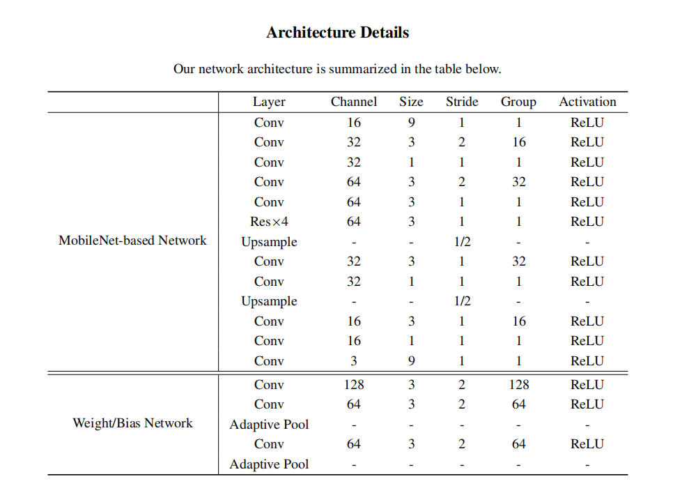

总结：
这篇文章还是有东西，对风格迁移有蛮多有用的研究。从实验结果上来看，确实有明显提升，不是其它论文中的一点点提升。
提到了风格笔触的精细和清晰，导致效果更好。
提到了风格图片中也有很多模式，能将更多风格模式迁移到目标图片中才是更好的模型，具有更好的效果。

任意风格的动态实例规范化
摘要：
先前的规范化方法依赖于仿射变换来生成任意的图像间风格迁移，其中仿射变换的参数以预定义的方式计算。这种人为定义的性质最终导致了风格和内容编码必须共享编码器且花费高，使得模型笨重难以部署到资源受限的系统中，比如移动终端。在本文中，我们提出了一个新的通用的规范化模块，称为动态实例规范化(DIN)，允许更灵活和更高效的任意图像风格迁移。DIN包括实例规范化和动态卷积，它将风格图像编码为可学习的卷积参数，之后内容图像基于这个被风格化。与传统使用共享复杂编码器来编码内容和风格的方法不同，DIN引入了一个精巧的风格编码器，同时也配备了一个紧凑而轻量级的内容编码器，用于快速推理。实验结果表明，该方法在具有挑战性的风格模式上产生了非常令人鼓舞的结果，据我们所知，这是首次使用基于mobile的轻量级架构实现任意风格传输，与现有方法相比，计算成本减少了20倍。此外，所提出的DIN为最先进的卷积操作提供了灵活的支持，从而触发了新的功能，如非自然图像的笔触提替换和自动笔触控制。

引言：
在cv领域图像风格化是纹理合成的泛化领域。Gatys （2016）是风格迁移领域的开创者。早期，什么像素空间迭代优化，计算代价高。然后，优化计算代价，单领域迁移。然后，多领域迁移。
直到近期的任意领域迁移，但是它在复杂样式和精细笔触方面还是有局限性。

不同于现有方法预定义的方式计算仿射变换的参数，DIN引入一个通用的动态卷积变换，它是适应性的为任意风格化学习参数。在这种情况下，DIN可以利用一个复杂的风格编码器来表达复杂性并丰富风格模式。同时，使用轻量紧凑的内容编码器，加速前项推理。利用DIN层，我们可以实施任意风格迁移。

所提出的方法提供了令人满意的视觉结果，特别是对于更精细的笔画和更清晰的细节。

# 相关工作
任意风格转换有两种方法：马尔科夫随机场的非参数化迁移 和 使用统计信息的参数化迁移
第一种没细看 
第二种分为 adain 和WIN （ Whitening Instance Normalization ）（就是 whitening normalization来控制风格）两种。win计算成本仍然高昂。

这些方法都成本高昂，包括计算和内存。有一个计算快的，但是内存高（Shen, Yan, and Zeng 2018)。

提出的方法：
再思神经风格迁移NST中的规范化方法。NST和若干种规范化方法的发展是相辅相成的。我们重新反思和分析了NST中现有的规范化方法，这激发出了本文所提出的方法的灵感。

首先登场的是IN，应用于单领域迁移。相对于BN，效果更好。  
  公式似乎有点问题
接着是CIN conditional instance normalization    
  两个放射参数对应于不同的风格。  
受到CIN的启发，adain被提出  
 
但是adain的放射参数还是太单一，对于所有的激活值都一样。这应该和spade类似，让反规范化的仿射参数不是单一的。
adain背后的自觉是，VGG特征激活值能够编码不同类型的笔触到一个确定的风格，而相同的特征激活的差异可以编码微妙的风格信息的数量（注：？）

我们相信，这种手动指定的计算适应参数的方法是次优的。
另外，更重要的，我们观察到两个重要的adain背后的要求：产生风格特征和内容特征的编码器要一样 and 编码器要能够提出高层特征。基于这两个要求，adain的特征和内容编码器都不能减小为一个轻量的。win也是一样的。

动态实例规范化：
为了解决上述问题，我们提出了DIN（动态实例规范化）层来进行任意图像风格转换。不同于手动定义计算方法计算仿射参数来对齐均值和方差的方式，这是任意风格迁移任务中内容特征和风格特征最简单的统计。我们引入了一个更加通用的动态卷积转换，在里面参数是通过学习的方式，根据不同的风格动态的适应性地变化，这能匹配更复杂的风格特征的统计。

F_c和F_s是特征表示，f是一个动态卷积操作，详见资料。卷积参数会根据不同的风格图片而动态变化。

如图，风格还经过了分离的权重和偏置网络，这个就是精巧的风格网络。这里的权重和偏置网络，由两个卷积和适应性池化组成，能够处理任意的输入尺寸，输出尺寸根据超参数和动态卷积而定。DIN可以被看做通过一个精巧的风格编码器，将给定风格的图片编码为可学习的卷积参数，然后内容图像通过动态卷积转换风格化。

与前面的方法相比，更通用。前面的归一化是特例。比如，IN，可被视为f的权重0，偏置1.adain，可被视为风格特征的通道层面的方差和均值被设置为f的权重和偏差。因此，DIN可以看做更通用的规范化架构。

第二，更加重要的，DIN不需要前述的复杂和共享的编码器。由于动态卷积转换，不需要对齐从内容和特征的有意义的特征中得到的均值和方差。另一方面，我们的方法鼓励更复杂的风格编码器，编码复杂的风格，然后使用更加轻量的内容编码器来进行快速推理，因为可以预先存储风格的参数。

第三：DIN支持多种卷积操作，通过简单的替换图3中的动态卷积。特别的，通过结合一些先进的卷积操作，DIN能够创造新颖的风格化能力。这里我们局两个例子：（暂略）
1、可变性动态实例规范化，把f变为可变形卷积操作，
2、空间自适应DIN，

DIN应用：

上图为基于MobileNet的架构。主要包括图像编码器，DIN层，ImageDecoder。第一个模块，图像编码器，包括一个 stride-1卷积层、两个stride-2分段可分离卷积块和两个stride-1剩余层，灵感来自于（Johnson, Alahi, and Fei-Fei 2016）。解码器与编码器对称。特别地，图像解码器的中间特征图从几个单独的DIN层接收分级的规范化特征以供相加。（注：类似UNET结构）

# 我的实现细节
  
4、padding 文中没有提到 应该是kernal_size // 2, 不是0
5、文中说节省内存 但是中间层的tensor仍然有16倍 这没有多节约呀 使用vgg最多才20层 这种情况下 可以 

这篇文章研究了轻量和高级的网络不能用作风格迁移特征提取器的原因
https://arxiv.org/pdf/2104.05623.pdf

