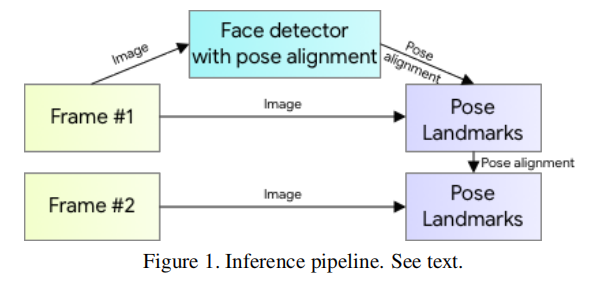
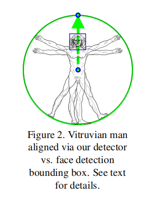
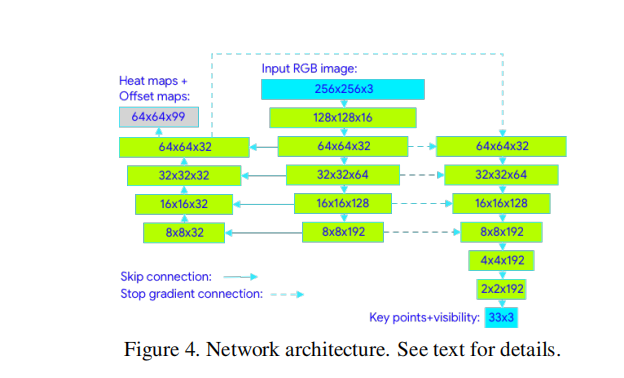

BlazePose: On-device Real-time Body Pose tracking
Abstract
We present BlazePose, a lightweight convolutional neural network architecture for human pose estimation that is  tailored for real-time inference on mobile devices. During inference, the network produces 33 body keypoints for a single person and runs at over 30 frames per second on a Pixel 2 phone. This makes it particularly suited to real-time use cases like fitness tracking and sign language recognition. Our main contributions include a novel body pose tracking solution and a lightweight body pose estimation neural network that uses both heatmaps and regression to keypoint coordinates.     
我们提出了BlazePose，一种用于人体姿态估计的轻量级卷积神经网络架构，专门为移动设备上的实时推断定制。在推理过程中，该网络为一个人产生33个身体关键点，并在Pixel2手机上以每秒超过30帧的速度运行。这使得它特别适合于健身跟踪等实时用例和手语识别。我们的主要贡献包括一种新的身体姿态跟踪解决方案和一个轻量级的身体姿态估计神经网络，它同时使用热图和回归到关键点坐标。   
# 1. Introduction
Human body pose estimation from images or video plays a central role in various applications such as health tracking, sign language recognition, and gestural control. This task is challenging due to a wide variety of poses, numerous degrees of freedom, and occlusions. Recent work [10][7] has shown significant progress on pose estimation. The common approach is to produce heatmaps for each joint along with refining offsets for each coordinate. While this choice of heatmaps scales to multiple people with minimal overhead, it makes the model for a single person considerably larger than is suitable for real-time inference on mobile phones. In this paper, we address this particular use case and demonstrate significant speedup of the model with little to no quality degradation. 

从图像或视频中估计人体姿态在健康跟踪、手语识别和手势控制等各种应用中起着核心作用。这个任务是具有挑战性的，因为各种各样的姿势，众多的自由度，和遮挡。最近的工作[10][7]在姿态估计方面取得了重大进展。常见的方法是为每个关节生成热图，并细化每个坐标的偏移量。虽然这种热图的选择可以以最小的开销扩展到多个人，但它使针对单个人的模型比适合在手机上的实时推断所需要的模型要大得多。在本文中，我们讨论了这个特殊的用例，并演示了模型的显著加速，但几乎没有质量下降。

In contrast to heatmap-based techniques, regressionbased approaches, while less computationally demanding and more scalable, attempt to predict the mean coordinate values, often failing to address the underlying ambiguity. Newell et al. [9] have shown that the stacked hourglass architecture gives a significant boost to the quality of the prediction, even with a smaller number of parameters. We extend this idea in our work and use an encoder-decoder network architecture to predict heatmaps for all joints, fol lowed by another encoder that regresses directly to the coordinates of all joints. The key insight behind our work is that the heatmap branch can be discarded during inference, making it sufficiently lightweight to run on a mobile phone.

与基于热图的技术相比，基于回归的方法虽然计算要求较低且更具可扩展性，但试图预测平均坐标值，但往往无法解决潜在的模糊性。Newell等人[9]已经证明，即使参数数量较少，堆叠沙漏结构也能显著提高预测质量。我们在工作中扩展了这一思想，并使用编码器-解码器网络架构预测所有关节的热图，然后由另一个编码器直接回归到所有关节的坐标。我们工作背后的关键洞察是，热图分支可以在推理过程中被丢弃，从而使其足够轻，可以在移动电话上运行。

   

# 2. Model Architecture and Pipeline Design
## 2.1. Inference pipeline
During inference, we employ a detector-tracker setup (see Figure 1), which shows excellent real-time performance on a variety of tasks such as hand landmark prediction [3] and dense face landmark prediction [6]. Our pipeline consists of a lightweight body pose detector followed by a pose tracker network. The tracker predicts keypoint coordinates, the presence of the person on the current frame, and the refined region of interest for the current frame. When the tracker indicates that there is no human present, we re-run the detector network on the next frame.  

在推理过程中，我们采用了一个检测器-跟踪器设置（见图1），它在各种任务上显示了出色的实时性能，如手地标预测[3]和密集的人脸地标预测[6]。我们的管道由一个轻量级的身体姿态检测器和一个姿态跟踪器网络组成。跟踪器预测关键点坐标、该人在当前帧上的存在，以及当前帧中细化的感兴趣的区域。当跟踪器表明没有人在时，我们将在下一帧上重新运行探测器网络。  

# 2.2. Person detector
The majority of modern object detection solutions rely on the Non-Maximum Suppression (NMS) algorithm for their last post-processing step. This works well for rigid objects with few degrees of freedom. However, this algorithm  breaks down for scenarios that include highly articulated poses like those of humans, e.g. people waving or hugging. This is because multiple, ambiguous boxes satisfy the intersection over union (IoU) threshold for the NMS algorithm.  

大多数现代目标检测解决方案都依赖于非最大抑制(NMS)算法来进行其最后的后处理步骤。这很适用于具有少数自由度的刚性物体。但是，该算法在包含高度关节化姿势（如人挥手或拥抱）的场景中会出现故障。这是因为多个模棱两可的框满足NMS算法的（IoU）阈值。

To overcome this limitation, we focus on detecting the bounding box of a relatively rigid body part like the human face or torso. We observed that in many cases, the strongest signal to the neural network about the position of the torso is the person’s face (as it has high-contrast features and has fewer variations in appearance). To make such a person detector fast and lightweight, we make the strong, yet for AR applications valid, assumption that the head of the person should always be visible for our single-person use case. 

为了克服这一限制，我们将重点放在检测相对刚性身体部位（如人脸或躯干）的边界框上。我们观察到，在许多情况下，向神经网络发送的关于躯干位置的最强信号是人的脸（因为它具有高对比度特征，外观变化较少）。为了使这样一个人员检测器快速、轻量级，我们提出了一个强有力的假设，即对于AR应用程序来说，人员的头部应该在单人用例中始终可见。

As a consequence, we use a fast on-device face detector [2] as a proxy for a person detector. This face detector predicts additional personspecific alignment parameters: the middle point between the person’s hips, the size of the circle circumscribing the whole person, and incline (the angle between the lines connecting the two mid-shoulder and mid-hip points).  

因此，我们使用快速设备人脸检测器[2]作为个人检测器的代理。该面部检测器可预测其他特定于人的对齐参数：人的臀部之间的中点、环绕整个人的圆圈的大小以及坡度（连接两个肩部中点和臀部中点的线之间的角度）。  

   

# 2.3. Topology
We present a new topology using 33 points on the human body by taking the superset of those used by BlazeFace[2], BlazePalm[3], and Coco[8]. This allows us to be consistent with the respective datasets  and inference networks. 

我们利用BlazeFace[2]、BlazePalm[3]和Coco[8]使用的超集，提出了一种新的拓扑结构，使用人体上的33个点。这使我们能够与相应的数据集和推理网络保持一致。

In contrast with the OpenPose[4] and Kinect[1] topologies, we use only a minimally sufficient number of keypoints on the face, hands, and feet to estimate rotation, size, and position of the region of interest for the subsequent  model. The topology we use is shown in Figure 3. For additional information, please see Appendix A. 

与OpenPose[4]和Kinect[1]topologies相比，我们仅使用脸、手和脚上最少数量的关键点来估计后续模型的旋转、大小和感兴趣区域的位置。我们使用的拓扑如图3所示。有关更多信息，请参见附录A。  

# 2.4. Dataset
Compared to the majority of existing pose estimation solutions that detect keypoints using heatmaps, our tracking based solution requires an initial pose alignment. We restrict our dataset to those cases where either the whole person is visible, or where hips and shoulders keypoints can be confidently annotated. To ensure the model supports heavy occlusions that are not present in the dataset, we use substantial occlusion-simulating augmentation. Our training dataset consists of 60K images with a single or few people in the scene in common poses and 25K images with a single person in the scene performing fitness exercises. All of these images were annotated by humans.  

与大多数使用热图检测关键点的现有姿势估计解决方案相比，我们基于跟踪的解决方案需要初始姿势对齐。我们将我们的数据集严格限制在这样的情况下：要么整个人子都是可见的，要么髋部和肩部的关键点可以自信地标注。为了确保模型支持数据集中不存在的严重遮挡，我们使用亚静态遮挡模拟增强。我们的训练数据集由60K图像和25K图像组成，其中场景中有一个或几个人摆出普通姿势，场景中有一个人在进行健身锻炼。所有这些图像都是由人类注释的。

# 2.5. Neural network architecture
   
The pose estimation component of our system predicts the location of all 33 person keypoints, and uses the person alignment proposal provided by the first stage of the pipeline (Section 2.1).  

我们系统的姿势估计组件预测所有33个人关键点的位置，并使用管道第一阶段（第2.1节）提供的个人定位建议。

We adopt a combined heatmap, offset, and regression approach, as shown in Figure 4. We use the heatmap and offset loss only in the training stage and remove the corresponding output layers from the model before running the inference. Thus, we effectively use the heatmap to supervise the lightweight embedding, which is then utilized by the regression encoder network. This approach is partially inspired by Stacked Hourglass approach of Newell et al. [9], but in our case, we stack a tiny encoder-decoder heatmap-based network and a subsequent regression encoder network.  

我们采用了组合热图、偏移和回归方法，如图4所示。我们仅在训练阶段使用热图和补偿损失，并在运行推断之前从模型中删除相应的输出层。因此，我们有效地使用热图来监控轻量级嵌入，然后由回归编码器网络使用。这种方法的部分灵感来自Newell等人[9]的叠加沙漏方法，但在我们的例子中，我们叠加了一个基于热图的微型编码器-解码器网络和一个随后的回归编码器网络。 

We actively utilize skip-connections between all the stages of the network to achieve a balance between highand low-level features. However, the gradients from the regression encoder are not propagated back to the heatmaptrained features (note the gradient-stopping connections in Figure 4). We have found this to not only improve the heatmap predictions, but also substantially increase the coordinate regression accuracy.

我们积极利用网络所有阶段之间的跳过连接，以实现高级和低级功能之间的平衡。但是，回归编码器的梯度不会传播回经过热图训练的特征（请注意图4中的梯度停止连接）。我们发现，这不仅改善了热图预测，而且大大提高了坐标回归精度。

# 2.6. Alignment and occlusions augmentation
A relevant pose prior is a vital part of the proposed solution. We deliberately limit supported ranges for the angle, scale, and translation during augmentation and data preparation when training. This allows us to lower the network capacity, making the network faster while  fewer computational and thus energy resources on the host device.

相关姿势是拟议解决方案的重要组成部分。在增强和训练时的数据准备期间，我们故意限制角度、比例和平移的支持范围。这允许我们降低网络容量，使网络更快，同时减少主机设备上的计算资源和能量资源。

Based on either the detection stage or the previous frame keypoints, we align the person so that the point between the hips is located at the center of the square image passed as the neural network input. We estimate rotation as the line L between mid-hip and mid-shoulder points and rotate the image so L is parallel to the y-axis. The scale is estimated so that all the body points fit in a square bounding box circumscribed around the body, as shown in Figure 2. On top of that, we apply 10% scale and shift augmentations to ensure the tracker handles body movements between the frames and distorted alignment.  

基于检测阶段或之前的帧关键点，我们对齐人，使髋部之间的点位于作为神经网络输入传递的方形图像的中心。我们将旋转估计为髋部中点和肩部中点之间的线L，并旋转图像，使L平行于y轴。对比例进行估计，以便所有身体点都适合身体周围的正方形边界框，如图2所示。除此之外，我们还应用了10%的缩放和移位增强，以确保跟踪器处理帧间的身体移动和扭曲对齐。 

To support the prediction of invisible points, we simulate occlusions (random rectangles filled with various colors) during training and introduce a per-point visibility classifier that indicates whether a particular point is occluded and if the position prediction is deemed inaccurate. This allows tracking a person constantly even for cases of significant occlusions, like upper bodyonly or when the majority of person body is out of scene as shown on Figure 5.

为了支持不可见点的预测，我们在训练期间模拟遮挡（填充各种颜色的随机矩形），并引入逐点可见性分类器，以指示特定点是否被遮挡以及位置预测是否被认为不准确。这使得即使在严重遮挡的情况下，也可以持续跟踪一个人，如图5所示，仅在上半身或当大部分人身体不在场景中时。

# 3. Experiments
To evaluate our model’s quality, we chose OpenPose [4] as a baseline. To that end, we manually annotated two inhouse datasets of 1000 images, each with 1–2 people in the scene. The first dataset, referred to as AR dataset, consist of a wide variety of human poses in the wild, while the second is comprised of yoga/fitness poses only. For consistency, we only used MS Coco [8] topology with 17 points for evaluation, which is a common subset of both OpenPose and BlazePose. As an evaluation metric, we use the Percent of Correct Points with 20% tolerance (PCK@0.2) (where we assume the point to be detected correctly if the 2D Euclidean error is smaller than 20% of the corresponding person’s torso size). To verify the human baseline, we asked two annotators to re-annotate the AR dataset independently and obtained an average PCK@0.2 of 97.2. 

为了评估模型的质量，我们选择OpenPose[4]作为基线。为此，我们手动注释了两个内部数据集，共1000幅图像，每个场景中有1-2人。第一个数据集被称为AR数据集，它由各种各样的野外人体姿势组成，而第二个数据集仅由瑜伽/健身姿势组成。出于一致性考虑，我们仅使用MS Coco[8]拓扑（17个点）进行评估，这是OpenPose和BlazePose的共同子集。作为评估指标，我们使用20%公差的正确点百分比(PCK@0.2)（如果2D Eu  clidean误差小于相应per  son躯干尺寸的20%，则我们假设检测点正确）。为了验证人类基线，我们要求两名注释员独立地重新注释AR数据集，并获得平均值PCK@0.2第97.2条。

We trained two models with different capacities: BlazePose Full (6.9 MFlop, 3.5M Params) and BlazePose Lite (2.7 MFlop, 1.3M Params). Although our models show slightly worse performance than the OpenPose model on the AR dataset, BlazePose Full outperforms OpenPose on Yoga/Fitness use cases. At the same time, BlazePose performs 25–75 times faster on a single mid-tier phone CPU compared to OpenPose on a 20 core desktop CPU[5] depending on the requested quality.
 
我们训练了两个不同能力的模型：BlazePose Full（6.9 MFlop，3.5 m参数）和BlazePose Lite（2.7 MFlop，1.3 m参数）。虽然我们的模型在AR数据集上的性能比OpenPose模型稍差，但BlazePose Full在瑜伽/健身用例上的性能优于OpenPose。同时，BlazePose在单个中端手机CPU上的性能比在20核桌面CPU上的OpenPose快25-75倍[5]，具体取决于所需的质量。

# 4. Applications
We developed this new, on-device, single personspecific human pose estimation model to enable various performance-demanding use cases such as Sign Language, Yoga/Fitness tracking and AR. This model works in nearrealtime on a mobile CPU and can be sped up to superrealtime latency on a mobile GPU. As its 33 keypoint topology is consistent with BlazeFace[2] and BlazePalm[3], it can be a backbone for subsequent hand pose[3] and facial geometry estimation[6] models.  

我们开发了这个新的设备上的单人特定人体姿势估计模型，以支持各种性能要求高的用例，如手语、瑜伽/健身跟踪和AR。该模型在移动CPU上近实时工作，在移动GPU上可加速到超实时延迟。由于其33个关键点拓扑与BlazeFace[2]和BlazePalm[3]一致，因此它可以作为后续手姿势[3]和面部几何估计[6]模型的主干。

Our approach natively scales to a bigger number of keypoints, 3D support, and additional keypoint attributes, since it is not based on heatmaps/offset maps and therefore does not require an additional full-resolution layer per each new feature type.  

我们的方法本机可扩展到更多的关键点、3D支持和其他关键点属性，因为它不基于热图/偏移图，因此不需要每个新特征类型额外的全分辨率层。