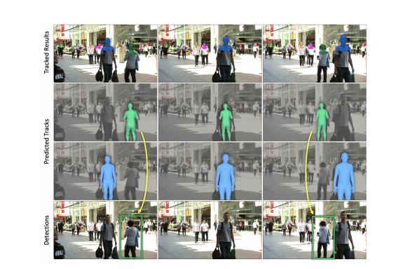
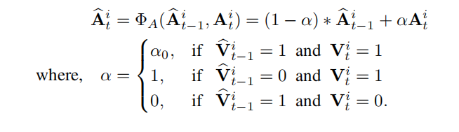
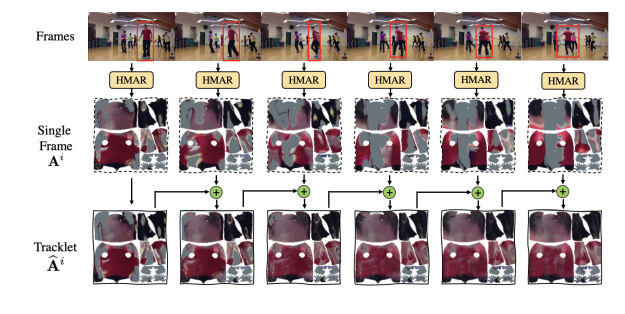
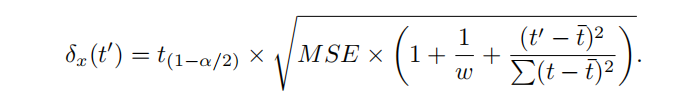
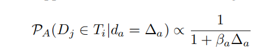
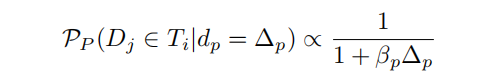
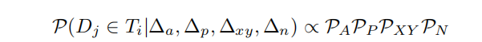
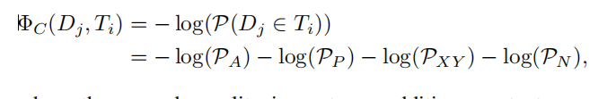

这篇文章也是属于多目标跟踪的类型，主框架是类似的。

检测，提取人体掩模等，再利用xxx网络提取和生成3D特征，再结合这些特征和一些其它信息，生成位置，姿势，外观，结合多帧，得到它们的序列，然后预测后面n帧的位置，姿势，外貌，最后在当前帧检测获取出上面的3种数据，与预测数据关联对比，判断是否是同一个人，over。

似乎参数和计算主要在提取特征，生成3D数据，预测这几个面，后面的轨迹关联不需要了。

Tracking People by Predicting 3D Appearance, Location & Pose
# Abstract
In this paper, we present an approach for tracking people in monocular videos, by predicting their future 3D representations. To achieve this, we first lift people to 3D from a single frame in a robust way. This lifting includes information about the 3D pose of the person, his or her location in   the 3D space, and the 3D appearance. As we track a person, we collect 3D observations over time in a tracklet representation. Given the 3D nature of our observations, we build temporal models for each one of the previous attributes. We use these models to predict the future state of the tracklet, including 3D location, 3D appearance, and 3D pose. For a future frame, we compute the similarity between the predicted state of a tracklet and the single frame observations in a probabilistic manner. Association is solved with simple Hungarian matching, and the matches are used to update the respective tracklets. We evaluate our approach on various benchmarks and report state-of-the-art results.

在本文中，我们提出了一种方法来跟踪单眼视频中的人，通过预测他们未来的三维表示。为了实现这一点，我们首先以一种鲁棒的方式将人们从单一帧提升到3D。这个提升包括关于这个人的3D姿势、他或她在3D空间中的位置以及3D外观等信息。当我们跟踪一个人时，我们以随时间变化的轨迹表示的形式收集3D观察结果。鉴于我们观察的3D性质，我们为之前的每个属性建立了时间模型。我们使用这些模型来预测轨迹的未来状态，包括三维位置、三维外观和三维姿态。对于未来的一帧，我们以概率的方式计算一个轨迹的预测状态和单帧观测值之间的相似性。关联用简单的匈牙利匹配解决，匹配用于更新各自的轨迹。我们根据各种基准来评估我们的方法，并报告最先进的结果。

# 1. Introduction
When we watch a video, we can segment out individual people, cars, or other objects and track them over time.The corresponding task in computer vision has been studied for several decades now, with a fundamental choice being whether to do the tracking in 2D in the image plane, or of 3D objects in the world. The former seems simpler because it obviates the need for inferring 3D, but if we do take the step of back-projecting from the image to the world, other aspects such as dealing with occlusion become easier. In the 3D world the tracked object doesn’t disappear,
and even young infants are aware of its persistence behind the occluder.  
当我们看一段视频时，我们可以分割出个人、汽车或其他物体，并随着时间的推移跟踪它们。计算机视觉中相应的相应任务已经研究了几十年，一个基本的选择是在图像平面上进行二维跟踪，还是对世界上的三维物体进行跟踪。前者看起来更简单，因为它排除了推断3D的需要，但如果我们确实采取从图像反向投影到世界的步骤，其他方面，如处理遮挡变得更容易。在3D世界中，被跟踪的物体不会消失，甚至婴儿也意识到它在封堵器后面的持久性。

A recent paper, Rajasegaran et al. [32] argues convincingly on the 3D side of this debate for people tracking, and presents experimental  evidence that indeed performance is better with 3D representations. In this paper, we will take this as granted, and proceed to develop a system in the 3D setting of the problem. While our approach broadly applies to any object category where parameterized 3D models are available and can be inferred from images, we will limit ourselves in this paper to studying people, the most important case in practice.
Rajasegaran等人[32]在最近的一篇论文中，对人们跟踪这一争论的3D方面进行了令人信服的论证，并提供了实验证据，证明3D表现确实更好。在本文中，我们将把这视为理所当然，并着手在这个问题上基于3D开发一个系统。虽然我们的方法广泛适用于任何可以使用参数化三维模型并可以从图像推断的对象类别，但在本文中，我们将仅限于研究人，这是实践中最重要的案例。

   
Figure 1. Tracking people by predicting and matching in 3D.
The top row shows our tracking results at three different frames. The results are visualized by a colored head-mask for unique identities. The second and third rows show renderings of the 3D states of the two people in their associated tracklets. The bottom row shows the bottom-up detections in each image frame which, after being lifted to 3D, will be matched with the 3D predictions of each tracklet in the corresponding frame. Note how in the middle frame of second row, the 3D representation of the person persists even though he is occluded in the image. More videos at project site.
图1。通过3D中的预测和匹配来跟踪人。最上面一行显示了我们在三个不同帧下的跟踪结果。结果是通过一个彩色的头面罩可视化来表示唯一身份。第二行和第三行显示两个人在关联的轨迹中的3D状态的渲染。下面一行显示了每一个图像帧中自下而上的检测结果，在被提升到3D后，将与相应帧中每个轨迹的三维预测相匹配。请注意，在第二行的中间一帧中，即使这个人在图像中被遮挡，他的3D表示仍然存在。更多视频请访问项目网站。

Once we have accepted the philosophy that we are tracking 3D objects in a 3D world, but from 2D images as raw data, it is natural to adopt the vocabulary from control theory and estimation theory going back to the 1960s. We are interested in the “state” of objects in 3D, but all we have access to are “observations” which are RGB pixels in 2D.
一旦我们接受了在3D世界中跟踪3D对象的理念，但将2D图像作为原始数据，我们自然会采用20世纪60年代控制理论和估计理论的词汇。我们对3D世界中对象的“状态”感兴趣，但我们所能获得的只是2D世界中的“观察”，即RGB像素。 
In an online setting, we observe a person across multiple time frames, and keep recursively updating our estimate of the person’s state — his or her appearance, location in the world, and pose (configuration of joint angles). Since we have a dynamic model (a “tracklet”), we can also predict states at future times. When the next image frame comes in, we detect the people in it, lift them to 3D, and in that setting solve the association problem between these bottomup detections and the top-down predictions of the different tracklets for this frame.
在在线环境中，我们在多个时间范围内观察一个人，并不断递归地更新我们对该人状态的估计——他或她的外貌、在世界上的位置和姿势（关节角度的配置）。由于我们有一个动态模型（“tracklet”），我们还可以预测未来的状态。当下一个图像帧出现时，我们检测其中的人，将他们提升到3D，并在该设置中解决这些自底向上检测与该帧不同轨迹的自顶向下预测之间的关联问题。 

Once the observations have been associated with the tracklets, the state of each person is reestimated and the process continues. Fig. 1 shows this process at work on a real video. Note that during a period of occlusion of a tracklet, while no new observations are coming in, the state of the person keeps evolving following his or her dynamics. It is not the case that “Out of sight, out of mind”!
一旦观察结果与轨迹关联，将重新估计每个人的状态，并继续此过程。图1示出了在真实视频上工作的该过程。请注意，在轨迹闭塞的一段时间内，虽然没有新的观察结果出现，但人的状态会随着其动力学而不断变化。不是“眼不见心理就没了”！

In an abstract form, the procedure sketched in the previous paragraph is basically the same as that followed in multiple computer vision papers from the 1980s and 1990s. The difference is that in 2021 we can actually make it work thanks to the advances brought about by deep learning and big data, that enable consistent and reliable lifting of people to 3D. For this initial lifting, we rely on the HMAR model [32]. This is applied on every detected bounding box of the input video and provides us with their initial, single frame, observations for 3D pose, appearance as well as location of the person in the 3D space.

# 3. Method
Tracking humans using 3D representations has significant advantages, including that appearance is independent of pose variations and the ability to have amodal completion for humans during partial occlusion. Our tracking algorithm accumulates these 3D representations over time, to achieve better association with the detections. PHALP has three main stages: 1) lifting humans into 3D representations in each frame, 2) aggregating single frame representations over time and predicting future representations, 3) associating tracks with detections using predicted representations in a probabilistic framework. We explain each stage in the next sections.

使用3D表示跟踪人类具有显著的优势，包括外观独立于姿势变化，并且能够在部分遮挡期间为人类完成多模态？我们的跟踪算法随着时间的推移累积这些3D表示，以实现更好的检测关联。PHALP有三个主要阶段：1）在每一帧中将人类提升为3D表示，2）随着时间的推移聚合单帧表示并预测未来表示，3）在概率框架中使用预测表示将轨迹与检测关联。我们将在下一节中解释每个阶段。

3.1. Single-frame processing
The input to our system is a set of person detections along with their estimated segmentation masks, provided by conventional detection networks, like Mask-RCNN [12].Each detection is processed by our feature extraction backbone that computes the basic representations for pose, appearance and location on a single-frame basis.
3.1.单帧处理我们的系统的输入是一组人的检测和他们估计的分割掩模，由传统的检测网络提供，如Mask-RCNN[12]。每个检测都由我们的特征提取主干处理，该骨干在单帧基础上计算姿态、外观和位置的基本表示。

 For this feature extraction we use a modification of the HMAR model [32]. HMAR returns a feature representation for the 3D pose p, for appearance a, while it can recover an estimate for the 3D location l for the person. 对于这个特征提取，我们使用了对HMAR模型[32]的修改。HMAR返回一个对3D姿态的特征表示p，外观a，而它可以恢复对该人的3D位置l的估计。

The standard HMAR model takes as input the pixels in the bounding box corresponding to a detected person. This means that in a crowded, multi-person scenario, the input will contain pixels corresponding to more than one person in the bounding box, potentially confusing the network. To deal with this problem, we modify HMAR to take as additional input, the pixel level mask of the person of interest (this is readily available as part of the output of Mask R-CNN) and re-train HMAR. Obviously, we cannot expect this step to be perfect, since there can be inaccuracies in the bounding box detections or mask segmentations. However, we observed that the model gives more robust results  in the case of close person-person interactions, which are common in natural videos.

标准的HMAR模型将与被检测到的人对应的边界框中的像素作为输入。这意味着，在一个拥挤的、多人参与的场景中，输入将包含在边界框中对应于多个人的像素，这可能会混淆网络。为了解决这个问题，我们修改了HMAR，将其作为额外的输入，即感兴趣者的像素级掩码(这很容易作为MaskR-CNN输出的一部分)，并重新训练HMAR。显然，我们不能期望这一步是完美的，因为在边界盒检测或掩码分割中可能存在不准确的地方。然而，我们观察到，该模型在亲密的情况下给出了更稳健的结果，这在自然视频中很常见。

## 3.2. 3D tracklet prediction  
The 3D estimates for each detection provide a rich and expressive representation for each bounding box. However, they are only the result of single-frame processing. During tracking, as we expand each tracklet, we have access to more information that is representative of the state of the tracklet along the whole trajectory. To properly leverage this information, our tracking algorithm builds a tracklet representation during every step of its online processing, which allows us to also predict the future states for each tracklet. In this section we describe how we build this tracklet representation, and more importantly, how we use it to predict the future state of each tracklet.
每个检测的3D估计为每个边界框提供了丰富而富有表现力的表示。然而，它们只是单帧处理的结果。在跟踪过程中，当我们扩展每个tracklet时，我们可以访问代表轨迹在整个轨迹上的状态的更多信息。为了正确地利用这些信息，我们的跟踪算法在在线处理的每个步骤中都会构建一个tracklet表示，这也允许我们预测每个tracklet的未来状态。在本节中，我们将介绍如何构建这个tracklet表示，更重要的是，我们如何使用它来预测每个tracklet的未来状态。

Appearance: 
The appearance pathway is used to integrate appearance information for each person over multiple frames.
外观：外观路径用于在多个帧上整合每个人的外观信息。
The single frame appearance representation for the person i at time step t, A^_t, is taken from the HMAR model by combining the UV image of that person T^i_t ∈ R^{3×256×256} and the corresponding visibility map  V^i_t ∈ R^{1×256×256} at time step t .
    A^i_t = [T^i_t, V^i_t] ∈ R^{4×256×256}
Note that the visibility mask Vit ∈ [0, 1] indicates whether  a pixel in the UV image is visible or not, based on the estimated mask from Mask-RCNN.   
外观路径用于在多个帧上整合每个人的外观信息。时间步t的人A^i_t的单帧外观表示通过结合HMAR模型的姿态∈R3×256×256和相应的可见图Vit∈R1×256×256：HMAR=[HMAR]∈R4×256×256得到.注意，可见掩码Vit∈[0,1]根据HMAR-RCNN中的估计掩码指示UV图像中的一个像素是否可见来确定。

Now, if we assume that we have established the identity of this person in neighboring frames, we can integrate the partial appearance information coming from the independent frames to an overall tracklet appearance for the person. Using the set of single frame appearance representations Ai = {Ait, Ait−1, Ait−2  , ...}, after every new detection we create a singe per-tracklet appearance representation:
b  Ait = ΦA( b
现在，如果我们假设我们已经在相邻的帧中建立了这个人的身份，我们就可以将来自独立帧的部分外观信息整合到这个人的整体轨迹外观中。使用单帧外观表示集Ai={Ait，Ait−1，Ait−2，…}，在每一次新的检测后，我们创建一个单轨迹外观表示：

Here, ΦA is the appearance aggregation function, which takes a weighted sum of the previous tracklet appearance representation and the new detection appearance representation.   
这里，ΦA是外观聚合函数，它取之前的轨迹外观表示和新的检测外观表示的加权和。
 Note that, at the start of the tracklet we simply assign the initial single-frame representation to the tracklet representation ( bAi0 = Ai0 ). 
注意，在轨迹的开始时，我们简单地将初始单帧表示分配给轨迹表示(bAi0=Ai0)。
With this definition of ΦA, we can aggregate appearance information over time, while allowing the representation to change slowly to account for slight appearance changes of the person during a video. 
有了ΦA的这个定义，我们可以随着时间的推移聚合外观信息，同时允许表示缓慢变化，以解释在视频中这个人的轻微外观变化。

Moreover, the UV image provides appearance of each point on the body surface independently of body pose and shape which enables the simple summation operation on the pixel space, without any learnable components. Figure 3 shows how the UV image of the person is aggregated over time and used for association of new detections.
此外，UV图像提供了每个点的外观独立于身体姿势和形状，使像素空间上的简单的求和操作，没有任何可学习的组件。图3显示了这个人的紫外线图像是如何随着时间的推移而聚集的，并用于关联新的检测。这里是一样的时间累积外观变化，专门用分割网络提取外观信息。

Figure 3. Prediction of appearance: We show how the single frame appearance Ai is aggregated over time for the prediction of the tracklet appearance b Ai . At the start, we only see the front side of the person indicated in the frame, however as he moves his visibility changes, and we only see his back side. With the single frame appearance, we can see that the visibility changes corresponding to the visibility of the person in the frame. However, in the tracklet, the appearance is accumulated over time, and even if the front side is not visible in the last frame, we can see that the tracklet has predicted these regions using the past frames.
图3。外观预测：我们展示了单帧外观Ai是如何随着时间的推移而聚集的，以预测轨迹外观bAi。一开始，我们只看到帧中显示的人的正面，但是当他移动他的能见度变化，我们只看到他的背面。对于单帧外观，我们可以看到可见性与帧中的人的可见性相对变化。然而，在轨迹中，外观是随着时间的推移而积累的，即使正面在最后一帧中不可见，我们也可以看到轨迹使用过去的帧预测了这些区域。

For appearance prediction, we make the realistic assumption that human appearance will not change rapidly over time. Then, the appearance of the tracklet b Ait can function as a reasonable prediction for the future appearance of the person. Therefore, we use b Ait as the prediction for appearance and use it to measure similarity against a detection in the future frames.
 对于外观预测，我们做出了一个现实的假设，即人类的外观不会随着时间的推移而迅速变化。然后，tracklet b Ait的出现可以作为对该人未来外观的合理预测。因此，我们使用b Ait作为外观预测，并使用它来衡量未来帧中检测的相似性。
Location: Lifting humans from pixels into the 3D space allows us to place them in the global 3D location. Let us assume that a person i at time t has an estimated 3D location lit.
位置：将人类从像素提升到3D空间，使我们能够将它们放置在全球3D位置。让我们假设一个人i在t的时间有一个估计的3D位置点亮。
Although, we can get an estimate for the location of the person in the global camera frame, this tends to be noisy, particularly along the z-axis. 
虽然，我们可以估计出一个人在全局相机帧中的位置，但这往往是嘈杂的，特别是沿着z轴。
 To avoid any instabilities when it comes to predicting future location, instead of performing our prediction on the Euclidean (X, Y, Z)T space, we express our locations in an equivalent lit = (x, y, n)T space where (x, y) is the location of the root of the person in the pixel space and n is nearness, defined as log inverse depth n = log(1/z).
为了避免预测未来位置时的不稳定性，我们不是在欧几里得(X，Y，Z)T空间上执行预测，而是在等效的=(xy，n)T空间中表示位置，其中(xy)是人在像素空间中的根的位置，n是接近，定义为对数逆深度n=对数(1/z)。
Nearness is a natural parameterization of depth in multiple vision settings, e.g., [21], because of the 1/z scaling of perspective projection. In our case it corresponds to the scale of the human figures that we estimate directly from images
接近度是在多个视觉设置中对深度的自然参数化，例如，[21]，因为透视投影的1/z缩放。在我们的例子中，它对应于我们直接从图像中估计出的人体人物的比例

We independently linearly regress the location predictions for x, y and n. This is somewhat like the Constant Velocity Assumption (CVA) used in past tracking literature, but there is a subtlety here because constant velocity in 3D need not give rise to constant velocity in 2D (a person would appear to speed up as she approaches the camera). But local linearization is always a reasonable approximation to make, which is what we do.
我们独立地线性回归了x，y和n的位置预测。这有点像在过去的跟踪文献中使用的恒定速度假设(CVA)，但这里有一个微妙之处，因为3D中的恒速不需要产生2D中的恒定速度（一个人在接近镜头时似乎会加速）。但是局部线性化总是一个合理的近似，这就是我们所做的。
Let us assume that a tracklet has a set of past locations
Li = {lit, lit−1, lit−2 , ...}. Then, the prediction of the loca-tion for time step t + 1 is given by:
让我们假设一个小轨迹有一组过去的位置，Li={点亮，点亮−1，点亮−2，……}。然后，时间步t+1的轨迹预测为：

Here, ΦL is the location aggregation function and we use a simple linear regression for prediction in our tracking algorithm. ybit+1 and b nit+1 are also predicted in a similar fashion. ΦL takes the last w observations to fit a line by least squares and regress the future location for x, y and n independently. From the standard theory of linear regression, the prediction interval for x at a time step t0 is given by the equation below:
这里，ΦL是位置聚合函数，我们在跟踪算法中使用一个**简单的线性回归进行预测**。ybit+1和bnit+1也以类似的方式被预测。ΦL取最后的w观测值，用最小二乘法拟合一条直线，并独立回归x、y和n的未来位置。根据线性回归的标准理论，x在时间步长t0时的预测区间如下式所示：

Here, t(1−α/2) is the Student’s t distribution with confi-
dence α and degree of freedom w − 2. MSE is the mean
squared error on the predicted locations and t¯is the mean of
the time stamps for the previous observations. In a similar
manner, we can compute prediction intervals ∆y, ∆n for y
and n respectively.
这里，t（1−α/2）是具有α和自由度w−2的学生t分布。MSE是预测位置上的均方误差，t¯是之前观测值的时间戳的平均值。同样，我们可以分别计算y和n的预测区间∆y和∆n。

### Pose: 
For the pose pathway, we need to integrate pose information across the tracklet and be able to predict future poses for the near future. To do this, we borrow ideas from the HMMR architecture [15]. Effectively, we learn a function ΦP that takes as input a series of pose embeddings of a person Pi = {pit, pit−1, pit−2 , ...} and computes a temporal pose embedding b pt. We train this temporal pose aggregation function ΦP to smooth the pose b pit at frame t, and regress the future pose representations {bpit+1, b pit+2, ..., b pit+c} (typically for up to c = 12 frames in the future). We use a transformer [36] to compute ΦP . This choice allows for some additional flexibility, since sometimes we are not able to detect an identity in some frames (e.g., due to occlusions), which can be handled gracefully by the transformer, by masking out the attention for the representation of the corresponding frame.

对于姿势路径，我们需要整合整个轨迹的姿势信息，并能够预测近期的未来姿势。为此，我们借鉴了HMMR体系结构的思想[15]。有效地，我们学习了一个函数ΦP，该函数以一个人的一系列姿势嵌入作为输入P^i = {p^i_t, p^i_t−1, p^i_t−2, ...} 并计算一个时间姿势嵌入P_t。我们训练这个时间姿势聚合函数ΦP来平滑第t帧的姿势P^i_t，并回归未来的姿势表示{p^i_t+1，b^i_t+2，…，b^i_c}（通常在未来最多c=12帧）。我们使用变压器[36]来计算ΦP。这种选择允许一些额外的灵活性，因为有时我们无法在某些帧中检测到身份（例如，由于遮挡），这可以由变换器的在相应帧对注意的掩模而优雅地处理。

# 3.3. Tracking with predicted 3D representations
Given the bounding boxes and their single-frame 3D representations, our tracking algorithm associates identities
across frames in an online manner. At every frame, we make future predictions for each tracklet and we measure the similarity with the detected single-frame representation.   
给定边界框及其单帧三维表示，我们的跟踪算法以在线方式关联跨帧的身份。在每一帧中，我们对每条轨迹进行未来的预测，并测量与检测到的单帧表示的相似性。   
 More specifically, let us assume that we have a tracklet Ti, which has been tracked for a sequence of frames and has information for appearance, pose and location.  3.3.更具体地说，让我们假设我们有一个轨迹Ti，它已经被跟踪了一系列帧，并有关于外观、姿势和位置的信息。
 The tracklet predicts its appearance  A, locationb l and pose p for the next frame, and we need to measure a similarity score between these predictions of the track Ti and a detection Dj to make an association.  

轨迹预测下一帧的外观ba、位置bl和姿态bp，我们需要测量这些预测的轨迹Ti和检测Dj之间的相似性得分，以建立关联。

Our tracklet representation has three different attributes (appearance, location and pose), so, directly combining their similarities/distances would not be ideal, since, each attribute has different characteristics. Instead, we investigate the conditional distributions of inliers and outliers of the attributes. Figure 5 presents the corresponding probability distributions for the PoseTrack dataset [3]. The characteristics of these distributions motivate our design decisions for our further modeling.    

我们的轨迹表示有三个不同的属性（外观、位置和姿势），因此，直接结合它们的相似性/距离并不理想，因为每个属性都有不同的特征。相反，我们研究属性的内点和离群点的条件分布。图5显示了PoseTrack数据集的相应概率分布[3]。这些分布的特征促使我们为进一步建模设计决策。

Assume that tracklet Ti has an appearance representation b Ait . On the detection side, the detection Dj has a  single-frame appearance representation Ajt . Both of these representations are in the pixel space, therefore we first encode them into an embedding space using the HMAR appearance-encoder network. This gives us an appearance embedding b ait and ajt for the prediction of the tracklet Ti and detection Dj , respectively. We are interested in estimating the posterior probability of the event where the detection Dj belongs to the track Ti , given some distance measure of the appearance feature (∆a). Assuming that the appearance distance is ∆a = ||bait − ajt ||22 , then the posterior probability is proportional to the conditional probability of the appearance distances, given correct assignments based on Bayes rule. We model this conditional probability as a Cauchy distribution, based on the observations from the inlier distribution of appearance distances (see also Fig 5):  

假设tracklet Ti具有外观表示Ait。在检测侧，检测Dj具有单帧外观表示Ajt。这两种表示都在像素空间中，因此我们首先使用HMAR外观编码器网络将它们编码到嵌入空间中。这给了我们一个分别用于预测轨迹Ti和检测Dj的嵌入ait和ajt的外观。我们感兴趣的是估计检测Dj属于轨迹Ti的事件的后验概率，给定外观特征的一些距离度量(∆a） 。假设外观距离为∆a=||ait− ajt ||^ 2_2，则后验概率与出现距离的条件概率成正比，根据贝叶斯规则给出正确的赋值。我们将该条件概率建模为Cauchy分布，基于从外观距离的inlier分布中观察到的结果（另请参见图5）：  
The distribution has one scaling hyper-parameter βa. 该分布有一个可缩放的超参数βa。  
 
Similarly, for pose, we use Cauchy distribution to model the conditional probability of inlier distances. We measure pose distance ∆p = ||bpit−pjt ||22 between the predicted pose representation pit from the track Ti and the pose representation pjt of detection Dj . The posterior probability that the detection belongs to the track, given the pose distance is:    
同样，对于姿态，我们使用Cauchy分布来模拟内点距离的条件概率。我们测量姿势距离∆p=| | bpit−pjt | | 22在轨迹Ti的预测姿势表示凹坑和检测Dj的姿势表示凹坑之间。给定姿势距离，检测属于轨迹的后验概率为：   
Here, ∆p = ||bpit − pjt|| and βp is the scaling factor 在这里，∆p=||bbit−pjt||22和βp是缩放因子

Now that we have computed the conditional probabilities of the detection belonging to a track conditioned on the individual cues of appearance, location and pose, we can compute the overall conditional probability of the detection Dj belonging to the track Ti , given all the cues together (assumed to be independent):
现在，我们已经计算了属于以外观、位置和姿势的单个线索为条件的轨迹的检测的条件概率，我们可以计算属于轨迹Ti的检测Dj的总体条件概率，假设所有线索在一起（假设独立）：
 
 这使我们能够基于各种属性距离来估计一个关联的可能性。最后，我们将相似度度量（概率值到一个尺度）映射到成本值，以解决关联。检测表示和轨迹的预测表示之间的成本函数定义为：
   
 where the second equality is up to an additive constant. Once the cost between all the tracks and the detection is computed, we simply pass it to the Hungarian algorithm for solving the association.
 其中第二个等式是一个加法常数。一旦计算了所有轨迹和检测之间的成本，我们就简单地将其传递给匈牙利算法来解决关联。
 
 Estimating the parameters of the cost function: The cost function ΦC has 4 parameters (βa, βp, βxy and βn). Additionally, the Hungarian algorithm has one parameter βth to decide whether the track is not a match to the detection. Therefore, overall we have five parameters for the whole association part of our tracking system
估计成本函数的参数：成本函数ΦC有4个参数(βa、βp、βxy和βn)。此外，匈牙利算法有一个参数βth来决定轨道是否与检测不匹配。因此，总的来说，我们的跟踪系统的整个关联部分有五个参数.

 Now, we
treat this as an empirical risk minimization problem and optimize the β values based on a loss function. We initialize βa, βp, βxy and βn with the values from the estimated density functions and use frame level association error as a loss function for the optimization. We use the Nelder–Mead [30] algorithm for this optimization. Finally, the optimized β values are used for the cost function across all the datasets, and a simple tracking algorithm is used to associate detections with tracklet predictions. The sketch of the tracking algorithm is shown in Algorithm 1.

现在，我们将其视为一个经验风险最小化问题，并基于损失函数对β值进行操作计时。我们用估计的密度函数的值初始化βa、βp、βxy和βn，并使用帧级关联误差作为损失函数进行优化。我们使用Nelder-Mead[30]算法来进行优化。最后，将优化后的β值用于所有数据集的成本函数，并使用一个简单的跟踪算法将检测与轨迹预测联系起来。跟踪算法的示意图见算法1。

Our framework can easily be extended to also handle shot changes, which are common in edited media, like movies, TV shows, but also sports. Since shot changes can be detected relatively reliably, we use an external shot detector [13] to identify frames that indicate shot changes. Informed by the detection of this boundary, during tracking, we update the distance metric accordingly. More specifically, since appearance and 3D pose are invariant to the viewpoint, we keep these factors in the distance computation, while we drop the location distance from the distance metric, because of the change in the camera location. Then, the association is computed based on this updated metric. 
We use the AVA dataset [10] to demonstrate this utility of our tracking system and present results in Section 4.
我们的框架可以很容易地扩展到处理镜头变化，这在编辑媒体中很常见，如电影、电视节目，但体育也很常见。由于镜头变化可以相对可靠地检测到，我们使用外部镜头检测器[13]来识别指示镜头变化的帧。通过检测到这个边界，在跟踪过程中，我们相应地更新距离度量。更具体地说，由于外观和三维姿态对视点是不变的，我们保留这些因素在距离计算，而我们删除位置距离从距离度量，因为相机位置的变化。然后，根据这个更新的度量来计算关联。我们使用AVA数据集[10]来演示我们的跟踪系统的实用性，并在第4节中展示结果。