# Abstract

 Currently, 3D pose estimation methods are not compatible with a variety of low computational power devices because of efficiency and accuracy. In this paper, we revisit a  pose estimation architecture from a viewpoint of both effi-ciency and accuracy. We propose a mobile-friendly model, MobileHumanPose, for real-time 3D human pose estimation from a single RGB image. This model consists of the modified MobileNetV2 backbone, a parametric activation function, and the skip concatenation inspired by U-Net. Especially, the skip concatenation structure improves accuracy by propagating richer features with negligible computational power. Our model achieves not only comparable performance to the state-of-the-art models but also has a seven times smaller model size compared to the ResNet-50 based model. In addition, our extra small model reduces inference time by 12.2ms on Galaxy S20 CPU, which is suitable for real-time 3D human pose estimation in mobile applications. The source code is available at: https:// github.com/SangbumChoi/MobileHumanPose.

目前，三维姿态估计方法由于效率和精度的原因与各种低计算能力的设备不兼容。在本文中，我们从效率和准确性的角度重新审视了姿势估计体系结构。我们提出了一个移动友好的模型MobileHumanPose，用于从单个RGB图像实时估计3D人体姿势。该模型由修改后的MobileNetV2主干、参数激活函数和受U-Net启发的跳过连接组成。特别是，跳过连接结构通过传播更丰富的特征而提高了精度，计算能力可以忽略不计。我们的模型不仅实现了与最先进模型相当的性能，而且与基于ResNet-50的模型相比，模型尺寸小了七倍。此外，我们的超小型模型在Galaxy S20 CPU上达到了12.2ms的推断时间，适用于移动应用中的实时3D人体姿势估计。源代码位于：https://github.com/sangbunchoi/MobileHumanPose

# 1. Introduction

  Due to the rapid development of deep convolutional neural networks and heatmap representation, 3D human pose estimation has significant performance improvement. This improvement helps to unlock many problems of widespread applications in human-computer interaction, robotics, surveillance, AR (augmented reality), and VR (virtual reality). In particular, Mobile Augmented Reality (MAR) has recently attracted much interest in both academia and industry. Therefore, constructing a 3D human pose estimation model with the restricted computational power is an important task. However, the performance gain of a deep learning-based model comes with a wider channel size and deeper convolution layer [44]. This leads to an increment of computing cost, which is not suitable for resource-limited devices such as smartphones.
  
由于深度卷积神经网络和热图表示的快速发展，三维人体姿态估计的性能有了显著的提高。这一改进有助于解决人机交互、机器人技术、监控、增强现实（AR）和虚拟现实（VR）等领域广泛应用的许多问题。特别是，移动增强现实（MAR）最近引起了学术界和工业界的极大兴趣。所以，建立一个计算能力有限的三维人体姿态估计模型是一项重要的任务。然而，基于深度学习的模型的性能增益伴随着更宽的信道大小和更深的卷积层[44]。这导致计算成本增加，这不适用于资源有限的设备，如智能手机。

 Unfortunately, only two papers [10, 18] have dealt with the issue of model efficiency in various 3D human pose estimation papers. However, both methods have significant drawbacks with the following reasons: (a) Although differential architecture search (DARTS) [10] might effectively search the network architecture of 3D human pose estimation, the number of parameters and computational costs are  not affordable to run on mobile devices. (b) Hwang et al. [18] have proposed a more efficient model concerning the number of parameters and FLoating Operations Per Second (FLOPS). However, its performance is unsatisfactory compared to other state-of-the-art methods. Additionally, there is no clear consensus of generating a lightweight model except for using a teacher-student learning algorithm. Besides these two papers, in the practical aspect, most of the training frameworks are implemented by PyTorch [34] in 3D human pose estimation. However, using Tensorflow [1] lite is the only option to use Android Neural Networks API (NNAPI) delegate [25], which fastens the inference time of some models.

不幸的是，在各种3D人体姿势估计论文中，只有两篇论文[10,18]讨论了模型效率问题。然而，这两种方法都有明显的缺点，原因如下：（a）尽管差分体系结构搜索（DARTS）[10]可以有效地搜索3D人体姿势估计的网络体系结构，但在移动设备上运行的参数数量和计算成本是无法承受的。（b） Hwang等人[18]提出了一个关于参数数量和每秒浮点运算（FLOPS）的更有效模型, 然而，与其他最先进的方法相比，其性能并不令人满意。此外，除了使用师生学习算法外，对于如何生成轻量级模型没有明确的共识。除了这两篇论文之外，在实际方面，大多数训练框架都是由Pyrotch[34]在3D人体姿势估计中实现的。然而，使用Tensorflow[1]lite是使用Android神经网络API（NNAPI）委托[25]的唯一选项，它缩短了一些模型的推理时间。

 To overcome the limitations, we propose a mobile friendly network, which considers both performance and computational cost. During the training process, we observed that a lightweight backbone (e.g., MobileNetV2 [38]) is usually well-trained for an image classification task whereas having a problem of fine-tuning for a 3D human pose estimation task. To solve this problem, we use a randomly initialized model, which is not pre-trained on any datasets. Besides that, we modify the number of channels at the first four inverted residual blocks, activation function, and add skip concatenation (see Fig. 1) inspired by U-Net [37]. Specifically, we propose two different types of concatenation structures, which are skip and residual, respectively. Comparing with the residual concatenation, the skip concatenation structure propagates richer contextual information from the encoder to the decoder part, it improves accuracy while maintaining efficiency.
 
为了克服这些局限性，我们提出了一种同时考虑性能和计算成本的移动友好网络。在训练过程中，我们观察到训练好的轻量级主干（例如MobileNetV2[38]）通常在图像分类任务表现良好，而在3D人体姿势估计任务中存在微调问题。为了解决这个问题，我们使用了一个随机初始化的模型，它没有在任何数据集上预先训练。除此之外，我们还修改了前四个反向残差块处的通道数量、激活函数，并添加了受U-Net启发的跳过串联（见图1）[37]。具体来说，我们提出了两种不同类型的连接结构，分别是skip和resident。与残差相比，跳过级联结构将更丰富的上下文信息从编码器传播到解码器部分，在保持效率的同时提高了准确性。

 In addition, we construct large, small, and extra small models for a fair comparison with a viewpoint of model performance and efficiency. With 68.9% fewer parameters and 48.8% fewer FLOPS, our large model achieves comparable result to state-of-the-art models, which is 51.4mm Mean Per Joint Position Error (MPJPE) on the Human3.6M [20] dataset, and 79.6% 3D Percentage of Correct Keypoints (3DPCKrel) on the MuPoTS [29] dataset. We provide the extra small model not only has a low model size (2.98MB) without post-quantization but also overwhelming accuracy of about 27.7mm compared to MoVNect (1.31MB) [18] while having faster inference speed (12.2ms vs. 22.0ms).

此外，我们构建了大型、小型和超小型模型，以便从模型性能和效率的角度进行公平比较。通过减少68.9%的参数和48.8%的失败次数，我们的大型模型达到了与最先进模型相当的结果，在Human3.6M[20]数据集上的平均每个关节位置误差（MPJPE）为51.4mm，以及MuPoTS[29]数据集上正确关键点（3DPCKrel）的79.6%3D百分比。我们提供的超小型模型不仅具有较低的模型尺寸（2.98MB），无需进行后量化，而且与MoVNect（1.31MB）[18]相比，具有约27.7mm的绝对精度，同时具有更快的推理速度（12.2ms vs.22.0ms）。

Our main contributions are summarized as follows: • We investigate the under-studied efficiency problem in 3D human pose estimation while existing methods are focusing on improving the accuracy with the high computational cost. • We propose an efficient model, called MobileHumanPose, for real-time 3D human pose estimation. It consists of various modifications from MobileNetV2, the skip concatenation from U-Net, and a parametric activation function. This architecture yields the best performance with the restricted computational power (less than 10 GFLOPS) compared to the similar alternative [18]. • We contribute to develop a real-world mobile application based on 3D human pose estimation by releasing our code. Figure 2 visualizes the examples of visual effects that can be derived from 3D pose estimation results.

我们的主要贡献总结如下：
•我们研究了三维人体姿势估计中未被研究的效率问题，而现有方法专注于以高计算成本提高精度我们提出了一个有效的模型，称为MobileHumanPose，用于实时三维人体姿势估计。它包括来自MobileNetV2的各种修改、来自U-Net的跳过连接和一个参数激活函数。与类似的备选方案相比，该体系结构在计算能力受限（小于10 GFLOPS）的情况下产生最佳性能[18]通过发布我们的代码，我们有助于开发基于3D人体姿势估计的真实世界移动应用程序。图2显示了可从3D姿势估计结果中导出的视觉效果示例。

Figure 2. Example of the overall implementation process with our model in a mobile application. First, individually cropped  images are fed into the MobileHumanPose model and the model gives the 3D joint coordinates. Second, the 3D joint coordinates are plotted on the 3D space with the corresponding skeleton. Lastly, in the visualization process, an effect behind the skeleton is removed and the remaining part of the effect is left in a camera viewpoint. Finally, it enables us to use various virtual 3D effects in a real-world application. 
图2。我们的模型在移动应用程序中的整体实现过程示例。首先，将单独裁剪的图像输入MobileHumanPose模型，该模型给出三维关节坐标。其次，将三维关节坐标绘制在具有相应骨架的三维空间上。最后，在可视化过程中，骨架后面的效果被移除，效果的其余部分保留在摄影机视点中。最后，它使我们能够在现实世界的应用程序中使用各种虚拟3D效果。

 # 2. Related work
 
 Efficient architecture After the public release of AlexNet [23] and VGG [40], many researchers have proposed deeper and wider neural networks. However, there was a gradient vanishing problem as the layer depth of the network increases. To solve this problem, He et al. [16] used residual connections to keep the signal strength of back-propagation. While the above neural networks are aimed at the performance of diverse tasks, some networks are specifically intended for resource-constrained circumstances. For example, the inverted residual block has a small number of parameters and low computational cost in MobileNetV2 [38] by using depthwise convolution in the expansion layers. Furthermore, Zhou et al. [53] pointed out the bottleneck problem of the inverted residual block and proposed MobileNeXt, which is the revised version of the inverted residual block to enhance accuracy in diverse tasks. 

高效的体系结构在AlexNet[23]和VGG[40]公开发布后，许多研究人员提出了更深更广的神经网络。然而，随着网络层深度的增加，存在梯度消失问题。为了解决这个问题，他等人[16]使用剩余连接来保持反向传播的信号强度。虽然上述神经网络旨在执行各种任务，但有些网络专门用于资源受限的情况。例如，在MobileNetV2[38]中，通过在扩展层中使用深度卷积，反向剩余块具有少量参数和较低的计算成本。此外，Zhou等人[53]指出了倒立残差块的瓶颈问题，并提出了MobileNeXt，这是倒立残差块的修订版，用于提高各种任务的准确性。

 In addition, many Neural Architecture Search (NAS) based papers came out for model efficiency. MNasNet [43] used the NAS algorithm specifically aimed at mobile devices. Additionally, MobileNetV3 [17] is improvement of MNasNet by using NetAdapt [49]. Besides using cheap operators such as pointwise and depthwise convolution, recently Han et al. [13] proposed ‘ghost module’, which reduces a channel dimension to have low computational power while maintaining information.
 
此外，许多基于神经结构搜索（NAS）的论文也出现在模型效率方面。MNasNet[43]使用了专门针对移动设备的NAS算法。此外，MobileNetV3[17]是通过使用NetAdapt[49]对MNasNet的改进。除了使用廉价的算子，如逐点卷积和深度卷积，最近Han等人[13]提出了“ghost模块”，该模块在保持信息的同时降低了通道维数，从而具有较低的计算能力。

 In these existing networks, we study the compatibility of various lightweight backbones in the pose estimation task and examine the problem of weight initialization.
在这些现有网络中，我们研究了姿势估计任务中各种轻量级主干的兼容性，并研究了权重初始化问题。

 2D human pose estimation Existing 2D human pose estimation methods can be divided into bottom-up and topdown approaches. The bottom-up approach [19, 22, 32] is to search all possible candidates of human joints and obtain the most accurate connection between the joints. Cao et al. [7] used Part Affinity Field (PAF) to match corresponding joints in multi-person circumstances.

二维人体姿态估计现有的二维人体姿态估计方法可分为自下而上和自上而下两种。自下而上的方法[19,22,32]是搜索所有可能的人体关节候选，并获得关节之间最精确的连接。Cao等人[7]使用部分亲和域（PAF）来匹配多人环境中的对应关节。

 In contrast, the top-down approach [9, 48, 33, 47] is to use a human detector to find the bounding boxes of each person in a single image. Individually cropped images are fed into the model of the human pose estimator to extract a 2D heatmap for each joint. Tang et al. [45] proposed quantized and densely-connected U-Net [37] to improve information flow. Otherwise, Tosheve et al. [46] suggested extracting joints’ value with a fully connected layer to reduce model complexity. The current state-of-the-art of this task [4] not only used a hybrid network that consists of Hourglass [33] and U-Net [37] but also proposed soft-gated skip connections to learn more complicated functions.
相反，自上而下的方法[9,48,33,47]是使用人体检测器在单个图像中查找每个人的边界框。将单独裁剪的图像输入人体姿势估计器的模型，以提取每个关节的二维热图。Tang等人[45]提出了量化和密集连接的U-NET[37]，以改善信息流。另外，Toshive等人[46]建议使用完全连接的层提取关节的值，以降低模型的复杂性。目前这项任务的sota[4]不仅使用了由沙漏[33]和U-net[37]组成的混合网络，而且还提出了软选通跳过连接来学习更复杂的功能。

 We investigate the effectiveness of the U-Net structure used in 2D human pose estimation and transfer this effectiveness to the 3D task by proposing two types of different concatenations.
我们研究了用于2D人体姿势估计的U形网络结构的有效性，并通过提出两种不同的连接方式将这种有效性转移到3D任务中。

 3D human pose estimation 3D human pose estimation methods can be categorized into two-stage and one-stage approaches. The two-stage approach [8, 26, 51, 11] is separated by extracting 2D joints of humans and lifting them into the 3D spaces. In contrast, the one-stage approach [3, 41, 35, 50, 27, 39, 31] is based on a volumetric heatmap to extract 3D joints. Sun et al. [42] introduced a volumetric heatmap, which uses a regression method to estimate 3D joints by integrating all weights by their probabilities. Since the accuracy of two-stage approach is highly related to the 2D joint prediction, our method follows the one-stage approach.

**三维人体姿态估计三维人体姿态估计方法可分为两阶段和一阶段。两阶段方法[8,26,51,11]通过提取人体的2D关节并将其提升到3D空间来分离。相比之下，单阶段方法[3,41,35,50,27,39,31]基于体积热图来提取三维关节。** Sun等人[42]介绍了一种体积热图，该热图使用回归方法通过将所有权重按概率进行积分来估计3D关节。由于两阶段方法的精度与二维联合预测高度相关，因此我们的方法遵循一阶段方法。

 However, most of the pose estimation papers focus on the performance and the models require high computational costs beyond the budgets of many mobile applications. Among various 3D human pose estimation papers, only two of them introduce the model efficiency problem. Chen et al. [10] used NAS to obtain a part-specific architecture in this task. As a result, the method achieved stateof-the-art on various datasets. Hwang et al. [18] proposed MoVNect, which is a combination of VNect [30] and MobileNetV2 [38]. They also used knowledge distillation to transfer the information from the teacher model. However, both methods [18, 10] did not satisfy the perfect balance between model accuracy and efficiency. To handle this problem, we propose a new lightweight model for 3D human pose estimation from a single RGB image.
然而，大多数姿势估计论文关注的是性能，并且模型需要的计算成本超出了许多移动应用程序的预算。在各种三维人体姿态估计论文中，只有两篇介绍了模型效率问题。Chen等人[10]在这项任务中使用NAS来获得特定于零件的体系结构。结果，该方法在各种数据集上达到了最先进的水平。Hwang等人[18]提出了MoVNect，它是VNect[30]和MobileNetV2[38]的组合。他们还使用知识提炼来传递来自教师模型的信息。然而，这两种方法[18,10]都不能满足模型精度和效率之间的完美平衡。为了解决这个问题，我们提出了一种新的轻量级模型，用于从单个RGB图像估计三维人体姿势。

# 3. Proposed Method
##  3.1. Issue of initialization
   Most of the 3D human pose estimation papers [48, 31, 18, 36, 39, 42] use backbone networks pre-trained on the ImageNet dataset [23]. However, He et al. [14] reemphasized that a randomly initialized network is no worse than the pre-trained network on the ImageNet dataset. To prove this hypothesis in 3D human pose estimation, we analyze the training loss of our backbone network when each learning process is initialized from the following parameters: random initialization and pre-trained on ImageNet. As a result, the randomly initialized network has a lower evaluation error, which is 56.38mm Mean Per Joint Position Error (MPJPE) shown in Table 1. 
 
3.1 初始化问题
大多数3D人体姿势估计论文[48,31,18,36,39,42]使用在ImageNet数据集上预先训练的主干网络[23]。然而，He等人[14]再次强调，随机初始化的网络并不比ImageNet数据集上预先训练的网络差。为了在三维人体姿势估计中证明这一假设，我们分析了当每个学习过程从以下参数初始化时主干网络的训练损失：随机初始化和在ImageNet上预训练。因此，随机初始化的网络具有较低的评估误差，即表1所示的56.38mm平均每个关节位置误差（MPJPE）。
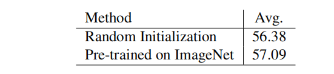
Table 1. Performance comparison between a randomly initialized model and pre-trained model on ImageNet. For evaluation, we used Human36M protocol 2 [20]. Metric: MPJPE (mm).
表1 ImageNet上随机初始化模型和预训练模型的性能比较。为了进行评估，我们使用了Human36M协议2[20] 指标：MPJPE(mm)。

 3.2. MobileHumanPose 
 Among the previous 3D human pose estimation methods, models proposed by Moon et al. [31] and Chen et al. [10] focused on accuracy rather than efficiency. We follow the basic encoder-decoder structure (e.g., bottleneck dimension and volumetric heatmap dimension) where the encoder performs global feature extraction and the decoder estimates the pose estimation. However, we modified the backbone block itself and channel size at the first four inverted residual blocks, an activation function, and implement the skip concatenation from U-Net [37].

在之前的3D人体姿势估计方法中，Moon等人[31]和Chen等人[10]提出的模型侧重于准确性而非效率。我们遵循基本的编码器-解码器结构（例如瓶颈维度和体积热图维度），其中编码器执行全局特征提取，解码器估计姿势估计。然而，我们在前四个反向剩余块（激活函数）处修改了主干块本身和信道大小，并实现了U-Net的跳过级联[37]。

 ## Backbone network 
 Although we choose the baseline structure of Chen et al., it is necessary to find an appropriate lightweight backbone for model efficiency. We compare the performance of the ResNet family [16] and that of various lightweight networks (see Table 2). All backbones are implemented from the initial layer to the first intermediate block that reaches 8 × 8 dimensions from the aforementioned pose estimation structure. In Table 2, MNasNet [43] scores the lowest MPJPE among the lightweight backbones. However, for a fair comparison with MNasNet, MobileNetV2 [38] still has more computational budget (3.36M/1.48G) to have a similar model efficiency (4.23M/1.49G). Therefore, we modify the channel size at the first four inverted residual blocks of MobileNetV2 for performance gain. Finally, by comparing the modified version of MobileNetV2 and MNasNet, we choose the former network as our backbone.

骨干网络
尽管我们选择了Chen等人的基线结构，但为了提高模型效率，有必要找到合适的轻量级骨干网。我们比较了ResNet系列[16]和各种轻量级网络的性能（见表2）。所有主干使用了从初始层到第一个到达 8* 8 尺寸（尺寸需求来源于从上述姿势估计结构）的中间块。在表2中，MNasNet[43]在轻量级主干中的MPJPE得分最低。然而，为了与MNasNet进行公平比较，MobileNetV2[38]仍然有更多的计算预算（336万/1.48克），以具有类似的模型效率（423万/1.49克）。因此，为了获得性能增益，我们修改了MobileNetV2的前四个反向剩余块的信道大小。最后，通过比较MobileNetV2和MNasNet的修改版本，我们选择了前面的网络作为我们的主干网。   
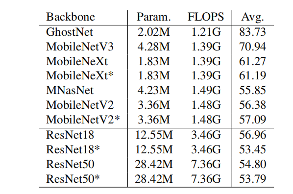  
Table 2. Comparison with various backbone networks. * indicates the corresponding network pre-trained on ImageNet. Metric: MPJPE (mm).
表2。与各种主干网的比较。*指示在ImageNet上预先训练的相应网络。公制：MPJPE（毫米）。

 ## Activation function
  Bulat et al. [5] show that performance increases when the Parametric ReLU (PReLU) [15] function is used in a 2D human pose estimation task. Since the PReLU function has a learnable parameter contrast to ReLU, it derives additional information in each layer. The PReLU function, f is defined as the following equation:  where ai and yi denote as a learnable parameter and input signal.

激活函数
Bulat等人[5]表明，在2D人体姿势估计任务中使用参数ReLU（PReLU）[15]功能时，性能会提高。由于PReLU函数与ReLU相比有一个可学习的参数，因此它在每一层中导出附加信息。PReLU函数f定义为以下等式：其中ai和yi表示为可学习参数和输入信号。

 Therefore, we apply PReLU to 3D pose estimation as well. We also compare the PReLU and ReLU activation functions with the same training condition in this study. Figure 3 (a) shows the baseline of our method after modifying the activation function.

因此，我们也将PReLU应用于三维姿态估计。在本研究中，我们还比较了相同训练条件下的PReLU和ReLU激活函数。图3（a）显示了修改激活函数后我们方法的基线。 
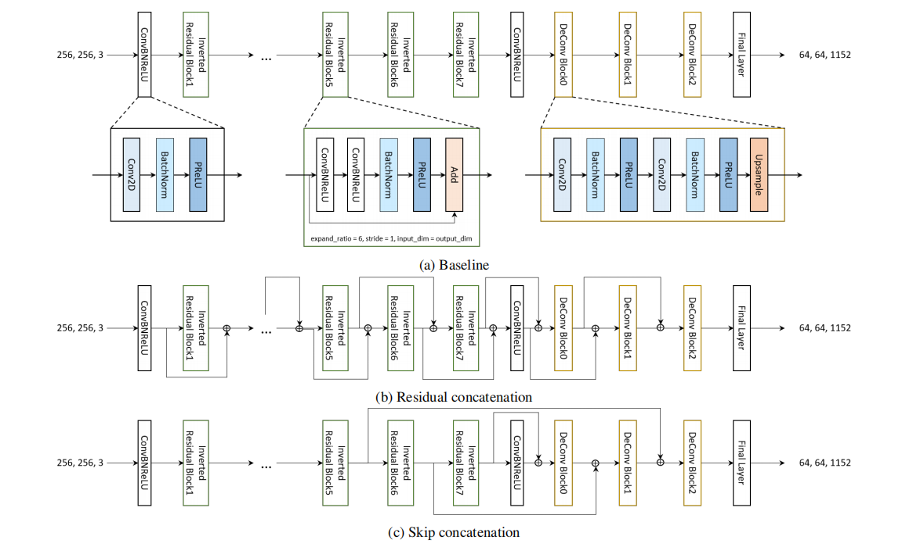
Figure 3. An illustration of the proposed concatenation structure. The skip concatenation is used for our final model.
图3。建议的串联结构的说明。跳过连接用于我们的最终模型。

 ## Skip concatenation 
 
 Most of the functions (e.g., Conv2D, ReLU) in PyTorch [34] are counted as FLOPS. Even though our baseline structure achieves great model ef-ficiency, it is important to use FLOPS uncountable functions (e.g., Concat, Bilinear) appropriately in a viewpoint of the inference speed. Considering the above factor, we propose two types of different concatenation structures. Specific details are shown in Fig. 3 (b) and (c).  
跳过串联
PyTorch[34]中的大多数功能（如Conv2D、ReLU）都算作触发器。尽管我们的基线结构实现了很高的模型效率，但从推理速度的角度来看，适当地使用FLOPS不可数函数（例如Concat、双线性）是很重要的。考虑到上述因素，我们提出了两种不同的级联结构。具体细节如图3（b）和（c）所示。

 For the residual concatenation, we use an average pooling function to match the dimension in the encoder part and use a bilinear function in the decoder part. We use a pure concatenation of two different outputs that have the same dimension in the skip concatenation. Bulat et al. [4] claimed that at least for some cases, residual connections will not fully perform and degrade the performance. Accordingly, we choose the skip concatenation, which can derive the lowlevel feature signal from the encoder to the decoder in contrast to the residual concatenation.

对于剩余级联，我们在编码器部分使用平均池函数来匹配维度，在解码器部分使用双线性函数。在跳过串联中，我们使用具有相同维度的两个不同输出的纯串联。Bulat等人[4]声称，至少在某些情况下，剩余连接不会完全发挥作用并降低性能。因此，我们选择跳过级联，与剩余级联相比，跳过级联可以将低电平特征信号从编码器导出到解码器。

 Loss We use the L1 loss [31, 10] between the groundtruth and predicted coordinates. Our loss L is defined as the following equation: L = 1J JXj=1 k Pj − Pj GT k , (2) where GT denotes the ground-truth.
损失我们使用地面真实坐标和预测坐标之间的L1损失[31,10]。我们的损失L定义为以下等式：L=1J JXj=1K Pj− Pj GT k，（2）其中GT表示基本事实。

 # 4. Experiment 

## 4.1. Datasets and settings 
Datasets and evaluation metrics We used Human3.6M [20] and MuCo-3DHP [29] as 3D human pose datasets. While training Human3.6M, we employed the additional 2D human pose MPII dataset [2]. A z-value for 3D coordinate becomes zero for the input of this training while using MPII. Human3.6M dataset is split into two protocols named Protocol 1 and Protocol 2. Protocol 1 consists of S1, S5, S6, S7, S8, S9 for training and S11 for testing. Protocol 2 contains S1, S5, S6, S7, S8 for training and S9, S11 for testing. For the evaluation of pose estimation methods, two popular metrics are used: Mean Per Joint Position Error (MPJPE) for protocol 1 and Procrustes Analysis Mean Per Joint Position Error (PA-MPJPE) for protocol 2

4.1. 数据集和设置
我们使用的数据集和评估指标3。6M[20]和MuCo-3DHP[29]作为3D人体姿势数据集。在培训人力资源的同时。6M，我们使用了额外的2D人体姿势MPII数据集[2]。使用MPII时，此培训输入的3D坐标z值变为零。人道主义3。6M数据集分为两个协议，分别命名为协议1和协议2。方案1包括S1、S5、S6、S7、S8、S9用于培训，S11用于测试。方案2包含S1、S5、S6、S7、S8用于培训，S9、S11用于测试。对于姿势估计方法的评估，使用了两种常用的度量：协议1的平均每关节位置误差（MPJPE）和协议2的Procrustes分析平均每关节位置误差（PA-MPJPE）

 For another training process, we used MuCo-3DHP and the additional 2D human keypoint detection COCO dataset [24]. MuCo-3DHP is a 3D single-person pose dataset, which consists of MPI-INF-3DHP dataset. The test set, MuPoTS-3DHP, includes 20 real-world scenes with the ground-truth of 3D poses for up to three subjects captured in outdoor circumstances. We adopted a 3D Percentage of Correct Keypoints (3DPCKrel) evaluation metric after root alignment with ground-truth data.

对于另一个培训过程，我们使用了MuCo-3DHP和额外的2D人体关键点检测COCO数据集[24]。MuCo-3DHP是一个3D单人姿势数据集，由MPI-INF-3DHP数据集组成。测试集MuPoTS-3DHP包括20个真实场景，其中包括在室外环境中拍摄的最多三个受试者的3D姿势的地面真实情况。在根与地面真实数据对齐后，我们采用了3D正确关键点百分比（3DPCKrel）评估指标。

## Implmentation details 
We used a random initialization method based on the experiment of section 3.1 because the pre-trained backbone is not necessary for the performance gain. The initial learning rate is set to 10−3 and divided by a factor of 10 at the 17th and 21th epochs. The Adam [21] optimizer with a mini-batch size of 24 was used in this training. We trained the MobileHumanPose mdoel for 25 epochs with two NVIDIA TITAN RTX GPUs, which took three days. We performed the data augmentation followed by [31], which includes rotation, horizontal flip, color jittering, and synthetic occlusion [52]. We also presented the horizontal flip augmentation in the testing phase.

实施细节
我们使用了基于第3.1节实验的随机初始化方法，因为预先训练的主干对于性能增益不是必需的。初始学习速率设置为10−在第17和21个时代，3除以10。本培训中使用了最小批量为24的Adam[21]优化器。我们用两个NVIDIA TITAN RTX GPU对MobileHumanPose mdoel进行了25个时代的培训，耗时三天。我们在[31]之后进行了数据扩充，包括旋转、水平翻转、颜色抖动和合成遮挡[52]。在测试阶段，我们还介绍了水平翻转增强。

 Framework We used the PyTorch [34] framework for training our baseline and the TFLite [1] framework for implementing in mobile devices. The default hyperparameter values (i.e., momentum, epsilon, and other values) between PyTorch and Tensorflow are fixed to PyTorch values when training on Tensorflow.
框架我们使用PyTorch[34]框架来训练我们的基线，使用TFLite[1]框架在移动设备中实现。在Tensorflow上进行训练时，PyTorch和Tensorflow之间的默认超参数值（即动量、ε和其他值）固定为PyTorch值。

 ## 4.2. Comparison with various backbones 
 As shown in Table 2, the performance of GhostNet [13], MobileNetV3 [17], and MobileNeXt [53] is not robust enough compared to the remainder, so we excluded these candidates. We chose the best performing backbone, which has the different channel size at the first four inverted residual blocks in MobileNetV2 [38].

4.2. 各种骨干的比较
如表2所示，GhostNet[13]、MobileNetV3[17]和MobileNeXt[53]的性能与其余部分相比不够健壮，因此我们排除了这些候选项。我们选择了性能最好的主干，它在MobileNetV2的前四个反向剩余块上具有不同的信道大小[38]。

 ## 4.3. Ablation study 
 ### Initialization and channel modification
  Table 3 shows that our modified version of MobileNetV2 [38] has lower MPJPE in both random initialization and pre-trained on the ImageNet dataset [23].
4.3. 烧蚀研究
初始化和通道修改表3显示，我们修改后的MobileNet V2版本[38]在随机初始化和在ImageNet数据集上预训练时的MPJPE都较低[23]。
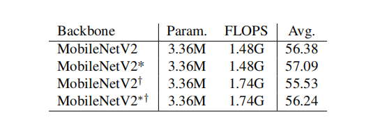
Table 3. Comparison between random initialization and pre-training methods on the Human36M protocol 2 [20]. * and † indicate the network pre-trained on ImageNet and  the modified version of the initial four inverted residual blocks, respectively. Metric: MPJPE (mm).
表3。Human36M协议2上随机初始化和预训练方法的比较[20]* 和†分别表示在ImageNet上预训练的网络和初始四个反向剩余块的修改版本。公制：MPJPE（毫米）。

 ### Activation function 
 Table 4 shows the effectiveness of activation functions. Using the PReLU function achieves 2.65mm lower MPJPE contrast to the ReLU function. Whereas the PReLU function requires additional backpropagation memory consumption on GPU due to the extra  variable of slope, there was no significant difference with the ReLU activation function in terms of throughput and inference time, which allows us to use PReLU in a real-world application.
激活功能
表4 显示了激活功能的有效性。与ReLU功能相比，使用PReLU功能可降低2.65毫米的MPJPE对比度。由于斜率的额外变量，PReLU函数需要GPU上额外的反向传播内存消耗，而在吞吐量和推理时间方面，与ReLU激活函数没有显著差异，这使我们能够在实际应用中使用PReLU。
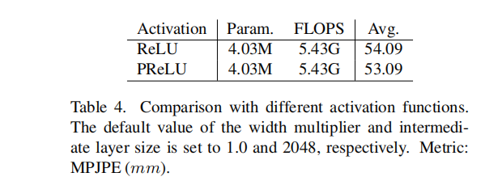

###  Concatenation structure 
 Table 5 shows the effectiveness of concatenation in the baseline architecture. Compared to Fig. 3 (a) and (c), it indicates that the skip concatenation derives richer information to a deeper layer of the architecture to enhance the performance of this task. The performance result of Fig. 3 (a) and (b) shows that the residual concatenation is not performed well even though FLOPS and the number of parameters dramatically increased due to enlarging a channel size in each layer.  
串联结构
表5显示了基线体系结构中连接的有效性。与图3（a）和（c）相比，它表明跳过连接可将更丰富的信息导出到体系结构的更深层，以增强该任务的性能。图3（a）和（b）的性能结果表明，即使由于扩大每层中的信道大小而使触发器和参数数量显著增加，残余级联也没有很好地执行。
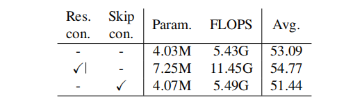

Table 5. Comparison of different ways to construct the various types of concatenation. The default value of the width multiplier and the intermediate layer size is set to 1.0 and 2048, respectively. Metric: MPJPE (mm).
表5。比较不同的方法来构造不同类型的连接。宽度倍增和中间层大小的默认值分别设置为1.0和2048。公制：MPJPE（毫米）。

### Cost effectiveness 
We extensively examined our proposed architecture design from a viewpoint of two dimensions: backbone width multiplier and the channel size at the intermediate layer (see the intermediate layer shown in Fig. 3). We defined our small model as 0.75 width multiplier and 512 channels in the intermediate layer and large model as 1.0 width multiplier and 2048 channels in the intermediate layer. Table 6 shows the result of architecture effi-ciency and the performance of diverse architectures. Since the width multiplier is related to the whole encoder structure, reducing this parameter gave a strong architecture ef-ficiency, which is related to the throughput and inference time. However, the result also shows a strong dependency between information capacity and width multiplier. On the other hand, the results of 512 and 1024 intermediate channel sizes show a relatively small performance variation in contrast to 1024 and 2048. This indicates that the bottleneck of information capacity relies on the encoder part and 512 intermediate channel size is enough to be implemented in a small model. 

我们从两个维度广泛研究了我们提出的架构设计：主干宽度倍增器和中间层的通道大小（参见图3中所示的中间层）。我们将小模型定义为0.75宽度倍增器，中间层定义为512个通道，将大模型定义为1.0宽度倍增器，中间层定义为2048个通道。表6显示了架构效率和不同架构的性能结果。由于宽度乘法器与整个编码器结构有关，因此减小此参数可提供强大的体系结构效率，这与吞吐量和推理时间有关。然而，结果也显示了信息容量和宽度乘数之间的强烈依赖性。另一方面，512和1024中间信道大小的结果显示，与1024和2048相比，性能变化相对较小。这表明信息容量的瓶颈依赖于编码器部分，512中间通道大小足以在小型模型中实现。

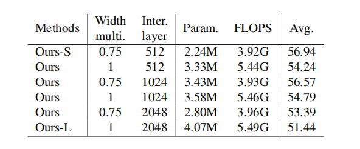
Table 6. Cost effectiveness analysis of our proposed model. Metric: MPJPE (mm).
表6。我们提出的模型的成本效益分析。公制：MPJPE（毫米）。

 # 4.4. Comparison with state-of-the-art methods 
 We compared the performance and efficiency on Human3.6M [20] and MuPoTS [29] including the state-of-theart methods. Figure 4 shows the qualitative result by using our large model in various images.
我们比较了Human3的性能和效率。6M[20]和MuPoTS[29]，包括最先进的方法。图4显示了在各种图像中使用我们的大型模型的定性结果。
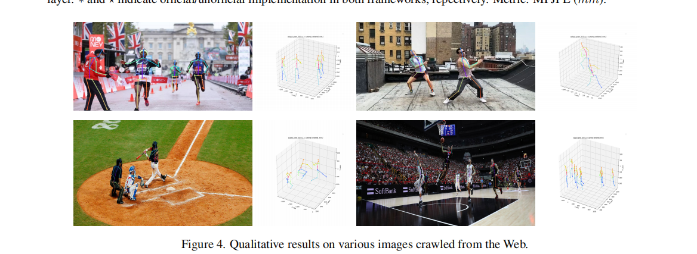

 ## H36M 
 Table 8 shows the comparison of various models on Human3.6M protocol 2. In a viewpoint of accuracy, our large model achieves 51.44mm Mean Per Joint Position Error (MPJPE), which is a comparable result in contrast to state-of-the-art methods. However, computational costs (i.e., FLOPS and number of parameters) of our model have only 5.0 times fewer number of parameters (4.07M vs. 20.4M) and 2.6 times fewer FLOPS (5.49G vs. 14.1G) in contrast to the model of Chen et al. [10]. In addition, we evaluate a small model of our method. Our small model achieves 56.94mm MPJPE with having 2.24M number of parameters and 3.92 GFLOPS.

表8显示了Human3上各种型号的比较。6M协议2。从精度的角度来看，我们的大型模型达到了51.44mm的平均每关节位置误差（MPJPE），这与最先进的方法相比是一个可比的结果。然而，与Chen等人的模型相比，我们模型的计算成本（即触发器和参数数量）仅减少了5.0倍的参数数量（4.07M vs.20.4M）和2.6倍的触发器数量（5.49G vs.14.1G）[10]。此外，我们评估了我们方法的一个小模型。我们的小型模型实现了56.94mm MPJPE，具有2.24M的参数数量和3.92gflops。

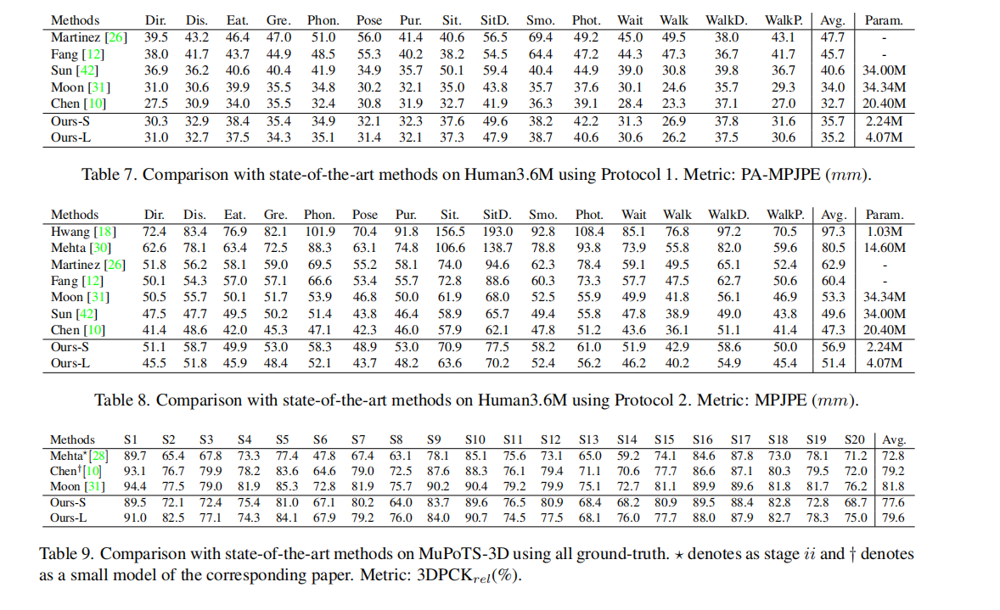

 Table 7 shows the comparison of various models on Human3.6M protocol 1. The tendency of the evaluation score is similar to Table 8. However, the average difference between the large and small model is decreased compared to Table 8.
表7显示了Human3上各种型号的比较。6M协议1。评价得分的趋势与表8相似。然而，与表8相比，大模型和小模型之间的平均差异有所减小。

 MuPoTS 
 For the multi-person 3D pose estimation task, we used RootNet [31] to estimate the absolute coordinate for each person. In Table 9, we compared with the small model of Chen et al. [10] and Moon et al. [31]. Among 20 scenes on MuPoTS, our large model achieves superior performance in contrast to the small model of Chen et al. on half of the scenes and scores state-of-theart performance on few scenes. Additionally, our large model (2.24M/3.92GFLOPS) outperforms the small model of Chen et al. (13.0M/10.7GFLOPS) in a viewpoint of model efficiency. Qualitative results can be seen in Fig. 5.
 
对于多人3D姿势估计任务，我们使用根网[31]估计每个人的绝对坐标。在表9中，我们与Chen等人[10]和Moon等人[31]的小型模型进行了比较。在MuPoTS上的20个场景中，我们的大型模型在一半场景中取得了优于Chen等人的小型模型的性能，在少数场景中取得了最先进的性能。此外，从模型效率的角度来看，我们的大型模型（2.24M/3.92GFLOPS）优于Chen等人的小型模型（13.0M/10.7GFLOPS）。定性结果如图5所示。
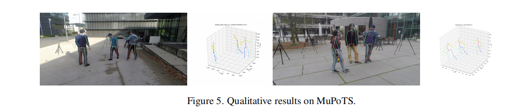

 4.5. Inference analysis
  
  Since our method contains a heavy computation function, which is a softmax function to give actual 3D joint coordinates from a volumetric heatmap, we compared both the softmax and non-softmax model in the inference stage because the softmax function can be easily implemented in C++ to reduce the inference time. To be specific, the output after the softmax function is denoted as Pj and before is PjS, which is an output of the volumetric heatmap. Pj = E(softmax(PjS )) ∈ R1×1×3, PjS ∈ R1×64×64×64 , (3) where j indicates a single joint in the human body.

由于我们的方法包含一个强大的计算函数，它是一个从体积热图中给出实际三维关节坐标的SUPtMAX函数，所以我们在推理阶段比较了SULTMAX和非SOFTMAX模型，因为SOFTMax函数可以在C++中容易地实现以减少推理时间。具体而言，softmax函数之后的输出表示为Pj，之前的输出表示为PjS，这是体积热图的输出。Pj=E（softmax（PjS））∈ R1×1×3，PjS∈ R1×64×64×64，（3）其中j表示人体中的单个关节。

 In this experiment, we define ‘Throughput’ usually known as frame per second when the batch size is set to one [6]. It is a variable to measure the speed performance of the model in diverse processing units. N is denoted as the number of iterations, which is 100, B is the optimal batch size, which is one, and T is set to the total inference time of the whole inference process. T hroughput = NB T . (4)

在这个实验中，我们定义了“吞吐量”，通常称为当批量大小设置为1时的每秒帧数[6]。它是一个变量，用于测量不同处理单元中模型的速度性能。N表示为迭代次数，即100，B表示最佳批量大小，即1，T设置为整个推理过程的总推理时间。通过量=NB T。(4)

 We compared the inference time of Hwang et al. [18], Moon et al. [31], and our models. In Table 10, we used Titan RTX Graphic Processing Unit (GPU) to evaluate the PyTorch [34] framework experiment, and TFlite is based on the Tensorflow [1] framework tested on Galaxy S20. Our large model outperforms the model of Moon et al. in all sectors, which are throughput, inference time, accuracy, and model size. Our extra small model is specially aimed for a mobile application, which has 0.5 width multiplier, 512 channels in the intermediate layer, and half resolution (32 × 32 × 32) of the volumetric heatmap compared to the original shape (64 × 64 × 64). Our extra small model has the comparable size (2.98MB) to MoVNect (1.31MB) [18] but advances 27.7mm MPJPE and reduces 9.8 ∼ 12.2ms inference time.
我们比较了Hwang等人[18]，Moon等人[31]和我们的模型的推断时间。在表10中，我们使用Titan RTX图形处理单元（GPU）评估Pyrotch[34]框架实验，TFlite基于在Galaxy S20上测试的Tensorflow[1]框架。我们的大型模型在吞吐量、推理时间、准确性和模型大小等所有方面都优于Moon等人的模型。我们的超小型模型专门针对移动应用，它具有0.5倍的宽度倍增器，中间层有512个通道，体积热图的分辨率为原始形状（64×64×64）的一半（32×32×32）。我们的超小型模型的大小（2.98MB）与MoVNect（1.31MB）[18]相当，但提高了27.7mm MPJPE，降低了9.8%∼ 12.2ms推断时间。
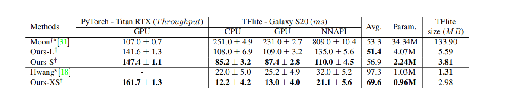
Table 10. Measuring throughput on Titan RTX and inference time on Galaxy S20 settings. The higher value in throughput and lower value in inference time designate better performance. † indicates the baseline architecture without the softmax layer. ∗ and ⋆ indicate official/unofficial implementation in both frameworks, repectively. Metric: MPJPE (mm).
表10 测量Titan RTX上的吞吐量和Galaxy S20设置上的推断时间。吞吐量值越高，推断时间值越低，表示性能越好。†指示没有softmax层的基线体系结构。∗ 和⋆ 分别指出两个框架中的官方/非官方实施。公制：MPJPE（毫米）。

#  4.6. Applications 
 Our proposed model can be implemented on various mobile applications that have a suitable format for 3D avatar control. In particular, our extra small model has extremely low inference time, it is capable of a real-time application. We developed Android and Unity3D a custom dispatcher to communicate 3D joints coordinate to use various visual effects from Unity3D. We will also release our code for a development of mobile applications based on 3D human pose estimation.

我们提出的模型可以在各种移动应用程序上实现，这些应用程序具有适合3D化身控制的格式。特别是，我们的超小型模型具有极低的推理时间，能够实时应用。我们开发了Android和Unity3D，这是一个自定义的调度程序，用于通信3D关节坐标，以使用Unity3D的各种视觉效果。我们还将发布基于3D人体姿势估计的移动应用程序开发代码。

# 5. Conclusion 
In this paper, we mainly focused on constructing a lightweight model and improving accuracy with detailed experiments. We claimed that the lightweight backbones are not performing well in the pose estimation task. To handle this problem, we suggested the modified version of backbone network based on MoblieNetV2 [38]. Also, we employed the skip concatenation and the parametric activation function to improve the accuracy while maintaining cost efficiency in contrast to the baseline architecture. Accordingly, we constructed MobileHumanPose, which is the most precise and compact model that can be implemented in mobile devices. The strategies implemented in this paper are not only restricted to the top-down and one-stage methods but also can be used in all kinds of 3D human pose estimation. We hope that this work gives a new idea for real-time 3D human pose estimation in mobile devices.

在本文中，我们主要致力于构建一个轻量级模型，并通过详细的实验来提高精度。我们声称轻量级脊柱在姿势估计任务中表现不佳。为了解决这个问题，我们提出了基于MoblinetV2的主干网的改进版本[38]。此外，与基线体系结构相比，我们还采用了跳过连接和参数激活函数来提高精度，同时保持成本效率。因此，我们构建了MobileHumanPose，这是可以在移动设备中实现的最精确、最紧凑的模型。本文所实现的策略不仅限于自顶向下和一阶段的方法，而且可以用于各种三维人体姿态估计。我们希望这项工作为移动设备中的实时三维人体姿势估计提供了一种新的思路。

