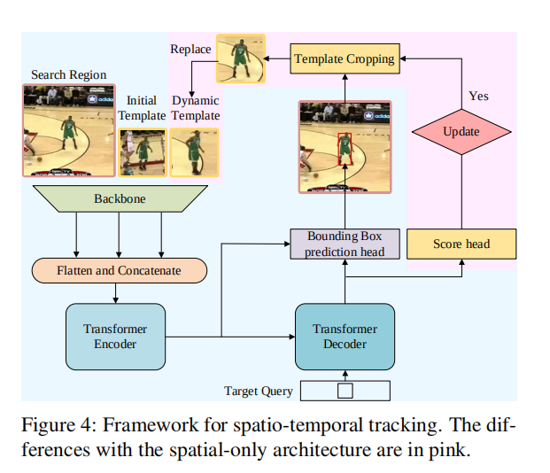
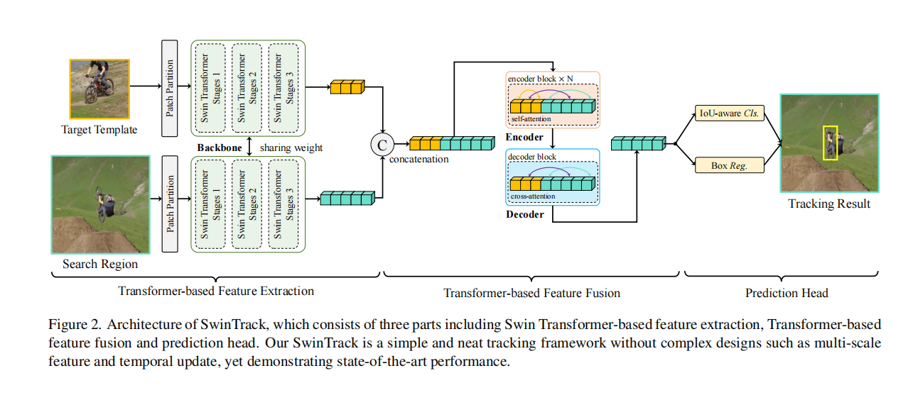
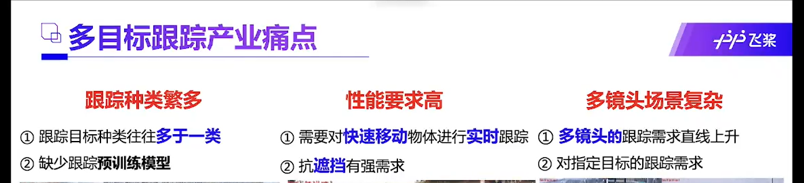
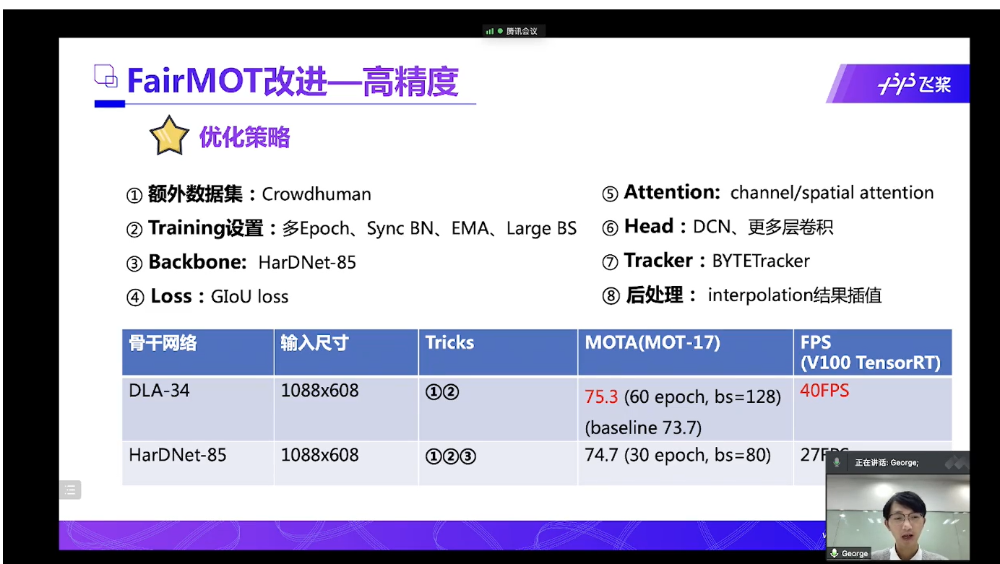
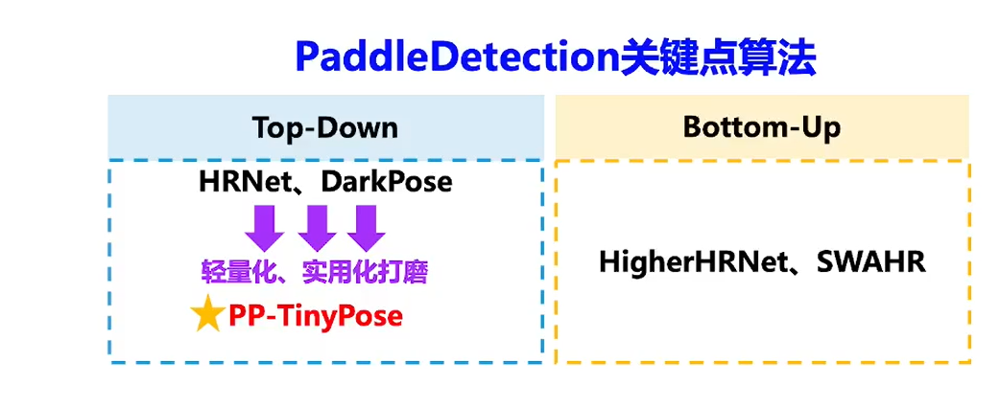
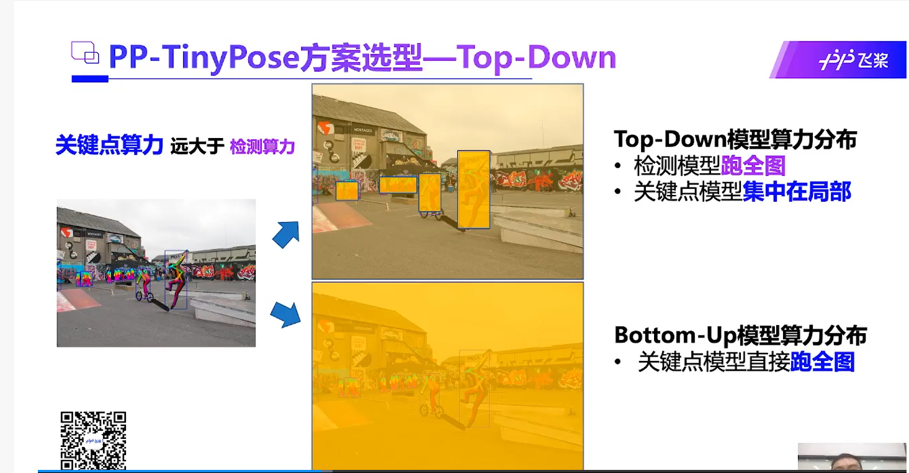
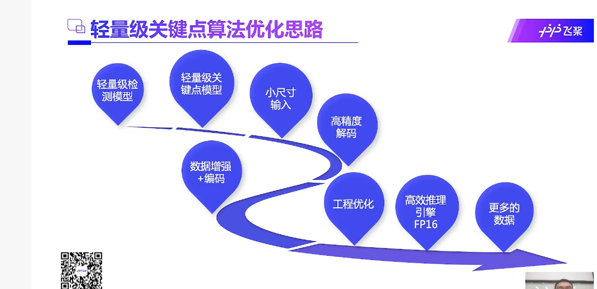
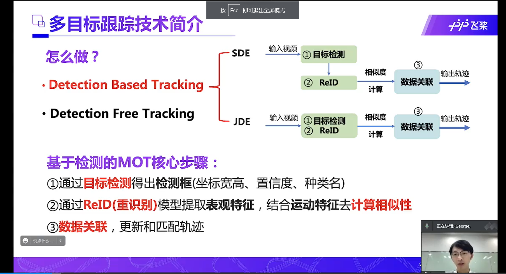

# 基本原则：
 1、不可能自己想出什么新的模型，基本上都是用现有的
 2、寻求大神的帮助是必须的
 
# 研究目标和内容，需求审视，非算法方面的更大层面的设计，优化 
## 视频跟踪技术
一开始想的是视频动态贴纸，实际上视频动态贴纸更本质的技术 就是视频跟踪，在现在的手机视频编辑APP上，视频跟踪功能他们没怎么做，实际上在电脑端软件这是一个很大的功能。
总结一下：
1. 视频跟踪是视频编辑里面很大的一项功能，只是现在的手机APP没做而已。
2. 跟踪之后不只是可以用来贴图，还有很多其它的操作可以做，比如各种P图操作都可以用上去，比如绘图，文字，扭曲这些灯等等。
3. 跟踪过程中可以发挥想象接入更多的用户操作来提升跟踪效果。

4、既然专注于跟踪式贴图，对于视频，那么是可以加入预处理的，这样对实时性要求就更低了
需要一个数据，用户手机里面的视频时长，目前估计对于用户的绝大多数视频，应该可以增加双倍的时间

# 应用
## 视频动态贴纸
视频动态贴纸目前用得最多的就是抖音 或者 很多直播里面的那种贴纸，比如一个墨镜贴纸，视频中人运动，然后
墨镜贴纸跟随人的眼睛在视频中运动

但是看到目前的动态贴纸基本上只实现了单人大头的效果，对于多人的情景不能区分不同的人

所以想实现的是，能够对多人，复杂运动情景下的，针对人的那种动态贴纸

这个涉及到的技术，主要是人体追踪和关键点检测。

google的mediapipe库提供人体姿势和关键点检测，但是它这个似乎没有追踪功能（当然也不能指定检测的人）

目前测试的效果就是多人情况下很容易丢失，比如人脸消失，人被挡住等，很容易就切换到其它人身上去了。

我们需要实现最终的效果是可以追踪的那种。

那么现在基本上就是只需要加一个单人目标追踪就行了

## 其它应用
低算力平台上部署
军事上 跟踪特定目标人物
安防领域：跟踪特定目标，低算力平台，危险人物，走失人物
运动：各种运动分析

## 研究目标：
实时的单人追踪和姿势检测

# 参考文献和实现方法
## 单目标跟踪
### 单目标跟踪排行：
https://paperswithcode.com/sota/visual-object-tracking-on-lasot

https://paperswithcode.com/sota/visual-object-tracking-on-vot201718

### 最新论文sota
2021年的单目标跟踪综述
https://www.arocmag.com/article/02-2021-10-003.html

目前排名第二的论文-主要是cnn和transformer结合的
https://paperswithcode.com/paper/learning-spatio-temporal-transformer-for
主要实现思路，相比如传统的单目标追踪，增加了一个时空信息网络，将目标图像和搜索区域图像，时空信息网络获取的数据，一起送入cnn的backbone，然后拼接backbone输出的特征，输入transformer，再从transformer输出的特征中利用fcn预测目标框。

这篇论文的作者在github还提供了轻量版的设计，在使用ONNXRUNTIME来进一步加速推理，加速后的STARK-Lightning在RTX TITAN上的运行速度可达200+ FPS 

2021.12.2 出的最新的sota,基于纯transformer架构
https://arxiv.org/abs/2112.00995

这个大概就是使用swin-transformer结构的多头只注意力堆叠的网络提取特征，然后使用transformer来融合特征，最后预测

2021多目标跟踪上实现了大步前进的sota，可能有借鉴意义
https://arxiv.org/abs/2110.06864
 
 
 
## 单人目标跟踪
找到一篇这样的文章了
http://guanghan.info/projects/LightTrack/
展示没有找到相关的论文

## 多人目标跟踪
https://arxiv.org/pdf/2112.04477.pdf
2012.12出的多人目标跟踪sota，它的思路和一般的多目标跟踪类似，但是结合了人类的特征，具体的说
先利用人体分割网络分割出人体，然后用3D相关的网络提取人体的3D位置，3D关键点，3D外貌，然后根据上述3种对象的多帧的状态，预测未来若干帧的状态，然后与当前帧中提取的位置，关键点，外貌等进行对比，利用一些贝叶斯概率之类的计算，判断它们是否属于同一个人，从而实现跟踪。

## 人体关键点检测
BlazePose 专门为移动端优化了人体姿势检测，能够在移动端实时检测单人姿势
会先检测人脸，然后根据人脸推断整个人体为范围，然后人体关键点，没有人脸的情况下怎么检测似乎没看到，实际效果是能检测的
然后没有重新识别的机制的，只是简单的在相邻区域寻找人脸（人体），如果出现遮挡或者另一个人靠近就容易出现丢失。

## 综合检测
https://google.github.io/mediapipe/solutions/holistic.html
MediaPipe的Hostlic检测流程是，用BlazePose先检测姿势，然后根据姿势判断和预测人手，人脸的区域，然后把该区域的图像裁剪下来检测人脸人手的关键点。
这个Hostlic是基于BlazePose，所以同样是没有重新识别的机制的，只是简单的在相邻区域寻找人体，如果出现遮挡或者另一个人靠近就容易出现丢失。

## 整体流程
单目标人体跟踪-根据检测到的目标框调用mediapipe的hostlic算法-根据算法给出的关键点实现动态贴纸

## 人体关键点检测
拟采用人体关键点检测，采用google开源的mediapipe库
https://google.github.io/mediapipe/solutions/holistic

## 实例分割
目前看到的实例分割，似乎只能在手机上做到接近实时的性能
2020.12 出的
https://github.com/haotian-liu/yolact_edge
2080ti 175fps

## 更多参考：
实时语义分割，可以参考实现方法
2021.6 出的
https://github.com/search?q=STDC-Seg
1080ti 250 fps

# 本文的工作
1、单人目标跟踪算法的轻量化，能够在消费级产品上实时运行-目前看到的效果好算法存在模型文件太大或者速度等问题），
2、算法性能优化，前面的sota比可能有些难，不知道可不可以在人这个专门的数据集上优化），
3、可能的化提出一些创新
4、结合单人跟踪和人体关键点检测，实现目前实际项目上尚未看到的，多人和复杂场景下的视频动态贴纸
5、更多可能的应用

# 难点
1、人物外貌出现巨大变化，如转身姿势等出现巨大变化  
2、处理遮挡问题：结合实例分割进行跟踪 
处理遮挡问题用一个实例分割来做可能不好，用一般的遮挡算法也不行，因为这些基本上只能得出人体之类的区域，人体之外的区域不能得出，这对于贴图应用来说就意义不大了，对于其它应用来说比较有用
有一个专门的课题，行人遮挡，一些行人遮挡甚至还用了姿势检测的算法，可借鉴其中的方法  
3、镜头切换或者摄像头切换--这个先不考虑  
借鉴行人重识别处理镜头切换问题 

# 实现思路 
1、结合姿势进行跟踪

3、搜索区域，根据姿势轨迹等的预测选择搜索区域，并且缩小搜索区域范围，如果出现目标丢失等情况再扩大或者选择其它区域，而不是使用固定的搜索区域
4、共用backbone

不能用多目标的思路，多目标思路基本上是不一样的，全图检测，然后对比跟踪，单目标用不着，的算力消耗高太多了，需要单目标的

单目标，我们还需要重识别

最好能加上目标遮挡判断

对于人，从3D的角度考虑，人体转身的会造成对比式跟踪出现问题。

## 其它论文提到的思路，技巧等
检测质量在通过检测进行跟踪的方案中起着关键作用，许多作品共同学习或微调自己的检测模型。

# 百度算法落地的实现方案、教程，可供借鉴学习
## 轻量化目标检测 思路等
https://cloud.tencent.com/developer/article/1897561
##  目标跟踪
目标跟踪产业痛点

trick
性能

轻量级

reid模型等可以根据不同对象专门化

光流估计
http://www.c-s-a.org.cn/html/2018/12/6665.html
## 关键点检测
关键点检测可以看做目标检测的复杂版

应用：安防应用，智慧交通-交警姿势，健身，互动娱了，工业应用

关键点检测的两种方案

top-down 先目标检测 再找关键点
bottom-up 先找到关键点 再检测
当前比较领先的方案：

关键点检测算力远大于目标检测

百度的模型速度 122fps
优化思路

数据增强：
遮挡关键点

低分辨率输入，高精度输入（大概就是二阶泰勒展开用离散位置预测连续位置）

工程优化
把前后处理操作放到模型中，可以利用模型框架优化速度

手臂正反面似乎需要3D Pose

问题点，优化点：
多人场景下单目标跟踪相似物体问题

思路：
引入下一帧距离上一帧中心点的距离，轨迹参数等是否会好，方法类似于前面的空间自适应归一化，或者bytetracking里面的

# 数据集：
目前的数据集都是为多种类别的目标准备的，我们可以只取数据集中的一类，然后结合多个数据集

另外，还可以从MOT里面取数据

比较先进的一个单目标数据集
LaSOT 2019年出的 
优点：
1、时长100s左右，比其它数据集提供的更长
2、数据量更大，种类更多
https://www.leiphone.com/category/academic/NhOeLVXzIdLVSxyU.html

所以结合姿势追踪的来做这个。
收录到的姿势追踪效果最好的
https://paperswithcode.com/paper/combining-detection-and-tracking-for-human
不要想大而全，实现关键点就好

可以学习的：
https://github.com/PaddlePaddle/PaddleDetection/tree/release/2.3/configs/keypoint/tiny_pose

挑战点：镜头切换时追踪 == 行人追踪过程中的行人重识别
跟踪算法有两类：基于检测的跟踪，不基于检测的跟踪
目前的好的都是基于检测的跟踪，一个原因是可以从检测算法中受益

# 引文
[1] Tracking People by Predicting 3D Appearance, Location & Pose