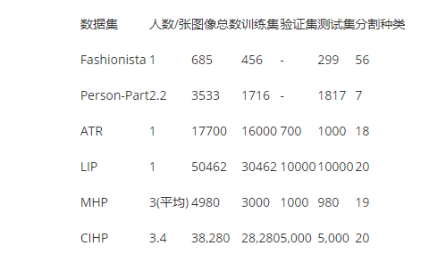

# 数据集：
https://www.pianshen.com/article/305860182/

数据集Look into Person (LIP)是一个人像分割和人体关键点数据集，包含50,462张图片，19个语义类别的标注,16个人体关键点标注。链接:https://pan.baidu.com/share/init?surl=UuUdy9RDdlC86f9Jmwzcbg 密码:qft1，大小800M。

https://wx.zsxq.com/mweb/views/topicdetail/topicdetail.html?topic_id=544841441284424&inviter_id=241521811842481&share_from=ShareToWechat&keyword=FmQ3VRr

数据集ATR是一个单人图像分割数据集，包含7,700张图像，18个语义类别，都是站立的人像，比较适合拿来算法调优，链接https://pan.baidu.com/share/init?surl=0x3P4UEcoo-4Sfr03Eohsw 密码:csv7,大小76OM。

https://wx.zsxq.com/mweb/views/topicdetail/topicdetail.html?topic_id=844142584128842&inviter_id=241521811842481&share_from=ShareToWechat&keyword=EIUvJEY

一个高质量人像分割数据集，
Automatic Portrait Matting数据集是一个图像分割数据集，包含2000张图像和对应的Matting标注结果，大小为600×800，都是自拍图像，链接:https://pan.baidu.com/share/init?surl=Q_xQS7rR73Dw7xiyx-YOHA 密码:h6fh

MHP 多人人体分割 标签达到58个 图片数量约3万张
https://github.com/ZhaoJ9014/Multi-Human-Parsing

中山大学的LIP(look into person)
地址：http://sysu-hcp.net/lip/index.php

这个课题组主要关注人体解析，有论文和数据库，也有开源代码（我没跑通）。

公开的数据集： Single Person、Multi-Person（Crowd Instance-level Human Parsing Dataset – IHP）和VIP(Video instance-level Parsing) 。单人、多人的数据都有，比较全面。

# 模型选择和设计
肯定需要轻量级的语义分割模型
自己设计或者写基本上不可能
只能借用别人的模型：
## 1. hrnet
这个网络结果效果很好，在很多任务上取得第一，可以配上transformer使用的
在LIP上仅次于SelfCorrectionHumanParsing
## 1、deeplabv3+
2018年8月发布
https://github.com/VainF/DeepLabV3Plus-Pytorch
基于mobilenet的只有40M
或者
https://github.com/jfzhang95/pytorch-deeplab-xception

教程
https://blog.csdn.net/Kelvin_XX/article/details/81946091
模型发布3年了，82%，但是效果也还算好，比其最好的差3个点，一个数据集只差一个点

## 方案一：
优化 SelfCorrectionHumanParsing 这个库 原始模型大小255M
2019年发布，但是它是目前为止在LIP这个数据集中效果最好的论文
由上，LIP应该也是人像分割数据集中效果最好的了

## 方案二：
百度的 EasyDL提到的方法
轻量级使用的是HrNet

综上，选用HrNet
https://github.com/HRNet/Lite-HRNet