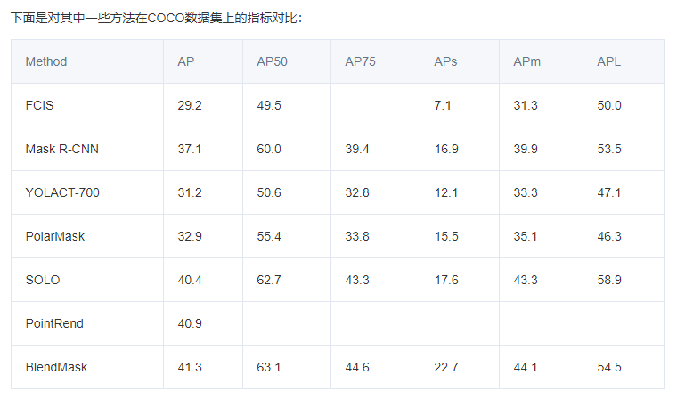

# 图像分割
## 简介
语义分割与实例分割
语义分割就是只分割到类的层次，比如人和汽车
实例分割需要分割到个体的层次，就是一个类别里面有多个个体，需要将不同的个体分割出来，比如有多个人，需要将每个人分割出来
这可以对比面向对象的类和实例来理解，两者是一样的，语义=类，实例就是面向对象的实例

为什么要分为语义分割和实例分割：
语义分割可以很容易地表达为一个密集的每像素分类问题，而直接遵循相同的范例来预测实例标签则具有挑战性。

# 实例分割：
## 简介
实例分割兼具语义分割和目标检测的特点，这也逐渐演化出基于语义分割的自底向上与基于目标检测的自顶向下的两条道路，这也是近期看到的很多论文里的遵循的分类方式。但目前这两种算法逐渐趋同，出现了相互融合的趋势。

## 总体思路
目标检测，语义分割，实例分割，它们都有一个核心的点，就是区域。
基于这个点，上面三个任务有如下两个共同要解决的问题，以及一个特有的问题，完成任务主要就通过解决这三个问题来完成
1、共同的问题是
2、区域怎样设定；
怎样提取区域特征；

然后实例分割特有问题是：
3、在每个区域内怎样表征和预测物体的mask；

对于问题1，我们一方面要保证region要足以覆盖图片中的所有object，另一方面需要尽可能减少region的数量，毕竟数量越多就意味着越大的计算量，因此我们需要找到以上两个问题的折中。这个问题实际上也是目标检测任务面临的核心问题，因此我们完全可以借鉴目标检测算法中anchor与gt assignment的设计。

对于问题2，CNN

问题3, 实例分割问题的核心，下面详解

## Mask representation
首先要提到的就是怎样表征instance mask，大体上我们可以分为这两类：binary mask和contour。

binary mask 二进制掩模方法获取物体掩模：
二进制掩模方法是获取物体掩模的主要方法。

contour是最近(2020年初）很火的实例分割方案，基本都是将contour的预测转化成位于contour上的点集的预测
