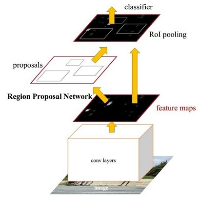
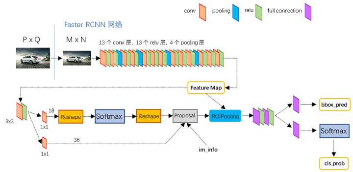
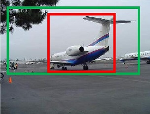
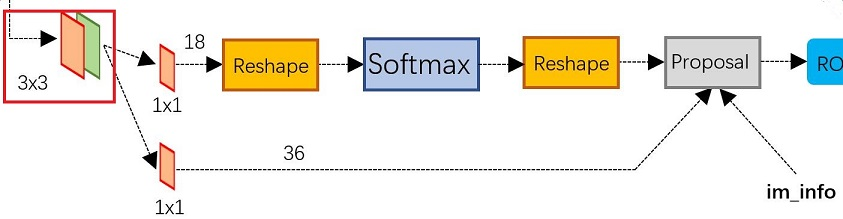
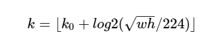
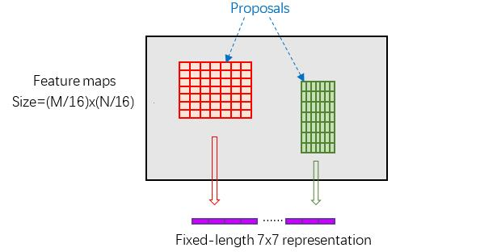

#简介
2016年提出了，在结构上，Faster RCNN已经将特征抽取、提取、bounding box regression、classification整合在了一个网络中（注意不是一阶段，仍然是两阶段的），使得综合性能有较大提高，在检测速度方面尤为明显。
参考：https://zhuanlan.zhihu.com/p/31426458
# 网络结构
## 主要结构
  
小点：RoI是Region of Interest的简写，利用RPN等算法来得到多个目标候选框，这些以输入图片为参考坐标的候选框在feature maps上的映射区域，即为目标检测中所说的RoI
Faster RCNN其实可以分为4个主要内容：

1、Conv layers。作为一种CNN网络目标检测方法，Faster RCNN首先使用一组基础的conv+relu+pooling层提取image的feature maps。该feature maps被共享用于后续RPN层和全连接层。
2、Region Proposal Networks。RPN网络用于生成region proposals。该层通过softmax判断anchors属于positive或者negative，再利用bounding box regression修正anchors获得精确的proposals。
3、Roi Pooling。该层收集输入的feature maps和proposals，综合这些信息后提取proposal feature maps，送入后续全连接层判定目标类别。
4、Classification。利用proposal feature maps计算proposal的类别，同时再次bounding box regression获得检测框最终的精确位置。
## 详细结构
  
可以清晰的看到该网络对于一副任意大小PxQ的图像：
首先缩放至固定大小MxN，然后将MxN图像送入网络；
而Conv layers中包含了13个conv层+13个relu层+4个pooling层；
RPN网络首先经过3x3卷积，再分别生成positive anchors和对应bounding box regression偏移量，然后计算出proposals；
而Roi Pooling层则利用proposals从feature maps中提取proposal feature送入后续全连接和softmax网络作classification（即分类proposal到底是什么object）。

# 各个模块详解
## Region Proposal Networks(RPN)
### 框的选取部分
经典的检测方法生成检测框都非常耗时，如OpenCV adaboost使用滑动窗口+图像金字塔生成检测框；或如R-CNN使用SS(Selective Search)方法生成检测框。而Faster RCNN则抛弃了传统的滑动窗口和SS方法，直接使用RPN生成检测框，这也是Faster R-CNN的巨大优势，能极大提升检测框的生成速度。
观察详细结构图中的RPN网络的具体结构。可以看到RPN网络实际分为2条线，上面一条通过softmax分类anchors获得positive和negative分类，下面一条用于计算对于anchors的bounding box regression偏移量，以获得精确的proposal。而最后的Proposal层则负责综合positive anchors和对应bounding box regression偏移量获取proposals，同时剔除太小和超出边界的proposals。其实整个网络到了Proposal Layer这里，就完成了相当于目标定位的功能。

一个小点：feature map中的点对应了若干个anchor，但是feature map是有很多通道的，这个是怎么对应的？注意这个点是指所有通道上同一位置合起来形成的点 ，不是单纯的一个通道上的一个点。

RPN中首先会经过一个`3*3`卷积，这会让feature map中的一个点结合周围的`3*3`个点来生成候选框，增加鲁棒性等，
然后经过一个`1*1`的卷积层，主要是为了将通道进行组合学习，由特征图的通道数（如255）变成anchor所需要通道数（18=9个anachor*2个数据positive/naigetive?）
reshap整理尺寸，然后能够让softmax函数处理，后面再reshape回去
实现细节：筛选框的时候，先选择前n个框，再使用nms

### 框回归，位置偏离预测，位置修正部分
如图9所示绿色框为飞机的Ground Truth(GT)，红色为提取的positive anchors，即便红色的框被分类器识别为飞机，但是由于红色的框定位不准，这张图相当于没有正确的检测出飞机。所以我们希望采用一种方法对红色的框进行微调，使得positive anchors和GT更加接近。
   
对于窗口一般使用四维向量 [公式] 表示，分别表示窗口的中心点坐标和宽高。对于图 11，红色的框A代表原始的positive Anchors，绿色的框G代表目标的GT，我们的目标是寻找一种关系，使得输入原始的anchor A经过映射得到一个跟真实窗口G更接近的回归窗口G'。

容易的，我们可以想到，平移和缩放红框就能使得红框和蓝框对齐，对应于四个值。对于红框和蓝框比较接近的情况，可以把平移缩放操作看成线性变换，于是我们在RPN模块的第二条线路中使用一个回归网络，对每个"点"预测四个值，也就是输入feature map c*w*h得到9*4*w*h大小的向量，即每个点对应9个anchor * 4个调整值，然后把这每个anchor对应的四个值用来修正anchor即可。  
  
观察网络结构对应部分，有两条路一条预测正负框得分，注意包括正负和负分，why？
一条预测框的偏移 
###  Proposal Layer部分
Proposal Layer负责综合第一条路输出的正框和框回归调整变量，计算出精准的proposal，送入后续RoI Pooling Layer。
Proposal Layer的3个输入：im_info用于尺寸计算
具体处理步骤：
1、利用框回归调整变量对所有的anchors做bbox regression回归（这里的anchors生成和训练时完全一致）
2、按照第一条路径的正向得分由大到小排序anchors，提取前topN 个anchors 
3、特殊情况处理：限定超出图像边界的positive anchors为图像边界，剔除尺寸非常小的positive anchors
4、对剩余的positive anchors进行NMS（nonmaximum suppression） 

## ROI pooling
这一层主要负责将根据前面建议的锚框，获取锚框包含的特征。
具体步骤
1、由于锚框是经过RPN层预测的调整参数调整过的，所以其大小不一定和产生的它层对应，需要重新获取它对应的层，在RPN论文中，提供了一个公式来获取这个  
  
其中 k0 是一个面积为 224*224 的 Proposal 应该处于的 feature map level。其他尺度的 Proposal 按照上面的公式安排。代码中选择的 256x48x84 这个尺度的 feature map 为 k0, 对应 224*224 这个大小范围的 Proposal。
2、使用 roi_align 提取每个 Proposal 的特征。mask rcnn论文中的一个创新
规整：即调整尺寸，长宽比相关的，具体待看  
  
因为不同的anchor对应检测框大小是不同的，这一层就是把不同的特征图转化到同样大小，论文里面就是7*7大小

## Classification
Classification部分利用已经获得的proposal feature maps，通过full connect层与softmax计算每个proposal具体属于那个类别（如人，车，电视等），输出cls_prob概率向量；同时再次利用bounding box regression获得每个proposal的位置偏移量bbox_pred，用于回归更加精确的目标检测框。Classification部分网络结构如图16。

# 训练
这个的训练比较复杂
Faster R-CNN的训练，是在已经训练好的model（如VGG_CNN_M_1024，VGG，ZF）的基础上继续进行训练。实际中训练过程分为6个步骤：
1-1、在已经训练好的model上，训练RPN网络，对应stage1_rpn_train.pt
1-2、利用步骤1中训练好的RPN网络，收集proposals，对应rpn_test.pt
1-3、第一次训练Fast RCNN网络，对应stage1_fast_rcnn_train.pt

循环
2-1、第二训练RPN网络，对应stage2_rpn_train.pt
2-2、再次利用步骤4中训练好的RPN网络，收集proposals，对应rpn_test.pt
2-3、第二次训练Fast RCNN网络，对应stage2_fast_rcnn_train.pt

可以看到训练过程类似于一种“迭代”的过程。
注意这个点，训练并不是一次完成的，而是分了不同的模块进行训练。这个网络也有端到端的一次直接训练完的训练方式。

