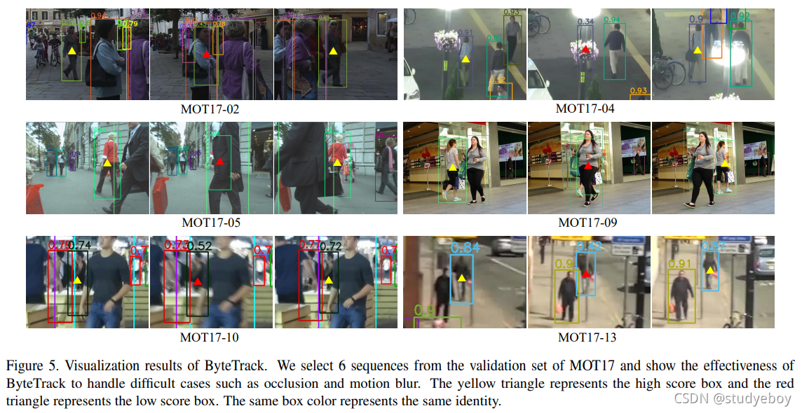

基于它提出的关联低分检测框，ByteTrack其它方面都是使用十分简单的结构，并没有做很多的tricky就取得了很好的性能，所谓简单但有效。

运动模型很简单(原始的卡尔曼滤波)，没有任何 Re-ID 模块或注意力机制.

实施细则。 **对于 BYTE，除非另有说明，否则默认的高检测分数阈值t{high}为 0.6，低阈值t_{low}为 0.1，轨迹ϵ初始化分数为 0.7。在线性分配步骤中，如果检测框和轨迹框之间的 IoU 小于 0.2，则匹配将被拒绝。对于丢失的轨迹，我们将其保留 30 帧，以防再次出现。**

混合多个数据集进行训练是MOT中的常规操作

轨迹插值是一种有效的后处理方法，可以获取那些完全遮挡物体的框。

原文提出的关联过程比直接在其它文章的关联过程中加入低分关联，性能更好

困难样例 

除了使用卡尔曼滤波，显然可以使用神经网络来预测运动轨迹。代表论文CenterTrack 和 TraDes

注意力机制根据其自然属性可以直接进行跨帧对象关联

# 和reid的结合
bytetrack基于轨迹追踪，不能处理长距离和镜头切换
使用fairmot的思路加上外观跟踪，也就是reid技术
fair mot发现的三个点

- 使用一个主干同时提取目标框特征和外观特征时，使用无锚框检测器更好
Anchor-Based 检测器不适用，适用的是Anchor-free 就是物体检测时的无锚框检测器，文中采用预测中心点那种，

- 外观模型需要多层特征融合 
这个考虑到Re-ID信息不能仅仅包含高层网络中的语义信息，也要适度包含低层网络中的的颜色，纹理的信息，所以多层特征融合是非常有必要的。

- Re-ID维度大了反而不好，因为轨迹不多，大了容易过拟合 文中采用128维度

记忆法：一多一少一无 多层融合 维度少，不是多，中只无锚框检测器，中心点

具体实现:
获取外观特征就是训练目标检测网络时多一个提取外观特征的分支
训练的时候用分类任务训练re-ID特征学习网络，训练集中相同标识的所有对象实例都被视为同一类

跟踪过程 
轨迹对比就是Re-ID特征上计算的余弦距离，然后其它的和bytetrack类似
