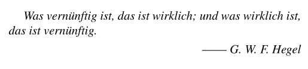
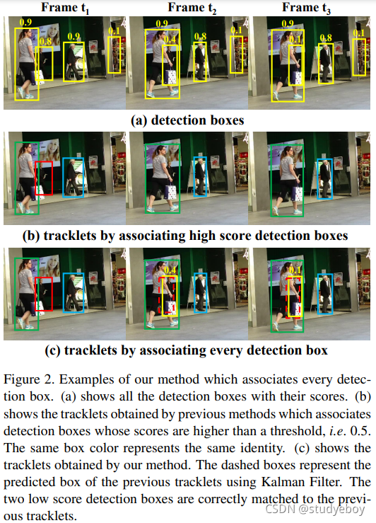
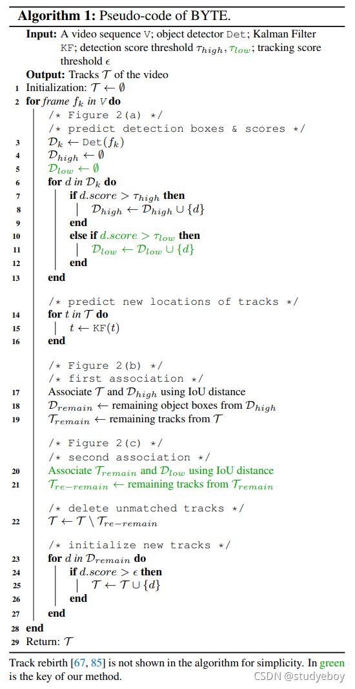
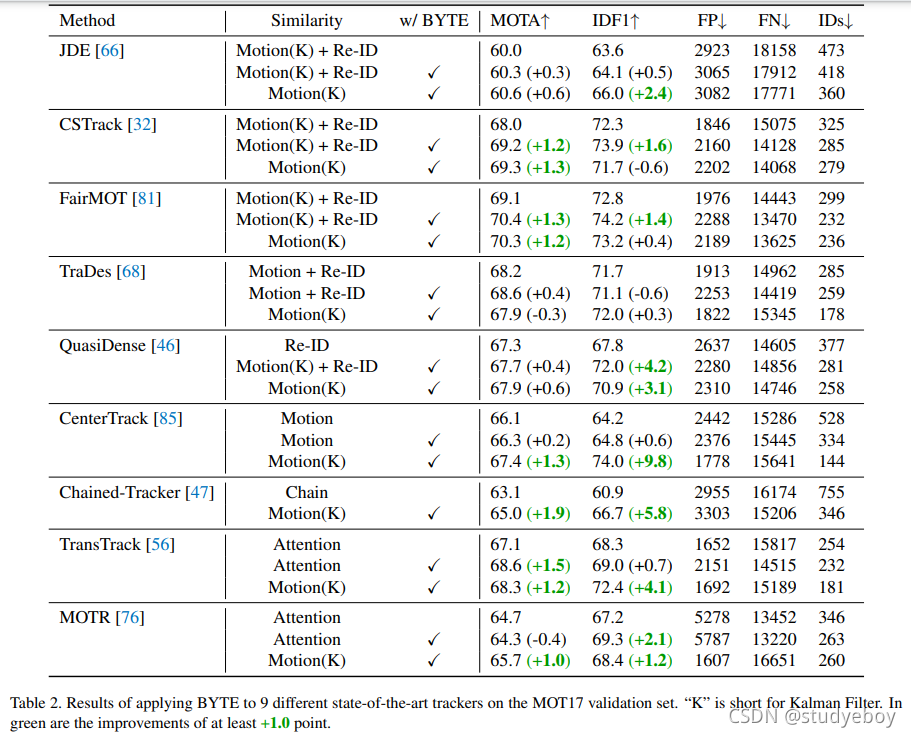
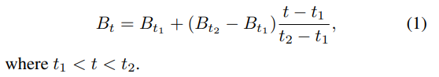

ByteTrack：Multi-Object Tracking by Associating Every Detection Box（2021）
网上翻译 https://blog.csdn.net/studyeboy/article/details/120993485
ByteTrack：通过关联每个检测框进行多目标跟踪
# 摘要
多目标跟踪(MOT)的目的是估计视频中物体的bounding box和Id。

目前大多数的方法是通过关联得分高于阈值的检测框来获得Id。检测分数低的对象，例如被遮挡的物体，被简单地扔掉，这带来了不可忽略的真实物体丢失和碎片轨迹。

为了解决这一问题，文章提出了一种简单、有效和通用的关联方法(ByteTrack)：通过关联每个检测框而不是只关联得分高的检测框进行跟踪。对于得分低的检测框，利用低分检测框和跟踪轨迹之间的相似性，恢复真正的物体并过滤掉背景。

当应用于9种不同的先进跟踪器时，该方法在IDF1评分上取得了一致的改善，提高了1-10个点。在MOT17测试集上，利用单个V100 GPU，以30 FPS的运行速度，实现了80.3 MOTA, 77.3 IDF1和63.1 HOTA。

一、介绍

介绍的第一句，就引用了一句黑格尔的话！还是第一次看到这样的论文，还是比较有意思的。
这句德语啥意思，有两种翻译。通俗一点的解释是：存在即合理。
比较正确且专业的解释是：凡是合乎理性的东西都是现实的；凡是现实的东西都是合乎理性的。
 
基于检测的跟踪是目前最有效的多目标跟踪方法。但是由于视频中复杂的场景，检测器并不能完美的预测。目前最先进的MOT方法需要权衡检测框中的真阳性/假阳性来消除低置信度检测框。但是直接去除这些低分框真的合理吗？

文章认为，低分框往往意味着被遮挡的物体。去掉这些目标意味着对于MOT造成不可逆误差、漏检和碎片轨迹。并提出了一种充分利用高低置信度检测框的、简单有效的数据关联方法BYTE：tracklet是一个基本单元，以每个检测框命名，并对每一个检测框进行计算。

图 2 (a) 和 (b) 显示了这个问题。在 t1 帧中，我们初始化了三个不同的轨迹，因为它们的分数都高于 0.5。然而，在发生遮挡的 t2 帧和 t3 帧中，红色轨迹对应的检测分数变低，即 0.8 到 0.4，然后是 0.4 到 0.1。 这些检测框被阈值机制消除，红色轨迹相应消失。尽管如此，如果我们考虑到每个检测框，就会立即引入更多的误报，例如，图 2（a）的帧 t3 中最右边的框。据我们所知，MOT 中很少有方法 [29, 60] 能够处理这种检测困境。 

在本文中，我们发现与 tracklets 的相似性提供了一个强有力的线索来区分低分检测框中的对象和背景。如图 2© 所示，两个低分检测框通过运动模型的预测框与轨迹匹配，从而正确恢复了对象。同时，背景框被移除，因为它没有匹配的轨迹。

为了在匹配过程中充分利用从高分到低分的检测框，我们提出了一种简单有效的关联方法BYTE，以命名每个检测框作为tracklet的基本单位，在计算机程序中为字节，我们的跟踪方法重视每个详细的检测框。我们首先根据运动相似性将高分检测框与轨迹匹配。

我们首先根据运动相似性将高分检测框与轨迹匹配。与 [7] 类似，我们使用卡尔曼滤波器 [28] 来预测新帧中轨迹的位置。运动相似度可以通过预测框和检测框的 IoU 来计算。图2(b)正是第一次匹配后的结果。然后，我们在未匹配的轨迹（即红色框中的轨迹）和低分检测框之间执行第二次匹配。 

图2（c）显示了第二次匹配后的结果。 检测分数低的被遮挡人与之前的轨迹正确匹配，背景被移除。为了评估我们提出的关联方法的泛化能力，我们将其应用于 9 种不同的最先进跟踪器，包括基于 Re-ID 的跟踪器 [66, 81, 32, 46]，基于运动的跟踪器 [85 , 68, 47]，基于链的 [47] 和基于注意力的 [56, 76]。我们在包括 MOTA、IDF1 分数和 ID 开关在内的几乎所有指标上都取得了显着改进。例如，我们将 CenterTrack [85] 的 MOTA 从 66.1 增加到 67.4，将 IDF1 从 64.2 增加到 74.0，并在 MOT17 [85] 的半验证集上将 ID 从 528 减少到 144。 

为了推动 MOT 的最先进性能，我们提出了一个简单而强大的跟踪器，名为 ByteTrack。我们采用最近的高性能检测器 YOLOX [24] 来获取检测框并将它们与我们提出的 BYTE 相关联。在MOT挑战方面，BYTECTAK在MOT17[43]和MOT20[16]中排名第一，在MOT17的V100 GPU上以30 FPS的运行速度实现了80.3 MOTA、77.3 IDF1和63.1 HOTA，在MOT20上实现了77.8 MOTA、75.2 IDF1和61.3 HOTA。

**我们提出的方法是第一个通过极其简单的运动模型实现极具竞争力的跟踪性能的工作，没有任何 Re-ID 模块或注意力机制 [81、32、46、65、76、56]。**它揭示了运动线索在处理遮挡和远程关联方面的巨大潜力。我们希望 ByteTrack 的效率和简单性能够使其在实际应用中具有吸引力。

相关工作
目标检测和数据关联是多目标跟踪的两个关键组成部分。检测估计边界框和关联获得身份。
MOT 中的物体检测
目标检测是计算机视觉中最活跃的话题之一，它是多目标跟踪的基础。MOT17 数据集 [43] 提供了由 DPM [21]、Faster R-CNN [49] 和 SDP [74] 等流行检测器获得的检测结果。大量方法 [71, 14, 4, 12, 88, 9, 27] 专注于基于这些给定的检测结果提高跟踪性能。这些方法的联想能力可以比较。

检测跟踪随着物体检测[49,26,48,34,10,22,57,55]的快速发展，越来越多的方法开始使用更强大的检测器来获得更高的跟踪性能。一级物体检测器 RetinaNet [34] 开始被多种方法使用，例如 [38, 47]。CenterNet [86] 是大多数方法 [85, 81, 68, 83, 65, 60, 63] 使用的最流行的检测器，因为它简单高效。YOLO 系列检测器 [48, 8] 也被大量方法 [66, 32, 33, 15] 使用，因为它在精度和速度之间取得了出色的平衡。这些方法中的大多数直接使用单个图像上的检测框进行跟踪。

通过跟踪检测 也可以采用跟踪来帮助获得更准确的检测框。一些方法 [52, 88, 14, 13, 15, 12] 使用单目标跟踪 (SOT) [6] 或卡尔曼滤波器 [28] 来预测下一帧中轨迹的位置并将预测框与检测融合 框以增强检测结果。其他方法 [82, 33] 使用前一帧中的跟踪框来增强后一帧的特征表示。最近，基于 Transformer 的 [61, 19, 64, 37] 检测器 [11, 89] 被多种方法 [56, 41, 76] 使用，因为它具有在帧之间传播框的强大能力。我们的方法也利用与轨迹的相似性来加强检测框的可靠性。

数据关联
数据关联是多目标跟踪的核心，它首先计算tracklet和检测框之间的相似度，然后根据相似度进行匹配。

### 相似度指标
位置、动作和外观是关联的有用线索。SORT [7] 以一种非常简单的方式结合了位置和运动线索。它首先使用卡尔曼滤波器 [28] 来预测新帧中轨迹的位置，然后计算检测框和预测框之间的 IoU 作为相似度。最近的一些方法 [85, 56, 68] 设计网络来学习对象运动，并在大相机运动或低帧率的情况下获得更稳健的结果。短距离匹配中的位置和运动相似度是准确的。外观相似度有助于长距离匹配。一个物体被长时间遮挡后，可以使用外观相似度重新识别。外观相似度可以通过 Re-ID 特征的余弦相似度来衡量。DeepSORT [67] 采用独立的 Re-ID 模型从检测框中提取外观特征。最近，联合检测和 Re-ID 模型 [66, 81, 32, 38, 80, 46] 由于其简单性和效率而变得越来越流行。

匹配策略 在相似度计算之后，匹配策略为对象分配身份。这可以通过匈牙利算法 [30] 或贪婪分配 [85] 来完成。SORT [7] 通过一次匹配将检测框与轨迹匹配。DeepSORT [67] 提出了一种级联匹配策略，该策略首先将检测框与最近的轨迹进行匹配，然后与丢失的轨迹进行匹配。MOTDT [12] 首先使用外观相似度进行匹配，然后使用 IoU 相似度匹配未匹配的轨迹。QuasiDense [46] 通过双向 softmax 操作将外观相似度转化为概率，并使用最近邻搜索来完成匹配。**注意机制 [61] 可以直接在帧之间传播框并隐式执行关联。最近的方法如 [41, 76] 提出了跟踪查询以在以下帧中找到被跟踪对象的位置。匹配是在注意力交互过程中隐式执行的。**

所有这些方法都集中在如何设计更好的关联方法上。然而，我们认为检测框决定了数据关联的上限，我们关注如何在匹配过程中利用从高分到低分的检测框。

BYTE
我们提出了一种简单、有效和通用的数据关联方法，BYTE。与之前的方法 [66, 81, 32, 46] 只保留高分检测框不同，我们保留每个检测框并将它们分为高分和低分。我们首先将高分检测框与轨迹相关联。一些轨迹无法匹配，因为它与适当的高分检测框不匹配，这通常发生在发生遮挡、运动模糊或大小变化时。然后，我们将低分检测框和这些不匹配的轨迹关联起来，以同时恢复低分检测框中的对象并过滤掉背景。BYTE 的伪代码如算法 1 所示。

BYTE 的输入是一个视频序列 V，以及一个目标检测器 Det 和卡尔曼滤波器 KF。我们还设置了三个阈值t_high t_low和ϵ,t_high和t_low是检测分数阈值，ϵ是跟踪分数阈值。BYTE 的输出是视频的轨迹 T，每个轨迹包含每一帧中对象的边界框和身份。 

对于视频中的每一帧，我们使用检测器 Det 预测检测框和分数。我们根据检测分数阈值 t_high和t_low 将所有检测框分成两部分 对于分数高于t_{high}的检测框，我们将它们放入高分检测框D_{high}中。对于分数范围从 t_{low}  到 t_{high} 的那些，我们将它们放入低分检测框 D_{low}中。
在将低分检测框和高分检测框分离后，我们使用卡尔曼滤波器 KF 来预测 T中每个轨道的新位置（算法 1 中的第 14 至 16 行）。

在高分检测框D_{high}和所有轨迹T（包括丢失轨迹T_{lost}）之间进行第一次关联。相似度由检测框D_{high}和轨迹T的预测框之间的 IoU 计算。

然后，我们使用匈牙利算法[30]完成基于相似度的匹配。特别是，如果检测框和轨迹框之间的 IoU 小于 0.2，我们拒绝匹配。我们将未匹配的检测保留在  D_{remain} 中，将未匹配的轨迹保留在  T_{remain}中（算法 1 中的第 17 至 19 行）。

BYTE 高度灵活，可以兼容其他不同的关联方式。例如，当 BYTE 与 DeepSORT [67] 结合时，在算法 1 中将 Re-ID 特征添加到 * 第一次关联（即高分关联） * 中，其他相同。在实验中，我们将 BYTE 应用于 9 个不同的最先进的跟踪器，并在几乎所有指标上取得了显着的改进。

低分检测框  D_{low}   与第一次关联后的剩余轨迹  T_{remain}  之间进行第二次关联。我们将未匹配的轨道保留在 Tre-remain 中，并删除所有未匹配的低分检测框，因为我们将它们视为背景。（算法 1 中的第 20 至 21 行）。

我们发现在第二个关联中使用 IoU 作为相似性很重要，因为低分检测框通常包含严重的遮挡或运动模糊，并且外观特征不可靠。因此，当将 BYTE 应用于其他基于 Re-ID 的跟踪器 [66, 81, 46] 时，我们不会在第二个关联中使用外观相似性。

关联后，将从轨迹中删除不匹配的轨迹。为简单起见，我们没有在算法 1 中列出轨道重生的过程 [67, 12, 85]。实际上，远程关联需要保留轨迹的标识。对于第二次关联后未匹配的轨迹 T_{re-remain} ，我们将它们放入 T_{lost} 。对于 T_{lost} 中的每个轨迹，只有当它存在超过一定数量的帧（即30帧）时，我们才会将其从轨迹T 中删除。否则，我们将保留 T   中丢失的轨迹  T_{lost}  （算法 1 中的第 22 行）。

最后，我们在第一次关联后从未匹配的高分检测框D_{remain} 中初始化新轨道。对于 D_{remain}D中的每个检测框，如果它的检测分数高于并存在连续两帧，我们初始化一个新的轨道（算法 1 中的第 23 到 27 行）。

每个单独帧的输出是当前帧中轨道T的边界框和标识。请注意，我们不输出T_{lost}的框和身份。

ByteTrack
为了提出 MOT 的最先进性能，我们设计了一个简单而强大的跟踪器，名为 ByteTrack，通过为高性能检测器 YOLOX [24] 配备我们的关联方法 BYTE。

YOLOX 原理 。。。。。。略。

我们注意到 MOT17 [43] 要求边界框 [85] 覆盖整个身体，即使对象被遮挡或部分在图像之外。但是，YOLOX 的默认实现会裁剪图像区域内的检测框。为了避免图像边界周围的错误检测结果，我们在数据预处理和标签分配方面修改了 YOLOX。在数据预处理和数据增强过程中，我们不会裁剪图像内的边界框。我们只删除数据增强后完全位于图像之外的框。在 SimOTA 标签分配策略中，正样本需要在物体的中心附近，而整个身体框的中心可能位于图像之外，因此我们将物体的中心裁剪在图像内。

MOT20 [16] 剪辑了图像内的边界框注释，因此我们只使用原始的 YOLOX。

# 实验
## 设置
数据集。 我们在“私人检测”协议下在 MOT17 [43] 和 MOT20 [16] 数据集上评估 BYTE 和 ByteTrack。两个数据集都包含训练集和测试集，没有验证集。对于消融研究，我们使用 MOT17 训练集中每个视频的前半部分进行训练，后半部分用于验证 [85]。我们在 CrowdHuman 数据集 [54] 和 MOT17 半训练集 [85, 56, 76, 68] 的组合上进行训练。在 MOT17 的测试集上进行测试时，我们添加了 Cityperson [78] 和 ETHZ [20] 用于训练 [66, 81, 32]。

指标。 我们使用 CLEAR 指标 [5]，包括 MOTA、FP、FN、ID 等，IDF1 [51] 和 HOTA [39] 来评估跟踪性能的不同方面。MOTA 是基于 FP、FN 和 ID 计算的。 考虑到 FP 和 FN 的数量大于 ID，MOTA 更注重检测性能。IDF1 评估身份保存能力，更关注关联性能。 HOTA 是最近提出的一个指标，它明确地平衡了执行准确检测、关联和定位的效果。

实施细则。 **对于 BYTE，除非另有说明，否则默认的高检测分数阈值t{high}为 0.6，低阈值t_{low}为 0.1，轨迹ϵ初始化分数为 0.7。在线性分配步骤中，如果检测框和轨迹框之间的 IoU 小于 0.2，则匹配将被拒绝。对于丢失的轨迹，我们将其保留 30 帧，以防再次出现。**

对于 ByteTrack，检测器是 YOLOX [24]，其中 YOLOX-X 作为主干，COCO 预训练模型 [35] 作为初始化权重。训练计划是在 MOT17、CrowdHuman、Cityperson 和 ETHZ 的组合上的 80 个 epoch。输入图像大小为 1440 × 800，多尺度训练时最短边范围为 576 到 1024。数据增强包括 Mosaic [8] 和 Mixup [77]。该模型在 **8 个 NVIDIA Tesla V100 GPU** 上训练，批量大小为 48。优化器是 SGD，权重衰减为 5 × 10−4，动量为 0.9。 初始学习率为 10−3，具有 1 个 epoch 预热和余弦退火计划。 **总训练时间约12小时**。 在 [24] 之后，FPS 是在单个 GPU 上使用 FP16precision [42] 和批量大小为 1 来测量的。

## 在其他跟踪器上的应用。
我们在 9 种不同的最先进跟踪器上应用 BYTE，包括 JDE [66]、CSTrack [32]、FairMOT [81]、TraDes [68]、QuasiDense [46]、CenterTrack [85]、Chained-Tracker [ 47]、TransTrack [56] 和 MOTR [76]。在这些跟踪器中，JDE、CSTrack、FairMOT、TraDes 使用了运动和 ReID 相似性的组合。QuasiDense 单独使用 Re-ID 相似性。
CenterTrack 和 TraDes 通过学习的网络预测运动相似性。 Chained-Tracker 采用链式结构，同时输出两个连续帧的结果，并通过 IoU 关联在同一帧中。
TransTrack 和 MOTR 使用注意力机制在帧之间传播框。 他们的结果显示在表 2 中每个跟踪器的第一行。为了评估 BYTE 的有效性，我们设计了两种不同的模式来将 BYTE 应用于这些跟踪器。

第一种方式是将BYTE插入到不同tracker的原始关联方法中，如表2中每个tracker结果的第二行所示。以FairMOT[81]为例，在原始关联完成后，我们选择所有不匹配的tracklet，并将它们与算法1中第二次关联之后的低分检测框关联。请注意，对于低分对象，Re-ID 特征不可靠，因此我们仅使用运动预测后检测框和轨迹框之间的 IoU 作为相似度。我们没有将 BYTE 的第一种模式应用于 Chained-Tracker，因为我们发现它很难在链结构中实现。
第二种模式是直接使用这些跟踪器的检测框，并使用算法1中的整个过程进行关联，如表2中每个跟踪器结果的第三行所示。

我们可以看到，在这两种模式下，BYTE 几乎可以在包括 MOTA、IDF1 和 ID 在内的所有指标上带来稳定的改进。例如，BYTE 将 CenterTrack 增加 1.3 MOTA 和 9.8 IDF1，Chained-Tracker 增加 1.9 MOTA 和 5.8 IDF1，TransTrack 增加 1.2 MOTA 和 4.1 IDF1。表 2 中的结果表明 BYTE 具有很强的泛化能力，可以很容易地应用于现有跟踪器以获得性能增益。
原文提出的关联过程比直接在其它文章的关联过程中加入低分关联，性能更好

# ByteTrack 上的消融研究
**训练数据。**我们使用不同的训练数据组合在 MOT17 的半验证集上评估 ByteTrack。结果如表4所示。仅使用 MOT17 的一半训练集时，性能达到 75.8 MOTA，已经超过大多数方法。这是因为我们使用了强大的增强功能，例如 Mosaic [8] 和 Mixup [77]。当进一步加入 CrowdHuman、Cityperson 和 ETHZ 进行训练时，我们可以达到 76.7 MOTA 和 79.7 IDF1。IDF1 的重大改进源于 CrowdHuman 数据集可以增强检测器识别被遮挡的人，因此，使卡尔曼滤波器生成更平滑的预测并增强跟踪器的关联能力。

训练数据的实验表明 ByteTrack 并不需要数据。与需要超过 7 个数据源 [43、20、78、70、84、18、54] 以实现高性能的先前方法 [81、32、63、33] 相比，这对于实际应用来说是一个很大的优势。
## 困难样例
我们在图 5 中展示了 ByteTrack 能够处理的一些困难案例的可视化结果。我们从 MOT17 的半验证集中选择 6 个序列，并使用具有 76.6 MOTA 和 79.3 IDF1 的模型生成可视化结果。困难的情况包括遮挡（即 MOT17-02、MOT17-04、MOT1705、MOT17-09、MOT17-13）、运动模糊（即 MOT17-10、MOT17-13）和小物体（即 MOT17-13）。中间有红色三角形的行人检测分数较低，这是通过我们的关联方法 BYTE 获得的。低分框不仅减少了缺失检测的数量，而且对于长距离关联也起到了重要作用。从所有这些疑难案例中我们可以看出，ByteTrack 并没有带来任何身份切换，并且有效地保留了身份。
 

## 轨迹插值 
我们注意到 MOT17 中有一些完全遮挡的行人，其可见率在地面实况注释中为 0。由于几乎不可能通过视觉线索检测它们，我们通过轨迹插值获得这些对象。

假设我们有一个轨迹 T TT，它的轨迹框由于从帧 t_1到t_2的遮挡而丢失。T在 t_1帧的轨迹框是  B_{t_1} ∈R……4
 ，它包含边界框的左上角和右下角坐标。让 B_{t_2}  代表 T在帧t_2处的轨迹框。我们设置了一个超参数 σ  表示我们执行轨迹插值的最大间隔，这意味着轨迹插值在 t_2 − t_1 ≤  ≤σ, 时执行。在第 T帧轨迹 T的插值框可以计算如下：

如表 5 所示，当 σ  为 20 时，轨迹插值可以将 MOTA 从 76.6 提高到 78.3，将 IDF1 从 79.3 提高到 80.2。轨迹插值是一种有效的后处理方法，可以获取那些完全遮挡物体的框。

