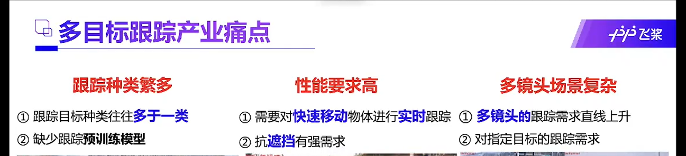
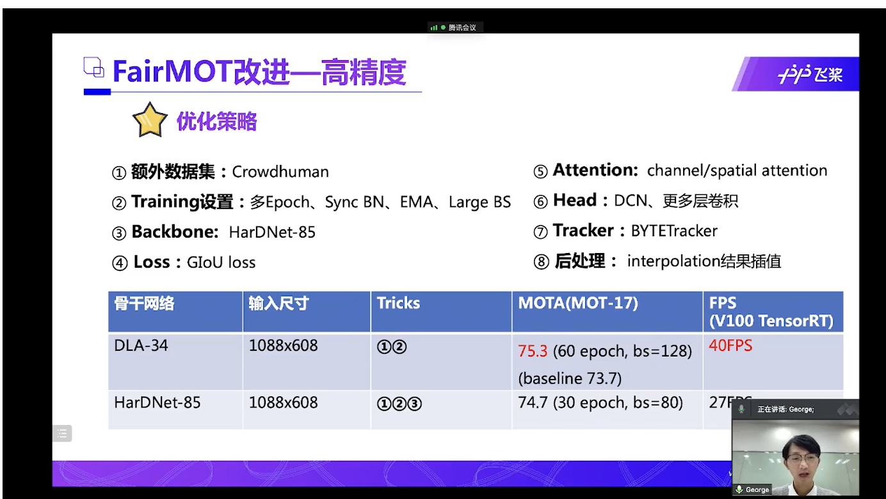
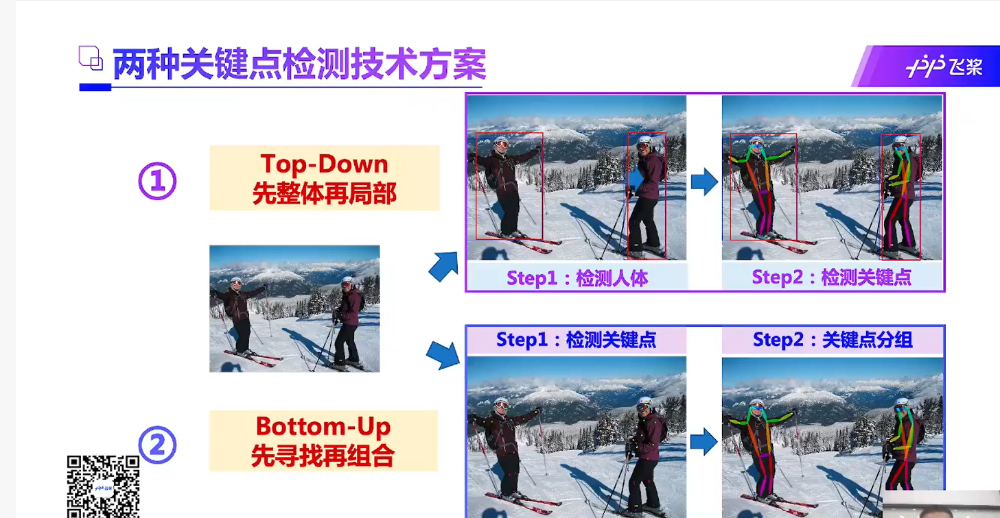
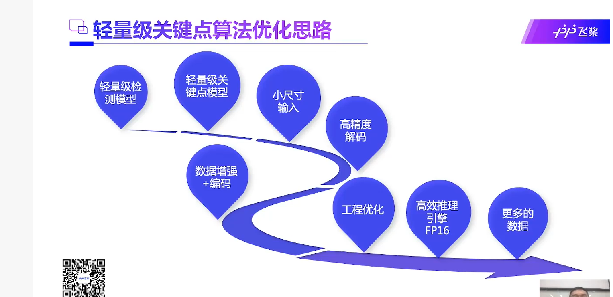

# 基本原则：
 1、不可能自己想出什么新的模型，基本上都是用现有的
 2、寻求大神的帮助是必须的
 
# 研究目标和内容 
## 视频动态贴纸
视频动态贴纸目前用得最多的就是抖音 或者 很多直播里面的那种贴纸，比如一个墨镜贴纸，视频中人运动，然后
墨镜贴纸跟随人的眼睛在视频中运动

但是看到目前的动态贴纸基本上只实现了单人大头的效果，对于多人的情景不能区分不同的人

所以想实现的是，能够对多人，复杂运动情景下的，针对人的那种动态贴纸

这个涉及到的技术，主要是人体追踪和关键点检测。

google的mediapipe库提供人体姿势和关键点检测，但是它这个似乎没有追踪功能（当然也不能指定检测的人）

目前测试的效果就是多人情况下很容易丢失，比如人脸消失，人被挡住等，很容易就切换到其它人身上去了。

我们需要实现最终的效果是可以追踪的那种。

那么现在基本上就是只需要加一个单人目标追踪就行了

## 单目标人体跟踪
简单的说就是，在复杂场景，多人等的视频中，根据给出的目标对象，在后续整个视频中给出目标对象的位置框

## 整体流程
单目标人体跟踪-根据检测到的目标框调用mediapipe的hostlic算法-根据算法给出的关键点实现动态贴纸

# 相关工作
## 单目标跟踪排行：
https://paperswithcode.com/sota/visual-object-tracking-on-lasot

https://paperswithcode.com/sota/visual-object-tracking-on-vot201718

## 最新论文
2021年的单目标跟踪综述
https://www.arocmag.com/article/02-2021-10-003.html

目前排名第二的论文-主要是cnn和transformer结合的
https://paperswithcode.com/paper/learning-spatio-temporal-transformer-for

2021.12.2出的最新的sota,基于纯transformer架构
https://arxiv.org/abs/2112.00995

2021多目标跟踪上实现了大步前进的sota，可能有借鉴意义
https://arxiv.org/abs/2110.06864

cnn和transformer学习相关文献目前网上比较多

## 人体关键点检测
拟采用人体关键点检测，采用google开源的mediapipe库
https://google.github.io/mediapipe/solutions/holistic

# 本文的工作
1、单人目标跟踪算法的轻量化，能够在消费级产品上实时运行-目前看到的效果好算法存在模型文件太大或者速度等问题），
2、算法性能优化，前面的sota比可能有些难，不知道可不可以在人这个专门的数据集上优化），
3、可能的化提出一些创新
4、结合单人跟踪和人体关键点检测，实现目前实际项目上尚未看到的，多人和复杂场景下的视频动态贴纸
5、更多可能的应用

# 实现思路 
不能用多目标的思路，多目标思路基本上是不一样的，全图检测，然后对比跟踪，单目标用不着，的算力消耗高太多了，需要单目标的

单目标，我们还需要重识别

最好能加上目标遮挡判断

# 百度算法落地的实现方案、教程，可供借鉴学习
目标跟踪产业痛点

trick
性能

轻量级

reid模型等可以根据不同对象专门化

光流估计
http://www.c-s-a.org.cn/html/2018/12/6665.html
## 关键点检测
关键点检测可以看做目标检测的复杂版

应用：安防应用，智慧交通-交警姿势，健身，互动娱了，工业应用

关键点检测的两种方案

top-down 先目标检测 再找关键点
bottom-up 先找到关键点 再检测
当前比较领先的方案：

关键点检测算力远大于目标检测

百度的模型速度 122fps
优化思路

数据增强：
遮挡关键点

低分辨率输入，高精度输入（大概就是二阶泰勒展开用离散位置预测连续位置）

工程优化
把前后处理操作放到模型中，可以利用模型框架优化速度

手臂正反面似乎需要3D Pose

问题点，优化点：
多人场景下单目标跟踪相似物体问题

思路：
引入下一帧距离上一帧中心点的距离，轨迹参数等是否会好，方法类似于前面的空间自适应归一化，或者bytetracking里面的

# 数据集：
目前的数据集都是为多种类别的目标准备的，我们可以只取数据集中的一类，然后结合多个数据集

另外，还可以从MOT里面取数据

比较先进的一个单目标数据集
LaSOT 2019年出的 
优点：
1、时长100s左右，比其它数据集提供的更长
2、数据量更大，种类更多
https://www.leiphone.com/category/academic/NhOeLVXzIdLVSxyU.html

所以结合姿势追踪的来做这个。
收录到的姿势追踪效果最好的
https://paperswithcode.com/paper/combining-detection-and-tracking-for-human
不要想大而全，实现关键点就好

可以学习的：
https://github.com/PaddlePaddle/PaddleDetection/tree/release/2.3/configs/keypoint/tiny_pose

挑战点：镜头切换时追踪 == 行人追踪过程中的行人重识别
跟踪算法有两类：基于检测的跟踪，不基于检测的跟踪
目前的好的都是基于检测的跟踪，一个原因是可以从检测算法中受益
