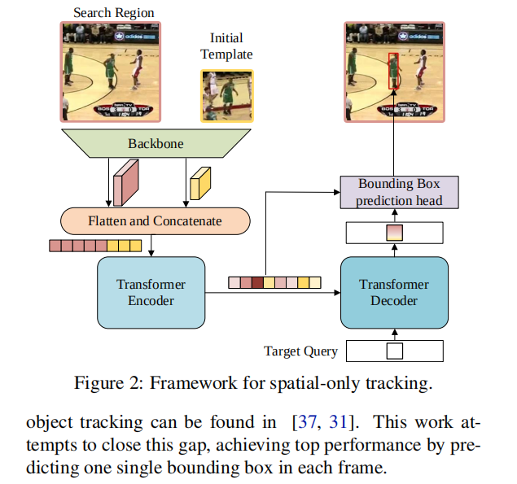

Learning Spatio-Temporal Transformer for Visual Tracking

Abstract
本文提出了一种以编码器-解码器变压器为关键组成对象的新型跟踪体系结构。编码器对目标对象和搜索重复之间的全局时空特征依赖进行建模，解码器学习查询嵌入来预先预测目标对象的空间位置。我们的方法将对象跟踪转换为一个直接边界框预测问题，而不使用任何建议或预定义的条件。对于编码器-解码器变压器，对象的准备只需使用一个简单的全卷积网络工作，它可以直接估计对象的各个角。整个方法都是端到端的，不需要任何余弦窗口和边界框光滑化等后处理步骤，从而在很大程度上简化了现有的跟踪管道。所提出的跟踪器在多个具有挑战性的短期和长期基准测试上实现了最先进的性能，同时以实时速度运行，比SiamR-CNN[54]快6×。代码和模型在https://github.com/researchmm/Stark上都是开源的。

# 1. Introduction
Visual object tracking is a fundamental yet challeng-ing research topic in computer vision.  Over the past few years, based on convolutional neural networks, object track-ing has achieved remarkable progress [28, 11, 54].  How-ever, convolution kernels are not good at modeling long-range dependencies of image contents and features, because they only process a local neighborhood, either in space or time. Current prevailing trackers, including both the offline Siamese trackers and the online learning models, are almost all built upon convolutional operations [2, 44, 3, 54].  As a consequence, these methods only perform well on model-ing local relationships of image content, but being limited to capturing long-range global interactions. Such deficiency may degrade the model capacities for dealing with the sce-narios where the global contextual information is important for localization, such as the objects undergoing large-scale variations or getting in and out of views frequently.  
1.介绍
视觉对象跟踪是计算机视觉中一个重要的研究课题。近年来，基于卷积神经网络的对象跟踪[28,11,54]取得了显著的进展。无论如何，卷积内核都不擅长建模图像内容和特征的长期依赖关系，因为它们只在空间或时间上处理一个局部邻域。**目前流行的跟踪器，包括离线的暹罗跟踪器和在线学习模型，几乎都是建立在卷积操作[2,44,3,54]的基础上的。** 因此，这些方法只在图像内容的局部关系建模上表现良好，但仅限于捕获长距离的全局交互。这种缺陷可能会降低模型处理全局上下文信息对定位很重要的安全导航问题的能力，例如经历大规模变化或频繁进出视图的对象。

图1：与LaSOT[15]上最先进技术的比较。我们根据帧-秒(fps)的跟踪速度来可视化成功的性能。圆的大小表示跟踪器的速度（x轴）和成功得分（y轴）的加权之和。体积越大，效果就越好。我们的-ST101和我们的-ST50分别表示了以ResNet-101和ResNet-50为骨干的建议跟踪器。颜色更好

The problem of long-range interactions has been tackled in sequence modeling through the use of transformer [53]. Transformer  has  enjoyed  rich  success  in  tasks  such  as natural language modeling  [13, 46] and speech recogni-tion [40]. Recently, transformer has been employed in dis-criminative computer vision models and drawn great atten-tion [14, 5, 41].  Inspired by the recent DEtection TRans-former (DETR) [5], we propose a new end-to-end tracking architecture with encoder-decoder transformer to boost the performance of conventional convolution models.
通过使用变压器[53]，在序列建模中解决了长程交互的问题。变压器在自然语言建模[13,46]和语音识别[40]等任务上取得了巨大的成功。近年来，变压器被应用于判计算机视觉模型中，并绘制了良好的证明[14,5,41]。**受最近的检测TRans-former(DETR)[5]的启发，我们提出了一种新的带编码解码器变压器的端到端跟踪架构，以提高传统卷积模型的性能。**

Both spatial and temporal information are important for object tracking. The former one contains object appearance information for target localization, while the latter one in-cludes the state changes of objects across frames. Previous Siamese trackers [28, 59, 16, 7] only exploit the spatial in-formation for tracking, while online methods [63, 66, 11, 3] use historical predictions for model updates. Although be-ing successful, these methods do not explicitly model the relationship between space and time.
**以前的孪生跟踪器[28,59,16,7]只利用空间形态进行跟踪，而在线方法[63,66,11,3]使用历史预测进行模型更新。虽然这些方法很成功，但它们并没有明确地模拟空间和时间之间的关系。**

 In this work, consider-ing the superior capacity on modeling global dependencies, we resort to transformer to integrate spatial and temporal information for tracking, generating discriminative spatio-temporal features for object localization.
 **在这项工作中，考虑了transformer在全局依赖关系的建模中优越的能力，我们采用变压器来整合空间和时间信息进行跟踪，生成用于目标定位的区分时空特征。**

 More specifically, we propose a new spatio-temporal ar-chitecture based on the encoder-decoder transformer for visual tracking. The new architecture contains three key components: an encoder, a decoder and a prediction head.
 **提出的新结构包含三个关键组件，编码器，解码器，预测头。**

The encoder accepts inputs of an initial target object, the current image, and a dynamically updated template.  The self-attention modules in the encoder learn the relation-ship between the inputs through their feature dependencies. Since the template images are updated throughout video se-quences, the encoder can capture both spatial and tempo-ral information of the target.   
**编码器接收原始的目标对象，当前图像，以及一个动态更新的模板作为输入（动态模板也是图的形式）。编码器中的自注意力模块通过输入模块之间的特征依赖学得它们之间的关系。因为模板在整个视频序列中都会更新，所以编码器能捕获目标的时间和空间信息。**
The decoder learns a query embedding to predict the spatial positions of the target ob-ject.  
**解码器学习一个查询嵌入来预测目标的空间位置。**

A corner-based prediction head is used to estimate the bounding box of the target object in the current frame. Meanwhile, a score head is learned to control the updates of the dynamic template images.
**一个基于角的预测头用来估计目标对象在当前帧中的边框。同时，一个打分头 学习控制动态模板图像的更新。**

It is also worth noting that compared with previous long-term trackers [9, 54, 62], the framework of our method is much simpler. Specifically, previous methods usually con-sist of multiple components, such as base trackers [11, 57], target verification modules [23], and global detectors [47, 21].   In contrast,  our method only has a single network learned in an end-to-end fashion. 
**前面的方法通常包括基础跟踪器，目标验证模型，以及全局检测器。对比的是，我们的方法只有一个单独的网络通过端到端的方式学习。**

Moreover, our tracker can run at real-time speed, being 6× faster than Siam R-CNN (30 v.s. 5 fps) on a Tesla V100 GPU, as shown in Fig. 1
Considering  recent  trends  of  over-fitting  on  small-scale benchmarks,  we collect a new large-scale tracking benchmark called  NOTU, integrating all sequences from NFS [24], OTB100 [58], TC128 [33], and UAV123 [42].考虑到目前的小规模测试基准有过拟合的趋势，我们收集了一个大规模的跟踪基准名叫NOTU，继承了NFS，OTB100，TC128,以及UAV123.

In summary, this work has four contributions.
•  We propose a new transformer architecture dedicated to visual tracking. It is capable of capturing global fea-ture dependencies of both spatial and temporal infor-mation in video sequences.
•  The  whole  method  is  end-to-end,  does  not  need any postprocessing steps such as cosine window and bounding box smoothing, thus largely simplifying ex-isting tracking pipelines.
•  The proposed trackers achieve state-of-the-art perfor-mance on five challenging short-term and long-term benchmarks, while running at real-time speed.
•  We construct a new large-scale tracking benchmark to alleviate the over-fitting problem on previous small-scale datasets.

# 2. Related Work
## Transformer in Language and Vision.   
Transformer is originally proposed by Vaswani et al. [53] for machine translation task, and has become a prevailing architecture in language modeling. Transformer takes a sequence as the in-put, scans through each element in the sequence and learns their dependencies.  This feature makes transformer be in-trinsically good at capturing global information in sequen-tial data.  Recently, transformer has shown their great po-tential in vision tasks like image classification [14], object detection [5], semantic segmentation [56], multiple object tracking [51, 41], etc.  Our work is inspired by the recent work DETR [5], but has following fundamental differences. (1) The studied tasks are different.  DETR is designed for object detection, while this work is for object tracking. (2) The network inputs are different.  DETR takes the whole image as the input, while our input is a triplet consisting of one search region and two templates.  Their features from the backbone are first flattened and concatenated then sent to the encoder. 
我们的工作受到detr的启发，但是有根本性的不同。
1.研究任务不同，前者是目标检测，这里是追踪
2.网络输入不同，detr获取整张图片作为输入，我们的输入是有三个部分：搜索区域，和两个模板。从主干来的特征首先被拉平然后concat然后输入编码器
(3) The query design and training strate-gies are different. DETR uses 100 object queries and uses the Hungarian algorithm to match predictions with ground-truths during training. In contrast, our method only uses one query and always matches it with the ground-truth without using the Hungarian algorithm.
3 查询结构设计不同，训练方式也不同。Detr使用100个对象查询并且在训练过程中使用匈牙利算法来匹配预测和真实标签。相对的，我们的方法只使用一个查询，然后不使用匈牙利算法匹配真实标签。
 (4) The bounding box heads are different.  DETR uses a three-layer perceptron to pre-dict boxes. Our network adopts a corner-based box head for higher-quality localization.
（4）边框预测头是不同的，detr使用了3层的感知机来预测边框，我们的网络采用了一个基于角的边框预测头来进行更高质量的定位。

Moreover, TransTrack  [51] and TrackFormer  [41] are two most recent representative works on transformer track-ing.  TransTrack [51] has the following features. 
更多的，TransTrack和TrnckFormer是最近使用transformer架构进行追踪的代表性工作。Transtrack有如下特性
(1)The encoder takes the image features of both the current and the previous frame as the inputs. 
编码器接受当前帧和前一帧 
(2) It has two decoders, which take the learned object queries and queries from the last frame as the input respectively. With different queries, the output sequence from the encoder is transformed into detection boxes and tracking boxes respectively.  
他有两个解码器，它们分别将学习到的对象查询和来自最后一帧的查询作为输入。通过不同的查询，将编码器的输出序列分别转换为检测框和跟踪框。
(3) The predicted two groups of boxes are matched based on the IoUs using the Hungarian algorithm  [27]. 
利用匈牙利算法[27]，根据iou对预测的两组盒子进行匹配。

While Track-former [41] has the following features. (1) It only takes the current frame features as the encoder inputs. 
而Track-former 的[41]有以下功能。（1）它只将当前的帧特性作为编码器的输入。 
(2) There is only one decoder, where the learned object queries and the track queries from the last frame interact with each other.
（2）只有一个解码器，其中学习到的对象查询和来自最后一帧的跟踪查询相互交互。
 (3) It associates tracks over time solely by attention operations, not relying on any additional matching such as mo-tion or appearance modeling.
（3）它仅仅通过注意力操作将轨道联系起来，而不依赖于任何额外的匹配，如动作或外观建模。 

In contrast, our work has the following fundamental differences with these two methods.
相比之下，我们的工作与这两种方法有以下根本的区别。
 (1) Network inputs are different. Our input is a triplet con-sisting of the current search region, the initial template and a dynamic template.  (2) Our method captures the appearance changes of the tracked targets by updating the dynamic template, rather than updating object queries as [51, 41].

## Spatio-Temporal Information Exploitation.
 Exploita-tion of spatial and temporal information is a core problem in object tracking field. 
**时空信息是目标追踪领域的核心问题。**
Existing trackers can be divided into two classes:  spatial-only ones and spatio-temporal ones. 现有的跟踪器可分为空间跟踪器和时空跟踪器两类。

### 空间跟踪器相关研究
Most of offline Siamese trackers  [2, 29, 28, 69, 34] be-long to the spatial-only ones,  which consider the object tracking as a template-matching between the initial tem-plate and the current search region.   
大多数离线孪生跟踪器[2,29,28,69,34]都只有空间跟踪器，它们认为对象跟踪是初始任务板和当前搜索区域之间的模板匹配。
To extract the rela-tionship between the template and the search region along the spatial dimension, most trackers adopt the variants of correlation,  including  the  naive  correlation  [2,  29],  the depth-wise correlation [28, 69], and the point-wise corre-lation [34, 61].  
为了提取模板与搜索区域在空间维度上的关系，大多数跟踪器都采用了相关性的变量 包括朴素相关[2,29]、深度相关[28,69]和点级相关[34,61]。
Although achieving remarkable progress in recent years, these methods merely capture local simi-larity, while ignoring global information. By contrast, the self-attention mechanism in transformer can capture long-range relationship, making it suitable for pairwise matching tasks. 
这些方法近年来虽然取得了显著的进展，但只是捕捉了局部的模拟，而忽略了全局信息。 相比之下，变压器中的自注意机制可以捕捉长程关系，适合于成对匹配任务。 

### 时空跟踪器相关研究
Compared with  spatial-only trackers,  spatio-temporal ones additionally exploit temporal information to improve trackers’ robustness. 
与仅空间跟踪器相比，时空跟踪器还利用时间信息来提高跟踪器的鲁棒性。
These methods can also be divided into two classes:  gradient-based and gradient-free ones. 
这些方法也可以分为基于梯度方法和无梯度方法。  

Gradient-based methods require gradient computa-tion during inference.  One of the classical works is MD-Net [44], which updates domain-specific layers with gradi-ent descent.  
基于梯度的方法在推理过程中需要进行梯度计算。其中一个经典的著作是MD-Net[44]，它以梯度下降来更新特定领域的层。To improve the optimization efficiency, later works [11, 3, 30, 55, 64] adopt more advanced optimization methods like GaussNewton method or meta-learning-based update  strategies. However,  many real-world de-vices for  deploying  deep learning  do not  support back-propagation,  which restricts the  application  of gradient-based methods.   
为了提高优化效率，[11,3,30,55,64]以后的工作采用了更先进的优化方法，如高斯牛顿方法或基于元学习的更新策略。
然而，许多部署深度学习的实际缺点并不支持反向传播，这限制了基于梯度的方法的应用。

In contrast,  gradient-free methods have larger potentials in real-world applications.One class of gradient-free methods [63, 66] exploits an extra network to update the template of Siamese trackers [2, 70]. 
相比之下，无梯度方法在实际应用中具有更大的潜力。一类无梯度方法[63,66]利用一个额外的网络来更新孪生跟踪器[2,70]的模板。
 Another representative work LTMU [9] learns a meta-updater to pre-dict whether the current state is reliable enough to be used for the update in long-term tracking.
另一个具有代表性的工作LTMU[9]学习了一个元更新器，以预测当前状态是否足够可靠，是否可以用于长期跟踪中的更新。

Although being effec-tive, these methods cause the separation between space and time. In contrast, our method integrates the spatial and tem-poral information as a whole, simultaneously learning them with the transformer.
虽然这些方法很有效，但它们会导致空间和时间之间的分离。相比之下，我们的方法将空间和空间信息作为一个整体集成，同时用transformer进行学习。

## Tracking Pipeline and Post-processing.  
The tracking pipelines of previous trackers  [28, 59, 69, 54] are com-plicated.   Specifically, they first generate a large number of box proposals with confidence scores, then use various post-processing to choose the best bounding box as the tracking result.  
以前的跟踪器[28,59,69,54]的跟踪管道是复杂的。具体来说，它们首先生成大量具有置信度分数的方框建议，然后使用各种后处理来选择最佳的边界方框作为跟踪结果。  

The commonly used post-processing in-cludes cosine window, scale or aspect-ratio penalty, bound-ing box smoothing, tracklet-based dynamic programming, etc.  Though it brings better results, post-processing causes the performance to be sensitive to hyper-parameters.   
常用的后处理方法有xxxx，  
There are some trackers [18, 21] attempting to simplify the track-ing pipeline, but their performances still lag far behind that of state-of-the-art trackers.    
有一些跟踪器尝试简化跟踪管道，但是它们的性能比其最先进的又有所差距。  
Recent books and surveys on object tracking can be found in [37, 31].  This work at-tempts to close this gap, achieving top performance by pre-dicting one single bounding box in each frame.  
最近关于物体跟踪的书籍和调查可以在[37,31]中找到。这项工作旨在缩小这个差距，通过在每一帧中预先预测一个单一的边界框来实现最高性能。

# 3. Method
In this section, we propose the spatio-temporal trans-former network for visual tracking,  called  STARK. For clarity, we first introduce a simple baseline method that di-rectly applies the original encoder-decoder transformer for tracking. The baseline method only considers spatial infor-mation and achieves impressive performance.   
**为了清晰起见，我们首先引入了一种简单的基线方法，它可以直接地应用原始的编码器-解码器变压器进行跟踪。基线方法只考虑空间信息，并取得了令人印象深刻的性能。**  
After that, we extend the baseline to learn both spatial and temporal representations for target localization.  We introduce a dynamic template and an update controller to capture the appearance changes of target objects.   
在此之后，我们扩展了基线来学习目标定位的空间和时间表示。我们引入了一个动态模板和一个更新控制器来捕获目标对象的外观变化。

## 3.1. A Simple Baseline Based on Transformer
We present a simple baseline framework based on visual transformer for object tracking.  
我们提出了一个基于视觉转换器的简单基线框架。   
The network architecture is demonstrated in Fig. 2. It mainly consists of three compo-nents: a convolutional backbone, an encoder-decoder transformer, and a bounding box prediction head.
该网络架构如图2所示。 2.它主要由三个组件组成：一个卷积主干、一个编码解码器转换和一个边界盒预测头。
## Backbone. 骨干
Our method can use arbitrary convolutional networks as the backbone for feature extraction.   
我们的方法可以使用任意的卷积网络作为特征提取的骨干。
Without loss of generality, we adopt the vanilla ResNet [17] as the backbone.  More concretely, except for removing the last stage and fully-connected layers, there is no other change for the original ResNet [17]. 
为了不失一般性，我们使用resnet作为backbone。更具体地说，除了删除最后一阶段和完全连接的层外，与原始的ResNet[17]相比没有其他变化。

The input of the backbone is a pair of images: a template image of the initial target object z ∈ R3×Hz×Wz   and a search region of the current frame x ∈ R3×Hx×Wx.  
主干的输入是一对图像：初始目标对象z的模板图像和当前帧x的搜索区域。

After passing through of the backbone, the template z and the search image x are mapped to two feature maps fz   and fx。  
通过主干后，将模板z和搜索图像x映射到两个特征映射fz和fx。

## Encoder.  
The feature maps output from the backbone require pre-processing before feeding into the encoder.  
从主干网输出的特征映射在输入编码器之前需要进行预处理。   
To be specific, a bottleneck layer is first used to reduce the channel number from C to d.  
具体来说，首先使用瓶颈层将通道数从C减少到d。  
Then the feature maps are flattened and concatenated along the spatial dimension, pro-ducing a feature sequence with length of $H _z/s * W_z / s + H_x/s * W_x/s$  and dimension of d,  which  servers  as the input for the transformer encoder.
然后将特征图沿空间维度（就是长宽维度）扁平连接，得到一个长度为 $H _z/s * W_z / s + H_x/s * W_x/s$ 、通道数量为d的特征序列，作为transformer编码器的输入。

The encoder consists of N encoder layers,  each of which is made up of a multi-head  self-attention module with a feed-forward network. 
编码器由N个编码器层组成，每个层由具有前馈网络多头自注意力组成。 
Due to the permutation-invariance of the original transformer [53], we add sinusoidal positional embeddings to the input sequence.   
由于对原变压器[53]的排列不变性，我们向输入序列添加正弦位置嵌入。（这个原理上就是最原始的attention is all you need提出的位置编码方法）
The encoder captures the feature dependencies among all elements in the sequence and reinforces the original features with global contextual information, thus allowing the model to learn discriminative features for object localization.  
编码器捕获序列中所有元素之间的特征依赖性，并使用全局上下文信息强化原始特征，从而允许模型学习用于对象定位的有判别力的特征。

## Decoder 解码器
The decoder takes a target query and the en-hanced feature  sequence from the encoder  as the input.    
解码器解码器从编码器中获取一个目标查询和被输入的特征序列作为输入。
Different from DETR [5] adopting 100 object queries, we only input one single query into the decoder to predict one bounding box of the target object.  
与采用100个对象查询的DETR[5]不同，我们只在解码器中输入一个查询来预测目标对象的一个边界框。Besides, since there is only one prediction, we remove the Hungarian algorithm [27] used in DETR for prediction association.  此外，由于只有一个预测，我们删除了DETR中用于预测关联的匈牙利算法[27]。Similar to the encoder, the decoder stacks M decoder layers, each of which consists of a self-attention, an encoder-decoder atten-tion, and a feed-forward network. 与编码器类似，解码器堆栈M个解码器层，每个层由一个自注意、一个编码器-解码器激活和一个前馈网络组成。 In the encoder-decoder attention module, the target query can attend to all positions on the template and the search region features, thus learning robust representations for the final bounding box prediction.在编码器-解码器注意模块中，目标查询可以关注模板上的所有位置和搜索区域特征，从而学习最终边界框预测的鲁棒表示。
## Head  
DETR  [5]  adopts  a three-layer perceptron to predict object box coordinates.   However,  as pointed by GFLoss [32], directly regressing the coordinates is equiv-alent to fitting a Dirac delta distribution, which fails to con-sider the ambiguity and uncertainty in the datasets. This representation is not flexible and not robust to challenges such as occlusion and cluttered background in object tracking.
然而，正如GFLoss[32]所指出的，直接回归坐标相当于拟合狄拉克分布，这并没有考虑到数据集中的模糊性和不确定性。  这种表示对于对象跟踪中的遮挡和杂乱背景等挑战不灵活且不鲁棒。    
To improve the box estimation quality, we design a new prediction head through estimating the probability dis-tribution of the box corners.    
为了提高box估计质量，通过估计框角的概率分配，设计了一种新的预测头。  

As shown in Fig. 3, we first take the search region features from the encoder’s output sequence, then compute the similarity between the search region features and the output embedding from the decoder.   
如图3所示 首先从编码器的输出序列中获取搜索区域特征，然后计算搜索区域特征与解码器的输出嵌入的相似性。  
Next, the similarity scores are element-wisely multiplied with the search region features to enhance important regions and weaken the less discriminative ones.   
接下来，将相似度得分逐元素的地与搜索区域特征相乘，以增强重要区域，削弱区分性较差的区域。   
The new feature sequence is reshaped to a feature map f  , and then fed into a simple fully-convolutional network (FCN).   
将新的特征序列重构为特征图f，然后输入一个简单的全卷积网络(FCN)。  
The FCN consists of L stacked Conv-BN-ReLU layers and outputs two probability maps Ptl(x,y) and Pbr(x,y) for the top-left and the bottom-right corners of object bound-ing boxes, respectively.    
FCN由L个堆叠的Conv-BN-ReLU层组成，分别为对象绑定框的左上角和右下角输出两个概率映射Ptl(x、y)和Pbr(x、y)。  
Finally, the predicted box coordi-nates (l , l) and (r , r) are obtained by computing the expectation of corners’ probability distribution as shown in Eq. (2). 
最后，通过如公式2所示的方式计算角概率分布的期望，得到预测的盒坐标(l、l)和(r、r)，  
Compared with DETR, our method explicitly models uncertainty in the coordinate estimation, generating more accurate and robust predictions for object tracking.  
与DETR相比，我们的方法明确地对坐标估计中的不确定性进行了建模，为目标跟踪产生了更准确和鲁棒的预测。

## Training and Inference. 
Our baseline tracker is trained in an end-to-end fashion with the combination of the ℓ1 Loss and the generalized IoU loss [48] as in DETR. The loss function can be written as 我们的基线跟踪器以端到端方式进行训练，并结合了ℓ1损失和广义欠条损失[48]，如DETR中所述。损失函数可以写成
L = λiouLiou(bi , i) + λL1 L1 (bi , i).         (1)
where bi and i represent the groundtruth and the predicted box respectively and λiou,λL1    ∈ R are hyperparameters. 
其中，bi和i分别表示基本真相和预测框，λiou，λL1∈R为超参数。
But unlike DETR, we do not use the classification loss and the Hungarian algorithm, thus further simplifying the train-ing process. 但与DETR不同的是，我们没有使用分类损失和匈牙利算法，从而进一步简化了训练过程。During inference, the template image together with its features from the backbone are initialized by the first frame and fixed in the subsequent frames. 在推理过程中，模板图像及其来自主干的特征被第一帧初始化，并固定在后续帧中。During track-ing, in each frame, the network takes a search region from
the current frame as the input, and returns the predicted box as the final result, without using any post-processing such as cosine window or bounding box smoothing.在跟踪过程中，在每一帧中，网络从中获取一个搜索区域
当前帧作为输入，并返回预测的框作为最终结果，不使用任何后处理，如余弦窗口或边界框平滑。
H    W                             H    W
(l , l) = (X Xx · Ptl(x,y), X Xy · Ptl(x,y)),
y=0 x=0                         y=0 x=0
H    W                              H    W
(r , r) = (X Xx · Pbr(x,y), X Xy · Pbr(x,y)),
y=0 x=0                          y=0 x=0
(2)
## 3.2. Spatio-Temporal Transformer Tracking
Since  the  appearance  of a  target  object  may  change significantly as time proceeds, it is important to capture the latest state of the target for tracking.  In this section, we demonstrate how to exploit spatial and temporal infor-mation simultaneously based on the previously introduced baseline. 如何在前面所述的基线模型上增加考虑时空信息的结合呢？Three key differences are made, including the net-work inputs, an extra score head, and the training & inference strategy.有三个关键的区别，包括网络工作输入，一个额外的分数头，以及训练和推理策略。 We elaborate them one by one as below. The spatio-temporal architecture is shown in Fig. 4.我们一个接一个地详细阐述它们，如下所示。其时空结构如图所示。 4.
Input.  Different from the baseline method which only uses the first and the current frames, the spatio-temporal method introduces a dynamically updated template sampled from intermediate frames as an additional input, as shown in Fig. 4.  Beyond the spatial information from the initial

template, the dynamic template can captures the target ap-pearance changes with time, providing additional temporal information. Similar to the baseline architecture in Sec. 3.1, feature maps of the triplet are flattened and concatenated
then sent to the encoder.  The encoder extracts discrimina-
tive spatio-temporal features by modeling the global rela-tionships in both spatial and temporal dimensions.
上面一段就是将加了动态模板获取时间信息，也就是目标外观变化的信息。
Head.   During tracking,  there are  some cases where the dynamic template should not be updated. 头在跟踪过程中，有些情况下不应该更新动态模板。 For example, the cropped template is not reliable when the target has been completely occluded or has moved out of view, or when the tracker has drifted. For simplicity, we consider that the dynamic template could be updated as long as the search region contains the target. 例如，当目标已经被完全遮挡或已经移出视图时，或当跟踪器已经漂移时，裁剪后的模板并不可靠。为简单起见，我们认为只要搜索区域包含目标，就可以更新动态模板。 To automatically deter-mine whether the current state is reliable, we add a simple score prediction head, which is a three-layer perceptron fol-lowed by a sigmoid activation. The current state is consid-ered reliable if the score is higher than the threshold τ .为了自动确定当前状态是否可靠，我们添加了一个简单的分数预测头，这是一个三层感知器，然后是sg激活。如果得分高于阈值τ，则认为当前状态是可靠的。
Training  and  Inference.    As  pointed  out  by  recent works [8, 50], jointly learning of localization and classifica-tion may cause sub-optimal solutions for both tasks, and it is helpful to decouple localization and classification.正如[8,50]最近的工作所指出的，联合学习定位和分类可能会导致这两个任务的次优解，这有助于解耦定位和分类。 Therefore, we divide the training process into two stages, regarding the localization as a primary task and the classification as a secondary task. 因此，我们将训练过程分为两个阶段，将定位划分为主要任务，将分类划分为次要任务。 To be specific, in the first stage, the whole network, except for the score head, is trained end-to-end only with the localization-related losses in Eq. 1. In this stage, we ensure all search images to contain the target objects and let the model learn the localization capacity. 具体来说，在第一阶段，除得分头外，整个网络只对公式中的定位相关损失进行端到端训练。 1.在这一阶段，我们确保所有的搜索图像都包含目标实验对象，并让模型学习定位能力。In the second stage, only the score head is optimized with binary cross-entropy loss defined as 在第二阶段，只有得分头被优化，二进值交叉熵损失定义为
Lce = yilog (Pi) + (1 − yi)log (1 − Pi) ,       (3)
where yi  is the groundtruth label and Pi  is the predicted confidence , and all other parameters are frozen to avoid af-fecting the localization capacity. In this way, the final model learn both localization and classification capabilities after the two-stage training.其中Yi为基真标签，Pi为预测的置信度，所有其他参数都被冻结，以避免影响定位能力。这样，最终的模型在两阶段训练后同时学习本地化和分类能力。
During inference, two templates and corresponding fea-tures are initialized in the first frame.在推理过程中，在第一帧中初始化两个模板和相应的功能。 Then a search region is cropped and fed into the network, generating one bound-ing box and a confidence score.  The dynamic template is updated only when the update interval is reached and the confidence score is higher than the threshold τ. 然后裁剪一个搜索区域并输入网络，生成一个边界框和一个置信分数。只有当达到更新间隔且置信度得分高于阈值τ时，才会更新动态模板。 For effi-ciency, we set the update interval as Tu frames.  The new template is cropped from the original image and then fed into the backbone for feature extraction. 为了提高效率，我们将更新间隔设置为Tu帧。将新的模板从原始图像中裁剪出来，然后输入到主干中进行特征提取。
# 4. Experiments
This section first presents the implementation details and the results of our STARK tracker on multiple benchmarks, with comparisons to state-of-the-art methods.  本节首先介绍了我们的严格跟踪器在多个基准测试上的实现细节和结果，并与最先进的方法进行了比较。Then, abla-tion studies are presented to analyze the effects of the key  

Figure 4: Framework for spatio-temporal tracking. The dif-ferences with the spatial-only architecture are in pink.
components in the proposed networks.然后，提出了初步研究，分析了关键组件的影响  We also report the results of other candidate frameworks and compare them with our method to demonstrate its superiority. Finally, vi-sualization on attention maps of the encoder and the decoder are provided to understand how the transformer works.我们还报告了其他候选框架的结果，并将其与我们的方法进行了比较，以证明其优越性。最后，对编码器和解码器的注意映射进行了六次化，以了解变压器的工作原理。
4.1. Implementation Details
Our trackers are implemented using Python 3.6 and Py-Torch  1.5.1.   The experiments are conducted on a server with 8 16GB Tesla V100 GPUs.
Model.     We  report  the  results  of  three  variants  of STARK: STARK-S50, STARK-ST50 and STARK-ST101. STARK-S50  only  exploits  spatial information  and takes ResNet-50 [17] as the backbone, i.e., the baseline tracker presented in Sec.  3.1.  STARK-ST50 and STARK-ST101 take ResNet-50 and ResNet-101 as the backbones respec-tively, exploiting both spatial and temporal information, i.e., the spatio-temporal tracker presented in Sec. 3.2.
The backbones are initialized with the parameters pre-trained on ImageNet. 用在ImageNet上预先训练的参数来初始化骨干。The BatchNorm [22] layers are frozen during training.   BatchNorm [22]层在训练过程中被冻结。Backbone features are pooled from the fourth stage with a stride of 16. 骨干特征从第四阶段开始抽取，步幅为16步。 The transformer architec-ture is similar to that in DETR [5] with 6 encoder layers and 6 decoder layers, which consist of multi-head attention layers (MHA) and feed-forward networks (FFN). 变压器档案结构与DETR[5]相似，有6个编码器层和6个解码器层，由多头注意层(MHA)和前馈网络(FFN)组成。The MHA have 8 heads, width 256, while the FFN have hidden units of
2048.MHA有8个头，宽256，而FFN有隐藏的单位
2048. Dropout ratio of 0.1 is used. The bounding box pre-diction head is a lightweight FCN, consisting of 5 stacked Conv-BN-ReLU layers.  The classification head is a three-layer perceptron with 256 hidden units in each layer.
Training. The training data consists of the train-splits of LaSOT [15], GOT-10K [20], COCO2017 [35], and Track-ingNet [43].  As required by VOT2019 challenge, we re-move 1k forbidden sequences from GOT-10K training set. The sizes of search images and templates are 320 × 320
搜索图像和模板的大小为320×320

Location error threshold
Figure 5: Comparisons on LaSOT test set [15].
pixels and 128 × 128 pixels respectively, corresponding to 52  and 22  times of the target box area.   Data augmenta-tions, 数据增强 including horizontal flip and brightness jittering, are used. 包括水平翻转和亮度抖动在内，都被使用了。  The minimal training data unit for STARK-ST is one triplet, consisting of two templates and one search im-ages.  The whole training process of STARK-ST consists of two stages, which take 500 epochs for localization and 50 epochs for classification, respectively. Each epoch uses 6 × 104 triplets.  The network is optimized using AdamW optimizer [36] and weight decay 10 −4.  The loss weights λL1  and λiou  are set to 5 and 2 respectively.  Each GPU hosts 16 triplets, hence the mini-batch size is 128 triplets.每个GPU拥有16个三联体，因此小批量大小为128个三联体。 The initial learning rates of the backbone and the rest parts are 10 −5 and 10 −4 respectively. The learning rate drops by a factor of 10 after 400 epochs in the first stage and after 40 epochs in the second stage. The training setting of STARK-S is almost the same as that of STARK-ST, except that (1) the minimal training data unit of STARK-S is a template-search pair; (2) the training process only has the first stage. 	Inference. The dynamic template update interval Tu and the confidence threshold τ are set to 200 frames and 0.5 by default. The inference pipeline only contains a forward pass
and a coordinate transformation from the search region to the original image, without any extra post-processing.
4.2. Comparisons on previous benchmarks
We compare our STARK with existing state-of-the-art object trackers on three short-term benchmarks (GOT-10K, TrackingNet and VOT2020) and two long-term benchmarks (LaSOT and VOT2020-LT).
GOT-10K. GOT-10K  [20] is a large-scale benchmark covering  a  wide range  of common  challenges in  object tracking. GOT-10K requires trackers to only use the train-ing set of GOT-10k for model learning. We follow this pol-icy and retrain our models only with the GOT-10K train set. As reported in Tab. 1, with the same ResNet-50 backbone, STARK-S50 and STARK-ST50 outperform PrDiMP50 [12]
by 3.8% and 4.6% AO scores, respectively.  Furthermore, STARK-ST101 obtains a new state-of-the-art AO score of 68.8%,  surpassing  Siam R-CNN  [54] by  3.9% with the same ResNet-101 backbone.

TrackingNet.  TrackingNet [43] is a large-scale short-term tracking benchmark containing 511 video sequences in the test set. Tab. 2 presents that STARK-S50 and STARK-ST50 surpass PrDiMP50 [12] by 4.5% and 5.5% in AUC respectively. With a more powerful ResNet-101 backbone, STARK-ST101 achieves the best AUC of 82.0%, outper-forming Siam R-CNN by 0.8%.
VOT2020.  Different from previous reset-based evalu-ations [26], VOT2020 [25] proposes a new anchor-based
evaluation protocol and uses binary segmentation masks as the groundtruth.   The final metric for ranking is the Ex-pected Average Overlap (EAO). Tab. 3 shows that STARK-S50  achieves  a  competitive  result,  which  is better  than DiMP [3] and UPDT [4].  After introducing temporal in-formation, STARK-ST50 obtains an EAO of 0.308, being superior to previous bounding-box trackers. Inspired by Al-phaRef [25], the winner of VOT2020 real-time challenge, we equip STARK with a refinement module in AlphaRef to generate segmentation masks.  The new tracker “STARK-ST50+AR”  surpasses  previous  SOTA  trackers,  like  Al-phaRef and OceanPlus [69], getting an EAO of 0.505.
LaSOT. LaSOT [15] is a large-scale long-term tracking benchmark, which contains 280 videos with average length
of 2448 frames in the test set.  STARK-S50 and STARK-
ST50 achieve a gain of 6.0% and 6.6% over PrDiMP [12] respectively, using the same ResNet-50 backbone. Further-more, STARK-ST101 obtains a success of 67.1%, which is 2.3% higher than Siam R-CNN [54], as shown in Fig. 5.
VOT2020-LT. VOT2020-LT consists of 50 long videos, in which target objects disappear and reappear frequently. Besides, trackers are required to report the confidence score of the target being present.  Precision (Pr) and Recall (Re)
are computed under a series of confidence thresholds.  F-
score, defined as F  =  , is used to rank different

network in STARK and the result is obtained in one forward
pass without post-processing.
Speed, FLOPs and Params. As demonstrated in Tab. 6, STARK-S50 can run in real-time at more than 40fps. Be-sides, the FLOPs and Params of STARK-S50 are 4× and 2× less than those of SiamRPN++.   Although STARK-ST50 takes a dynamic template as the extra input and in-troduces an additional score head, the increases of FLOPs
and Params is a little, even negligible. This shows that our

Table 1: Comparisons on GOT-10k test set [20].

	SiamFC
[2]	SiamFCv2
[52]	ATOM
[11]	SiamFC++
[59]	D3S
[38]	DiMP50
[3]	Ocean
[69]	PrDiMP50
[12]	SiamRCNN
[54]	STARK -S50	STARK -ST50	STARK -ST101
AO(%)    SR0.5(%)  SR0.75(%)	34.8
35.3
9.8	37.4
40.4
14.4	55.6
63.4
40.2	59.5
69.5
47.9	59.7 67.6 46.2	61.1
71.7
49.2	61.1 72.1 47.3	63.4
73.8
54.3	64.9
72.8
59.7	67.2
76.1
61.2	68.0
77.7
62.3	68.8
78.1
64.1
Table 2: Comparisons on TrackingNet test set [43].

82.2	7

method can exploit temporal information in a nearly cost-free fashion.  When ResNet-101 is used as the backbone, both FLOPs and Params increase significantly but STARK-ST101 can still run at real-time speed, which is 6x faster than Siam R-CNN (5 fps), as shown in Fig. 1.
4.3. Comparisons on newly constructed benchmark
NOTU. In recent years, an obvious trend of over-fitting has been observed on  some  small-scale tracking bench-marks like OTB [58].  Performance on these datasets may not accurately reflect the tracking ability of various trackers. To address this issue, we collect a new large-scale tracking benchmark called NOTU, which contains all 401 sequences from NFS  [24],  OTB100  [58],  TC-128  [33],  and UAV-123 [42]. Tab. 5 demonstrates that the rankings of trackers on OTB100 are quite different from those on NOTU, ver-ifying the over-fitting phenomenon we mentioned before. Besides, STARK outperforms all previous trackers consis-tently on NOTU, showing strong generalization ability.
4.4. Component-wise Analysis
In this  section,  we choose STARK-ST50 as the base model and evaluate the effects of different components in it on LaSOT [15].在本节中，我们选择stark-ST50作为基础模型，并评估其不同成分对LaSOT[15]的影响。 For simplicity, encoder, decoder, positional encoding, corner prediction, and score head are abbreviated as enc, dec, pos, corner, and score respectively. 为简单起见，编码器、解码器、位置编码、角预测和得分头分别缩写为enc、dec、pos、角和分数。As shown in Tab. 7 #1, when the encoder is removed, the success drops significantly by 5.3%. This illustrates that the deep interac-tion among features from the template and the search region plays a key role. 当去除编码器后，成功率显著下降了5.3%。这说明了来自模板和搜索区域的特征之间的深度交互起着关键作用。The performance drops by 1.9% when the decoder is removed as shown in #2. This drop is less than that of removing the encoder, showing that the importance of the decoder is less than the encoder. 当如#2所示，删除解码器时，性能下降了1.9%。这个下降小于去除编码器的下降，表明解码器的重要性小于编码器。When the positional 
encoding is removed, the performance only drops by 0.2% as shown in #3. 当位置 编码被删除后，性能只下降了0.2%，如#3所示。 Thus we conclude that the positional en-coding is not a key component in our method. 因此，我们得出结论，位置编码不是我们的方法的关键组成部分。We also try to replace the corner head with a three-layer perceptron as in DETR [5].  #4 shows that the performance of STARK with an MLP as the box head is 2.7% lower than that of the proposed corner head.  我们也试图用DETR[5]中的三层感知器来替换角头。#4显示，以MLP为盒头的鲜明的性能比建议的角头低2.7%。It demonstrates that the boxes pre-dicted by the corner head are more accurate.  这表明，由角头预先标明的盒子更准确。As shown in #5, when removing the score head, the performance drops to 64.5%, which is lower than that of STARK-S50 without using temporal information. This demonstrates that improper uses of temporal information may hurt the performance and it is important to filter out unreliable templates. 如第5条所示，当去除得分头时，性能下降到64.5%，低于不使用时间信息的stark-s50。这表明，对时间信息的不当使用可能会损害性能，并且过滤掉不可靠的模板是很重要的。

4.5. Comparison with Other Frameworks
In  this  section,  we  choose  the  STARK-ST50  as  our base model and compare it with other possible candidate frameworks. These frameworks include generating queries from the template, using the Hungarian algorithm, updating queries as in TrackFormer [41], and jointly learning local-ization and classification.  Due to the space limitation, the figures of the detailed architectures are presented in the sup-plementary material.
Template images serve as the queries.   Queries and templates have similar functions in transformer tracking. For example, both of them are expected to encode informa-tion about the target objects. From this view, a natural idea is to use template images to serve as the queries of the de-coder. Specifically, first, the template and the search region features are separately fed to a weight-shared encoder then the queries generated from the template features are used to interact with the search region features in the decoder. As shown in Tab. 8, the performance of this framework is

#	Enc	Dec	Pos	Corner	Score	Success
1
2
3
4
5
6	✗	✗	
✗	

✗	

✗	61.1
64.5
66.2
63.7
64.5
66.4
Table  8:   Comparison  between  STARK  and  other  candidate frameworks. Performance is evaluated on LaSOT.

	Template query	Hungarian	Update query	Loc-Cls Joint	Ours
Success	61.2	63.7	64.8	62.5	66.4
61.2%, which is 5.2% lower than that of our design.  We conjecture that the underlying reason is that compared with our method, this design lacks the information flow from the template to the search region, thus weakening the discrimi-native power of the search region features.
Using the Hungarian algorithm [5]. We also try to use K queries, predicting K boxes with confidence scores. K is equal to 10 in the experiments.  The groundtruth is dy-namically matched with these queries during the training using the Hungarian algorithm. We observe that this train-ing strategy leads to the “Matthew effect”.  There are only one or two queries having the ability to predict high-quality boxes.  If they are not selected during inference, the pre-dicted box may become unreliable. As shown in Tab. 8, this strategy performs inferior to our method by 2.7%.
Updating  the  query  embedding.      Different  from STARK exploiting temporal information by introducing an

extra dynamic template, TrackFormer [41] encodes tempo-ral information by updating the query embedding. Follow-ing this idea, we extend the STARK-S50 to a new temporal tracker by updating the target query. Tab. 8 shows that this design achieves a success of 64.8%, which is 1.6% lower than that of STARK-ST50.  The underlying reason might be that the extra information brought by an updatable query embedding is much less than that by an extra template.
Jointly learning of localization and classification. As mentioned in Sec 3.2, localization is regarded as the primary task and is trained in the first stage. While classification is trained in the second stage as the secondary task. We also make an experiment to jointly learn localization and clas-sification in one stage.  As shown in Tab. 8, this strategy leads to a sub-optimal result, which is 3.9% lower than that of STARK. Two potential reasons are: (1) Optimization of the score head interferes with the training of the box head, leading to inaccurate box predictions. (2) Training of these two tasks requires different data. To be specific, the local-ization task expects that all search regions contain tracked targets to provide strong supervision. By contrast, the clas-sification task expects a balanced distribution, half of search regions containing the targets, while the remaining half not.
# 5. Conclusion
This paper proposes a new transformer-based tracking framework, which can capture the long-range dependency in both spatial and temporal dimensions. Besides, the pro-posed STARK tracker gets rid of hyper-parameters sensi-tive post-processing, leading to a simple inference pipeline. Extensive experiments show that the STARK trackers per-form much better than previous methods on both exist-ing short-term and long-term benchmarks and newly con-structed NOTU benchmark, while running in real-time. We expect this work can attract more attention on transformer architecture for visual tracking.

# Acknowledgement.
We would like to thank the reviewers for their insight-ful comments.  Lu and Wang are supported in part by Na-tional Natural Science Foundation of China under grant No. U1903215, 61725202, 61829102, 62022021 and Dalian In-novation leader’s support Plan under Grant No. 2018RD07.

# References
[1]  https://github.com/visionml/pytracking. 7
[2]  Luca Bertinetto, Jack Valmadre, Joo F Henriques, Andrea
Vedaldi, and Philip H S Torr.  Fully-convolutional siamese networks for object tracking. In ECCVW, 2016. 1, 3, 7, 8
[3]  Goutam Bhat, Martin Danelljan, Luc Van Gool, and Radu
Timofte. Learning discriminative model prediction for track-ing. In ICCV, 2019. 1, 3, 6, 7, 8
[4]  Goutam  Bhat,  Joakim  Johnander,  Martin  Danelljan,  Fa-
had Shahbaz Khan, and Michael Felsberg.   Unveiling the power of deep tracking. In ECCV, 2018. 6, 7
[5]  Nicolas Carion, Francisco Massa, Gabriel Synnaeve, Nicolas
Usunier, Alexander Kirillov, and Sergey Zagoruyko. End-to-end object detection with transformers.  In ECCV, 2020.  1, 2, 4, 5, 7, 8
[6]  Xin Chen, Bin Yan, Jiawen Zhu, Dong Wang, Xiaoyun Yang,
and Huchuan Lu. Transformer tracking. In CVPR, 2021. 8
[7]  Zedu Chen, Bineng Zhong, Guorong Li, Shengping Zhang,
and Rongrong Ji.  Siamese box adaptive network for visual tracking. In CVPR, 2020. 1
[8]  Bowen Cheng, Yunchao Wei, Honghui Shi, Rogerio Feris,
Jinjun Xiong,  and Thomas Huang.    Revisiting rcnn:  On awakening the classification power of faster rcnn. In ECCV, 2018. 5
[9]  Kenan  Dai,   Yunhua  Zhang,   Dong  Wang,   Jianhua  Li,
Huchuan Lu, and Xiaoyun Yang.  High-performance long-term tracking with meta-updater. In CVPR, 2020. 2, 3, 8
[10]  Martin Danelljan, Goutam Bhat, Fahad Shahbaz Khan, and
Michael Felsberg. ECO: Efficient convolution operators for tracking. In CVPR, 2017. 8
[11]  Martin Danelljan, Goutam Bhat, Fahad Shahbaz Khan, and
Michael Felsberg.    ATOM: Accurate tracking by overlap maximization. In CVPR, 2019. 1, 2, 3, 6, 7, 8
[12]  Martin Danelljan, Luc Van Gool, and Radu Timofte.  Prob-
abilistic regression for visual tracking.  In CVPR, 2020.  6,
7
[13]  Jacob Devlin, Ming-Wei Chang, Kenton Lee, and Kristina
Toutanova.  BERT: Pre-training of deep bidirectional trans-
formers for language understanding. NAACL-HLT, 2019. 1   [14]  Alexey Dosovitskiy,  Lucas Beyer,  Alexander Kolesnikov,
Dirk  Weissenborn,  Xiaohua  Zhai,   Thomas  Unterthiner, Mostafa Dehghani, Matthias Minderer, Georg Heigold, Syl-vain Gelly, et al.  An image is worth 16x16 words:  Trans-formers  for  image  recognition  at  scale.     arXiv preprint arXiv:2010.11929, 2020. 1, 2
[15]  Heng Fan, Liting Lin, Fan Yang, Peng Chu, Ge Deng, Sijia
Yu, Hexin Bai, Yong Xu, Chunyuan Liao, and Haibin Ling. LaSOT: A high-quality benchmark for large-scale single ob-ject tracking. In CVPR, 2019. 1, 2, 5, 6, 7
[16]  Dongyan Guo, Jun Wang, Ying Cui, Zhenhua Wang, and
Shengyong Chen.   SiamCAR: Siamese fully convolutional classification and regression for visual tracking.  In CVPR, 2020. 1
[17]  Kaiming He, Xiangyu Zhang, Shaoqing Ren, and Jian Sun.
Deep residual learning for image recognition.   In  CVPR, 2016. 3, 5

[18]  David Held, Sebastian Thrun, and Silvio Savarese. Learning
to track at 100 fps with deep regression networks. In ECCV, 2016. 3
[19]  Joo F Henriques, Rui Caseiro, Pedro Martins, and Jorge
Batista. High-speed tracking with kernelized correlation fil-ters. In ICVS, 2008. 7
[20]  Lianghua Huang, Xin Zhao, and Kaiqi Huang. GOT-10k: A large high-diversity benchmark for generic object tracking in the wild. TPAMI, 2019. 2, 5, 6, 7
[21]  Lianghua Huang, Xin Zhao, and Kaiqi Huang. Globaltrack:
A simple and strong baseline for long-term tracking.   In AAAI, 2020. 2, 3, 6
[22]  Sergey Ioffe and Christian Szegedy.  Batch Normalization:
Accelerating deep network training by reducing internal co-variate shift. In ICML, 2015. 5
[23]  Ilchae Jung, Jeany Son, Mooyeol Baek, and Bohyung Han.
Real-time MDNet. In ECCV, 2018. 2, 8
[24]  Hamed Kiani Galoogahi, Ashton Fagg, Chen Huang, Deva
Ramanan, and Simon Lucey. Need for speed: A benchmark for higher frame rate object tracking. In ICCV, 2017. 2, 7, 8
[25]  Matej Kristan,  Ale Leonardis,  Ji Matas,  Michael Fels-berg, Roman Pflugfelder, Joni-Kristian Kmrinen, Martin
Danelljan, Luka ehovin Zajc, Alan Lukei, Ondrej Dr-bohlav, et al. The eighth visual object tracking vot2020 chal-lenge results. In ECCVW, 2020. 2, 6, 7, 8
[26]  Matej Kristan, Jiri Matas, Ales Leonardis, et al.  The sev-
enth visual object tracking VOT2019 challenge results.  In ICCVW, 2019. 6
[27]  Harold W Kuhn.  The hungarian method for the assignment
problem. Naval research logistics quarterly, 1955. 2, 4
[28]  Bo Li, Wei Wu, Qiang Wang, Fangyi Zhang, Junliang Xing,
and Junjie Yan.  SiamRPN++: Evolution of siamese visual tracking with very deep networks. In CVPR, 2019. 1, 3, 7, 8
[29]  Bo Li, Junjie Yan, Wei Wu, Zheng Zhu, and Xiaolin Hu.
High performance visual tracking with siamese region pro-posal network. In CVPR, 2018. 3
[30]  Peixia Li, Boyu Chen, Wanli Ouyang, Dong Wang, Xiaoyun
Yang, and Huchuan Lu. GradNet: Gradient-guided network for visual object tracking. In ICCV, 2019. 3
[31]  Peixia Li, Dong Wang, Lijun Wang, and Huchuan Lu. Deep
visual tracking: Review and experimental comparison.  PR, 2018. 3
[32]  Xiang Li, Wenhai Wang, Lijun Wu, Shuo Chen, Xiaolin Hu,
Jun Li, Jinhui Tang, and Jian Yang.  Generalized focal loss: Learning qualified and distributed bounding boxes for dense object detection. In NeurIPS, 2020. 4
[33]  Pengpeng Liang, Erik Blasch, and Haibin Ling.  Encoding
color information for visual tracking: Algorithms and bench-mark. TIP, 2015. 2, 7, 8
[34]  Bingyan Liao, Chenye Wang, Yayun Wang, Yaonong Wang,
and Jun Yin. PG-Net: Pixel to global matching network for visual tracking. 3
[35]  Tsung-Yi Lin, Michael Maire, Serge J. Belongie, Lubomir D.
Bourdev, Ross B. Girshick, James Hays, Pietro Perona, Deva Ramanan, Piotr Dollr, and C. Lawrence Zitnick. Microsoft COCO: Common objects in context. In ECCV, 2014. 5

[36]  Ilya Loshchilov and Frank Hutter. Decoupled weight decay
regularization. arXiv preprint arXiv:1711.05101, 2017. 6     [37]  Huchuan  Lu  and  Dong  Wang.     Online  visual  tracking.
Springer, 2019. 3
[38]  Alan Lukezic, Jiri Matas, and Matej Kristan. D3S-a discrim-
inative single shot segmentation tracker. In CVPR, 2020. 7
[39]  Alan Lukezic, Tomas Vojir, Luka ˇCehovin Zajc, Jiri Matas,
and Matej Kristan.    Discriminative correlation filter with channel and spatial reliability. In CVPR, 2017. 7
[40]  Christoph Lscher, Eugen Beck, Kazuki Irie, Markus Kitza, Wilfried Michel, Albert Zeyer, Ralf Schlter, and Hermann Ney. Rwth asr systems for librispeech: Hybrid vs attention– w/o data augmentation.   arXiv preprint arXiv:1905.03072,
2019. 1
[41]  Tim Meinhardt, Alexander Kirillov, Laura Leal-Taixe, and
Christoph Feichtenhofer.  TrackFormer: Multi-object track-ing with transformers.   arXiv preprint arXiv:2101.02702, 2021. 1, 2, 7, 8
[42]  Matthias Mueller,  Neil Smith,  and Bernard Ghanem.    A
benchmark and simulator for uav tracking. In ECCV, 2016. 2, 7, 8
[43]  Matthias Muller, Adel Bibi,  Silvio Giancola,  Salman Al-
subaihi, and Bernard Ghanem.  Trackingnet:  A large-scale dataset and benchmark for object tracking in the wild.   In ECCV, 2018. 2, 5, 6, 7
[44]  Hyeonseob Nam and Bohyung Han. Learning multi–domain
convolutional neural networks for visual tracking. In CVPR, 2016. 1, 3, 6
[45]  Seoung Wug Oh, Joon-Young Lee, Ning Xu, and Seon Joo
Kim.  Video object segmentation using space-time memory networks. In ICCV, 2019. 7
[46]  Alec Radford, Jeffrey Wu, Rewon Child, David Luan, Dario
Amodei, and Ilya Sutskever. Language models are unsuper-
vised multitask learners. OpenAI blog, 1(8):9, 2019. 1          [47]  Shaoqing Ren, Kaiming He, Ross Girshick, and Jian Sun.
Faster R–CNN: Towards real-time object detection with re-gion proposal networks. In NIPS, 2015. 2
[48]  Hamid Rezatofighi,  Nathan Tsoi,  JunYoung Gwak,  Amir
Sadeghian, Ian Reid, and Silvio Savarese.  Generalized in-tersection over union: A metric and a loss for bounding box regression. In CVPR, 2019. 4
[49]  David A Ross, Jongwoo Lim, Ruei-Sung Lin, and Ming-
Hsuan Yang. Incremental learning for robust visual tracking. ijcv, 2008. 7
[50]  Guanglu Song, Yu Liu, and Xiaogang Wang. Revisiting the
sibling head in object detector. In CVPR, 2020. 5
[51]  Peize Sun, Yi Jiang, Rufeng Zhang, Enze Xie, Jinkun Cao,
Xinting Hu, Tao Kong, Zehuan Yuan, Changhu Wang, and Ping Luo.  TransTrack: Multiple-object tracking with trans-former. arXiv preprint arXiv:2012.15460, 2020. 2
[52]  Jack Valmadre,  Luca Bertinetto,  Joao Henriques,  Andrea
Vedaldi,  and  Philip  HS  Torr.    End-to-end representation learning for correlation filter based tracking. In CVPR, 2017.
7
[53]  Ashish Vaswani, Noam Shazeer, Niki Parmar, Jakob Uszko-
reit, Llion Jones, Aidan N Gomez, Lukasz Kaiser, and Illia Polosukhin. Attention is all you need. In NIPS, 2017. 1, 2, 4

[54]  Paul Voigtlaender, Jonathon Luiten, Philip HS Torr, and Bas-
tian Leibe. Siam R-CNN: Visual tracking by re-detection. In CVPR, 2020. 1, 2, 3, 6, 7
[55]  Guangting Wang, Chong Luo, Xiaoyan Sun, Zhiwei Xiong,
and Wenjun Zeng. Tracking by instance detection: A meta-learning approach. In CVPR, 2020. 3, 7
[56]  Huiyu Wang, Yukun Zhu, Hartwig Adam, Alan Yuille, and
Liang-Chieh  Chen.    MaX-DeepLab:   End-to-end  panop-tic segmentation with mask transformers.   arXiv preprint arXiv:2012.00759, 2020. 2
[57]  Qiang Wang, Li Zhang, Luca Bertinetto, Weiming Hu, and
Philip H. S. Torr. Fast online object tracking and segmenta-tion: A unifying approach. In CVPR, 2019. 2, 6, 7
[58]  Yi Wu, Jongwoo Lim, and Ming Hsuan Yang. Object track-ing benchmark. TPAMI, 2015. 2, 7, 8
[59]  Yinda Xu, Zeyu Wang, Zuoxin Li, Ye Yuan, and Gang Yu.
SiamFC++: towards robust and accurate visual tracking with target estimation guidelines. In AAAI, 2020. 1, 3, 7
[60]  Bin Yan, Houwen Peng, Kan Wu, Dong Wang, Jianlong Fu,
and Huchuan Lu.   LightTrack:  Finding lightweight neural networks for object tracking via one-shot architecture search. In ICCV, 2021. 8
[61]  Bin  Yan,  Xinyu  Zhang,  Dong  Wang,  Huchuan  Lu,  and
Xiaoyun  Yang.    Alpha-refine:   Boosting  tracking perfor-mance by precise bounding box estimation.  arXiv preprint arXiv:2012.06815, 2020. 3
[62]  Bin Yan, Haojie Zhao, Dong Wang, Huchuan Lu, and Xi-
aoyun Yang.   ‘Skimming-Perusal’ Tracking:  A framework for real-time and robust long-term tracking. In ICCV, 2019. 2, 8
[63]  Tianyu Yang and Antoni B Chan. Learning dynamic memory
networks for object tracking. In ECCV, 2018. 1, 3
[64]  Tianyu Yang, Pengfei Xu, Runbo Hu, Hua Chai, and An-
toni  B  Chan.     ROAM:  Recurrently  optimizing  tracking model. In CVPR, 2020. 3
[65]  Yuechen Yu, Yilei Xiong, Weilin Huang, and Matthew R
Scott. Deformable siamese attention networks for visual ob-ject tracking. In CVPR, 2020. 7
[66]  Lichao Zhang, Abel Gonzalez-Garcia, Joost van de Weijer,
Martin Danelljan, and Fahad Shahbaz Khan.  Learning the model update for siamese trackers. In ICCV, 2019. 1, 3
[67]  Zhipeng Zhang, Bing Li, Weiming Hu, and Houweng Peng.
Towards accurate pixel-wise object tracking by attention re-trieval. arXiv preprint arXiv:2008.02745, 2020. 7
[68]  Zhipeng  Zhang  and  Houwen  Peng.     Deeper  and  wider
siamese networks for real-time visual tracking.   In CVPR, 2019. 8
[69]  Zhipeng Zhang, Houwen Peng, Jianlong Fu, Bing Li, and
Weiming Hu. Ocean: Object-aware anchor-free tracking. In ECCV, 2020. 3, 6, 7, 8
[70]  Zheng Zhu, Qiang Wang, Bo Li, Wei Wu, Junjie Yan, and
Weiming Hu.  Distractor-aware siamese networks for visual object tracking. In ECCV, 2018. 3, 7