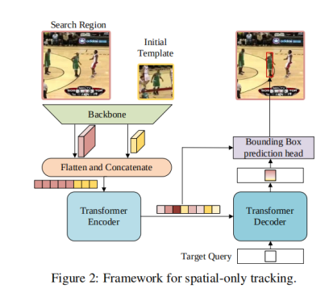

论文信息:
最早发布时间 2021年2月左右 
知乎的一个解读
https://zhuanlan.zhihu.com/p/361515226

transformer在cv领域大显神威，作者把它用到目标跟踪领域。并且建立一个足够简洁的端到端网络。性能比前面的sota涨了好几个点，并且速度快，参数量也不大。

利用transformer优越的全局信息建模能力，用它来整合空间和时间信息进行跟踪，生成用于目标定位的有判别力的时空特征。提出了一个 encoder-decoder transformer ，

提出的新架构包含三个部分：编码器，解码器，预测头三个部分
 编码器接收原始的目标对象，当前图像，以及一个动态更新的模板作为输入（动态模板也是图的形式）。
 编码器中的自注意力模块通过输入模块之间的特征依赖学得它们之间的关系。
 因为模板在整个视频序列中都会更新，所以编码器能捕获目标的时间和空间信息。
 解码器学习一个查询嵌入来预测目标的空间位置。
 一个基于角的预测头用来估计目标对象在当前帧中的边框。
 同时，一个打分头 学习控制动态模板图像的更新。

 我们的工作收到detr的启发，但是有根本性的不同。
 1.研究任务不同，前者是目标检测，这里是追踪
 2.网络输入不同，detr获取整张图片作为输入，我们的输入是有三个部分：搜索区域，和两个模板。从主干来的特征首先被拉平然后concat然后输入编码器
 3 查询结构设计不同，训练方式也不同。detr
 
 当前也有使用transformer进行追踪的工作。TransTrack  [51] and TrackFormer  [41]。
 不同点：（1）的网络输入也有所不同。我们的输入是当前搜索区域、初始模板和动态模板的三重配置。（2）我们的方法通过更新动态模板来捕获被跟踪目标的外观变化，而不是将对象查询更新为[51,41]。就是通过更新动态模板来更新目标的变化。
 
 ## 时空信息是目标追踪领域的核心问题。 
 现有的跟踪器可分为空间跟踪器和时空跟踪器两类。空间跟踪器，，，，。
时空跟踪器还利用时间信息来提高跟踪器的鲁棒性。这些方法也可以分为基于梯度方法和无梯度方法。梯度下降的实用性较低。一类无梯度方法[63,66]利用一个额外的网络来更新孪生跟踪器[2,70]的模板。另一个具有代表性的工作LTMU[9]学习了一个元更新器，以预测当前状态是否足够可靠，是否可以用于长期跟踪中的更新。
**虽然这些方法很有效，但它们会导致空间和时间之间的分离。相比之下，我们的方法将空间和空间信息作为一个整体集成，同时用transformer进行学习。**

为了清晰起见，我们首先引入了一种简单的基线方法，它可以直接地应用原始的编码器-解码器变压器进行跟踪。基线方法只考虑空间信息，并取得了令人印象深刻的性能。在此之后，我们扩展了基线来学习目标定位的空间和时间表示。我们引入了一个动态模板和一个更新控制器来捕获目标对象的外观变化。
  
该网络架构如图所示。 2.它主要由三个组件组成：一个卷积主干、一个编码解码器transformer和一个边界盒预测头。

# github提问，关于目标查询的 
Hi!
You said that "In the encoder-decoder attention module, the target query can attend to all positions on the template and the search region features, thus learning robust representations for the final bounding box prediction." in your paper. How to understand that? It's really abstract for me.
Thanks for your reply!

嗨！您说，“在编解码注意模块中，目标查询可以注意到模板上的所有位置和搜索区域特征，从而学习最终包围盒预测的健壮表示。”在你的报纸上。如何理解？这对我来说太抽象了。谢谢你的回复！

@MasterBin-IIAU

Collaborator 合作者
MasterBin-IIAU commented 评论18 days ago
@ANdong-star Hi, this process is quite similar to that in the DETR decoder. In DETR, 100 object queries interact with the image features output by the encoder. In STARK, one target query interacts with the joint template-search features to extract the target information. Finally the box prediction head integrate the output of the encoder and the decoder to predict the final box results.

@ andong-star 嗨，这个过程与 DETR 解码器中的过程非常相似。在 DETR 中，100个对象查询与编码器输出的图像特征交互。在 STARK 算法中，一个目标查询与联合模板搜索特征交互，以提取目标信息。最后，盒预测头将编码器和解码器的输出结合起来，预测最终的盒预测结果。

@ANdong-star

Author 作者
ANdong-star 安东星 commented 评论16 days ago
@ANdong-star Hi, this process is quite similar to that in the DETR decoder. In DETR, 100 object queries interact with the image features output by the encoder. In STARK, one target query interacts with the joint template-search features to extract the target information. Finally the box prediction head integrate the output of the encoder and the decoder to predict the final box results.

@ andong-star 嗨，这个过程与 DETR 解码器中的过程非常相似。在 DETR 中，100个对象查询与编码器输出的图像特征交互。在 STARK 算法中，一个目标查询与联合模板搜索特征交互，以提取目标信息。最后，盒预测头将编码器和解码器的输出结合起来，预测最终的盒预测结果。

got it! thanks!

优化点：
文中最后使用的预测头比较不常见，有没有什么最新出来的模型架构比它好的可以用？ 