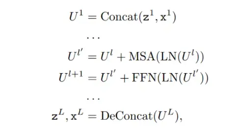

SwinTrack: A Simple and Strong Baseline for Transformer Tracking  

Abstract
Transformer has recently demonstrated clear potential in improving visual tracking algorithms. Nevertheless, ex- isting transformer-based trackers mostly use Transformer tofuse and enhance thefeatures generated by convolutional neural networks (CNNs). Transformer最近在改进视觉跟踪算法方面显示出了明显的潜力。然而，现有的基于Transformer的跟踪器大多使用Transformer来融合和增强由卷积神经网络(CNNs)产生的特征。By contrast, in this paper, we pro- pose a fully attentional-based Transformer tracking algo-rithm, Swin-Transformer Tracker  (SwinTrack).  相比之下，本文提出了一种完全基于注意力的Transformer跟踪算法，即双Transformer跟踪器(SwinTrack)。SwinTrack uses  Transformer for both feature extraction and feature fusion, allowing full interactions between the target object and the search region for tracking.SwinTrack使用Transformer进行特征提取和特征融合，允许在目标对象和搜索区域之间进行完全交互以进行跟踪。 To further improve per- formance, we investigate comprehensively different strate- giesforfeaturefusion, position encoding, and training loss. 为了进一步提高性能，我们全面研究了特征融合、位置编码和训练损失的不同协调条件。All these efforts make SwinTrack a simple yet solid baseline. In our thorough experiments, 所有这些努力使SwinTrack 成为一个简单而坚实的基准。在我们彻底的实验中SwinTrack sets a new record with 0.702 SUC on LaSOT, surpassing STARK [44] by 3.1% while still running at 45 FPS. Besides,  it achieves state- of-the-art performances with 0.476 SUC, 0.840 SUC and 0.694 AO on other challenging LaSOText, TrackingNet, and GOT-10k datasets. Our implementation and trained models are available at https://github.com/LitingLin/SwinTrack.

1. Introduction
Recently, Transformer has made significant progress on
vision tasks. Attempts to introduce the Transformer architecture into the vision community can be broadly classi-fied into two types:
1.最近，Transformer在视觉任务方面取得了重大进展。将Transformer架构引入视觉社区的尝试可以大致分为两种类型：
 some studies regard the Transformer structure as a powerful complement to CNNs, employing
a hybrid architecture which combines the attention mechanisms with convolutional networks, attempting to exploit the advantages of both;  
一些研究认为Transformer结构是对CNNs的强大补充，采用了一种将注意机制与卷积网络相结合的混合架构，试图利用两者的优势； 
Transformer’s remarkable success in NLP tasks, devote to explorer a fully attentional model, believe that Transformer will defeat CNN structures in the near future, and attention mechanisms will be served as the fundamental building blocks of the next generation
其他的研究，在Transformer在NLP任务上的显著成功的鼓舞下，致力于探索一个完全的注意力模式，相信Transformer将在不久的将来击败CNN结构，注意机制将成为下一代的基本基石。
 Several hybrid architectures, such as [10] [5], have rapidly reached state-of-the-art in a
variety of tasks, indicating the great potential of the Transformer. In contrast, the fully attentional model did not go so well at the first time. The Vision Transformer [13] (ViT, the
first fully attentional model in vision tasks) and many of its successors [37] were inferior to convnets in terms of performance, until the appearance of the Swin-Transformer [30].
一些混合架构，如[10][5]，已经在各种任务中迅速达到了最先进的水平，这表明了Transformer的巨大潜力。相比之下，完全注意模型在第一次就表现得不那么好。视觉Transformer[13](ViT，视觉任务中的第一个完全值得注意的模型)和其许多后继者[37]在性能方面不如凸面机，直到swintransformer[30]出现。
Swin-Transformer employs a hierarchical window
attention-based architecture to address two major challenges in the Transformer architecture:
双Transformer采用基于分层窗口注意的架构来解决Transformer架构中的两个主要挑战：
 the variety of visual elements in scale and the high computational complexity on high-resolution images. Unlike the ViT family using a fixed-size feature map, Swin-Transformer builds the feature map by gradually merging neighbor patches from large to small.
**高分辨率图像的尺度问题和高计算复杂度问题**，与使用固定大小的特征图的ViT家族不同，双Transformer通过逐步合并从大到小的邻居补丁来构建特征图。
With hierarchical feature maps, traditional multiscale prediction techniques can be used to overcome the scaling problem. Besides, Swin-Transformer introduces a non-overlapping window partition operation. Self-attention computing is limited within the window. As a result, the computational complexity is greatly reduced. Furthermore, the partition windows are shifted periodically to bridge the windows in preceding layers.
利用层次特征图，可以利用传统的多尺度预测来克服缩放问题。此外，Swin-Transformer引入了一个不重叠的窗口分区操作。Self-Attention计算仅限于窗口内。从而大大降低了计算复杂度。此外，分区窗口定期移动以桥接前一层中的窗口。
The advantages of Transformer are widely acknowledged to be due to two factors [39]: 
The Transformer is a sequence-to-sequence model, which makes it easier to combine multi-modal data, thus providing more flexibility in network architecture design; 
The capability of long-range
modeling from the attention mechanism unleash the limitation of the traditional CNN-based or RNN-based model.
Transformer的优势被广泛承认主要有两个因素:
Transformer是一个序列到序列的模型，这使得它更容易组合多模态数据，从而在网络架构设计中提供更大的灵活性;
从注意力机制出发的远程建模能力，释放了传统的基于CNN或基于RNN模型的局限性；

Visual object tracking is a challenging research topic with a long history. Many issues are still not well addressed, including relocation after occlusion or being out of vision, discrimination between similar objects, etc. [7] and [44] are the most advanced trackers in the visual object tracking task. They both use a hybrid architecture, with ResNet serving as the backbone and Transformer  as the encoder and decoder networks, as previously summarized. We believe that by fully utilizing the power of fully attentional model and the Swin-Transformer backbone, we can significantly boost up the tracker’s performance to a new level.
视觉目标跟踪是一个具有悠久历史的具有挑战性的研究课题。许多问题仍然没有得到很好的解决，包括被遮挡或失去视觉后的重新定位，相似物体之间的区别等等。Transformer tracking和LSTT是视觉物体跟踪任务中最先进的跟踪器。如前所述，它们都使用混合架构，使用ResNet作为Backbone，Transformer作为编码器和解码器网络。我们相信，通过充分利用全注意模型和Swin-Transformer主干的力量，我们可以显著地提高跟踪器的性能到一个新的水平。
Through the insight of the nature of the attention mechanism and a bunch of thorough experiments, we designed a powerful yet efficient fully attentional tracker-SwinTrack.
SwinTrack suppresses the SOTA [44] [32] trackers on the challenging long-term dataset LaSOT by 3.1%, while still having an FPS at 45. We also provide a lighter version of SwinTrack, which provides a SOTA performance at 97 FPS.
通过对注意机制的本质的洞察和一系列彻底的实验，我们设计了一个强大而有效全注意力跟踪器SwinTrack。在具有挑战性的长期数据集LaSOT上，SwinTrack将SOTA跟踪器提升了4.6%，而FPS仍然保持在45。我们还提供了一个更轻版本的SwinTrack，它提供了97FPS的SOTA性能。

The key designs of SwinTrack includes:
• Swin-Transformer as the backbone network;
• Proper choices between various candidate network structures for different part of the tracker;
• Introduce untied positional encoding to provide an accurate positional encoding for concatenation-based feature fusion;
• Introduce IoU-Aware Classification Score to the classification prediction branch, to select an more accurate bounding box prediction.
SwinTrack的主要设计包括:

Swin-Transformer作为Backbone；
针对跟踪器的不同部分，选择合适的候选网络结构;
引入松散位置编码，为基于连接的特征融合提供精确的位置编码;
在分类预测分支中引入IoU-Aware Classification Score，得到更准确的bounding box预测。

We believe that SwinTrack has fully revealed the great potential of the Transformer network. We’d like to propose the SwinTrack model as a new baseline network for future research.
我们相信，SwinTrack已经充分揭示了Transformer网络的巨大潜力。我们想将SwinTrack模型作为未来研究的一个新的基线网络。

2. Related Work
2.1. Transformer in Vision Tasks
Transformer was first proposed by [39], applied in the task of machine text translation. Due to significantly more parallelization and promising performance, Transformer rapidly replaced the LSTM model and soon achieved complete dominance in NLP tasks.
Transformer首先由[39]提出，应用于机器文本翻译任务。由于显著增加的并行化和良好的性能，Transformer迅速取代了LSTM模型，并很快在NLP任务中取得了完全的主导地位。
Starting from 2020, Transformer has been vastly introduced to the vision community. DETR [5] attracted a lot of attention. By modeling the object detection as a direct set prediction problem, DETR removes most hand-crafted processes and reaches a state-of-the-art comparable performance without domain knowledge. Later, the advancing model of DETR [48] and many other transformer-based
models were proposed to the image and video tasks.
从2020年开始，Transformer已经被广泛地引入了视觉界。DETR[5]引起了很多人的关注。通过将对象检测建模为一个直接集的预测问题，DETR删除了大多数手工制作的过程，并在没有领域知识的情况下达到了最先进的可比性能。随后，提出了DETR[48]的推进模型和许多其他基于Transformer的模型，用于图像和视频任务。
The large-scale pre-trained models in NLP tasks have made a great success, such as the well-known BERT [12] and the GPT family [34]. With the attempts to replicate the success, the Vision Transformer(ViT) [13] was proposed. ViT splits the image into multiple fixed-size patches as the token, with a linear projection and a proper positional encoding. The image tokens are then fed into the standard
Transformer encoder. With the success of the first applicable convolution-free network architecture and a vision of a shared pre-trained backbone network for CV and NLP tasks, a family of ViT variants was proposed [38] [28] [6] [47].
NLP任务中的大规模预训练模型取得了巨大的成功，如著名的BERT[12]和GPT家族[34]。随着复制成功的尝试，视觉Transformer(ViT)[13]被提出。ViT将图像分割成多个固定大小的补丁作为标记，具有线性投影和适当的位置编码。然后将图像token输入标准的Transformer编码器。随着第一个可用的无卷积网络架构的成功，以及针对CV和NLP任务的共享的预训练主干网络的愿景，ViT变体家族的[38][28][6][47]被提出。

In standard ViTs, the number of tokens is fixed across the layers. To control the computation complexity and open the access to the multi-scale architecture in various vision tasks, multi-scale Vision Transformers with window-based attention were proposed, like [42] [8] [30]. Swin Transformer [30] may be the most famous one since it reached state-of-the-art in multiple tasks when it was first released.
在标准的ViTs中，token的数量在各个层之间是固定的。为了控制计算的复杂度，并在各种视觉任务中开放对多尺度架构的访问， 提出了基于窗口注意的多尺度视觉Transformer，如[42][8][30]。Swin Transformer [30]可能是最著名的一个，因为它在第一次发布时就在多项任务中达到了最先进的水平。

2.2. Siamese Tracking
By offline learning a generic matching function from a large set of sequences, tracking is to search for a region that is the most similar to the target template. The Siamese methods formulate object tracking as a matching problem. Especially, the work of [1] introduces a fully convolutional Siamese network for tracking and shows a good balance off between accuracy and speed.
通过从大量的序列中离线学习一个通用匹配函数，跟踪是为了搜索与目标模板最相似的区域。孪生网络的方法将目标跟踪定义为一个匹配问题。特别是，[1]的工作引入了一个全卷积的孪生网络进行跟踪，并在精度和速度之间有良好的平衡。
In order to improve [1] in dealing with scale variation, the method of [26] incorporates the region proposal network into Siamese network and proposes the anchor-based tracker, achieving higher accuracy with faster speed.Later, numerous extensions have been presented to improve [26], including deeper backbone network [25], multi-stage architecture [16, 17], anchor-free Siamese trackers [46]
为了提高[1]在处理尺度变化方面的性能，[26]方法将区域建议网络rpn纳入孪生网络，并提出了基于锚框的跟踪器，以获得更高的精度和更快的速度。后来，许多扩展被改进[26]，包括更深的骨干网络[25]、多阶段架构[16,17]、无锚孪生跟踪器[46]。
2.3. Transformer in Visual Tracking
Several Transformer based trackers have been proposed. [7] [41] [18] are the very first works that introduce the Transformer architecture to the visual object tracking. [7] propose the ECA and CFA modules. The modules replace the traditional correlation operation with cross attention. [41] improves the Siamese matching and DiMP based tracking frameworks by Transformer enhanced template features and search features. [44] explores the Spatiotemporal Transformer by integrating the model updating operations into a Transformer module.
目前已经提出了几种基于Transformer的跟踪器。[7][41][18]是第一批将Transformer架构引入视觉对象跟踪的作品。[7]提出了ECA和CFA模块。**这些模块用交叉注意力取代了传统的关联操作。**[41]通过Transformer增强的模板特性和搜索特性，改进了基于孪生匹配和DiMP的跟踪框架。[44]通过将模型更新操作集成到一个Transformer模块中来探索时空Transformer。

 3 Swin Transformer Tracking
 3.1. Overview
Our tracker is based on the Siamese network architecture [4], as shown in 2. Four main components comprise our fully attentional tracker: the Swin-Transformer backbone, the attentional encoder-decoder network, positional encoding, and the head network. 
四个主要组成部分包括我们的完全注意跟踪器： Swin-Transformer主干、注意编码器-解码器网络、位置编码和头部网络。
During tracking, the backbone network extracts the features of the template image patch and the search region image patch separately with shared weights (for simplification, we call them the template image and the search image for convenience, respectively),
在跟踪过程中，骨干网络分别提取具有共享权重的模板图像块和搜索区域图像块的特征（为方便起见，我们分别称它们为模板图像和搜索图像）
the encoder network fuse the feature tokens from the template image and the search image by concatenation, and enhances the concatenated tokens layer-by-layer by attention mechanism, 编码器网络将模板图像和搜索图像的特征token串联起来，通过注意机制层层增强连接的token。
positional encoding helps the model to distinguish the tokens from the different source and the different position
位置编码帮助模型区分不同来源和不同位置的token
the decoder network generates the final feature map of the search image and feeds it to the head network to obtain the IoU-Aware classification response map and bounding box estimation map. 
解码器网络生成搜索图像的最终特征图，并将其反馈给Head网络，得到IoU-Aware分类响应图和BBox估计图。
We will discuss the details of each component in the following sections.
我们将在下面的几节中讨论每个组件的详细信息。

3.2. Transformer-based Feature Extraction
The deep convolutional neural network has significantly improved the performance of trackers. Along with the advancement of trackers, the backbone network has evolved twice: AlexNet [23] and ResNet [19]. Swin-Transformer [30], in comparison to ResNet, can give a more compact feature representation and richer semantic information to assist succeeding networks in better localizing the target, which we will demonstrate in the ablation study experimentally.
深度卷积神经网络极大地提高了跟踪器的性能。随着跟踪器的发展，backbone也经历了两次进化：AlexNet和ResNet。与ResNet相比，Swin-Transformer可以提供更紧凑的特征表示和更丰富的语义信息，以帮助后续网络更好地定位目标对象。

Our tracker follows the scheme of classic Siamese tracker [1], which requires a pair of image patches as the input, one is the template image patch z ∈ RHz×Wz×3, the other one is the search region image patch x ∈ RHx×Wx×3 (for simplification, we call them the template image and the search image for convenience respectively).
SwinTrack遵循经典的Siamese跟踪器的方案，它需要一对图像patch作为输入，一个是模板图像patch ，另一个是搜索区域图像补丁(为了简化起见，分别称它们为模板图像和搜索图像)。

We denote the feature tokens from the template image as z, the feature tokens from the search image as x, s is the stride of the backbone network.Since there is no dimension projection in our model, C is also the hidden dimension of the whole model.
将来自模板图像的特征token表示为z，来自搜索图像的特征标记表示为x，s表示backbone的stride。由于模型中没有维度投影，所以C也是整个模型的隐藏维度。

3.3 基于Transformer的特征融合
Encoder. The encoder is composed of a sequence of blocks where each block contains a multi-head self-attention (MSA) module and a feed forward network (FFN). FFN contains a two-layers multi-layer perceptron (MLP), GELU activation layer is inserted after the first layer’s output.
Layer normalization (LN) is always performed before every module (MSA and FFN). Residual connection is applied on MSA and FFN modules.
编码器由一系列块组成，每个块包含一个多头自注意力模块(MSA)和前馈网络(FFN)。FFN包含一个两层多层感知器(MLP)， GELU激活层插入第一层后输出。层归一化(LN)总是在每个模块(MSA和FFN)之前执行。残差连接主要应用于MSA和FFN模块。
Before the feature tokens are fed into the encoder, the tokens from the template image and the search image are concatenated along spatial dimensions to generate a union representation U. For each block, the MSA module computes self-attention over the union representation, FFN refines the feature tokens generated by MSA. When the tokens are getting out of the encoder, a de-concatenation operation
is performed to recover the template image feature tokens and the search image feature tokens.
在将特征token送入编码器之前，模板图像和搜索图像中的token沿着空间维度进行拼接，以生成联合表示U。对于每个Block，MSA在联合表示上进行自注意力计算，FFN对MSA生成的特征token进行细化。当token从编码器中取出时，执行解拼接操作以恢复模板图像特征token和搜索图像特征token。
整个过程可以表示为:

其中l表示第l层，L表示块数。
Why concatenated attention? To simplify the description, we call the method described above concatenation-based fusion. 为了简化描述，将上面的方法描述为基于连接的融合。
To fuse and process features from multiple branches, it is intuitive to perform self-attention on the feature tokens in each branch separately to complete the feature extraction step and then compute cross-attention across feature tokens from different branches to complete the feature fusion step. We call this method cross-attention-based fusion. 
为了融合处理多个分支的特征，直观的做法是分别对每个分支的特征token进行Self-Attention，完成特征提取步骤，然后计算跨不同分支特征token的Cross Attention，完成特征融合步骤。作者称这种方法为基于交叉注意力的融合。
Considering that the Transformer is a sequence-to-sequence model, the Transformer can naturally accept multi-modal data as input. In comparison to cross-attention-based fusion, concatenation-based fusion can save computation operations through operation combination and reduce model parameters through weight sharing. From this perspective, concatenation-based fusion implicitly implements the
考虑到Transformer是一个序列到序列的模型，Transformer可以自然地接受多模态数据作为输入。与基于交叉注意力的融合相比，基于concat的融合，通过操作组合节省计算操作，通过权值共享减少模型参数。从这个角度来看，基于concat的融合隐式实现了Siamese网络架构。
To ensure that the attention mechanism is aware of which branch the token currently being processed belongs to and its location within
the branch, we must carefully design the model’s positional
encoding solution.
。为了确保注意力机制知道当前正在处理的token属于哪个分支以及它在分支中的位置，必须仔细设计模型的位置编码解决方案。