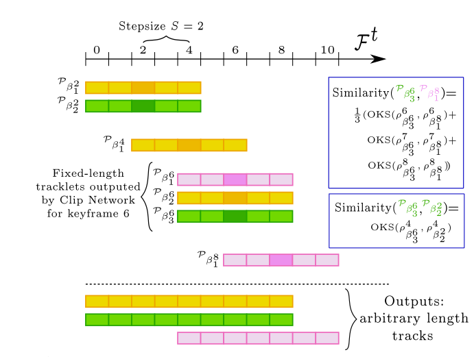

Combining detection and tracking for human pose estimation in videos

2.2. Human pose estimation and tracking in videos
2.2. 视频中的人体姿态估计与跟踪
Given the image approaches just introduced, it is natural to extend them to multi-person pose tracking in videos by running them on each frame independently and then linking these predictions over time. Along these lines, bottom-up methods [17, 25] build spatial-temporal graphs between the detected joints. Raaj et al. [25] did so by extending the spatial Affinity Field image work of Cao et al. [5] to SpatioTemporal Affinity Fields (STAF), while Jin et al. [17] extended the spatial Associative Embedding image work of Newell et al. [21] to Spatio-Temporal Embedding. 

基于前面介绍的图像方法，自然可以将它们扩展到视频中的多人姿势跟踪，方法是在每一帧上独立运行它们，然后随着时间的推移将这些预测链接起来。沿着这些思路，自下而上的方法[17,25]在检测到的关节之间建立时空图。Raaj等人[25]将Cao等人[5]的空间亲和场图像工作扩展到时空亲和场（STAF），而Jin等人[17]将Newell等人[21]的空间关联嵌入图像工作扩展到时空嵌入。

On the other hand, top-down methods [13, 34] build temporal graphs between person bounding boxes, which are usually simpler to solve. SimpleBaseline [34] first run a person detector on each frame independently and then linked its detections in a graph, where the temporal similarity was defined using expensive optical flow. Detectand-Track [13] instead used a 3D Mask R-CNN approach to detect the joints of a person in a short video clip and then used a lightweight tracker to link consecutive clips together by comparing the location of the detected bounding boxes. Like [13], our approach also runs inference on short clips in a single forward pass, but it brings many advantages over it: (i) as most top-down approaches, [13] is limited by its detector’s accuracy and it cannot recover from its misses; instead, we propose to propagate detected bounding boxes to neighbouring frames and look for missed people in those regions. (ii) [13] runs on non-overlapping clips and performs tracking based on person bounding boxes only; instead, we run on overlapping clips and use multiple joint hypothesis in a novel tracking system, that leads to more accurate predictions. (iii) [13] employs fully 3D convolutional networks, while we show that 3D filters on only part of a network is already sufficient to teach the network to track.

另一方面，自上而下的方法[13,34]在人的边界框之间建立时间图，这通常更容易解决。SimpleBaseline[34]首先在每一帧上独立运行一个人物检测器，然后将其检测链接到一个图中，其中时间相似性是使用昂贵的光流定义的。Detectand Track[13]使用3D Mask R-CNN方法在短视频剪辑中检测人的关节，然后使用轻型跟踪器通过比较检测到的边界框的位置将连续剪辑链接在一起。与[13]一样，我们的方法也会在一次向前传递中对短片段进行推断，但它比[13]有许多优点：（i）与大多数自上而下的方法一样，[13]受到检测器精度的限制，无法从未命中中恢复；相反，我们建议将检测到的边界框传播到相邻的帧，并在这些区域中寻找丢失的人。（ii）[13]在非重叠剪辑上运行，并仅基于人物边界框执行跟踪；相反，我们在重叠的剪辑上运行，并在一个新的跟踪系统中使用多关节假设，从而得到更准确的预测。（iii）[13]采用了全三维卷积网络，而我们表明，仅在网络的一部分上的三维滤波器已经足以教会网络跟踪。

3. Methodology

At a high level, our method works by first detecting all candidate persons in the center frame of each video clip (i.e. the keyframe) and then estimating their poses forward and backward in time. Then, it merges poses from different clips in time and space, producing any arbitrary length tracks. More in details, our approach consist of three major components: Cut, Sew and Polish. 
在高层次上，我们的方法首先检测每个视频剪辑（即关键帧）中心帧中的所有候选人物，然后在时间上向前和向后估计他们的姿势。然后，它在时间和空间上合并来自不同剪辑的姿势，生成任意长度的轨迹。更详细地说，我们的方法包括三个主要部分：切割、缝合和抛光。

Given a video, we first cut it into overlapping clips and then run a person detector on their keyframes. For each person bounding box detected in a keyframe, a spatial-temporal tube is cut out at the bounding box location over the corresponding clip. Given this tube as input, our Clip Tracking Network both estimates the pose of the central person in the keyframe, and tracks his pose across the whole video clip (sec. 3.1, fig. 2). We call these tracklets.
给定一个视频，我们首先将其剪切成重叠的片段，然后在关键帧上运行人物检测器。对于在关键帧中检测到的每个人的边界框，将在相应剪辑上的边界框位置剪切出时空管。给定这个管作为输入，我们的剪辑跟踪网络既可以估计关键帧中中心人物的姿势，也可以在整个视频剪辑中跟踪他的姿势（第3.1节，图2）。我们称之为tracklet。

 Next, our Video Tracking Pipeline works as a tailor to sew these tracklets together based on poses in overlapping frames (sec. 3.2, fig. 3). We call these multiple poses for the same person in same frame hypotheses. Finally, Spatial-Temporal merging polishes these predictions using these hypotheses in an optimization algorithm that selects the more spatially and temporally consistent location for each joint (sec. 3.3, fig. 4). In the next three sections we present these three components in details.
接下来，我们的视频跟踪管道像一个裁缝一样根据重叠帧中的姿势将这些轨迹缝合在一起（第3.2节，图3）。我们称这些姿势为同一个人在同一框架内的多个姿势。最后，时空合并使用优化算法中的这些假设来优化这些预测，该算法为每个关节选择更具时空一致性的位置（第3.3节，图4）。在接下来的三节中，我们将详细介绍这三个部分。

 3.1. Clip Tracking Network

  Our Clip Tracking Network performs both pose estimation and tracking simultaneously, on a short video clip. Its architecture builds upon the successful HRNet architecture of Sun et al. [30]. In the next paragraph we summarize the original HRNet design and in the following one we explain how to extend it to tracking.
我们的剪辑跟踪网络在短视频剪辑上同时执行姿势估计和跟踪。其架构建立在Sun等人[30]成功的HRNet架构之上。在下一段中，我们将总结最初的人力资源网设计，并在下一段中解释如何将其扩展到跟踪。

 HRNet for human pose estimation in images. Given an image, this top-down approach runs a person detector on it, which outputs a list of axis-aligned bounding boxes, one for each localized person. Each of these boxes is independently cropped and fed into HRNet, which consists of four stages of four parallel subnetworks trained to localize all body joints of only the central person in the crop.
用于图像中人体姿势估计的HRNet。给定一张图像，这种自上而下的方法在其上运行一个人物检测器，它输出一个轴对齐的边界框列表，每个定位的人物对应一个。每个盒子都被独立裁剪并送入HRNet，HRNet由四个平行子网络的四个阶段组成，这些子网络经过训练，只定位裁剪中中心人的所有身体关节。

 The output of HRNet is a set of heatmaps, one for each body joint. Each pixel of these heatmaps indicates the likelihood of “containing” a joint. As other approaches in the literature [5, 7, 14, 16, 21, 24], the network is trained using a mean squared error loss function, between the predicted heatmap H pred and the ground-truth heatmap H gt :
  where K is the number of body joints (keypoints) and i, j the pixel coordinates. H gt are generated by convolving a 2D Gaussian filter on the annotated location of each joint.
HRNet的输出是一组热图，每个身体关节对应一个热图。这些热图的每个像素都表示“包含”关节的可能性。与文献[5,7,14,16,21,24]中的其他方法一样，使用预测热图H pred和地面真实热图H gt之间的均方误差损失函数对网络进行训练：
其中K是身体关节（关键点）的数量，i，j是像素坐标。H gt是通过在每个关节的注释位置上卷积二维高斯滤波器生成的。

 3D HRNet for video pose estimation and tracking. Our approach operates on short video clips: C =
{F t−δ , ..., F t , ..., F t+δ } . First, it runs a person detector on the center frame F t and obtains a list of person bounding boxes B t = {β 1 t , ..., β n t } (fig. 2a). Then, for each bounding box β p t , it creates a tube T β p t by cropping the box region t+δ t from all frames in the clip C: T β p t = {F β t−δ t , ..., F β t , ..., F β t } p p p
(fig. 2b). Next, it feeds this tube to our video HRNet, which outputs a tracklet containing all the poses of person p in t+δ t all the frames of the tube: p_β p t = {ρ t−δ t , ..., ρ β t , ..., ρ β t }
β p p p
(fig. 2c). Importantly, all the poses in p_β p t need to belong to the same person, even when this becomes occluded or moves out of the tube frame (in which case the network should not output any prediction, even if other people are present). This is a difficult task, which requires the network to both learn to predict the location of the joints of the pose and track them through time.

3D HRNet用于视频姿势估计和跟踪。我们的方法在短视频剪辑上运行：C=
{F t−δ , ..., F t。。。，ft+δ}。首先，它在中心帧F t上运行人员检测器，并获得人员边界框B t={β1 t，…，βn t}的列表（图2a）。然后，对于每个边界框βpt，它通过从剪辑C:tβpt={Fβt]中的所有帧裁剪框区域t+δt来创建一个管tβpt−δt。。。，Fβt。。。，Fβt}p
（图2b）。接下来，它将这根管子送入我们的视频HRNet，它输出一个轨迹，包含人p在t+δt中的所有姿势。管子的所有帧：pβp t={ρt−δt。。。，ρβt。。。，ρβt}
βp
（图2c）。重要的是，PβP t中的所有姿势都必须属于同一个人，即使这个姿势被遮挡或移出管架（在这种情况下，即使有其他人在场，网络也不应输出任何预测）。这是一项困难的任务，需要网络学习预测姿势关节的位置，并通过时间跟踪它们。

 In order to help the network tackle this challenge, we do two things: (i) to account for fast moving people, we enlarge each bounding box by 25% along both dimensions prior to creating a tube; and (ii) to allow the network to associate people between frames, we inflate the 2D convolutions in the first two stages of HRNet to 3D to help the network learn to track. Specifically, in the first stage we use 3×1×1, 1×3×3 and 1×1×1 filters, while in the second stage we use 3×3×3 filters. After this second stage the network has a receptive field that is temporally large enough to observe the whole tube, learn the person’s appearance and his/her movements within it. Note how our method is similar in spirit to what Jin et al. [17] proposed with their temporal associative embedding, but it is learnt automatically by the network without the need of additional constraints. Finally, we train our video HRNet with the same mean squared loss of eq. 1, but now computed over all the frames in the clip C:
为了帮助网络应对这一挑战，我们做了两件事：（i）考虑到快速移动的人，在创建管道之前，我们将每个边界框沿两个维度放大25%；（ii）为了让网络在帧之间关联人，我们将HRNet前两个阶段的2D卷积膨胀到3D，以帮助网络学习跟踪。具体来说，在第一阶段，我们使用3×1×1、1×3×3和1×1×1滤波器，而在第二阶段，我们使用3×3×3滤波器。在第二阶段之后，神经网络有一个时间上足够大的感受野，可以观察整个管子，了解人的外貌和他/她的动作。请注意，我们的方法在精神上与Jin等人[17]提出的时间关联嵌入方法类似，但它是由网络自动学习的，不需要额外的约束。最后，我们用等式1中相同的均方损失训练视频HRNet，但现在在剪辑C中的所有帧上计算：

  
Figure 2: Clip Tracking Network. First, (a) our approach runs a person detector on the keyframe of a short video clip. Then, (b) for each detected person it creates a tube by cropping the region within his/her bounding box from all the frames in the clip. Next, (c) each tube is independently fed into our Clip Tracking Network (3D HRNet), which outputs pose estimates for the same person (the one originally detected in the keyframe) in all the frames of the tube. Finally, (d) we reproject the predicted poses on the original images to show how the model can correctly predict poses in all the frames of the clip, by only detecting people in the keyframe.
图2：剪辑跟踪网络。首先，（a）我们的方法在短视频剪辑的关键帧上运行人员检测器。然后，（b）对于每个检测到的人，它通过从剪辑中的所有帧裁剪他/她的边界框内的区域来创建一个管。接下来，（c）每个管被独立地输入我们的剪辑跟踪网络（3D HRNet），该网络在管的所有帧中输出同一个人（最初在关键帧中检测到的那个人）的姿势估计。最后，（d）我们在原始图像上重新投影预测的姿势，以显示模型如何通过仅检测关键帧中的人来正确预测剪辑所有帧中的姿势。

 3.2. Video Tracking Pipeline

 Our Clip Tracking Network outputs a tracklet Pβ_pt for each person p localized at β_p. However, p may exist beyond the length of p_βpt and the duty of our Video Tracking pipeline is to merge tracklets that belong to the same person, thus enabling pose estimation and tracking on any arbitrary length video (fig. 3). Our pipeline merges two fixed-length tracklets if their predicted poses on overlapping frames are similar (e.g., in fig. 3, p_β 1 2 and p_β 1 4 overlap on frames 2-4).
我们的剪辑跟踪网络为位于βP的每个人P输出一个轨迹 PβPpt。然而，P可能存在于Pβpt的长度之外，我们的视频跟踪管道的职责是合并属于同一个人的轨迹，从而在任意长度的视频上实现姿势估计和跟踪（图3）。如果两个固定长度的轨迹在重叠帧上的预测姿势相似（例如，在图3中，p_β1 2和p_β1 4在帧2-4上重叠），我们的管道将合并这两个轨迹。

 We generate these overlapping tracklets by running our Clip Tracking Network on clips of length |C| from keyframes sampled every S (stepsize) frames with S < |C|.
我们通过在长度为|C|的剪辑上运行我们的剪辑跟踪网络来生成这些重叠的轨迹，这些剪辑是从每一个S（步长）帧采样的关键帧中获得的，其中S<|C|。

 We model the problem of merging tracklets that belong to the same person as a bipartite graph based energy minimization problem, which we solve using the Hungarian algorithm [18]. As a similarity function between two overlapping tracklets, we compute Object Keypoint Similarity (OKS) [19, 27] between their poses (reprojected on the original coordinate space, fig. 2d) on their overlapping frames. 
 我们将合并属于同一个人的轨迹的问题建模为基于二部图的能量最小化问题，我们使用匈牙利算法解决该问题[18]。作为两个重叠轨迹之间的相似性函数，我们计算它们在重叠帧上的姿势（在原始坐标空间上重新投影，图2d）之间的对象关键点相似性（OKS）[19,27]。
For example, infig. 3 tracklets p_β36 and p_β18 are computed on tubes generated from keyframes 6 and 10 respectively and of length |C| = 5. Under these settings, these tracklets both predict poses for frames 6, 7 and 8 and their similarity is computed as the average OKS over these three frames. On the other hand, tracklets p_β36 and p_β22 only overlap on frame 4 and as such their similarity is computed as the OKS on that single frame. Finally, we take the negative value of this OKS similarity for our minimization problem.
例如，在图3中，轨迹p|β36和p|β18分别在从关键帧6和10生成的管上计算，长度为| C |=5。在这些设置下，这些轨迹都可以预测第6帧、第7帧和第8帧的姿势，它们的相似性计算为这三帧上的平均OKS。另一方面，轨迹 p_β36和p_β22仅在第4帧上重叠，因此它们的相似性被计算为该单个帧上的OKS。最后，我们把这个OKS相似性的负值作为最小化问题。

 Note how this formulation is able to overcome the limitation that top-down approaches usually suffer from: missed bounding box detections. Thanks to our propagation of person detections from keyframes to their neighbouring frames (fig. 2b), we are able to obtain joints predictons even for those frames with missed detections. For example, in fig. 3 the person detector failed to localize the green person in keyframe 4, but by propagating the detections from keyframes 2 and 6 we are able to obtain a pose estimate for frame 4 as well. In addition, we are also able to link these correctly, thanks to the overlap between these two tracklets.
 请注意，此公式如何能够克服自顶向下方法通常会遇到的限制：边界框检测缺失。由于我们将人员检测从关键帧传播到其相邻帧（图2b），我们能够获得关节预测，即使是那些漏检的帧。例如，在图3中，人物检测器未能定位关键帧4中的绿色人物，但通过传播关键帧2和6的检测，我们也能够获得第4帧的姿势估计。此外，由于这两个轨迹之间的重叠，我们还能够正确地链接这些轨迹。

 3.3. Spatial-Temporal merging of pose hypotheses Our video tracking pipeline merges tracklets, but it does not deal with merging human poses. For example, in fig. 3 the approach correctly links all the yellow tracklets, but it does not address the question of what to do with the multiple pose estimates for frame 4 (i.e., ρ 4 β 2 , ρ 4 β 4 and ρ 4 β 6 ). In this 1 1 2 section we present our solution to this problem.
3.3. 姿势的时空合并假设我们的视频跟踪管道合并轨迹，但它不处理合并人类姿势。例如，在图3中，该方法正确地链接了所有黄色轨迹，但没有解决如何处理第4帧的多个姿势估计（即ρ4β2、ρ4β4和ρ4β6）的问题。在本节中，我们将介绍这个问题的解决方案。

 Given a set of merged, overlapping tracklets for person p, we define H p t = {ρ tβ t−δ , ..., ρ tβ p t , ..., ρ tβ t+δ } , as the pose p p hypotheses of p at time t. H p t represents the collection of poses for person p, generated by our Clip Tracking Network at time t by running on tube crops centered on different keyframes. The most straightforward procedure to obtain a single final pose for each person is to simply select, for each joint, the hypothesis H p t with the highest confidence score. We call this Baseline Merge and, as we show later in our experiments, it achieves competitive performance, already highlighting the power of our Clip Tracking Network. Nevertheless, this procedure occasionally predicts the wrong location when the person of interest is entangled with or occluded by another person, as show in fig. 4d.

 Figure 3: Video Tracking Pipeline merges fixed-length tracklets into arbitrary length tracks by comparing the similarity of their detected poses in the frames the tracklets overlap on.

 To overcome these limitations, we propose a novel method to merge these hypotheses (fig. 4b-c). Our intuition is that the optimal location for a joint should be the one that is both consistent across the multiple candidates within a frame (spatial constraint) and consistent over consecutive frames (temporal constraint). We model the problem of predicting the optimal location for each joint in each frame as a shortest path problem and we solve it using the Dijkstra’s algorithm [10]. Instead of considering each joint detection as a node in the graph, we operate on clusters obtained by running a mean shift algorithm over joint hypotheses [8]. This clusters robustly smooth out noise in the individual hypotheses, while also reducing the graph size leading to faster optimization. As a similarity function φ between clusters c t and c t+1 in consecutive frames, we compute a spatial-temporal weighting function that follows the aforementioned intuition: it favours clusters with more hypotheses and those that have smoother motion across time.

 Formally,

  Spatial
(3) Temporal where µ(c t ), µ(c t+1 ) are the locations of the centers of the clusters, |c t |, |c t+1 | their magnitude and |H| the number of hypotheses. Finally, we balance these spatial and temporal constraints using λ.

 Figure 4: Merging pose hypotheses. Our video tracking pipeline runs our Clip Tracking Network on multiple overlapping frames, producing multiple hypotheses for every joint of a person (a). We cluster these hypotheses (b) and solve a spatial-temporal optimization problem on these clusters to estimate the best location of each joint (c). This achieves better predictions than a simple baseline that always pick the hypothesis with the highest confidence score
(d), especially on frames with highly entangled people.

 4. Experiments

 4.1. Datasets and Evaluation

 We experiment with PoseTrack [3], which is a largescale benchmark for human pose estimation and tracking in video. It contains challenging sequences of highly articulated people in dense crowds performing a wide range of activities. We experiment on both the 2017 and 2018 versions of this benchmark. PoseTrack2017 contains 250 videos for training, 50 for validation and 214 for test. PoseTrack2018 further increased the number of videos of the 2017 version to a total of 593 for training, 170 for validation and 375 for test. These datasets are annotated with 15 body joints, each one defined as a point and associated to a unique person id. Training videos are annotated with a single dense sequence of 30 frames, while validation videos also provide annotations for every forth frame, to enable the evaluation of longer range tracking.
我们使用PoseTrack[3]进行了实验，它是视频中人体姿势估计和跟踪的大型基准。它包含了一系列极具挑战性的场景，在密集的人群中，高度清晰的人正在进行各种各样的活动。我们在2017年和2018年版本的基准上进行了实验。PoseTrack2017包含250个培训视频、50个验证视频和214个测试视频。PoseTrack2018进一步将2017版的视频数量增加到593个用于培训，170个用于验证，375个用于测试。这些数据集用15个身体关节进行注释，每个关节定义为一个点，并与一个唯一的个人id关联。训练视频用30帧的单一密集序列进行注释，而验证视频也为每四帧提供注释，以便对更长距离的跟踪进行评估。

 We evaluate our models using the standard human pose estimation [19, 24, 27] and tracking [3, 20] metrics: joint detection performance is expressed in terms of average precision (AP), while tracking performance in terms of multi object tracking accuracy (MOTA). We compute these metrics independently on each body joint and then obtain our final performance by averaging over the joints. As done in the literature [13, 30, 34], when we evaluate on the validation sets of these datasets, we compute AP on all the localized body joints, but we threshold low confidence predictions prior to computing MOTA. For our experiments we learn a per-joint threshold on a hold out set of the training set. Moreover, we remove very short tracklets (< 5 frames) and tiny bounding boxes (W ∗ H < 3200), as these often capture not annotated, small people in the background.

 4.2. Implementation details

 3D Video HRNet. Prior to inflating a 2D HRNet to our 3D version, we pre-train it for image pose estimation on the PoseTrack dataset (2017 or 2018, depending on what set we evaluate the models on). This step enables the network to learn the task of localizing body joints, so that during training on videos it can focus on learning to track. We inflate the first two stages of HRNet using “mean” initialization [6, 12, 13], which replicates the 2D filters and normalizes them accordingly. We use stepsize S = 1, as it produces the highest number of pose hypotheses, and clips of |C| = 9 frames, so that the model can benefit from important temporal information. We use the same hyperameters of [30], but we train 3D HRNet for 20 epochs and decrease the learning rate two times after 10 and 15 epochs, respectively (1e-4 → 1e-5 → 1e-6). Finally, during inference we follow the procedure of [30, 34]: we run on both the original and the flipped image and average their heatmaps.

 Person detector. We use a ResNet-101 SNIPER [28] detector to localize all the person instances. We train it on the MS COCO 2017 dataset [19] and achieve an AP of 57.9 on the “person” class on COCO minival, which is similar to that of other top-down approaches [34, 36]. Merging pose hypotheses. We follow the PoseTrack evaluation procedure to determine a good size estimate for our clusters. This procedure considers a prediction correctly, if the L 2 distance between that prediction and the closest ground truth is within a radius defined as 50% of the head size of the person. We use the same radius for our clusters. Moreover, we set λ = 0.1 to give equal importance to the spatial and temporal components, as the latter has approximately 10× the magnitude of the former.

