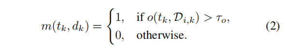
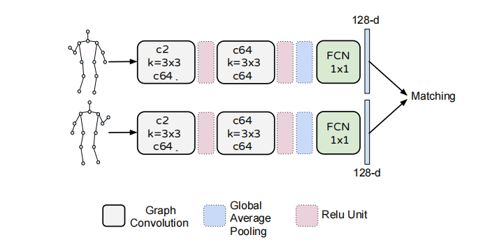
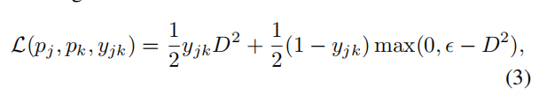
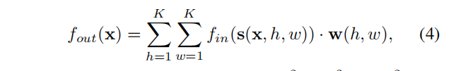
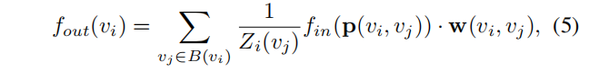

LightTrack: A Generic Framework for Online Top-Down Human Pose Tracking
   
LightTrack：一个在线自上而下人体姿势跟踪的通用框架

# Abstract  
In this paper, we propose a simple yet effective framework, named LightTrack, for online human pose tracking. Existing methods usually perform human detection, pose estimation and tracking in sequential stages, where pose tracking is regarded as an offline bipartite matching problem. Our proposed framework is designed to be generic, efficient and truly online for top-down approaches. For efficiency, Single-Person Pose Tracking (SPT) and Visual Object Tracking (VOT) are incorporated as a unified online functioning entity, easily implemented by a replaceable single-person pose estimator. To mitigate offline optimization costs, the framework also unifies SPT with online identity association and sheds first light upon bridging multiperson keypoint tracking with Multi-Target Object Tracking (MOT). Specifically, we propose a Siamese Graph Convolution Network (SGCN) for human pose matching as a Re-ID module. In contrary to other Re-ID modules, we use a graphical representation of human joints for matching. The skeleton-based representation effectively captures human pose similarity and is computationally inexpensive. It is robust to sudden camera shifts that introduce human drifting. The proposed framework is general enough to fit other pose estimators and candidate matching mechanisms. Extensive experiments show that our method outperforms other online methods and is very competitive with offline state-of-the-art methods while maintaining higher frame rates. Code and models are publicly available at https://github.com/Guanghan/lighttrack.  

在本文中，我们提出了一个简单而有效的框架，名为LightTrack，用于在线人体姿势跟踪。**现有的方法通常连续进行人体检测、姿态估计和跟踪这几个阶段**，其中姿态跟踪被视为一个离线的二分图匹配问题。我们提出的框架设计为通用、高效、真正在线的自顶向下方法。为了提高效率，单人姿势跟踪（SPT）和视觉对象跟踪（VOT）被合并为一个统一的在线功能实体，很容易由可更换的单人姿势估计器实现。为了降低离线优化成本，该框架还将SPT与在线身份关联相结合，并首次揭示了多人关键点跟踪与多目标对象跟踪（MOT）之间的联系。具体地说，我们提出了一个孪生图卷积网络（SGCN）作为一个Re ID模块用于人体姿势匹配。与其他Re ID模块不同，我们使用人体关节的图形表示进行匹配。基于骨架的表示有效地捕捉了人体姿势的相似性，并且计算成本较低。它对引入人体漂移的摄像机突然移动具有鲁棒性。该框架具有足够的通用性，可以适用于其他姿态估计和候选匹配机制。大量的实验表明，我们的方法优于其他在线方法，在保持较高帧速率的同时，与离线最先进的方法具有很强的竞争力。代码和模型可在https://github.com/Guanghan/lighttrack.

# 1. Introduction
   Pose tracking is the task of estimating multi-person human poses in videos and assigning unique instance IDs for each keypoint across frames. Accurate estimation of human keypoint-trajectories is useful for human action recognition, human interaction understanding, motion capture    and animation, etc. Recently, the publicly available PoseTrack dataset [1, 2] and MPII Video Pose dataset [3] have    pushed the research on human motion analysis one step further to its real-world scenario. Two PoseTrack challenges have been held.   
   姿势跟踪的任务是估计视频中的多人姿势，并为帧中的每个关键点分配唯一的实例ID。准确估计人体关键点轨迹有助于人体动作识别、人机交互理解、运动捕捉和动画等。最近，公开的PoseTrack数据集[1,2]和MPII视频姿势数据集[3]将人体运动分析的研究进一步推向了现实场景。已经举行了两次PoseTrack挑战赛。

However, most existing methods are offline hence lacking the potential to be real-time.   More emphasis has been put on the Multi-Object Tracking Accuracy    (MOTA) criterion while neglecting the Frame Per Second (FPS) criterion. Existing offline methods divide the tasks of human detection, candidate pose estimation, and identity    association into sequential stages. In the procedure, multiperson poses are estimated across frames within a video.    Based on the pose estimation results, pose tracking outputs are derived by solving an offline optimization problem. It    requires the poses across frames to be pre-computed, or at least for the frames within some range.  

然而，大多数现有的方法都是离线的，因此缺乏实时性。更多的关注放在了多目标跟踪精度（MOTA）指标，而忽略了每秒帧数（FPS）指标。现有的离线方法将人体检测、候选姿态估计和身份关联任务分为连续的几个阶段。在该过程中，多人姿势是在视频中跨帧估计的。基于姿态估计结果，通过求解离线优化问题导出姿态跟踪输出。它要求预先计算跨帧的姿势，或者至少对某些范围内的帧。（离线就是这个意思，计算当前帧结果需要后面的帧）

In this paper, we propose a simple yet effective framework for pose tracking. It is designed to be generic, topdown (i.e., pose estimation is performed after candidates are detected), and truly online. To efficiently perform pose tracking, we incorporate Single-Person Pose Tracking (SPT) and Visual Object Tracking (VOT) as a uni- fied online functioning entity, easily implemented by a replaceable single-person pose estimatior. Therefore, object detection can be performed scarcely (in key frames). In order to mitigate the offline optimization cost, we unify single-person pose tracking with intervallic person re-identification, namely, key-frame pose matching. This problem conversion bridges multi-person keypoint tracking with multi-target object tracking. Since the proposed framework is general enough to fit other pose estimators and candidate matching mechanisms, advances in pose estimation, person re-identification and multi-target object tracking can be conveniently utilized for pose tracking in the future.   
在本文中，我们提出了一个简单而有效的姿态跟踪框架。它被设计成通用的、自上而下的（即，在检测到候选对象后执行姿势估计），并且真正在线。为了有效地执行姿势跟踪，我们将单人姿势跟踪（SPT）和视觉对象跟踪（VOT）合并为一个统一的在线功能实体，可由可替换的单人姿势估计器轻松实现。因此，只在极少的帧中（关键帧）执行对象检测。为了降低离线优化代价，我们将单人姿态跟踪与间隔人重新识别相结合，即关键帧姿态匹配。该问题将多人关键点跟踪与多目标目标跟踪联系起来。由于该框架具有足够的通用性，可以适用于其他姿态估计器和候选匹配机制，因此，姿态估计、人员再识别和多目标跟踪等方面的进展可以方便地用于未来的姿态跟踪。

Specifically, in contrast to VOT methods, in which the visual features are implicitly represented by kernels or CNN feature maps, we track each human pose by recursively updating the bounding box and its corresponding pose in an explicit manner. The bounding box region of a target is inferred from the explicit features, i.e., the human keypoints. Human keypoints can be considered as a series of special visual features. The advantages of using pose as explicit features include: (1) The features are human-related, interpretable, and have strong, stable correlation with the bounding box position. Human pose enforces direct constraint on the bounding box region. (2) The task of pose estimation and tracking requires human keypoints to be predicted in the first place. Taking advantage of the predicted keypoints is efficient in tracking the ROI region, which is almost free. This mechanism makes the online tracking possible. (3) It naturally keeps the identity of the candidates, which greatly alleviates the burden of data association in the system. Even when data association is necessary, we can re-use the pose features for skeleton-based pose matching. In this way, SPT and VOT are unified with a replaceable single-person human pose estimation module.   
具体地说，与VOT方法不同，在VOT方法中，视觉特征由核或CNN特征映射隐式表示，我们通过递归更新边界框及其相应的姿势来跟踪每个人体姿势。目标的边界框区域是从显式特征（即人体关键点）推断出来的。人体关键点可以看作是一系列特殊的视觉特征。使用姿势作为显式特征的优点包括：（1）特征与人相关，可解释，并且与边界框位置具有强、稳定的相关性。人体姿势对边界框区域强制执行直接约束。（2） 姿态估计和跟踪任务首先需要预测人体关键点。利用预测的关键点可以有效地跟踪ROI区域，这几乎是免费的。这种机制使在线跟踪成为可能。（3） 它自然地保留了候选对象的身份，这大大**减轻了系统中数据关联的负担**。即使在需要数据关联时，我们也可以重用姿势特征进行基于骨架的姿势匹配。通过这种方式，SPT和VOT与可替换的单人人体姿势估计模块相统一。

Our contributions are three-fold: (1) We propose a general online pose tracking framework that is suitable for top-down approaches of human pose estimation. Both human pose estimator and Re-ID module are replaceable. In contrast to Multi-Object Tracking (MOT) frameworks, our framework is specially designed for the task of pose tracking. (2) We propose a Siamese Graph Convolution Network (SGCN) for human pose matching as a Re-ID module in our pose tracking system. Unlike existing Re-ID methods, we use a graphical representation of human joints for matching. The skeleton-based representation effectively captures human pose similarity and is computationally inexpensive. It is robust to sudden camera shift that introduces human drifting. (3) We conduct extensive experiments with various settings and ablation studies. Our proposed online pose tracking approach outperforms existing online methods and is competitive to the offline state-of-the-art methods, with much higher frame rates. We make the code publicly available to facilitate future research.

我们的贡献有三个方面：（1）我们提出了一个通用的在线姿态跟踪框架，适用于自顶向下的人体姿态估计方法。人体姿态估计器和Re ID模块都是可更换的。与多目标跟踪（MOT）框架相比，我们的框架是专门为姿态跟踪任务设计的。（2） 我们提出了一种连体图卷积网络（SGCN）用于人体姿势匹配，作为我们的姿势跟踪系统中的Re ID模块。与现有的重新识别方法不同，我们使用人体关节的图形表示进行匹配。基于骨架的表示有效地捕捉了人体姿势的相似性，并且计算成本较低。它对引入人体漂移的摄像机突然移动具有鲁棒性。（3） 我们在各种设置和消融研究中进行了广泛的实验。我们提出的在线姿态跟踪方法优于现有的在线方法，并且与离线最先进的方法相比具有更高的帧速率。我们将代码公开，以促进未来的研究。

# 2. Related Work
##   Human Pose Estimation and Tracking: 
   Human Pose Estimation (HPE) has seen rapid progress with the emergence    of CNN-based methods [4, 5, 6, 7]. The most widely used    datasets, e.g., MPII [8] and LSP [9], are saturated with    methods that achieve 90% and higher accuracy. Multi person human pose estimation is more realistic and challenging, and has received increasing attentions with the    hosting of COCO keypoints challenges [10] since 2017. Existing methods can be classified into top-down and bottomup approaches. The top-down approaches [11, 12, 13] rely    on the detection module to obtain human candidates and    then applying single-person pose estimation to locate human keypoints. The bottom-up methods [14, 15, 16, 17] detect human keypoints from all potential candidates and then    assemble these keypoints into human limbs for each individual based on various data association techniques. The    advantage of bottom-up approaches is their excellent tradeoff between estimation accuracy and computational cost because the cost is nearly invariant to the number of human    candidates in the image. In contrast, the advantage of topdown approaches is their capability in disassembling the    task into multiple comparatively easier tasks, i.e., object detection and single-person pose estimation. The object detector is expert in detecting hard (usually small) candidates, so    that the pose estimator will perform better with a focused regression space.      
   随着基于CNN的方法的出现，人体姿势估计（HPE）得到了快速发展[4,5,6,7]。最广泛使用的数据集，例如MPII[8]和LSP[9]，都采用了达到90%和更高精度的方法。多人人体姿势估计更具现实性和挑战性，自2017年以来，随着COCO keypoints challenges[10]的举办，它受到了越来越多的关注。现有的方法可分为自顶向下和自底向上方法。自上而下的方法[11、12、13]依赖于检测模块获取人体候选，然后应用单人姿势估计来定位人体关键点。自下而上的方法[14、15、16、17]从所有潜在的候选对象中检测人类关键点，然后根据各种数据关联技术将这些关键点组装成每个人的肢体。自底向上方法的优点是在估计精度和计算成本之间进行了很好的折衷，因为成本几乎与图像中的人类候选数量保持不变。相反，自上而下方法的优势在于能够将任务分解为多个相对简单的任务，即目标检测和单人姿势估计。目标检测器擅长检测硬（通常很小）候选对象，因此姿态估计器在聚焦回归空间中表现更好。   
   Pose tracking is a new topic that is primarily    introduced by the PoseTrack dataset [1, 2] and MPII Video    Pose dataset [3]. A typical top-down but offline method was    introduced in [3], where pose tracking is transformed into    a minimum cost multi-cut problem with a graph partitioning formulation. Existing methods [18, 19, 20] are either    offline or theoretically online but requires heavy overhead    across frames pre-computed before performing an actual    batch process. [21] propsosed to use box propagation to refine detection. In our approach, we also employs box propagation, but we incorporate the box propagation scheme with    a pose estimator to form a single-object tracker. In their approach, detection is performed for every frame, while we    only perform detection at keyframes.   
   姿势跟踪是一个新主题，主要由PoseTrack数据集[1,2]和MPII视频姿势数据集[3]引入。[3]中介绍了一种典型的自顶向下但离线的方法，其中姿势跟踪转化为具有图分割公式的最小代价多切割问题。现有方法[18、19、20]要么离线，要么理论上在线，但在执行实际批处理之前，需要在预先计算的帧之间进行大量开销。[21]建议使用盒传播重新细化检测。在我们的方法中，我们也采用了盒子传播，但我们将盒子传播方案与姿势估计器结合起来，**形成了一个单目标跟踪器。在他们的方法中，对每一帧执行检测，而我们只对关键帧执行检测。**

## Object Detection vs. Human Pose Estimation:
Earlier works in object detection regress visual features into bounding box coordinates. HPE, on the other hand, usually re-gresses visual features into heatmaps, each channel representing a human joint. Recently, research in HPE has inspired many works on object detection [22, 23, 24]. These works predict heatmaps for a set of special keypoints to infer detection results (bounding boxes). Based on this motivation, we propose to predict human keypoints to infer bounding box regions. Human keypoints are a special set of keypoints to represent detection of the human class only.   

目标检测与人体姿势估计：
早期的目标检测工作将视觉特征回归到边界框坐标中。另一方面，HPE通常将视觉特征渐变为热图，每个通道代表一个人体关节。最近，HPE的研究激发了许多关于目标检测的工作[22,23,24]。这些工作预测一组特殊关键点的热图，以推断检测结果（边界框）。**基于这个动机，我们提出预测人类关键点来推断包围盒区域。人类关键点是一组特殊的关键点，仅代表人类类别的检测。**

## Multi-Object Tracking: 
MOT aims to estimate trajectories of multiple objects by finding target locations while maintaining their identities across frames. Offline methods use both past and future frames to generate trajectories while online methods are performed on the go. An online MOT pipeline [25] was presented where a single object tracker keeps tracking targets given their detections across frames. The target state is set as ”tracked” until the tracking result turns unreliable. The target is then considered lost, and data association is performed to compute the similarity between the track-let and detections. Our proposed framework also tracks each target (with corresponding keypoints) individually while keeping their identities, and performs data association when target is lost. However, our framework is distinct in two aspects: (a) the detection is generated by object detector only at keyframes. It can be provided scarcely; (b) the single object tracker is actually a pose estimator that predicts keypoints based on an enlarged region.   
MOT的目标是通过寻找目标位置来估计多个目标的轨迹，同时在帧之间保持它们的身份。离线方法使用过去和未来的帧来生成轨迹，而在线方法则在移动中执行。提出了一种在线MOT管道[25]，其中单个目标跟踪器在给定目标跨帧检测的情况下保持跟踪目标。目标状态设置为“已跟踪”，直到跟踪结果变得不可靠。然后将目标视为丢失，并执行数据关联以计算轨迹let和检测之间的相似性。**我们提出的框架还可以单独跟踪每个目标（具有相应的关键点），同时保持其身份，并在目标丢失时执行数据关联。** 然而，我们的框架在两个方面是不同的：（a）检测仅在关键帧处由对象检测器生成。它几乎无法提供；（b） 单目标跟踪器实际上是一种姿态估计器，它根据扩大的区域预测关键点。

Graphical Representation for Human Pose: It is recently studied in [26] on how to effectively model dynamic skeletons with a specially tailored graph convolution operation, which turns human skeletons into spatio-temporal representation of human actions. Inspired by this work, we propose to employ GCN to encode spatial interdependencies among human joints into a latent representation of human pose. The representation aims to robustly encode the pose, which is invariant to human location or view angle. We measure similarities of such encodings for the pose matching problem.  
人体姿势的图形表示：最近在[26]中研究了如何使用专门定制的图形卷积操作有效地建模动态骨骼，该操作将人体骨骼转换为人体动作的时空表示。受这项工作的启发，我们建议使用GCN将人体关节之间的空间相关性编码为人体姿势的潜在表示。该表示的目的是对姿势进行鲁棒编码，该姿势对人的位置或视角保持不变。我们测量这些编码的相似性来解决姿势匹配问题。

# 3. Proposed Method
##  3.1. Top-Down Pose Tracking Framework
We propose a novel top-down pose tracking framework.    It has been proved that human pose can be employed for better inference of human locations [27]. We observe that, in a    top-down approach, accurate human locations also ease the    estimation of human poses. We further study the relationship between these two levels of information: (1) Coarse    person location can be distilled into body keypoints by a    single-person pose estimator. (2) The position of human    joints can be straightforwardly used to indicate rough locations of human candidates. (3) Thus, recurrently estimating one from the other is a feasible strategy for SPT.   

我们提出了一种新颖的自顶向下的姿态跟踪框架。[27]已经证明，可以利用人体姿势更好地推断人体位置。我们观察到，在自上而下的方法中，准确的人体位置也可以简化人体姿势的估计。我们进一步研究了这两个层次的信息之间的关系：（1）单人姿势估计器可以将粗略的人体位置提取为人体关键点。（2） 人体关节的位置可以直接用于指示候选人体的大致位置。（3） 因此，循环的一个人估计一个人是SPT的可行策略。

However, it is unreliable to merely consider the Multitarget Pose Tracking (MPT) problem as a repeated SPT    problem for multiple individuals. Because certain constraints need to be met, e.g., in a certain frame, two different    IDs cannot belong to the same person, nor should two candidates share the same identity. A better way is to track multiple individuals simultaneously and preserve/update their    identities occasionally with an additional Re-ID module.    The Re-ID module is essential because it is usually hard to    maintain correct identities all the way. It is unlikely to track    the individual poses effectively across frames of the entire    video. For instance, under the following scenarios, identities have to be updated: (1) human candidates disappear    from the camera view or get occluded; (2) new candidates    enter the scene or previous ones re-appear; (3) people walk    across each other (two identities may merge into one if not    treated carefully); (4) tracking fails due to fast camera shifting or zooming.  

然而，仅仅考虑多目标位姿跟踪（MPT）问题作为多个体重复SPT问题是不可靠的。因为需要满足某些约束条件，例如，在某个帧中，两个不同的id不能属于同一个人，两个候选者也不应该共享相同的身份。一种更好的方法是同时跟踪多个个人，并使用附加的Re ID模块偶尔保留/更新他们的身份。Re ID模块非常重要，因为通常很难始终保持正确的身份。在整个视频的各个帧中，不太可能有效跟踪各个姿势。例如，在以下情况下，身份必须更新：（1）候选人从摄像机视图中消失或被遮挡；（2） 新的候选者进入场景或之前的候选者重新出现；（3） 人与人之间相互穿行（如果不小心处理，两种身份可能合并为一种身份）；（4） 由于相机快速移动或缩放，跟踪失败。

In our method, we first treat each human candidate separately such that their corresponding identity is kept across the frames. In this way, we circumvent the time-consuming offline optimization procedure. In case the tracked candidate is lost due to occlusion or camera shift, we then call the detection module to revive candidates and associate them to the tracked targets from the previous frame via pose matching. In this way, we accomplish multi-target pose tracking with an SPT module and a pose matching module.  

在我们的方法中，我们首先分别对待每个人类候选对象，以便在帧之间保持其对应的身份。这样，我们就避免了耗时的离线优化过程。如果被跟踪的候选对象由于遮挡或摄像机移动而丢失，我们将调用检测模块来恢复候选对象，并通过姿势匹配将其与前一帧中的被跟踪目标关联。通过SPT模块和姿态匹配模块实现多目标姿态跟踪。

Specifically, the bounding box of the person in the upcoming frame is inferred from the joints estimated by the pose module from the current frame. We find the minimum and maximum coordinates and enlarge this ROI region by 20% on each side. The enlarged bounding box is treated as the localized region for this person in the next frame. If the average confidence score s¯ from the estimated joints is lower than the standard τs, it reflects that the target is lost since the joints are not likely to appear in the bounding box region. The state of the target is defined as:

具体地说，将要出现的帧中人物的边界框是根据姿势模块从当前帧估计的关节推断出来的。我们找到了最小和最大坐标，并将ROI区域每侧放大20%。放大的边界框在下一帧中被视为此人的局部区域。如果估算节理的平均置信度s’低于标准τs，则表明目标丢失，因为节理不太可能出现在边界框区域中。目标的状态定义为：

If the target is lost, we have two modes: (1) Fixed Keyframe Interval (FKI) mode. Neglect this target until the scheduled next key-frame, where the detection module re-generate the candidates and then associate their IDs to the tracking history. (2) Adaptive Keyframe Interval (AKI) mode. Immediately revive the missing target by candidate detection and identity association. The advantage of FKI mode is that the frame rate of pose tracking is stable due to the fixed interval of keyframes. The advantage of AKI mode is that the average frame rate can be higher for noncomplex videos. In our experiments, we incorporate them by taking keyframes with fixed intervals while also calling detection module once a target is lost before the arrival of the next arranged keyframe. The tracking accuracy is higher because when a target is lost, it is handled immediately.

如果目标丢失，我们有两种模式：（1）固定关键帧间隔（FKI）模式。忽略此目标，直到预定的下一关键帧，检测模块在该关键帧中重新生成候选对象，然后将其ID与跟踪历史关联。（2） 自适应关键帧间隔（AKI）模式。通过候选检测和身份关联，立即恢复丢失的目标。FKI模式的优点是，由于关键帧的固定间隔，姿势跟踪的帧速率是稳定的。AKI模式的优点是非复合视频的平均帧速率可能更高。在我们的实验中，我们通过以固定的间隔获取关键帧来合并它们，同时在下一个安排好的关键帧到达之前，一旦目标丢失，也调用检测模块。跟踪精度更高，因为当目标丢失时，会立即进行处理。

For identity association, we propose to consider two complementary pieces of information: spatial consistency and pose consistency. We prioritize spatial consistency, i.e., if two bounding boxes from the current and the previous frames are adjacent, or their Intersection Over Union (IOU) is above a certain threshold, we consider them to belong to the same target. Specifically, we set the matching flag m(tk, dk) to 1 if the maximum IOU overlap ratio o(tk, Di,k) between the tracked target tk ∈ Tk and the corresponding detection dk ∈ Dk for key-frame k is above a threshold τo. Otherwise, m(tk, dk) is set to 0: m(tk, dk) = ( 1, if o(tk, Di,k) > τo, 0, otherwise. (2) 

对于身份关联，我们建议考虑两个互补的信息片段：**空间一致性和姿势一致性。我们优先空间一致性**，即，如果两个边界框从当前和先前的帧是相邻的，或它们的交叉超过工会（IOU）高于某一阈值，我们认为它们属于同一目标。具体地说，如果被跟踪目标tk之间和相应的关键帧k的检测dk∈Dk的最大IOU重叠率$o（t_k，D_{i，k}）$高于阈值τo，我们将匹配标志m（tk，dk）设置为 。否则，m（tk，Dk）设置为0:
  

The above criterion is based on the assumption that the tracked target from the previous frame and the actual location of the target in the current frame have significant overlap, which is true in most cases. However, such assumption is not always reliable, especially when the camera shifts swiftly. In such cases, we need to match the new observation to the tracked candidates. In Re-ID problems, this is usually accomplished by a visual feature classifier.  

上述标准基于以下假设：**来自前一帧的跟踪目标与当前帧中目标的实际位置有明显重叠，这在大多数情况下都是正确的。** 然而，这样的假设并不总是可靠的，特别是当摄像机快速移动时。在这种情况下，我们需要将新的观察结果与跟踪的候选者相匹配。在Re-ID问题中，这通常由视觉特征分类器完成。

However, visually similar candidates with different identities may confuse such classifiers. Extracting visual features can also be computationally expensive in an online tracking system. Therefore, we design a Graph Convolution Network (GCN) to leverage the graphical representation of the human joints. We observe that in two adjacent frames, the location of a person may drift away due to sudden camera shift, but the human pose will stay almost the same as people usually cannot act that fast, as illustrated in Fig. 2. Consequently, the graph representation of human skeletons can be a strong cue for candidate matching, which we refer to as pose matching in the following text.

然而，具有不同身份的视觉相似候选可能会混淆此类分类器。**在在线跟踪系统中，提取视觉特征在计算上也很昂贵。因此，我们设计了一个图形卷积网络（GCN）来利用人类关节的图形表示。我们观察到，在两个相邻的帧中，一个人的位置可能会由于摄像机的突然移动而漂移，但人的姿势将保持几乎相同，因为人通常不能动作那么快，如图2所示。** 因此，人类骨骼的图形表示可以作为候选匹配的有力线索，我们在下文中称之为姿势匹配。

## 3.2. Siamese Graph Convolutional Networks
Siamese Network: Given the sequences of body joints in the form of 2D coordinates, we construct a spatial graph with the joints as graph nodes and connections in human body structures as graph edges. The input to our graph convolutional network is the joint coordinate vectors on the graph nodes. It is analogous to image-based CNNs where the input is formed by pixel intensity vectors residing on the 2D image grid [26]. Multiple graph convolutions are performed on the input to generate a feature representation vector as a conceptual summary of the human pose. It inherently encodes the spatial interdependencies among the human joints. The input to the Siamese networks, therefore, is a pair of inputs to the GCN network. The distance between two output features indicate the similarity of the corresponding poses. Two poses are called a match if they are conceptually similar. The network is illustrated in Fig.
孪生网络：给定二维坐标形式的人体关节序列，我们构建了一个空间图，其中关节作为图节点，人体结构中的连接作为图边。图卷积网络的输入是图节点上的联合坐标向量。它类似于基于图像的CNN，其中输入由驻留在2D图像网格上的像素强度向量形成[26]。对输入执行多个图形卷积以生成特征表示向量，作为人体姿势的概念摘要。它固有地编码人类关节之间的空间相关性。因此，暹罗网络的输入是GCN网络的一对输入。两个输出特征之间的距离表示相应姿势的相似性。如果两个姿势在概念上相似，则称为匹配。该网络如图3所示. 
   
Figure 3. The Siamese graph convolution network for pose matching. We extract two feature vectors from the input graph pair with shared network weight. The feature vectors inherently encode the spatial interdependencies among the human joints.
图3。用于姿势匹配的连体图卷积网络。我们从共享网络权值的输入图对中提取两个特征向量。特征向量内在地编码人类关节之间的空间相关性。

The Siamese network consists of 2 GCN layers and 1 fully convolutional layer. We take normalized keypoint coordinates as input; the output is a 128 dimensional feature    vector. The network is optimized with contrastive loss L because we want the network to generate feature vectors, that    are close by enough for positive pairs, whereas they are far    away at least by a minimum for negative pairs. we employ    the margin contrastive loss:
暹罗网络由2个GCN层和1个完全卷积层组成。以归一化关键点坐标作为输入；输出为128维特征向量。使用对比损耗L对网络进行优化，因为我们希望网络生成特征向量，这些特征向量对于正对来说足够接近，而对于负对来说，它们至少远离最小值。我们采用margin对比损失：
  
 where D = k f(pj ) − f(pk)k 2 is the Euclidean distance of two ℓ2-norm normalized latent representations, yjk ∈ {0, 1} indicates whether pj and pk are the same pose, and ǫ is the minimum distance margin that pairs depicting different poses should satisfy.
其中D=kf（pj）− f（pk）k2是2的欧氏距离ℓ2-范数规范化潜在表示，yjk∈ {0，1}表示pj和pk是否为同一姿势，而ǫ是描述不同姿势的配对应满足的最小距离裕度。

### Graph Convolution for Skeleton:
For standard 2D convolution on natural images, the output feature maps can have the same size as the input feature maps with stride 1 and appropriate padding. Similarly, the graph convolution operation is designed to output graphs with the same number of nodes. The dimensionality of attributes of these nodes, which is analogous to the number of feature map channels in standard convolution, may change after the graph convolution operation.
对于自然图像上的标准2D卷积，输出特征贴图可以具有与输入特征贴图相同的大小，并具有步长1和适当的填充。类似地，图卷积操作被设计为输出具有相同节点数的图。这些节点属性的维数类似于标准卷积中的特征映射通道数，在图卷积操作后可能会发生变化。

The standard convolution operation is defined as follows: given a convolution operator with the kernel size of K ×K, and an input feature map fin with the number of channels c, the output value of a single channel at the spatial location x can be written as:    where the sampling function s : Z2 × Z2 → Z2 enumerates the neighbors of location x. The weight function w : Z2 → Rc provides a weight vector in c-dimension real space for computing the inner product with the sampled input feature vectors of dimension c.
标准卷积运算定义如下：给定一个核大小为K×K的卷积算子和一个通道数为c的输入特征映射fin，空间位置x处单个通道的输出值可以写成：！[]（.LightTrack\u CVPR\u 2020\u纸张翻译_图像/b2afb01c。png）其中采样函数s:Z2×Z2→ Z2枚举位置x的邻居。权重函数w:Z2→ Rc在c维实空间中提供一个权向量，用于计算c维采样输入特征向量的内积。

The convolution operation on graphs is defined by extending the above formulation to the cases where the input features map resides on a spatial graph Vt, i.e. the feature map ft in : Vt → Rc has a vector on each node of the graph. The next step of the extension is to re-define the sampling function p and the weight function w. We follow the method proposed in [26]. For each node, only its adjacent nodes are sampled. The neighbor set for node vi is B(vi) = {vj |d(vj , vi) ≤ 1}. The sampling function p : B(vi) → V can be written as p(vi , vj ) = vj . In this way, the number of adjacent nodes is not fixed, nor is the weighting order. In order to have a fixed number of samples and a fixed order of weighting them, we label the neighbor nodes around the root node with fixed number of partitions, and then weight these nodes based on their partition class. The specific partitioning method is illustrated in Fig. 4.  
通过将上述公式扩展到输入特征映射位于空间图Vt（即特征映射ft in:Vt）上的情况，定义了图上的卷积运算→ Rc在图的每个节点上都有一个向量。扩展的下一步是重新定义采样函数p和权重函数w。我们遵循[26]中提出的方法。对于每个节点，仅对其相邻节点进行采样。节点vi的邻居集是B（vi）={vj|d（vj，vi）≤ 1}. 采样函数p:B（vi）→ V可以写成p（vi，vj）=vj。通过这种方式，相邻节点的数量不是固定的，权重顺序也不是固定的。为了获得固定数量的样本和固定的加权顺序，我们使用固定数量的分区标记根节点周围的邻居节点，然后根据这些节点的分区类别对这些节点进行加权。具体的划分方法如图4所示。

Therefore, Eq. (4) for graph convolution is re-written as:因此，用于图卷积的等式（4）被重写为：    where the normalization term Zi(vj ) =| {vk|li(vk) = li(vj )} | is to balance the contributions of different subsets to the output. According to the partition method mentioned above, we have: 其中规范化项Zi（vj）=|{vk | li（vk）=li（vj）}用于平衡不同子集对输出的贡献。根据上面提到的划分方法，我们有：  where ri is the average distance from gravity center to joint i over all frames in the training set. 其中ri是训练集中所有帧上从重心到关节i的平均距离。 

# 4. Experiments
   In this section, we present quantitative results of our experiments. Some qualitative results are shown in Fig. 5.
  ##  4.1. Dataset
   PoseTrack [2] is a large-scale benchmark for human pose    estimation and articulated tracking in videos. It provides    publicly available training and validation sets as well as an    evaluation server for benchmarking on a held-out test set.    The benchmark is a basis for the challenge competitions at    ICCV’17 [28] and ECCV’18 [29] workshops. The dataset    consisted of over 68, 000 frames for the ICCV’17 challenge    and is extended to twice as many frames for the ECCV’18    challenge. It now includes 593 training videos, 74 validation videos and 375 testing videos. For held-out test set, at    most four submissions per task can be made for the same    approach. Evaluation on validation set has no submission    limit. Therefore, ablation studies in Section 4.4 are performed on the validation set. Since PoseTrack’18 test set is    not open yet, we compare our results with other approaches    in Section 4.5 on PoseTrack’17 test set.

PoseTrack[2]是用于视频中人体姿势估计和关节跟踪的大规模基准。它提供了公开可用的培训和验证集，以及一个评估服务器，用于在测试集上进行基准测试。基准是ICCV'17[28]和ECCV'18[29]研讨会挑战赛的基础。该数据集包括ICCV'17挑战的68000多帧，并扩展到ECCV'18挑战的两倍。它现在包括593个培训视频、74个验证视频和375个测试视频。对于搁置的测试集，对于相同的方法，每个任务最多可以提交四次。对验证集的评估没有提交限制。因此，第4.4节中的消融研究是在验证集上进行的。由于PoseTrack'18测试集尚未打开，我们将我们的结果与第4.5节中关于PoseTrack'17测试集的其他方法进行比较。

