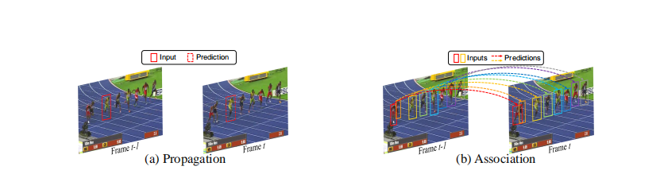
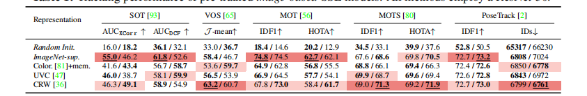
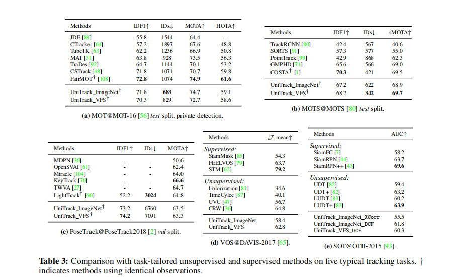
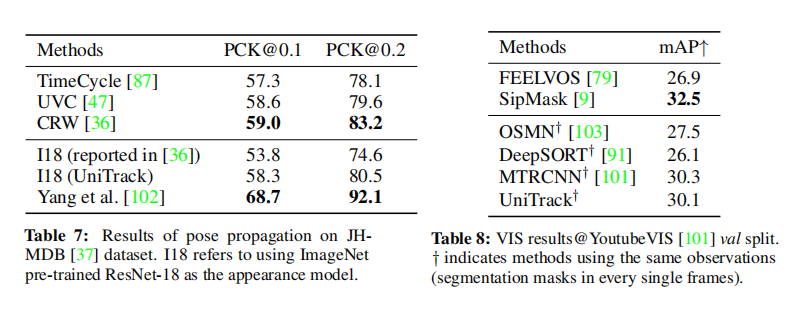

Do Different Tracking Tasks Require Different Appearance Models?

Tracking objects of interest in a video is one of the most popular and widely applicable problems in computer vision. However, with the years, a Cambrian explosion of use cases and benchmarks has fragmented the problem in a multitude of different experimental setups. As a consequence, the literature has fragmented too, and now novel approaches proposed by the community are usually specialised to fit only one specific setup. To understand to what extent this specialisation is necessary, in this work we present UniTrack, a solution to address five different tasks within the same framework. UniTrack consists of a single and task-agnostic appearance model, which can be learned in a supervised or self-supervised fashion, and multiple “heads” that address individual tasks and do not require training. We show how most tracking tasks can be solved within this framework, and that the same appearance model can be successfully used to obtain results that are competitive against specialised methods for most of the tasks considered. The framework also allows us to analyse appearance models obtained with the most recent self-supervised methods, thus extending their evaluation and comparison to a larger variety of important problems.
在计算机视觉中，跟踪视频中感兴趣的对象是最流行和最广泛应用的问题之一。然而，随着时间的推移，寒武纪大量的用例和基准测试已经将这个问题分散在许多不同的实验装置中。因此，文献也变得支离破碎，现在社区提出的新方法通常只适用于一种特定的设置。为了理解这种专业化在多大程度上是必要的，在这项工作中，我们提出了UniTrack，一种在同一框架内解决五个不同任务的解决方案。UniTrack由一个单一的、与任务无关的外观模型和多个“头部”组成，前者可以在监督或自我监督的方式下学习，后者处理单个任务，不需要培训。我们展示了如何在这个框架内解决大多数跟踪任务，并且可以成功地使用相同的外观模型来获得与所考虑的大多数任务的专业方法相比具有竞争力的结果。该框架还允许我们分析用最新的自我监督方法获得的外观模型，从而将其评估和比较扩展到更广泛的重要问题。

# 1 Introduction

Unlike popular image-based computer vision tasks such as classification and object detection, which are (for the most part) unambiguous and clearly defined, the problem of object tracking has been considered under different setups and scenarios, each motivating the design of a separate set of benchmarks and methods. For instance, for the Single Object Tracking (SOT) and Video Object Segmentation (VOS) communities [93, 40, 65], tracking means estimating the location of an arbitrary user-annotated target object throughout a video, where the location of the object is represented by a bounding box in SOT and by a pixel-wise mask in VOS. Instead, in multiple object tracking settings (MOT [56], MOTS [80] and PoseTrack [2]), tracking means connecting sets of (often given) detections across video frames to address the problem of identity association and forming trajectories. Despite these tasks only differing in the number of objects per frame to consider and observation format (bounding boxes, keypoints or masks), the best practices developed by the methods tackling them vary significantly.

与流行的基于图像的计算机视觉任务（例如分类和对象检测）不同，这些任务（在大多数情况下）是明确且明确定义的，对象跟踪问题已在不同的设置和场景下进行了考虑，每一个都激发了单独集合的设计基准和方法。例如，对于单对象跟踪 (SOT) 和视频对象分割 (VOS) 社区 [93, 40, 65]，跟踪意味着在整个视频中估计任意用户注释目标对象的位置，其中对象的位置在 SOT 中由边界框表示，在 VOS 中由像素级掩码表示。相反，在多个对象跟踪设置（MOT [56]、MOTS [80] 和 PoseTrack [2]）中，跟踪意味着跨视频帧连接（通常给定的）检测集，以解决身份关联和形成轨迹的问题。尽管这些任务仅在每帧要考虑的对象数量和观察格式（边界框、关键点或掩码）方面有所不同，但解决它们的方法开发的最佳实践差异很大。

Though the proliferation of setups, benchmarks and methods is positive in that it allows specific use cases to be thoroughly studied, we argue it makes increasingly harder to effectively study one of the fundamental problems that all these tasks have in common, i.e. what constitutes a good representation to track objects throughout a video? Recent advancements in large-scale models for language [20, 8] and vision [32, 13] have suggested that a strong representation can help addressing multiple downstream tasks. Similarly, we speculate that a good representation is likely to benefit many different tracking tasks, regardless of their specific setup. In order to validate our speculation, in this paper we present a framework that allows to adopt the same appearance model to address five different tracking tasks (Figure 2). 
尽管设置、基准和方法的激增是积极的，因为它允许对特定用例进行彻底的研究，但我们认为，有效地研究所有这些任务都有共同点的一个基本问题变得越来越困难，即，什么构成了在整个视频中跟踪对象的良好表示？语言[20,8]和视觉[32,13]大规模模型的最新进展表明，强大的表示有助于解决多个下游任务。同样，我们推测，无论具体设置如何，良好的表现可能会使许多不同的跟踪任务受益。为了验证我们的推测，在本文中，我们提出了一个框架，允许采用相同的外观模型来处理五个不同的跟踪任务（图2）。

In our taxonomy (Figure 4), we consider existing tracking tasks as problems that have either propagation or association at their core. When the core problem is propagation (as in SOT and VOS), one has to localise a target object in the current frame given its location in the previous one. Instead, in association problems (MOT, MOTS, and PoseTrack), target states in both previous and current frames are given, and the goal is to determine the correspondence between the two sets of observations. We show how most tracking tasks currently considered by the community can be simply expressed starting from the primitives of propagation or association. For propagation tasks, we employ existing box and mask propagation algorithms [7, 84, 81]. For association tasks, we propose a novel reconstruction-based metric that leverages fine-grained correspondence to measure similarities between observations. In the proposed framework, each individual task is assigned to a dedicated “head” that allows to represent the object(s) in the appropriate format to compare against prior arts on the relevant benchmarks.

在我们的分类（图4）中，我们将现有的跟踪任务视为在其核心具有传播或关联的问题。当核心问题是传播（如SOT和VOS）时，必须根据目标对象在前一帧中的位置，在当前帧中定位目标对象。相反，在关联问题（MOT、MOT和PoseTrack）中，会给出前一帧和当前帧中的目标状态，目标是确定两组观测值之间的对应关系。我们展示了如何从传播或关联的原语开始简单地表达社区当前考虑的大多数跟踪任务。对于传播任务，我们使用现有的框和掩码传播算法[7,84,81]。对于关联任务，我们提出了一种新的基于重构的度量方法，它利用细粒度的对应关系来度量观测值之间的相似性。在提出的框架中，每个单独的任务被分配给一个专用的“头部”，该头部允许以适当的格式表示对象，以便与关联基准上的现有技术进行比较。

Note that, in our framework, only the appearance model contains parameters that can be learned via back-propagation, and that we do not experiment with appearance models that have been trained on specific tracking tasks. Instead, we adopt models trained via recent self-supervised learning (SSL) techniques and that have already demonstrated their effectiveness on a variety of image-based tasks. Our motivation is twofold. First, SSL models are particularly interesting for our use-case, as they are explicitly conceived to be of general purpose. As a byproduct, our work also serves the purpose of evaluating and comparing appearance models obtained from self-supervised learning approaches (see Figure 1). Second, we hope to facilitate the tracking community in directly benefiting from the rapid advancements of the self-supervised learning literature.
请注意，在我们的框架中，只有外观模型包含可以通过反向传播学习的参数，并且我们不使用经过特定跟踪任务训练的外观模型进行实验。相反，我们采用了通过最近的自我监督学习（SSL）技术训练的模型，这些模型已经在各种基于图像的任务中证明了它们的有效性。我们的动机是双重的。首先，SSL模型对于我们的用例来说特别有趣，因为它们被明确地认为是通用的。作为一个副产品，我们的工作还用于评估和比较自监督学习方法获得的外观模型（见图1）。第二，我们希望帮助追踪社区直接受益于自我监督学习文献的快速发展。

To summarise, the contributions of our work are as follows: 
- We propose UniTrack, a framework that supports five tracking tasks: SOT [93], VOS [65], MOT [56], MOTS [80], and PoseTrack [2]; and that can be easily extended to new ones.
- We show how UniTrack can leverage many existing general-purpose appearance models to achieve a performance that is competitive with the state-of-the-art on several tracking tasks. 
- We propose a novel reconstruction-based similarity metric for association that preserves fine-grained visual features and supports multiple observation formats (box, mask and pose). 
- We perform an extensive evaluation of self-supervised models, significantly extending the empirical analysis of prior literature to video-based tasks.

总之，我们的工作贡献如下：
- 我们提出了UniTrack，一个支持五项跟踪任务的框架：SOT[93]、VOS[65]、MOT[56]、MOTS[80]和PoseTrack[2]；这可以很容易地扩展到新的任务上。
- 我们将展示UniTrack如何利用许多现有的通用外观模型，在多个跟踪任务上实现与最新技术相竞争的性能。
- 我们提出了一种新的基于重建的关联相似性度量，它保留了细粒度的视觉特征，并支持多种观察格式（框、掩膜和姿势）
- 我们对自我监督模型进行了广泛的评估，显著地将之前文献的经验性的分析扩展到基于视频的任务中。

 # 2 The UniTrack Framework 
##  2.1 Overview Inspecting existing tracking tasks and benchmarks 回顾检查现有的跟踪任务和基准
 we noticed that their differences can be roughly categorised across four axes, illustrated in Figure 2 and detailed below. 1. Whether the requirement is to track a single object (SOT [93, 40], VOS [65]), or multiple objects (MOT [65], MOTS [80], PoseTrack [2]). 2. Whether the targets are specified by a user in the first frame only (SOT, VOS), or instead are given in every frame, e.g. by a pre-trained detector (MOT, MOTS, PoseTrack). 3. Whether the target objects are represented by bounding-boxes (SOT, MOT), pixel-wise masks (VOS, MOTS) or pose annotations (PoseTrack). 4. Whether the task is class-agnostic, i.e. the target objects can be of any class (SOT, VOS); or if instead they are from a predefined set of classes (MOT, MOTS, PoseTrack).

我们注意到它们的差异可以大致分为四个轴，如图2所示，详情如下。1.要求是跟踪单个对象（SOT[93,40]，VOS[65]）还是跟踪多个对象（MOT[65]，MOT[80]，PoseTrack[2]）。2.目标是由用户仅在第一帧（SOT、VOS）中指定，还是在每一帧中指定，例如由预先训练的检测器（MOT、MOT、PoseTrack）指定。3.目标对象是否由边界框（SOT、MOT）、像素级掩膜（VOS、MOT）或姿势注释（PoseTrack）表示。4.任务是否与类无关，即目标对象可以是任何类（SOT、VOS）；或者，如果它们来自一组预定义的类（MOT、MOT、PoseTrack）。

  
 
Figure 1: High-level overview of the performance of 16 self-supervised learning models on five tracking tasks: SOT, VOS, MOT, PoseTracking and MOTS. A higher rank (better performance) corresponds to a vertex nearer to the outer circle. A larger area of the pentagon signifies better overall performance of its respective appearance model. Results of a vanilla ImageNet-supervised model are indicated with a gray dashed line as reference. Notice how the best model VFS [97] dominates on four out of the five tasks considered. All methods use ResNet-50.
图1：16个自监督学习模型在五项跟踪任务（SOT、VOS、MOT、PoseTracking和MOT）上的性能概述。等级越高（性能越好）对应的顶点越靠近外圆。五角大楼面积越大，其各自外观模型的整体性能越好。vanilla ImageNet监督模型的结果以灰色虚线作为参考。请注意，在所考虑的五项任务中，最佳型号VFS[97]占了四项。所有方法都使用ResNet-50。

  
 
Figure 2: Existing tracking problems and their respective benchmarks differ from each other under several aspects: the assumption could be that there is a single or multiple objects to track; targets can be specified by the user in the first frame only, or assumed to be given at every frame (e.g. provided by a detector); the classes of the targets can be known (classspecific) or unknown (class-agnostic); the representation of the targets can be bounding boxes, pixel-wise masks, or pose annotations.
图2：现有的跟踪问题及其各自的基准在几个方面有所不同：假设可能有一个或多个目标需要跟踪；目标只能由用户在第一帧中指定，或假设在每一帧中给出（例如，由检测器提供）；目标的类别可以是已知（特定类别）或未知（不可知类别）；目标的表示可以是边界框、像素级掩膜或姿势注释。

 
Figure 3: Overview of UniTrack. The framework can be divided in three levels. Level-1: a trainable appearance model. Level-2: the fundamental primitives of propagation and association. Level-3: task-specific heads.
图3:UniTrack概述。该框架可分为三个层次。1级：可培训的外观模型。二级：传播和关联的基本原语。3级：任务特定的头。

Typically, in single-object tasks the target is specified by the user in the first frame, and it can be of any class. Instead, for multi-object tasks detections are generally considered as given for every frame, and the main challenge is to solve identity association for the several objects. Moreover, in multi-object tasks the set of classes to address is generally known (e.g. pedestrians or cars).
通常，在单对象任务中，目标由用户在第一帧中指定，可以是任何类。相反，对于多目标任务，通常认为每个帧的检测都是给定的，主要的挑战是解决多个目标的身份关联。此外，在多对象任务中，要处理的类集通常是已知的（例如行人或汽车）。

Figure 3 depicts a schematic overview of the proposed UniTrack framework, which can be understood as conceptually divided in three “levels”. The first level is represented by the appearance model, responsible for extracting high-resolution feature maps from the input frame (Section 2.2). The second level consists of the algorithmic primitives addressing propagation (Section 2.3) and association (Section 2.4). Finally, the last level comprises multiple task-specific algorithms that make direct use of the primitives of the second level. In this work, we illustrate how UniTrack can be used to obtain competitive performance on all of the five tracking tasks of level-3 from Figure 3. Moreover, new tracking tasks can be easily integrated.
图3描述了提出的UniTrack框架的示意图概述，可以理解为在概念上分为三个“级别”。第一级由外观模型表示，负责从输入帧中提取高分辨率特征图（第2.2节）。第二级由算法原语组成，用于处理传播（第2.3节）和关联（第2.4节）。最后，最后一级包含多个特定于任务的算法，这些算法直接使用第二级的原语。在这项工作中，我们将说明如何使用UniTrack在图3中的五项三级跟踪任务中获得具有竞争力的性能。此外，新的跟踪任务可以轻松集成。

Importantly, note that the appearance model is the only component containing trainable parameters. The reason we opted for a shared and non task-specific representation is twofold. Firstly, the large amount of different setups motivated us to investigate whether having separately-trained models for each setup is necessary. Since training on specific datasets can bias the representation towards a limited set of visual concepts (e.g. animals or vehicles) and limit its applicability to “open-world” settings, we wanted to understand how far can a shared representation go. Second, we wanted to provide the community with multiple baselines that can be used to better assess newly proposed contributions, and that can be immediately used on new datasets and tasks without the need of retraining.
重要的是，请注意，外观模型是唯一包含可训练参数的组件。我们选择共享和非特定任务表示的原因有两个。首先，大量不同的设置促使我们研究是否有必要为每个设置单独训练模型。由于针对特定数据集的培训可能会使表示偏向于有限的视觉概念集（如动物或车辆），并限制其对“开放世界”设置的适用性，我们想了解共享表示能走多远。其次，我们希望为社区提供多个基线，可以用来更好地评估新提出的贡献，并且可以立即用于新的数据集和任务，而无需再培训。

 
 Figure 4: Propagation v.s. Association. In the propagation problem, the goal is to estimate the target state at the current frame given the observation in the previous one. This is typically addressed for one object at the time. In the association problem, observations in both previous and current frames are given, and the goal is to determine correspondences between the two sets.
图4：传播VS关联。在传播问题中，目标是根据前一帧中的观测值估计当前帧中的目标状态。这通常一次针对一个对象。在关联问题中，给出了前一帧和当前帧中的观察值，目标是确定这两个集合之间的对应关系。

# 2.2 Base appearance model
#2.2基本外观模型
The base appearance model φ takes as input a 2D image I and outputs a feature map X = φ(I) ∈ R^{H×W×C} . Since ideally an appearance model used for object propagation and association should be able to leverage fine-grained semantic correspondences between images, we choose a network with a small stride of r = 8, so that its output in feature space can have a relatively large resolution.
基本外观模型φ将二维图像I作为输入，并输出特征映射X=φ（I）∈ RH×W×C。由于理想情况下，用于对象传播和关联的外观模型应该能够利用图像之间的细粒度语义对应，因此我们选择了一个步幅较小的网络，其在特征空间中的输出可以具有相对较大的分辨率。

We refer to the vector (along the channel dimension) of a single point in the feature map as a point vector. We expect a point vector xi1 ∈ RC from the feature map X1 to have a high similarity with its “true match” point vector xˆi2 in X2, while being far apart from all the other point vectors xj2 in X2; i.e. we expect s(xi1 , x ˆi2) > s(xi1 , x j2), ∀j = ˆi, where s(·, ·) represents a similarity function.
我们将特征图中单个点的向量（沿通道维度）称为点向量。我们期待特征图X1中一个点向量x^i_1 ∈ R^C与X2中的“真正匹配”点向量xˆi_2具有高度相似性，同时与X2中的所有其他点向量xj2相距很远；i、 e.我们期望s（xi1，xˆi2）>s（xi1，x j2），∀j=ˆi，其中s（·，·）表示相似性函数。

In order to learn fine-grained correspondences, fully-supervised methods are only amenable for synthetic datasets (e.g. Flying Chairs for optical flow [21]). With real-world data, it is intractable to label pixel-level correspondences and train models in a fully-supervised fashion. To overcome this obstacle, in this paper we adopt representations obtained with self-supervision. We experiment both with models trained with approaches that leverage pixel-wise pretext tasks [36, 81] and, inspired by prior works that have pointed out how fine-grained correspondences emerge in middle-level features [53, 97], with models obtained from image-level tasks (e.g. MoCo [32], SimCLR [13]).
为了学习细粒度的对应关系，全监督方法仅适用于合成数据集。对于真实世界的数据，很难标记像素级的对应关系，并以完全监督的方式训练模型。为了克服这个障碍，在本文中，我们采用了通过自我监督获得的表示。我们用经过训练的模型进行实验，这些模型利用像素级辅助任务[36,81]进行训练，并受之前指出如何在中间级特征中出现细粒度对应的工作[53,97]的启发，使用从图像级任务（例如MoCo[32]，SimCLR[13]）获得的模型进行实验。

## 2.3 Propagation Problem definition.
##2.3传播问题定义。
Figure 4a schematically illustrates the problem of propagation, which we use as a primitive to address SOT and VOS tasks. Considering the single-object case, given video frames {I_t}T_{t=1}and an initial ground truth observation z1 as input, the goal is to predict object states {zˆt}^T_{t=2} for each time-step t. In this work we consider three formats to represent objects: bounding boxes, segmentation masks and pose skeletons.
图4a示意性地说明了传播问题，我们将其用作处理SOT和VOS任务的原语。考虑到单个对象的情况，给定的视频帧{I_t}T_{t=1}和初始真实数据观察Z1作为输入，目标是预测对象状态{zˆt}^T_{t=2}，对于每一个时间步长T.在这项工作中，我们考虑三种格式来表示对象：包围框、分割掩模和姿态骨架。

### Mask propagation. 
In order to propagate masks, we rely on the approach popularised by recent video self-supervised methods [36, 81, 47, 42]. Consider the feature maps of a pair of consecutive frames Xt-1 and Xt, both ∈ Rs×C , and the label mask ztt1 ∈ [0, 1]s of the previous frame 2 , where s = H × W indicates its spatial resolution. We compute the matrix of transitions Kttt1 = [ki,j ]s×s as the affinity matrix between Xtt1 and Xt. Each element ki,j is defined as
掩模传播。为了传播掩膜，我们依靠最近视频自我监督方法流行的方法[36,81,47,42]。考虑一对连续帧X_T-1和X_T的特征映射，两者都是∈ Rs×C和标签掩码ztt1∈ 前一帧2的[0,1]s，其中s=H×W表示其空间分辨率。我们计算转换矩阵Kttt1=[ki，j]s×s作为Xtt1和Xt之间的亲和矩阵。每个元素ki，j的定义如下：

where h·, ·i indicates inner product, and τ is a temperature hyperparameter. As in [36], we only keep the top K values for each row and set other values to zero. Then, the mask for the current frame at time t is predicted by propagating the previous prediction: zt = Kttt1ztt1. Mask propagation proceeds in a recurrent fashion: the output mask of the current frame is used as input for the next one.
其中h·，·i表示内积，τ表示温度超参数。如[36]中所述，我们只保留每行的前K值，并将其他值设置为零。然后，通过传播先前的预测：zt＝Kttt1ztt1来预测时间t处的当前帧的掩码。掩码传播以循环方式进行：当前帧的输出掩码用作下一帧的输入。

### Pose propagation. 
In order to represent pose keypoints, we use the widely adopted Gaussian belief maps [89]. For a keypoint p, we obtain a belief map zp ∈ [0, 1]s by using a Gaussian with mean equal to the keypoint’s location and variance proportional to the subject’s body size. In order to propagate a pose, we can then individually propagate each belief map in the same manner as mask propagation, again as ztp = Kttt1ztpp1.
姿势传播。为了表示姿势关键点，我们使用了广泛采用的高斯信念图[89]。对于一个关键点p，我们得到了一个信念映射zp∈ [0,1]s，使用高斯分布，平均值等于关键点的位置，方差与受试者的体型成比例。为了传播一个姿势，我们可以用与掩膜传播相同的方式单独传播每个信念图，同样是ztp=Kttt1ztpp1。

### Box propagation.
The position of an object can also be more simply expressed with a four dimensional vector z = (u, v, w, h), where (u, v) are the coordinates of the bounding-box center, and (w, h) are its width and height. While one could reuse the strategy adopted above by simply converting the bounding-box to a pixel-wise mask, we observed that using this strategy leads to inaccurate predictions. Instead, we use the approach of SiamFC [7], which consists in performing cross-correlation (XCORR) between the target template ztt1 and the frame Xt to find the new location of the target in frame t. Cross-correlation is performed at different scales, so that the bounding-box representation can be resized accordingly. We also provide a Correlation Filter-based alternative (DCF) [76, 84] (see Appendix B.1)
框传播。对象的位置也可以更简单地用四维向量z=（u，v，w，h）表示，其中（u，v）是边界框中心的坐标，（w，h）是其宽度和高度。虽然可以通过简单地将边界框转换为像素级掩膜来重用上面采用的策略，但我们发现使用这种策略会导致不准确的预测。相反，我们使用了SiamFC[7] 就是孪生网络 的方法，该方法包括在目标模板ztt1和帧Xt之间执行互关联（XCORR），以在帧t中找到目标的新位置。互关联以不同的比例执行，以便可以相应地调整边界框表示的大小。我们还提供了基于关联滤波器的替代方案（DCF）[76,84]（见附录B.1）

# 2.4 Association 关联
Problem definition. Figure 4b schematically illustrates the association problem, which we use as primitive to address the tasks of MOT, MOTS and PoseTrack. In this case, observations for object states {Zˆt}Tt=1 are given for all the frames {It}Tt=1, typically via the output of a pre-trained detector. The goal here is to form trajectories by connecting observations across adjacent frames according to their identity
问题定义。图4b示意性地说明了关联问题，我们将其用作解决MOT、MOT和PoseTrack任务的原语。在这种情况下，对于所有帧{It}Tt=1，通常通过预先训练的检测器的输出给出对象状态{Zˆt}Tt=1的观测值。这里的目标是通过将相邻帧之间的观测值根据其身份连接起来，形成轨迹
Association algorithm. We adopt the association algorithm proposed in JDE [88] for MOT, MOTS and PoseTrack tasks, of which detailed description can be found in Appendix C.1. In summary, we compute an N × M distance matrix between N already-existing tracklets and M “new” detections from the last processed frame. We then use the Hungarian algorithm [41] to determine pairs of matches between tracklets and detections, using the distance matrix as input. To obtain the matrix of distances used by the algorithm, we compute the linear combination of two terms accounting for motion and appearance cues. For the former, we compute a matrix indicating how likely a detection corresponds to the object state predicted by a Kalman Filter [38]
关联算法。对于MOT、MOT和PoseTrack任务，我们采用JDE[88]中提出的关联算法，详细描述见附录C.1。总之，我们计算了N个已经存在的tracklet和来自最后处理帧的M个“新”检测之间的N×M距离矩阵。然后，我们使用匈牙利算法[41]确定轨迹和检测之间的匹配对，使用距离矩阵作为输入。为了获得该算法使用的距离矩阵，我们计算了两项的线性组合，这两项考虑了运动和外观线索。对于前者，我们计算一个矩阵，表明检测与卡尔曼滤波器预测的目标状态对应的相似性[38]
Instead, the appearance component is directly computed by using feature-map representations obtained by processing individual frames with the appearance model (Section 2.2). While object-level features for box and mask observations can be directly obtained by cropping frame-level feature maps, when an object is represented via a pose it first needs to be converted to a mask (via a procedure described in Appendix C.2).
相反，通过使用外观模型处理单个帧而获得的特征映射表示，直接计算外观组件（第2.2节）。虽然框和掩膜观察的对象级特征可以通过裁剪帧级特征贴图直接获得，但当通过姿势表示对象时，首先需要将其转换为掩膜（通过附录C.2中描述的程序）。
A key issue of this scenario is how to measure similarities between object-level features. We find existing methods limited. First, objects are often compared by computing the cosine similarity of average-pooled object-level feature maps [113, 72]. However, the operation of average inherently discards local information, which is important for fine-grained recognition. Approaches [25, 73] that instead to some extent do preserve fine-grained information, such as those computing the cosine similarity of (flattened) feature maps, do not support objects with differently-sized representation (situation that occurs for instance with pixel-level masks). To cope with the above limitations, we propose a reconstruction-based similarity metric that is able to deal with different observation formats, while still preserving fine-grained information.
这个场景的一个关键问题是如何度量对象级特征之间的相似性。我们发现现有的方法有限。首先，通常通过计算平均合并对象级特征映射的余弦相似性来比较对象[113,72]。然而，平均值的运算固有地丢弃了局部信息，这对于细粒度识别非常重要。方法[25,73]在某种程度上确实保留了细粒度信息，例如那些计算（展平）特征地图的余弦相似性的方法，不支持具有不同大小表示的对象（例如使用像素级掩膜的情况）。为了克服上述局限性，我们提出了一种基于重建的相似性度量，它能够处理不同的观测格式，同时仍然保留细粒度信息。
Reconstruction Similarity Metric (RSM). Let {ti}Ni=1 denote the object-level features of N existing tracklets, ti ∈ Rsti×C and sti indicates the spatial size of the object, i.e. the area of the box or the mask representing it. Similarly, {dj}Mj=1 denotes the object-level features of M new detections. With the goal of computing similarities to obtain an N × M affinity matrix to feed to the Hungarian algorithm, we propose a novel reconstruction-based similarity metric (RSM) between pairs (i, j), which is obtained as
重建相似性度量（RSM）。设{ti}Ni=1表示N个现有tracklet的对象级特征，ti∈ Rsti×C和sti表示对象的空间大小，即框或表示框的掩膜的面积。类似地，{dj}Mj=1表示M个新检测的对象级特征。为了计算相似度以获得一个N×M的亲和矩阵，并将其提供给匈牙利算法，我们提出了一种新的基于重建的成对（i，j）之间的相似度度量（RSM），其获得如下：
where tˆi←j represents ti reconstructed from dj and dˆj←i represents dj reconstructed from ti . In multi-object tracking scenarios, observations are often incomplete due to frequent occlusions. As such, directly comparing features between incomplete and complete observations often fails because of misalignment between local features. Suppose dj is a detection feature representing a severely occluded pedestrian, while ti a tracklet feature representing the same person, but unoccluded. Likely, directly computing the cosine similarity between the two will not be very telling. RSM addresses this issue by introducing a step of reconstruction after which the co-occurring parts of point features will be better aligned, thus making the final similarity more likely to be meaningful.
tˆi在哪里←j代表从dj和dˆj重建的ti←我代表从ti重建的dj。在多目标跟踪场景中，由于频繁的遮挡，观测通常是不完整的。因此，直接比较不完整和完整观测值之间的特征通常会失败，因为局部特征之间存在偏差。假设dj是一个表示严重堵塞行人的检测特征，而ti是一个表示同一个人但未被堵塞的轨迹特征。很可能，直接计算两者之间的余弦相似性不会很有说服力。RSM通过引入一个重建步骤来解决这个问题，在重建之后，点特征的共现部分将更好地对齐，从而使最终的相似性更有可能是有意义的。

  Figure 5: Reconstruction Similarity Metric (RSM): First, object-level features of existing tracklets and current detections are flattened and concatenated. Then, an affinity matrix between the two feature sets is computed. For a pair of tracklet ti and detection dj , we “extract” the corresponding sub-matrix from the entire affinity matrix as linear weights and reconstruct ti from dj using these linear weights. The similarity between the original object-level feature and its reconstructed version is finally taken as the RSM. We want the metric to be symmetric, so we perform reconstruction both forward (ti ← dj ) and backward (ti → dj ).
![img_5.png]（img_5.png）图5：重建相似性度量（RSM）：首先，现有轨迹和当前检测的对象级特征被展平和连接。然后，计算两个特征集之间的亲和矩阵。对于一对tracklet ti和detection dj，我们从整个亲和矩阵中“提取”相应的子矩阵作为线性权重，并使用这些线性权重从dj重构ti。最终将原始对象级特征与其重构版本之间的相似性作为RSM。我们希望度量是对称的，所以我们执行前向重建（ti）← dj）和向后（ti）→ dj）。
The reconstructed object-level feature map tˆi←j is a simple linear transformation of dj , i.e. ˆti←j = Ri←jdj , where Ri←j ∈ Rsti×sdj is a transformation matrix obtained as follows. We first flatten and concatenate all object-level features belonging to a tracklet (i.e. the set of observations corresponding to an object) into a single feature matrix T ∈ R(Pi sti )×C . Similarly, we obtain all the object-level feature maps of a new set of detections D ∈ R(Pj sdj )×C . Then, we compute the affinity matrix A = Softmax(T D>) and “extract” individual Ri←j mappings as sub-matrices of A with respect to the appropriate (i, j) tracklet-detection pair: Ri←j = A hPii 1 i0=1 si0 : Pii0=1 si0 ,Pjj 1 j0=1 sj0 : Pjj0=1 sj0i3 . For a schematic representation of the procedure just described, see Figure 5.

重建的对象级特征映射tˆi←j是dj的简单线性变换，即ˆti←j=Ri←jdj，Ri在哪里←J∈ Rsti×sdj是一个变换矩阵，如下所示。我们首先将属于轨迹的所有对象级特征（即对应于对象的观察集）展平并连接到单个特征矩阵T中∈ R（πsti）×C。同样地，我们获得了一组新检测的所有对象级特征映射∈ R（Pj-sdj）×C。然后，我们计算亲和矩阵A=Softmax（td>）并“提取”单个Ri←j映射 ping作为A关于适当（i，j）轨迹检测对的子矩阵：Ri←j=A hPii 1 i0=1 si0:Pii0=1 si0，Pjj 1 j0=1 sj0:Pjj0=1 sj0i3。有关刚才描述的程序的示意图，请参见图5。

RSM can be interpreted from an attention [78] perspective. The feature map of a tracklet ti being reconstructed can be seen as a set of queries, and the “source” detection feature dj can be interpreted both as keys and values. The goal is to reconstruct the queries by linear combination of the values. The linear combination (attention) weights are computed using the affinity between queries and keys. Specifically, we first compute a global affinity matrix between ti and all the dj0 for j0 = 1, ..., M, and then extract the corresponding sub-matrix for ti and dj0 as the attention weights. Our formulation leads to a desired property: if the attention weights approach zero, the corresponding reconstructed point vectors will approach zero and so the RSM between ti and dj .
RSM可以从注意力[78]的角度进行解释。正在重构的tracklet ti的特征映射可以被视为一组查询，“源”检测特征dj可以被解释为键和值。目标是通过值的线性组合来重建查询。线性组合（注意）权重是使用查询和键之间的亲和力计算的。具体来说，我们首先计算ti和所有dj0之间的全局亲和矩阵，j0=1。。。，M、 然后提取ti和dj0对应的子矩阵作为注意权重。我们的公式得出了一个期望的性质：如果注意权重接近零，相应的重构点向量将接近零，因此ti和dj之间的RSM也将接近零。

Measuring similarity by reconstruction is popular in problems such as few-shot learning [90, 106], self-supervised learning [51], and person re-identification [34]. However, reconstruction is typically framed as a ridge regression or optimal transport problem. With O(n2) complexity, RSM is more efficient than ridge regression and it has a similar computation cost to calculating the Earth Moving Distance for the optimal transport problem. Appendix D shows a series of ablation studies illustrating the importance of the proposed RSM for the effectiveness of UniTrack on association-type tasks.
通过重建来衡量相似性在一些问题中很流行，比如少镜头学习[90,106]、自我监督学习[51]和人员重新识别[34]。然而，重建通常被定义为山脊回归或最优运输问题。在O（n2）复杂度下，RSM比岭回归更有效，并且其计算成本与计算最优运输问题的土方距离相似。附录D显示了一系列消融研究，说明了提出的RSM对于UniTrack在关联型任务中的有效性的重要性。

# 3 Experiments 实验
Since UniTrack does not require task-specific training, we were able to experiment with many alternative appearance models (see Figure 3) with little computational cost. In Section 3.1 we perform an extensive evaluation to benchmark a wide variety of off-the-shelf, modern self-supervised models, showing their strengths and weaknesses on all five tasks considered. In this section we also conduct a correlation study with the so-called “linear probe” strategy [107], which became a popular way to evaluate representations obtained with self-supervised learning. Then, in Section 3.2 we compare UniTrack (equipped with supervised or unsupervised appearance models) against recent and task-specific tracking methods.
由于UniTrack不需要特定于任务的培训，我们可以用很少的计算成本来试验许多替代的外观模型（见图3）。在第3.1节中，我们对各种现成的现代自我监督模型进行了广泛的评估，展示了它们在所有五项任务中的优势和劣势。在本节中，我们还对所谓的“线性探测”策略进行了关联研究[107]，这一策略已成为评估自监督学习获得的表征的常用方法。然后，在第3.2节中，我们将UniTrack（配备有监督或无监督的外观模型）与最近的和特定于任务的跟踪方法进行比较。
## Implementation details. 实施细节
We use ResNet-18 [33] or ResNet-50 as the default architecture. With ImageNet-supervised appearance model, we refer to the ImageNet pre-trained weights made available in PyTorch’s “Model Zoo”. To prevent excessive downsampling, we modify the spatial stride of layer3 and layer4 to 1, achieving a total stride of r = 8. We extract features from both layer3 and layer4. We report results with layer3 features when comparing against task-specific methods (Section 3.2), and with both layer3 and layer4 when evaluating multiple different representations (Section 3.1). Further implementation details are deferred to Appendix B and C
 我们使用ResNet-18[33]或ResNet-50作为默认体系结构。对于ImageNet监督外观模型，我们指的是PyTorch的“model Zoo”中提供的ImageNet预训练权重。为了防止过度的下采样，我们将第3层和第4层的空间步幅修改为1，实现了r=8的总步幅。我们从第三层和第四层提取特征。在与特定任务方法（第3.2节）进行比较时，我们报告了第3层功能的结果；在评估多个不同表示时，报告了第3层和第4层功能的结果（第3.1节）。进一步的实施细节将推迟到附录B和C
## Datasets and evaluation metrics.
For fair comparison with existing methods, we report results on standard benchmarks with conventional metrics for each task. Please refer to Appendix A for details.
数据集和评估指标。为了与现有方法进行公平比较，我们报告了标准基准上的结果，以及每个任务的常规指标。详情请参阅附录A。
## 3.1 UniTrack as evaluation platform of previously-learned representations UniTrack作为之前学习过的表达的评估平台
The process of evaluating representations obtained via self-supervised learning (SSL) often involves additional training [22, 32, 13], for instance via the use of linear probes [107], which require to fix the pre-trained model and train an additional linear classifier on top of it. In contrast, using UniTrack as evaluation platform (1) does not require any additional training and (2) enables the evaluation on a battery of important video tasks, which have generally been neglected in self-supervised-learning papers in favour of more established image-level tasks such as classification.
评估通过自监督学习（SSL）获得的表示的过程通常涉及额外的训练[22,32,13]，例如通过使用线性探针[107]，这需要修复预先训练的模型，并在其上训练额外的线性分类器。相比之下，使用UniTrack作为评估平台（1）不需要任何额外的培训，（2）可以对一系列重要的视频任务进行评估，这些任务在自我监督的学习论文中通常被忽略，而倾向于更确定的图像级任务，如分类。
In this section, we evaluate three types of SSL representations: (a) Image-level representations learned from images, e.g. MoCo [32] and BYOL [29]; (b) Pixel-level representations learned from images (such as DetCo [95] and PixPro [96]) and (c) videos (such as UVC [47] and CRW [36]). For all methods considered, we use the pre-trained weights provided by the authors.
在本节中，我们评估了三种类型的SSL表示：（a）从图像中学习的图像级表示，例如MoCo[32]和BYOL[29]；（b） 从图像（如DetCo[95]和PixPro[96]）和（c）视频（如UVC[47]和CRW[36]）中学习到的像素级表示。对于所有考虑的方法，我们使用作者提供的预训练权重。
Results are shown in Table 1 and 2, where we report the results obtained by using features from either layer3 or layer4 of the pre-trained ResNet backbone. We report both results and separate them by a ‘/’ in the table. Note that, for this analysis only, for association-type tasks motion cues are discarded to better highlight distinctions between different representations and avoid potential confounding factors. Figure 1 provides a high-level summary of the results by focusing on the ranking obtained by different SSL methods on the five tasks considered (each represented by a vertex in the radar-style plot). Several observations can be made:
结果如表1和表2所示，我们报告了通过使用预先训练的ResNet主干的第3层或第4层的特征获得的结果。我们报告这两个结果，并在表中用“/”分隔。请注意，仅在本分析中，对于关联型任务，运动线索被丢弃，以更好地突出不同表征之间的区别，并避免潜在的混淆因素。图1通过关注不同SSL方法对所考虑的五个任务（每个任务在雷达样式图中由一个顶点表示）获得的排名，提供了结果的高级总结。可以观察到以下几点：
(1) There is no significant correlation between “linear probe accuracy” on ImageNet and overall tracking performance. The linear probe approach [81] has become a standard way to compare SSL representations. In Figure 6, we plot tracking performance on five tasks (y-axes) against ImageNet top-1 accuracy of 16 different models (x-axes), and report Pearson and Spearman (rank) correlation coefficients. We observe that the correlation between ImageNet accuracy and tracking performance is small, i.e. the Pearson’s r ranges from −0.38 to +0.20, and Spearman’s ρ ranges from −0.36 to +0.26. For most tasks, there is almost no correlation, while for VOS the two measures are mildly inversely correlated. The result suggests that evaluating SSL models on five extra tasks with UniTrack could constitute a useful complement to ImageNet linear probe evaluation, and encourage the SSL community to pursue the design of even more general purpose representations.
（1） ImageNet上的“线性探头精度”与整体跟踪性能之间没有显著关联性。线性探测方法[81]已成为比较SSL表示的标准方法。在图6中，我们根据16种不同模型（x轴）的ImageNet top-1精度绘制了五项任务（y轴）的跟踪性能，并报告了Pearson和Spearman（rank）关联系数。我们观察到ImageNet精度和跟踪性能之间的关联性很小，即皮尔逊r的范围为−0.38至+0.20，斯皮尔曼的ρ范围为−0.36至+0.26。对于大多数任务来说，几乎没有关联性，而对于VOS来说，这两个指标是轻度负关联的。结果表明，使用UniTrack在五个额外任务上评估SSL模型可以构成ImageNet线性探针评估的有用补充，并鼓励SSL社区追求更通用的表示设计。
(2) A vanilla ImageNet-trained supervised representation is surprisingly effective across the board. On most tasks, it reports a performance competitive with the best representation for that task. This is particularly evident from Figure 1, where its performance is outlined as a gray dashed line. This result suggests that results obtained with vanilla ImageNet features should be reported when investigating new tracking methods.
（2） 经过vanilla ImageNet培训的受监督代表在所有方面都出人意料地有效。在大多数任务中，它报告的性能与该任务的最佳表现具有竞争力。这一点在图1中尤为明显，图中的性能用灰色虚线表示。这一结果表明，在研究新的跟踪方法时，应报告使用vanilla ImageNet特征获得的结果。
(3) The best self-supervised representation ranks first on most tasks. Recently, it has been shown how SSL-trained representations can match or surpass their supervised counterparts on ImageNet classification (e.g. [21]) and many downstream tasks [17, 72]. Within UniTrack, although no individual SSL representation is able to beat the vanilla ImageNet-trained representation on every single task, we observe that the recently proposed VFS [74] ranks first on every task, except for single-object tracking. This suggests that advancements of the self-supervised learning literature can directly benefit the tracking community: it is reasonable to expect that newly-proposed representations will further improve performance across the board.
（3） 在大多数任务中，最好的自我监督表现排名第一。最近，有研究表明，经过SSL训练的表示法可以在ImageNet分类（例如[21]）和许多下游任务[17,72]上与受监督的表示法相匹配或超过它们。在UniTrack中，虽然没有一个单独的SSL表示能够在每项任务上击败vanilla ImageNet训练的表示，但我们观察到，最近提出的VFS[74]在每项任务上都排名第一，除了单个对象跟踪。这表明，自我监督学习文献的进步可以直接使跟踪社区受益：可以合理预期，新提出的表示将进一步全面提高绩效。

 Table 1: Tracking performance of pre-trained image-based SSL models. All methods employ a ResNet-50
![img_5.png]（img_5.png）表1：预先训练的基于图像的SSL模型的跟踪性能。所有方法都使用ResNet-50

![img_6.png]（img_6.png）
Table 2: Tracking performance of pre-trained video-based SSL models. All methods employ a ResNet-18. In the above two tables, we report results with [layer3 / layer4] features in each cell, and the best performance between the two is bolded. We use the bolded values to rank the models in each column, and visualise (column-wise) better performance with darker cell colors. Best results in each column are underlined.
表2：预先训练的基于视频的SSL模型的跟踪性能。所有方法都使用ResNet-18。在以上两个表格中，我们报告了每个单元格中具有[layer3/layer4]功能的结果，两者之间的最佳性能以粗体显示。我们使用粗体的值对每列中的模型进行排序，并用较暗的单元格颜色可视化（按列）更好的性能。每列中的最佳结果都有下划线。

![img_7.png]（img_7.png）
Figure 7: Tracking performance is poorly correlated with ImageNet accuracy. On the x-axes we plot ImageNet linear probe top-1 accuracy and on the y-axes the tracking performance on five tracking datasets. Correlation coefficients (Spearman’s ρ and Pearson’s r) are shown in the left bottom of each plot
图7：跟踪性能与ImageNet的精度关联性很差。在x轴上，我们绘制ImageNet线性探头top-1精度，在y轴上绘制五个跟踪数据集的跟踪性能。关联系数（斯皮尔曼的ρ和皮尔逊的r）显示在每个图的左下角
(4) Pixel-level SSL representations do not seem to have a consistent advantage in pixel-level tasks. In Table 2 and at the bottom of Table 1 we compare recent SSL representations trained with pixellevel proxy tasks: PixPro [96], DetCo [95], TimeCycle [87], Colorization [81], UVC [47] and Contrastive Random Walk (CRW) [36]. Considering that pixel-level models leverage more finegrained information during training, one may expect them to outperform image-based models in the tracking tasks where this is important. It is not straightforward to compare pixel-level SSL models with image-level ones, as the two types employ different default backbone networks. However, note how good image-based models (MoCo-v1, SimCLR-v2) are on par with their supervised counterpart in all tasks, while good pixel-level models (DetCo, CRW) still have gaps with respect to their supervised counterparts in tasks like SOT and MOT. Moreover, from Table 1, one can notice how the last three rows, despite representing methods leveraging pixel-level information during training, are actually outperformed by image-level representations on the pixel-level tasks of VOS, MOTS and PoseTrack.
（4） 像素级SSL表示在像素级任务中似乎没有一致的优势。在表2中和表1的底部，我们比较了最近使用像素级代理任务训练的SSL表示：PixPro[96]、DetCo[95]、Time Cycle[87]、Colorization[81]、UVC[47]和对比随机游走（CRW）[36]。考虑到像素级模型在训练过程中利用了更细粒度的信息，人们可能会期望它们在重要的跟踪任务中优于基于图像的模型。比较像素级SSL模型和图像级SSL模型并不容易，因为这两种类型使用不同的默认主干网络。然而，注意如何良好的基于图像的模型（MOCO-V1，SIMCL—V2）在所有任务中都与他们监督的对等体保持一致，而良好的像素级模型（DETCO，CRW）在其任务如SOT和MOT方面仍然存在空白。此外，从表1可以看出，尽管最后三行表示的方法在训练期间利用了像素级信息，但在VOS、MOTS和PoseTrack的像素级任务中，图像级表示实际上优于图像级表示。
(5) Video data can benefit representation learning for video tasks. The top-ranking VFS is similar to MoCo, SimCLR and BYOL in terms of learning scheme: they all perform contrastive learning on image level features. The most important distinction is the training data. Previous SSL methods mostly train on still-image based datasets (typically ImageNet), while VFS employs a large-scale video dataset Kinetics [12]. Clearly, this is not very surprising, as training on video data can help closing the domain gap with the (video-based) downstream tasks considered in this paper.
（5） 视频数据有利于视频任务的表征学习。排名靠前的VFS在学习模式上与MoCo、SimCLR和BYOL类似：它们都在图像级特征上进行对比学习。最重要的区别是训练数据。以前的SSL方法主要在基于静态图像的数据集（通常是ImageNet）上训练，而VFS则使用大规模视频数据集[12]。显然，这并不奇怪，因为视频数据培训可以帮助缩小与本文所考虑的（基于视频的）下游任务之间的领域差距。

![img_8.png]（img_8.png）

## 3.2 Comparison with task-specific tracking methods Unsupervised methods. 3.2与任务特定跟踪方法的比较无监督方法。
We observe that UniTrack performs competitively against unsupervised state-of-the-art methods in both the propagation-type tasks we considered (Table 3d and 3e). For SOT, UniTrack with a DCF head [84] outperforms UDT [82] (a strong recent method) by 2.4 AUC points, while it is surpassed by LUDT+ [83] by 2.1 points. Considering that LUDT+ adopts an additional online template update mechanism [16] while ours does not, we believe the gap could be closed. In VOS, existing unsupervised methods are usually trained on video datasets [47, 36], and some of the most recent outperform UniTrack (with an ImageNet-trained representation). Nonetheless, when we use a VFS-trained representation, this performance difference is reduced to 2%. Finally, note that for association-type tasks we are not aware of any existing unsupervised learning method, and thus in this case we limit the comparison to supervised methods.
我们观察到，在我们考虑的两种传播类型任务（表3d和3e）中，UniTrack的性能与无监督的最先进方法相比具有竞争力。对于SOT，具有DCF头[84]的UniTrack比UDT[82]（一种最近采用的强有力的方法）高出2.4个AUC点，而LUDT+[83]则高出2.1个点。考虑到LUDT+采用了额外的在线模板更新机制[16]，而我们没有，我们相信这一差距可以缩小。在VOS中，现有的无监督方法通常在视频数据集上进行训练[47,36]，最近的一些方法优于UniTrack（使用ImageNet训练的表示法）。尽管如此，当我们使用经过VFS训练的表示法时，这种性能差异降低到2%。最后，请注意，对于关联类型的任务，我们不知道任何现有的无监督学习方法，因此在这种情况下，我们将比较限制为有监督的方法。
Comparison with supervised methods. In general, UniTrack with a ResNet-18 appearance model already performs on par with several existing task-specific supervised methods, and in several tasks it even shows superior accuracy, especially for identity-related metrics. (1) For SOT, UniTrack with a DCF head outperforms SiamFC [7] by 3.6 AUC points. This is a significant margin considering that SiamFC is trained with a large amount of crops from video datasets with annotated bounding boxes. (2) For VOS, UniTrack surpasses SiamMask [85] by 4.1 J -mean points, despite this being trained on the joint set of three large-scale video datasets [50, 19, 98]. (3) For MOT, we employ the same detections used by the state-of-the-art tracker FairMOT [108]. The appearance embedding in FairMOT is trained with 270K bounding boxes of 8.7K labeled identities, from a MOT-specific dataset. In contrast, despite our appearance model not being trained with any MOT-specific data, our IDF1 score is quite competitive (71.8 v.s. 72.8 of FairMOT), and the ID switches are considerably reduced by 36.4%, from 1074 to 683. (4) For MOTS, we start from the same segmentation masks used by the COSTA [1] tracker, and observe a degradation in terms of ID switches (622 vs the 421 of the state of the art), and also a gap in IDF1 and sMOTA. (5) Finally, for pose tracking, we employ the same pose estimator used by LightTrack [60]. Compared with LightTrack, the MOTA of UniTrack degrades of 1.3 points because of an increased amount of ID switches. However, the IDF-1 score is improved by a significant margin (+21.0 points). This shows UniTrack preserves identity more accurately for long tracklets: even if ID switches occur more frequently, after a short period UniTrack is able to correct the wrong association, leading to a higher IDF-1.
与监督方法的比较。一般来说，具有RESNET-18外观模型的UniTrack已经与一些现有任务特定的监督方法保持一致，并且在若干任务中，它甚至表现出较高的精度，特别是对于与身份关联的度量。（1） 对于SOT，具有DCF磁头的UniTrack的性能比SiamFC[7]好3.6个AUC点。考虑到SiamFC使用大量来自带注释边界框的视频数据集的作物进行训练，这是一个很大的优势。（2） 对于VOS，UniTrack比SiamMask[85]高出4.1 J-平均分，尽管它是在三个大型视频数据集[50,19,98]的联合集合上训练的。（3） 对于MOT，我们采用与最先进的追踪器FairMOT相同的检测方法[108]。FairMOT中嵌入的外观使用来自MOT特定数据集的270K边界框（8.7K标记身份）进行训练。相比之下，尽管我们的外观模型没有使用任何特定于MOT的数据进行培训，但我们的IDF1分数相当有竞争力（FairMOT的分数为71.8 v.s.72.8），ID开关显著减少了36.4%，从1074减少到683。（4） 对于MOT，我们从COSTA[1]跟踪器使用的相同分段掩膜开始，观察到ID开关的退化（622与421的最新技术相比），以及IDF1和sMOTA的差距。（5） 最后，对于姿势跟踪，我们使用了LightTrack[60]使用的相同姿势估计器。与LightTrack相比，由于ID开关数量增加，UniTrack的MOTA降低了1.3个点。然而，IDF-1得分显著提高（+21.0分）。这表明UniTrack可以更准确地为长Tracklet保留身份：即使ID切换更频繁，但在短时间内UniTrack能够纠正错误的关联，从而提高IDF-1。
Notice how, overall, UniTrack obtains more competitive performance on tasks that have association at their core, i.e. MOT, MOTS and PoseTrack. Upon inspection, we observed that most failure cases in propagation-type tasks regard the “drift” occurring when the scale of the object is improperly estimated. In future work, this could be addressed for instance by a bounding-box regression module to refine predictions, or by carefully designing a motion model. For association-type tasks, the consequences of any type of inaccuracy are isolated to individual pairs of frames, and thus much less catastrophic by nature.
请注意，总的来说，UniTrack如何在以关联为核心的任务（即MOT、MOT和PoseTrack）上获得更具竞争力的性能。经过检查，我们发现传播型任务中的大多数失败案例都与不当估计对象规模时发生的“漂移”有关。在未来的工作中，这可以通过边界框回归模块来改进预测，或者通过仔细设计运动模型来解决。对于关联类型的任务，任何类型的不准确的后果都与单个帧对隔离，因此本质上灾难性要小得多。

# 4 Related Work 关联工作
To the best of our knowledge, sharing the appearance model across multiple tracking tasks has not been extensively studied in the computer vision literature, and especially not in the context of SSL representations. Some existing methods do share a common backbone architecture across tasks. For instance, STEm-Seg [4] addresses VIS [101] and MOTS; while TraDeS [92] addresses MOT, MOTS and VIS. However, both methods need to be trained separately and on different datasets for every task. Conversely, we reuse the same representation across five tasks. A promising direction for future work would be to use UniTrack to train a shared representation in a multi-task fashion. Only a few relevant works do adopt a multi-task approach [85, 109, 55], and they usually consider SOT and VOS tasks only. In general, despite the multi-task direction being surely interesting, it requires the availability of large-scale datasets with annotations in multiple formats, and costly training. These are two of the main reasons for which we believe that having a framework that allows to achieve competitive performance on multiple tasks with previously-trained models is a worthwhile endeavour.
就我们所知，在计算机视觉文献中，尤其是在SSL表示的上下文中，尚未对跨多个跟踪任务共享外观模型进行广泛研究。一些现有的方法在任务之间共享一个共同的主干架构。例如，STEm Seg[4]地址为VIS[101]和MOT；而TraDeS[92]则涉及MOT、MOT和VIS。然而，这两种方法都需要分别进行培训，并针对每项任务在不同的数据集上进行培训。相反，我们在五个任务中重复使用相同的表示。未来工作的一个有希望的方向是使用UniTrack以多任务的方式训练共享表示。只有少数关联的工作采用了多任务方法[85, 109, 55 ]，他们通常只考虑SOT和VOS任务。总的来说，尽管多任务方向肯定很有趣，但它需要具有多种格式注释的大规模数据集的可用性，以及昂贵的培训。这是两个主要原因，我们认为，有一个框架，允许使用以前训练过的模型在多个任务上实现有竞争力的性能，是一项值得努力的工作。
Self-supervised model evaluation. Given the difference between the pretext tasks used to train self-supervised models and the downstream tasks used to evaluate them, the comparison between self-supervised approaches has always been a delicate matter. Existing evaluation strategies typically require additional training once a general-purpose representation has been obtained. One strategy keeps the representation fixed, and then trains additional task-specific heads with very limited capacity (e.g. a linear classifier [28, 13, 32] or a regression head for object detection [28]). A second strategy, instead, leverages SSL to obtain particularly effective initializations, and then proceeds to fine-tune such initialized models on the downstream task of interest. A wider range of tasks can be tested using this setup, such as semantic segmentation [22, 28] and surface normal estimation [28, 86]. In contrast, UniTrack provides a simpler way to evaluate SSL models, one that does not require additional training or fine-tuning. Also, this work is the first to extend SSL evaluation to a set of diverse video tasks. We believe this contribution will allow the study of self-supervised learning methods with a broader scope of applicability. Our work is also related to a line of self-supervised learning methods [36, 81, 47, 42] that learn their representations in a task-agnostic fashion, and then test it on propagation tasks (SOT and VOS). The design of UniTrack is inspired by their task-agnostic philosophy, while significantly extending their scope to a new set of tasks.
自我监督模型评估。鉴于用于训练自我监督模型的辅助任务与用于评估它们的下游任务之间的差异，自我监督方法之间的比较一直是一个微妙的问题。现有的评估策略通常需要在获得通用代表后进行额外培训。一种策略是保持表示固定，然后以非常有限的容量训练额外的特定于任务的头部（例如，用于对象检测的线性分类器[28,13,32]或回归头部[28]）。相反，第二种策略是利用SSL来获得特别有效的初始化，然后在感兴趣的下游任务上对这些初始化的模型进行微调。使用这种设置可以测试更广泛的任务，例如语义分割[22,28]和表面法线估计[28,86]。相比之下，UniTrack提供了一种更简单的方法来评估SSL模型，不需要额外的培训或微调。此外，这项工作是首次将SSL评估扩展到一组不同的视频任务。我们相信这一贡献将使自我监督学习方法的研究具有更广泛的适用范围。我们的工作还涉及一系列自我监督学习方法[36,81,47,42]，这些方法以任务无关的方式学习它们的表征，然后在传播任务（SOT和VOS）上进行测试。UniTrack的设计灵感来自于他们的任务不可知论哲学，同时显著地将其范围扩展到一组新的任务。
# 5 Conclusion 结论
Do different tracking tasks require different appearance models? In order to address this question, the proposed UniTrack framework has been instrumental, as it has allowed to easily experiment with alternative representations on a wide variety of downstream problems. Although the answer is not a resounding “no”, as only sometimes a single shared appearance model can outperform dedicated methods, we argue that a unified framework is an appealing alternative to task-specific methods. The main reason is that it allows us to make the most of the progress made in the representation learning literature at no extra cost. With the rapid development of self-supervised learning, and the large amount of computational resources dedicated to it, we believe it is reasonable to expect that, in the future, a general-purpose representation will be able to outperform task-specific methods across the board. Until then, UniTrack could still serve as a useful evaluation tool for novel representations, especially considering the lack of correlation with the standard linear-probe approach. We believe this will encourage the community to develop self-supervised representations that are of “general purpose” in a broader sense.
不同的跟踪任务需要不同的外观模型吗？为了解决这个问题，所提出的UniTrack框架非常有用，因为它可以方便地对各种下游问题进行替代表示的实验。虽然答案不是响亮的“不”，因为只有在某些情况下，单一的共享外观模型才能优于专用方法，但我们认为，统一的框架是任务特定方法的一个有吸引力的替代方案。主要原因是，它允许我们在没有额外成本的情况下充分利用表征学习文献中取得的进展。随着自我监督学习的快速发展，以及大量的计算资源投入其中，我们相信，在未来，通用表示法将能够全面超越特定任务的方法是合理的。在此之前，UniTrack仍然可以作为一个有用的评估工具，用于新的表示，尤其是考虑到与标准线性探针方法缺乏关联性。我们相信，这将鼓励社区发展更广泛意义上的“通用”自我监督表示。
Broader impact. Upon reflection, we believe that progress in tracking applications and self￾supervised learning is beneficial for society, as it can significantly impact (for instance) the de- 10 velopment of autonomous vehicles, which we consider a net positive for society. We also recognise that the same technologies could constitute a threat if deployed for surveillance by entities hostile to civil liberties.
更广泛的影响。经过深思熟虑，我们相信在跟踪应用程序和自我评估方面取得的进展￾监督学习对社会有益，因为它可以显著地影响（例如）自主车辆的10次开发，我们认为它对社会是积极的。我们还认识到，如果这些技术被敌视公民自由的实体用于监视，可能会构成威胁。
6 Funding Transparency Statement
6资金透明度声明
This work was supported by the National Natural Science Foundation of China under Grant No. 61771288, Cross-Media Intelligent Technology Project of Beijing National Research Center for Information Science and Technology (BNRist) under Grant No. BNR2019TD01022 and the research fund under Grant No. 2019GQG0001 from the Institute for Guo Qiang, Tsinghua University. This work was also supported by the EPSRC grant: Turing AI Fellowship: EP/W002981/1, EPSRC/MURI grant EP/N019474/1. We would also like to thank the Royal Ac
这项工作得到了中国国家自然科学基金61771288号资助，北京国家信息科学与技术研究中心跨媒体智能技术项目（BNRIST）的批准，BNR2019TD01022和清华大学郭强研究所资助的第2019GQG00 01的研究基金。这项工作也得到了EPSRC资助：图灵人工智能奖学金：EP/W002981/1，EP  SRC/MURI-grant EP/N019474/1。我们还要感谢皇家Ac

# Appendices: Do Different Video Tasks Require Different Appearance Models? 附录：不同的视频任务需要不同的外观模型吗？
## A Datasets and Evaluation Metrics 
The table below summarizes the datasets (all publicly available) and evaluation metrics used in this work. In general, to compare with existing task-specific methods, we use the most popular benchmark for each task and report the standard metrics. For association-type tasks (MOT, MOTS and PoseTrack), we first report the MOTA metric since it highly-correlates with human’s perception in measuring tracking accuracy [5]. However, the MOTA metric disproportionately overweights good detection accuracy [54, 17]. Since most multi-object trackers (included UniTrack) adopt off-the-shelf detectors, it is desirable to also adopt detectionindependent measures of performance. For this reason, we also report identity based metrics such as IDF-1 and ID-switch. We also adopt the recently-introduced higher-order HOTA [54], to replace MOTA and to represent the overall tracking accuracy when comparing self-supervised methods. For pose tracking, results are averaged for IDF-1 and MOTA, and summed for ID-switch, over 15 key points. In the main text, we only report results for the first five tasks from the table below. For the rest tasks (PoseProp and VIS) we provide additional results in Appendix E. We also provide SOT results on many more recent large-scale datasets in Appendix F.    A single run of the evaluation on five tasks takes about 2 hours in a Titan Xp GPU
A数据集和评估指标下表总结了本工作中使用的数据集（所有公开可用）和评估指标。一般来说，为了与现有的特定于任务的方法进行比较，我们对每个任务使用最流行的基准，并报告标准度量。对于关联型任务（MOT、MOT和PoseTrack），我们首先报告了MOTA度量，因为它与人类在测量跟踪精度时的感知高度关联[5]。然而，MOTA度量不成比例地高估了良好的检测精度[54,17]。由于大多数多目标跟踪器（包括UniTrack）采用现成的检测器，因此也需要采用独立于检测的性能度量。因此，我们还报告了基于身份的指标，如IDF-1和ID switch。我们还采用了最近引入的高阶HOTA[54]，以取代MOTA，并在比较自监督方法时表示整体跟踪精度。对于姿态跟踪，在15个关键点上对IDF-1和MOTA的结果进行平均，并对ID切换的结果进行汇总。在正文中，我们只报告下表中前五项任务的结果。对于rest任务（PoseProp和VIS），我们在附录E中提供了额外的结果。在附录F中，我们还提供了许多最近的大规模数据集的SOT结果！[img_9.png]（img_9.png）在Titan Xp GPU中，对五项任务进行一次评估大约需要2小时
# B Propagation 传播
## B.1 Box Propagation  框传播
In order to propagate bounding boxes, we adopt two methods relying on fully-convolutional Siamese [7, 76, 84, 44] networks. Given a target image patch Ix that contains the object of interest, and a search image patch Iz (typically a larger search area in the next frame), the appearance model φ processes both patches and outputs their feature maps x = φ(Ix) and z = φ(Iz).
为了传播边界框，我们采用了两种方法，它们依赖于完全卷积的孪生[7,76,84,44]网络。给定一个包含感兴趣对象的目标图像补丁Ix和一个搜索图像补丁Iz（通常在下一帧中有一个更大的搜索区域），外观模型φ处理这两个补丁并输出其特征图x=φ（Ix）和z=φ（Iz）。
Cross-correlation (XCorr) head. As in SiamFC [7], we simply cross-correlate the two feature maps, yielding the response map g(x, z) = x ? z (3) Eq. 3 is equivalent to performing an exhaustive search of the pattern x over the search region z. The location of the target object can be determined by finding the maximum value of response map.
互关联（XCorr）头。正如在SiamFC[7]中一样，我们只是将两个特征映射相互关联，得到响应映射g（x，z）=x？z（3）等式3相当于在搜索区域z上对模式x进行穷举搜索。可通过找到响应图的最大值来确定目标物体的位置。
Discriminative Correlation Filter (DCF) head. The DCF head [76, 84] is similar to the XCorr head, with two major differences. The first one is that it involves solving a ridge-regression problem to find the template w = ω(x) rather than using the original template x, so that the response map is given by g(x, z) = ω(x) ? z (4)
鉴别关联滤波器（DCF）头。DCF磁头[76,84]与XCorr磁头相似，但有两个主要区别。第一个是，它涉及到解决岭回归问题，以找到模板w=ω（x），而不是使用原始模板x，因此响应图由g（x，z）=ω（x）给出？z（4）
More specifically, the DCF template w = ω(x) is a more discriminative template compared with the original template, and is obtained by solving arg min w kw ? x x yk2 + λkwk2, (5)
更具体地说，与原始模板相比，DCF模板w=ω（x）是一个更具辨别力的模板，并且通过求解arg min w kw？xyk2+λkwk2，（5）
where y is an ideal response (here represented as a Gaussian function peaked at the center) and λ ≥ 0 is the regularization coefficient typical of ridge regression. The solution to Eq. 5 can be computed efficiently in the Fourier domain [76, 84] as ˆw = ˆx  yˆ∗ ˆx  ˆx∗ + λ (6)
其中y是理想响应（此处表示为在中心处达到峰值的高斯函数）和λ≥ 0是岭回归的典型正则化系数。方程5的解可以在傅里叶域[76，84]中有效地计算为ˆw=ˆxyˆ∗ ˆx ˆx∗ + λ (6)
where the hat notation ˆx = F(x) indicates the discrete Fourier Transform of x, y∗ represents the complex conjugate of y and  denotes the Hadamard (element-wise) product. The response map can be computed via inverse Fourier Transform F F1, g(x, z) = ˆw ? z = F F1 ( ˆw  z) (7)
其中，hat符号ˆx=F（x）表示x，y的离散傅里叶变换∗ 表示y的复共轭，表示Hadamard（元素）积。响应图可以通过傅里叶逆变换F F1，g（x，z）=ˆw？z=F F1（ˆwz）（7）
Another difference w.r.t the XCorr head is that it is effective to update the template online by simple moving average [84], i.e. , ˆwt = αˆxtyˆ∗+(11α)ˆxtt1yˆ∗ α(ˆxtˆx∗t +λ)+(11α)(ˆxtt1ˆx∗tt1+λ) . In contrast, with the XCorr head every frame is compared against the first one. As shown in Table 2 and Table 3 from the main paper, for the tested architectures and appearance models we can see a clear advantage of DCF of XCorr (note that the difference was less significant in the original [76] paper, though the experiments were done with a shallower architecture).
与XCorr head的另一个区别是，通过简单的移动平均[84]在线更新模板是有效的，即ˆwt=αˆxt  yˆ∗+（11α）ˆxtt1yˆ∗ α（ˆxtx）∗t+λ）+（11α）（ˆxtt1x∗tt1+λ）。相比之下，对于XCorr头，每一帧都会与第一帧进行比较。如主要论文中的表2和表3所示，对于测试的架构和外观模型，我们可以看到XCorr的DCF的明显优势（注意，在原始[76]论文中，差异不太显著，尽管实验是在较浅的架构下进行的）。
### Hyper-parameters. 超参数。
Following common practice [7, 44], we provide the Correlation Filter with a larger region of context in the template patch. To be specific, the template patch Ix is determined by expanding the height and width of the target bounding box by k = 4.5 times. The search patch is also determined by expanding the bounding box by same amount, and its center corresponds the latest estimated location of the target. To handle scale variation of the object, we consider s = 3 different search patches at different scales 0.985{1,0,1} . Template and search patches are cropped and resized to 520 × 520. This means that with a total stride of r = 8, we have feature maps of size 65 × 65. In the DCF head, we set the regularization coefficient to λ = 1ee 4 , and the moving average momentum to α = 1ee 2.
按照常见做法[7,44]，我们在模板补丁中提供了具有更大上下文区域的关联过滤器。具体来说，模板补丁Ix是通过将目标边界框的高度和宽度扩展k=4.5倍来确定的。搜索补丁也通过将边界框展开相同的量来确定，其中心对应目标的最新估计位置。为了处理对象的尺度变化，我们考虑S＝3在不同尺度0.985 {1，0，1}上的不同搜索补丁。模板和搜索补丁被裁剪并调整大小为520×520。这意味着，在r=8的总步幅下，我们有大小为65×65的特征图。在DCF头中，我们将正则化系数设置为λ=1ee 4，移动平均动量设置为α=1ee 2。

## B.2 Mask and Pose Propagation 
In Section 2.3 we introduced the recursive mask propagation as zt = Kttt1ztt1. In practice, to provide more temporal context, we use a memory bank [42, 36] consisting of multiple former label maps as the source label zm
B.2掩模和姿势传播在第2.3节中，我们介绍了递归掩模传播zt=Kttt1ztt1。实际上，为了提供更多的时间上下文，我们使用由多个前标签映射组成的内存库[42,36]作为源标签zm

# C Association 关联
## C.1 Association 关联
Algorithm Motion cues: object states and Kalman Filtering. We employ a Kalman filter with constant velocity and linear motion model to handle motion cues in algorithms of the association type. We assume a generic setting where the camera is not calibrated and the ego-motion is not known. The object states are defined in an eight-dimensional space (u, v, γ, h, ˙u, ˙v, ˙γ, ˙h), where (u, v) indicate the position bounding box center, h the bounding-box height and γ = hw the aspect ratio. The latter four dimensions represent the respective velocities of the first four terms.
算法运动提示：对象状态和卡尔曼滤波。在关联型算法中，我们采用了一个恒速度和线性运动模型的卡尔曼滤波器来处理运动线索。我们假设一个普通的设置，相机没有校准，自我运动未知。对象状态在八维空间（u、v、γ、h、˙u、˙v、˙γ、˙h）中定义，其中（u、v）表示包围框中心的位置，h表示包围框高度，γ=hw表示纵横比。后四维分别代表前四项的速度。

For the sake of simplicity we convert mask representations to bounding boxes. Let the coordinates of “in-mask” pixels form a set {(xj , yj )|j = 1, ...N}, where N is the number of mask pixels. Then, the center of the corresponding bounding box is obtained by averaging these coordinates, as (u, v) = 1N PNj=1(xj , yj ). We estimate the height of the bounding box as h = 2N PNj=1 kyj | hk1. This estimation is analogous to the one suggested in the continuous case [47]. Consider a rectangle with scale (2w, 2h) whose center locates at the origin of a 2D coordinate plane; by integrating over the points inside of the rectangle, we have 1h R hh h kyk1dy = 2h R0h ydy = h. For objects represented as a pose, we first convert pose keypoints to masks following Appendix C.2, and then convert masks to boxes.
为了简单起见，我们将掩膜表示转换为边界框。让“掩模内”像素的坐标形成一个集合{（xj，yj）| j=1，…N}，其中N是掩模像素的数量。然后，通过对这些坐标进行平均得到相应边界框的中心，即（u，v）=1N PNj=1（xj，yj）。我们估计边界框的高度为h=2N PNj=1 kyj | hk1。这种估计与连续情况下的建议类似[47]。考虑具有中心（2W，2H）的矩形，其中心位于2D坐标平面的原点；通过对矩形内部的点进行积分，我们得到1h R hh kyk1dy=2h R0h ydy=h。对于表示为姿势的对象，我们首先按照附录C.2将姿势关键点转换为掩膜，然后将掩膜转换为方框。

For each timestep, the Kalman Filter [38] predicts current states of existing tracklets. If a new detection is associated to a tracklet, then the state of the detection is used to update the tracklet state. If a tracklet is not associated with any detection, its state is simply predicted without correction.
对于每个时间步，卡尔曼滤波器[38]预测现有轨迹的当前状态。如果新检测与tracklet关联，则检测状态用于更新tracklet状态。如果tracklet与任何检测都没有关联，那么它的状态将被简单地预测，而无需进行校正。

We use the (squared) Mahalanobis distance [91] to measure the “motion distance” between a newly arrived detection and an existing tracklet. Let us project the state distribution of the i-th tracklet into the measurement space and denote mean and covariance as µi and Σi , respectively. Then, the motion distance is given by
我们使用（平方）马氏距离[91]来测量新到达的检测和现有轨迹之间的“运动距离”。让我们将第i个轨迹的状态分布投影到测量空间中，并将平均值和协方差分别表示为µi和∑i。然后，运动距离由

cm i,j = (oj | µi)>Σ1(oj | µi) (9) where oj indicates the observed (4D) state of the j-th detection. We observe that the Mahalanobis distance consistently outperforms Euclidean distance and IOU distance, likely thanks to the consideration of state estimation uncertainty. Using this metric also allows us to filter out unlikely matches by simply thresholding at 95% confidence interval [91]. We denote the filtering with an indicator function

cm i，j=（oj |µi）>∑1（oj |µi）（9），其中oj表示第j次检测的观察（4D）状态。我们观察到，马氏距离始终优于欧几里德距离和IOU距离，这可能是由于考虑了状态估计的不确定性。使用这个指标，我们还可以通过在95%的置信区间内简单设置阈值来过滤不太可能的匹配[91]。我们用指示函数表示过滤
The threshold η can be computed from the inverse X 2 distribution. In our case the degrees of freedom of the X 2 distribution is 4, so the threshold η = 9.4877.
阈值η可以从逆x2分布计算得出。在我们的例子中，x2分布的自由度是4，所以阈值η=9.4877。

Association algorithm. Algorithm 1 outlines the association procedure for a single timestamp. The algorithm takes as input a set of tracklets T = {1, ..., N} and detections D = {1, ..., M}. First, we predict the current states of the all tracklets using the Kalman Filter. Then we perform the main matching stage. In this stage, we compute a motion cost matrix Cm using Eq 9, and compute an appearance cost matrix Ca using the RSM metric described in Section 2.4,
关联算法。算法1概述了单个时间戳的关联过程。该算法以一组tracklet T={1，…，N}和检测D={1，…，M}作为输入。首先，我们使用卡尔曼滤波器预测所有轨迹的当前状态。然后我们进行主要的匹配阶段。在此阶段，我们使用等式9计算运动成本矩阵Cm，并使用第2.4节中描述的RSM度量计算外观成本矩阵Ca，

The final cost matrix is the linear combination of the two cost matrices C = λCa + (1 1λ)Cm. We set λ = 0.99. A Hungarian solver takes the cost matrix C as input and outputs matches [xi,j ]. We then filter out unrealistic matches using Eq 10. For the remaining tracklets and detections which failed matching, we perform a second matching stage using IOU distance as the cost matrix. Remaining tracklets and detections are output by the association algorithm, further steps (described below) determine if a remaining tracklet should be terminated or if a new identity should be initialized from a remaining detection.
最终成本矩阵是两个成本矩阵C=λCa+（1λ）Cm的线性组合。我们设定λ=0.99。匈牙利解算器将成本矩阵C作为输入，输出匹配[xi，j]。然后我们使用等式10过滤掉不现实的匹配。对于匹配失败的剩余轨迹和检测，我们使用IOU距离作为代价矩阵执行第二个匹配阶段。剩余的tracklet和检测由关联算法输出，进一步的步骤（如下所述）确定是否应该终止剩余的tracklet，或者是否应该根据剩余的检测初始化新的身份。

Tracklet termination and initialization. If a tracklet fails to be matched with a newly arrived detection with Algorithm 1, we mark it as inactive. To account for short occlusions, inactive tracklets can still be restored if they are found to be matching with a new detection. We record a “lost age” for each inactive tracklet. If the lost age is greater than a pre-given time, the tracklet would be removed from the current tracklet pool. The lost age is set to 1 second in our experiments.
Tracklet终止和初始化。如果tracklet无法与算法1中新到达的检测匹配，我们将其标记为非活动。为了解决短遮挡问题，如果发现不活动的轨迹与新检测相匹配，仍然可以恢复它们。我们为每个不活动的tracklet记录一个“丢失的年龄”。如果丢失的时间大于预先给定的时间，则将从当前tracklet池中删除tracklet。在我们的实验中，丢失的年龄设定为1秒。

If a detection fails to match existing tracklets with Algorithm 1, it could correspond to a new tracklet. However, this would result in the creation of frequent brief “spurious” tracklets, containing one detection only. To cope with this issue, similarly to [91] we only initialize a new tracklet if a new detection appears in two consecutive frames (and the IOU between consecutive boxes is at least 0.8)
如果检测无法将现有的tracklet与算法1匹配，它可能对应于一个新的tracklet。然而，这将导致频繁创建简短的“伪”轨迹，只包含一个检测。为了解决这个问题，与[91]类似，我们仅在两个连续帧中出现新检测时（且连续框之间的IOU至少为0.8）才会初始化新的tracklet

## C.2 Pose-to-Mask 姿势到掩膜
Conversion Given the key points’ location of a target person, we convert the pose into a binary mask in two steps. First, the key points are connected to form a skeleton, where the width of each segment forming this skeleton is proportional to the body size with a linear coefficient ηp = 0.05, and the body size is computed with Eq. 8. Second, we fill closed polygons inside the pose skeleton, since the parts inside the polygon usually belong to the target object.
转换给定目标人物的关键点位置，我们分两步将姿势转换为二值掩膜。首先，连接关键点以形成骨架，其中形成该骨架的每个节段的宽度与身体大小成正比，线性系数ηp=0.05，身体大小用等式8计算。其次，我们在姿势骨架内填充闭合多边形，因为多边形内的部分通常属于目标对象。
 
# D Ablations for the Reconstruction Similarity Metric (RSM) 重建相似性度量（RSM）的D烧蚀
In Section 2.4 we claimed that the good tracking performance of UniTrack on association-type tasks is largely attributed to the proposed Reconstruction Similarity Metric (RSM). In this section, we provide results of several baseline methods in order to validate the effectiveness of RSM. These baseline are described below.
在第2.4节中，我们声称UniTrack在关联类型任务上的良好跟踪性能主要归功于提出的重建相似性度量（RSM）。在本节中，我们提供了几种基线方法的结果，以验证RSM的有效性。这些基线如下所述。
Center feature (CF). For a given observation feature dj ∈ Rsdj ×C of a bounding box or a mask, we compute the location of its center of mass and extract the corresponding point feature (a single C-dim vector) as representation of this observation. Cosine similarity is computed to measure how likely two observations belong to the same identity. Using center feature to represent an object is a straightforward strategy, widely used in tracking tasks [112, 88, 108]. The benefit of CF is that it can handle objects in any observation format, e.g. boxes or masks, while the drawback is also obvious: it is a local feature and cannot represent the complete information of the object
中心特征（CF）。对于给定的观测特征dj∈ Rsdj×C对于边界框或掩模，我们计算其质心的位置，并提取相应的点特征（单个C-dim向量）作为该观测的表示。计算余弦相似性来衡量两个观测值属于同一身份的可能性。使用中心特征表示对象是一种简单的策略，广泛用于跟踪任务[112、88、108]。CF的优点是，它可以处理任何观察格式的对象，例如框或掩膜，但缺点也很明显：它是一种局部特征，无法表示对象的完整信息
Global feature (GF). For a given observation feature dj ∈ Rsdj ×C , we concatenate the sdj point features and obtain a single global feature vector with length sdjC. Cosine similarity is computed to measure how likely two observations belong to the same identity. Note that only representations with fixed sdj are feasible in this case. For this reason, we only provide results for GF on the MOT task, where observations are bounding boxes that can be resized to a fixed size. The benefit of GF is that it preserve complete information of the observation, while the main drawback is that local features may not align between a pair of samples. Therefore, global feature is only applicable in cases where samples are aligned with pre-processing, e.g. in face recognition [25]
全局特征（GF）。对于给定的观测特征dj∈ Rsdj×C，我们将sdj点特征连接起来，得到一个长度为sdjC的全局特征向量。计算余弦相似性来衡量两个观测值属于同一身份的可能性。请注意，在这种情况下，只有具有固定sdj的表示才可行。出于这个原因，我们只为GF提供MOT任务的结果，在MOT任务中，观察值是可以调整到固定大小的边界框。GF的优点是它保留了观测的完整信息，而主要缺点是局部特征可能无法在一对样本之间对齐。因此，全局特征仅适用于样本与预处理对齐的情况，例如人脸识别[25]
Global-pooled feature (GPF). Similar to the global feature, but averaging is performed along the sdj dimension to obtain a single feature vector with length C. Cosine similarity then is computed to measure how likely it is that the two observations belong to the same identity. A large body of re-identification (ReID) approaches [73, 113, 72] employ global-pooled feature (on fully supervised learned feature maps). The benefit and drawback are similar to center feature.
全局池功能（GPF）。与全局特征相似，但沿sdj维度进行平均，以获得长度为C的单个特征向量。然后计算余弦相似性，以测量两个观测值属于同一身份的可能性。大量的再识别（ReID）方法[73、113、72]采用全局混合特征（在完全监督的学习特征地图上）。其优点和缺点与中心功能类似。

![img_13.png]（img_13.png）
Supervised ReID feature (ReID). For a given image cropped from a bounding box, we employ an strong, off-the-shelf person ReID model to extract a single feature vector with length C, and compute cosine similarity between observations. The model uses a ResNet-50 [33] architecture and is trained with the joint set of three widely-used datasets: Market-1501 [110], CUHK-03 [46], and DukeMTMC-ReID [67]. Using supervised ReID models to extract appearance features is widely used in existing multi-object tracking approaches [74, 52, 68]. Considering large amount of identity labels are leveraged in training, supervised ReID models usually show good association accuracy.
监督里德特征（里德）。对于从边界框裁剪的给定图像，我们使用一个强大的现成person-ReID模型来提取长度为C的单个特征向量，并计算观测值之间的余弦相似性。该模型使用ResNet-50[33]体系结构，并使用三个广泛使用的数据集的联合集进行训练：Market-1501[110]、CUHK-03[46]和DukeMTMC ReID[67]。在现有的多目标跟踪方法中，广泛使用监督里德模型来提取外观特征[74,52,68]。考虑到训练中使用了大量的身份标签，监督ReID模型通常表现出良好的关联准确性。
Note that for CF, GF, GPF, and the proposed RSM, we employ the same appearance model (ImageNet pre-trained ResNet-18) for fair comparison. For a broad comparison, we provide results obtained with different detectors and on different datasets. We adopt the following detectors and test on MOT- 16 [56] train split (listed with detection accuracy from low to high): DPM [26], Faster R-CNN [66] (FRCNN), SDP [100], and FairMOT [108].
请注意，对于CF、GF、GPF和建议的RSM，我们使用相同的外观模型（ImageNet预先训练的ResNet-18）进行公平比较。为了进行广泛的比较，我们提供了在不同检测器和不同数据集上获得的结果。我们在MOT-16[56]列车拆分（以从低到高的检测精度列出）上采用了以下检测器和测试：DPM[26]、更快的R-CNN[66]（FRCNN）、SDP[100]和FairMOT[108]。
Results are shown in Table 4. We first apply the full association algorithm, i.e. using both appearance and motion cues. In this case (first half of the table), RSM consistently outperforms CF, GF, GPF baselines, and even surpasses the supervised ReID features in several cases, e.g. with FRCNN and FairMOT detectors. In the second half of the table, we show results in which only appearance cues are used, so that the difference between metrics (which are based on appearance) can be better emphasized. In this case, the gaps between different methods are more significant than in the previous case, and RSM still consistently outperforms CF, GF, and GPF. Furthermore, RSM also surpasses the strong supervised ReID feature with all detectors, except for DPM. This suggests that RSM can be an effective similarity metric for tasks that have association at their core.
结果如表4所示。我们首先应用全关联算法，即同时使用外观和运动线索。在这种情况下（表的上半部分），RSM始终优于CF、GF、GPF基线，甚至在某些情况下超过受监督的里德特征，例如FRCNN和FairMOT检测器。在表格的后半部分，我们展示了只使用外观提示的结果，因此可以更好地强调度量（基于外观的度量）之间的差异。在这种情况下，不同方法之间的差距比前一种情况下更大，RSM仍然始终优于CF、GF和GPF。此外，除了DPM之外，RSM在所有检测器上都优于强监督ReID特性。这表明，RSM可以作为一种有效的相似性度量，用于以关联为核心的任务。
To show the generality of the results, we also experiment on different datasets and different tasks. Table 5 shows comparisons on the MOT-20 [18] train
为了展示结果的普遍性，我们还对不同的数据集和不同的任务进行了实验。表5显示了MOT-20[18]列车上的比较

# E More Tracking Tasks 更多的跟踪任务
In this section we present two more tasks that UniTrack can address
在本节中，我们将介绍UniTrack可以解决的另外两个任务
The first task is human Pose Propagation on the JHMDB [37] dataset: each video contains a single person of interest, and the pose keypoints are provided in the first frame of the video only. The goal here is to predict the pose of the person throughout the video. Note that this is different from the previously mentioned PoseTrack task: PoseTrack mainly focuses on association between different identities, while in Pose Propagation we aim at propagating the pose of a single identity.
第一个任务是JHMDB[37]数据集上的人体姿势传播：每个视频包含一个感兴趣的人，姿势关键点仅在视频的第一帧中提供。这里的目标是预测视频中人物的姿势。请注意，这与前面提到的PoseTrack任务不同：PoseTrack主要关注不同身份之间的关联，而在姿势传播中，我们的目标是传播单个身份的姿势。
Results are shown in Table 7. We report a higher result with ImageNet pre-trained ResNet-18 compared with in previous work [36, 47] (58.3 v.s. 53.8 PCK@0.1). With this result, we observe the best self-supervised method CRW [36] does not beat the ImageNet pre-trained representation by a significant margin (only +0.7 PCK@1). This again validates our second finding in Section 3.2: a vanilla ImageNet-trained representation is surprisingly effective
结果如表7所示。与之前的工作[36,47]（58.3 v.s.53.8）相比，我们报告了ImageNet预训练的ResNet-18的更高结果PCK@0.1).根据这个结果，我们观察到最佳自我监督方法CRW[36]在很大程度上（仅+0.7）没有超过ImageNet预先训练的表示法PCK@1).这再次验证了我们在第3.2节中的第二个发现：一个经过vanilla ImageNet培训的表示法出人意料地有效
 Table 9: Results on more SOT datasets. An ImageNet pre-trained representation with a ResNet-50 architecture is employed as the appearance model within UniTrack. “TS sup.” indicates whether the method requires task-specific supervision.
![img_14.png]（img_14.png）表9：更多SOT数据集的结果。UniTrack中的外观模型采用了一种带有ResNet-50体系结构的ImageNet预训练表示法。“谢谢。”指示该方法是否需要特定于任务的监视。
The second task is Video Instance Segmentation (VIS). The problem of VIS is similar to Multiple Object Tracking and Segmentation (MOTS), but its setup differs in the following aspects: first, the object categories are fairly diverse (40 different categories), while in MOTS objects are mostly persons and vehicles. This also requires the trackers tackling the VIS task to handle objects from different classes within the same scene. Second, the evaluation metrics are different. In MOTS, the MOT-like metrics (CLEAR [5], IDF-1/IDs, and HOTA [54]) are used, which implicitly encourages methods to focus on outputting temporally consistent trajectories. Instead, for VIS the evaluation metric is spatial-temporal mAP, a temporal extension of the vanilla mAP which is usually used in detection and segmentation tasks. The mAP metric significantly biases towards segmentation and classification accuracy in single frames, thus being less informative for evaluating “tracking” accuracy
第二个任务是视频实例分割（VIS）。VIS的问题类似于多目标跟踪和分割（MOTS），但其设置在以下方面有所不同：首先，目标类别相当多样化（40个不同类别），而在MOTS中，目标主要是人和车辆。这还需要处理VIS任务的跟踪器处理同一场景中不同类别的对象。第二，评估指标是不同的。在MOT中，使用了类似MOT的度量（CLEAR[5]、IDF-1/IDs和HOTA[54]），这暗含鼓励方法专注于输出时间一致的轨迹。相反，对于VIS来说，评估指标是时空地图，这是通常用于检测和分割任务的普通地图的时间扩展。mAP度量显著偏向于单帧中的分割和分类精度，因此在评估“跟踪”精度方面信息较少
Results on VIS task are shown in Table 8. We adopt an identical segmentation model to the one of MaskTrackRCNN [101], and observe only a 0.2 difference in mAP. For further comparison, we also provide results of two other association methods, OSMN [103] and DeepSORT [91], providing them with the same observations as used by UniTrack. Note how UniTrack boasts better accuracy than both methods (30.0 v.s. 27.5 and 26.1 mAP). Comparing with an state-of-the-art model, SipMask [9], our result is also comparable with h 2.4 point mAP. We believe if equipped with more advanced single frame segmentation model, the mAP would be further improved.
VIS任务的结果如表8所示。我们采用了与MaskTrackRCNN[101]相同的分割模型，在mAP中只观察到0.2的差异。为了进一步比较，我们还提供了其他两种关联方法的结果，即OSMN[103]和DeepSORT[91]，为它们提供了与UniTrack相同的观察结果。请注意，UniTrack的精确度比这两种方法（30.0 v.s.27.5和26.1 mAP）都高。与最先进的模型SipMask[9]相比，我们的结果也与h 2.4点地图相当。我们相信，如果配备更先进的单帧分割模型，地图将得到进一步改进。
# F SOT results on more datasets 更多数据集的SOT结果
To further validate the general validity of our experiments, we provide more results for the SOT task by testing on more recent datasets that contain large-scale and long-term videos. The results in Table 9 show a very similar trend to the one already observed for OTB (Table 3e in the main text): For the SOT task, UniTrack with ImageNet features has comparable performance to the one of the recent LUDT+, which like UniTrack does not require task-specific supervision, but can only be used for SOT. Again, similarly to what was reported for OTB, UniTrack is outperformed by recent methods such as SiamRPN++. This is to be expected, as SiamRPN++ is specifically designed for SOT and trained in a supervised fashion on several large-scale video datasets.
为了进一步验证我们实验的总体有效性，我们通过对包含大规模和长期视频的较新数据集进行测试，为SOT任务提供了更多结果。表9中的结果显示了与已经观察到的OTB（正文中的表3e）非常相似的趋势：对于SOT任务，具有ImageNet功能的UniTrack与最近的LUDT+具有相当的性能，后者与UniTrack一样，不需要特定于任务的监督，但只能用于SOT。同样，与OTB报告的情况类似，UniTrack的性能优于最新的方法，如SiamRPN++。这是意料之中的，因为SiamRPN++是专门为SOT设计的，并且在多个大型视频数据集上以有监督的方式进行培训。

# G Additional Correlation Studies 其他关联研究
In Section 3.3 (main paper) we investigated the correlation between tracking performance and ImageNet “linear probe” accuracy for different SSL models. In this section, we provide more results and discussions by studying the correlation between tracking performance and several other downstream tasks when using the appearance model from the many SSL methods under consideration. For non-tracking tasks, we report numbers from [22] and plot them against tracking performance in Figure 8.
在第3.3节（主要论文）中，我们研究了不同SSL模型的跟踪性能和ImageNet“线性探头”精度之间的关联性。在本节中，我们将通过研究跟踪性能与其他几个下游任务之间的关联性，提供更多的结果和讨论，这些任务是在使用许多SSL方法中的外观模型时进行的。对于非跟踪任务，我们报告了[22]中的数字，并将其与图8中的跟踪性能进行对比。
We report three tasks: surface normal estimation on the NYUv2 [69] dataset, where the mean angular error is used as the evaluation metric (the lower the better); Object detection on Pascal VOC [23],
我们报告了三项任务：NYUv2[69]数据集上的表面法线估计，其中平均角度误差用作评估指标（越低越好）；Pascal VOC上的目标检测[23]，

Figure 8: Correlation study between tracking tasks and other tasks for SSL models. On the y-axes we plot tracking performance, and on x-axes performance of the other tasks. Spearman’s r and Pearson’s ρ are shown in the left bottom corner of each plot, indicating how the two axes are correlated.
图8:SSL模型的跟踪任务和其他任务之间的关联性研究。我们在y轴上绘制跟踪性能，在x轴上绘制其他任务的性能。Spearman的r和Pearson的ρ显示在每个图的左下角，表明这两个轴是如何相互关联的。
with performance measured in mAP (the higher the better); Semantic segmentation on ADE20k [111] dataset, with performance measured in mean IOU (the higher the better). In each subfigure, we plot the performance of five tracking tasks along the y-axes, and performance of the other task along the x-axes. Note that we actually use negative mean error for surface normal estimation, to represent accuracy. As in the main paper, we compute two types of correlation coefficient: Spearman’ r and Pearson’s ρ, and report them in the left bottom corner of each plot. Several interesting findings can be observed:
在mAP中测量性能（越高越好）；ADE20k[111]数据集上的语义分割，以平均IOU（越高越好）衡量性能。在每个子图中，我们沿y轴绘制了五个跟踪任务的性能，并沿x轴绘制了另一个任务的性能。请注意，我们实际上使用负平均误差进行表面法线估计，以表示精度。正如在主要论文中一样，我们计算了两种类型的关联系数：斯皮尔曼r和皮尔逊ρ，并在每个图的左下角报告它们。可以观察到几个有趣的发现：
(a) Correlation between tracking and surface normal prediction performance is fairly strong. Results are shown in Figure 8a. For instance, r = 0.70 for surface normal error v.s. MOT accuracy, and 0.56 for surface normal error v.s. PoseTrack accuracy. Interestingly, the behavior of SOT is in contrast with MOT and PoseTrack: SOT accuracy is moderately negative correlated (r = =0.50) with surface normal estimation accuracy. VOS presents a similar trend to the one of SOT, but with a lower correlation coefficient.
（a） 跟踪和表面法线预测性能之间的关联性相当强。结果如图8a所示。例如，表面法向误差v.s.MOT精度的r=0.70，表面法向误差v.s.PoseTrack精度的r=0.56。有趣的是，SOT的行为与MOT和PoseTrack相反：SOT精度与表面法线估计精度呈中度负关联（r==0.50）。VOS呈现出与SOT相似的趋势，但关联系数较低。
(b) Object detection is moderately correlated with association-type tracking tasks. For object detection, we consider two setups: one is to freeze the representation and only train the additional classification/regression head; the other is to finetune the whole network in an end-to-end manner. Results are shown in Figure 8b and 8c respectively. In general, MOT and PoseTrack are moderately correlated with object detection under the frozen setting (r = 0.48 for MOT and and r = 0.42 for PoseTrack), and MOTS is moderately correlated with object detection under the finetune setting (r = 0.51). Propagation-type tasks are poorly correlated with object detection results under both settings (|ρ| < 0.10). We speculate that, in this case, positive correlation might be due to the fact that both object detection and association-type tracking require discriminative features at the level of the object.
（b） 目标检测与关联类型的跟踪任务有一定的关联性。对于对象检测，我们考虑两种设置：一种是冻结表示，并且只训练附加分类/回归头；另一种是以端到端的方式对整个网络进行微调。结果分别如图8b和8c所示。一般来说，MOT和PoseTrack与冻结设置下的目标检测中度关联（MOT为r=0.48，PoseTrack为r=0.42），而MOT与微调设置下的目标检测中度关联（r=0.51）。在这两种设置下，传播类型任务与目标检测结果的关联性较差（|ρ|<0.10）。我们推测，在这种情况下，正关联可能是由于目标检测和关联类型跟踪都需要在目标水平上的鉴别特征。
(c) Semantic segmentation is slightly negative correlated with tracking tasks. As can be observed in Figure 8d, correlation coefficients between segmentation accuracy and tracking performance are mildly negative. Among these results, VOS is the task that is most (negatively) correlated with segmentation, with r = =0.50. MOTS and PoseTrack are also mildly correlated, with r = =0.41 and r = =0.25 respectively. We speculate that negative correlation might be cause to the fact that tracking and segmentation require features with contradictory properties. Consider two different instances that belongs to the same category, i.e. two different pedestrian. For segmentation, the task requires pixel-wise classification, meaning that pixels inside the two instances should be equally classified into the same “pedestrian” class, thus their features should be similar (close to the class center). In contrast, for tracking tasks, it is required to distinguish different instances from the same class, otherwise a tracker would easily fail when objects overlap with each other. Therefore, point features inside the two different pedestrian are expected to be dissimilar.
（c） 语义切分与跟踪任务略有负关联。如图8d所示，分割精度和跟踪性能之间的关联系数为轻度负。在这些结果中，VOS是与分段最（负）关联的任务，r==0.50。MOTS和PoseTrack也有轻度关联性，分别为r==0.41和r==0.25。我们推测负关联可能是因为跟踪和分割需要具有矛盾属性的特征。考虑属于同一类别的两个不同实例，即两个不同的行人。对于分割，该任务需要按像素分类，这意味着两个实例中的像素应该被平等地划分为相同的“行人”类别，因此它们的特征应该相似（靠近类别中心）。相比之下，对于跟踪任务，需要区分同一类中的不同实例，否则当对象彼此重叠时，跟踪器很容易失败。因此，两个不同行人内的点特征预计会不同。

