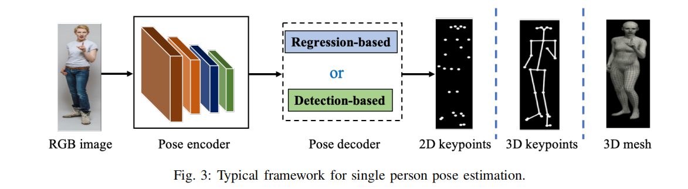

# III. MONOCULAR 2D POSE ESTIMATION 
# A 单人姿态估计

 A. Single Person Pose Estimation As shown in Fig. 3, the framework of typical single person pose estimation methods can be formulated as consisting of a pose encoder followed by a pose decoder. The pose encoder is a backbone to extract high-level features, while the pose decoder yields the 2D locations of keypoints in the regression-based manner or detection-based manner. Most of the pose encoders are based on image classification networks, such as ResNet [125], with a pre-trained model on a large-scale dataset such as ImageNet. Instead, few work designs the task-specific pose encoders. For example, the stacked hourglass network [14] exploits the skip connection layer to connect the mirror features with the same resolution. Furthermore, PoseNAS [126] exploits the Neural Architecture Search [127] to find that the task-driven searchable feature extractor blocks. It directly searches a data-oriented pose encoder with stacked searchable cells, which can provide an optimum feature extractor for the pose specific task.
A.单人姿势估计如图3所示，典型单人姿势估计方法的框架可以被表述为由姿势编码器和姿势解码器组成。姿势编码器是提取高级特征的主干，而姿势解码器以基于回归或基于检测的方式生成关键点的二维位置。大多数姿势编码器基于图像分类网络，如ResNet[125]，在大规模数据集（如ImageNet）上使用预先训练的模型。相反，很少有工作设计特定于任务的姿势编码器。例如，堆叠沙漏网络[14]利用跳过连接层以相同的分辨率连接镜像特征。此外，PoseNAS[126]利用神经架构搜索[127]来发现任务驱动的可搜索特征提取器。它通过堆叠的可搜索单元直接搜索面向数据的姿势编码器，这可以为特定姿势的任务提供最佳特征提取。

 Most of the recent works focus on the design of pose decoder, which pays more and more attention to explore the context information and the inherent characteristics of body structure. Toshev et al. [13] propose DeepPose, which is one of the first human pose estimation methods based on deep convolutional neural networks (DCNNs). With a cascade of DCNN-based pose predictors, DeepPose formulates the keypoint estimation as a regression problem. It is different from previous traditional methods like manually designed graphical models [128], [129] and part detectors [130]–[132]. Iterative Error Feedback (IEF) network [69] exploits a self-correcting regression model. It is a kind of top-down feedback to progressively change the initial keypoint predictions. Sun et al. [52] introduce the compositional pose regression, which is body structure-aware. The method in [24] solves the regression-based keypoint prediction along with human action recognition in the multi-task manner.
近年来，大多数工作都集中在姿势解码器的设计上，它越来越注重探索背景信息和身体结构的固有特征。Toshev等人[13]提出了DeepPose，这是最早的基于深度卷积神经网络（DCNNs）的人体姿势估计方法之一。通过一系列基于DCNN的姿态预测器，DeepPose将关键点估计公式化为一个回归问题。它不同于以前的传统方法，如手动设计的图形模型[128]、[129]和零件检测器[130]–[132]。迭代误差反馈（IEF）网络[69]利用自校正回归模型。这是一种自上而下的反馈，以逐步改变初始关键点预测。Sun等人[52]介绍了合成姿势回归，即身体结构感知。[24]中的方法以多任务的方式解决了基于回归的关键点预测和人类行为识别。

 Since the regression-based method directly maps the image to the coordinates of body joints, it is a non-linear problem and may fail for complex poses. Instead, the detection-based pose decoder generates heatmaps of keypoints instead of direct regression [45]. As the detection-based pose decoders are widely used in many existed methods, we will introduce them according to their design categories as following.
由于基于回归的方法直接将图像映射到身体关节的坐标，因此这是一个非线性问题，对于复杂姿势可能会失败。相反，基于检测的姿势解码器生成关键点的热图，而不是直接回归[45]。由于基于检测的姿态解码器在许多现有方法中得到了广泛的应用，我们将根据它们的设计类别介绍如下。

 ## Structural Body Model 结构化模型
 Along with the DCNN-based feature representation for the whole body, graphical models are explored to describe the structural and local parts with the spatial relationship, as illustrated in Fig. 6 (a). Tompson et al. [45] propose the convolutional network Part-Detector via a hybrid DCNN architecture. They formulate the distribution of spatial locations for body parts as an Markov Random Field-like model, which helps to remove the anatomically incorrect pose predictions. Similarly, Chen et al. [58] use DCNNs to learn conditional probabilities for the presence of body parts and their spatial relationships within image patches. Different from those works that learn pair-wise relationship from the predicted score maps, Chu et al. [46] first investigate the relationship among parts at the feature level. The proposed end-to-end learning framework captures structural information among body joints by the learnable geometrical transform kernels and a bi-directional tree-structured model. Other than relying on any assumptions about the conditional distributions of joints, Gkioxari et al. [60] propose a chained sequenceto-sequence model to sequentially predict each body part based on all previously predicted body parts. Besides, to avoid biologically implausible pose predictions, the work in [61] proposes a structure-aware network to implicitly exploit geometric constraint priors of the human body. It designs discriminators to distinguish the real poses from the fake ones by the conditional Generative Adversarial Networks (GANs). 

 除了基于DCNN的全身特征表示外，还探索了图形模型，以描述具有空间关系的结构和局部零件，如图6（a）所示。Tompson等人[45]通过一种混合DCNN架构提出了卷积网络部分检测器。他们将身体部位的空间位置分布描述为类似马尔可夫随机场的模型，这有助于消除解剖学上不正确的姿势预测。类似地，Chen等人[58]使用DCNN学习身体部位存在的条件概率及其在图像块中的空间关系。与那些从预测得分图中学习成对关系的工作不同，Chu等人[46]首先在特征层面上研究零件之间的关系。提出的端到端学习框架通过可学习的几何变换核和双向树结构模型来获取人体关节之间的结构信息。除了依赖于关于关节条件分布的任何假设之外，Gkioxari等人[60]提出了一个链式序列到序列模型，以基于之前预测的所有身体部位顺序预测每个身体部位。此外，为了避免生物学上不可信的姿势预测，[61]中的工作提出了一种结构感知网络，隐式利用人体的几何约束先验。它通过条件生成对抗网络（GANs）设计鉴别器来区分真实姿势和虚假姿势。

To further learn the compositionality of human body, Tang et al. [47] propose the deeply learned compositional model (DLCM) that has the bottom-up/top-down inference stages across multiple semantic levels. In the bottom-up stage, the higher-level parts are recursively estimated from their children, while in the top-down stage, the lower-level parts are recursively refined by their parents. Different from the previous approaches that use fully shared features for all body parts, Tang et al. [133] proposes to learn specific features for related parts. Moreover, instead of the manually defined body structure relation, they propose a data-driven approach to group related parts based on the amount of information they shared. Additionally, to deal with occlusion, ORGM [63] proposes an occlusion relational graphical model to represent the selfocclusion and object-person occlusion simultaneously, which discriminatively encodes the interactions between human body parts and objects 
为了进一步了解人体的组成性，Tang等人[47]提出了深入学习的组成模型（DLCM），该模型在多个语义层次上具有自下而上/自上而下的推理阶段。在自下而上阶段，较高级别的部分由其子级递归估计，而在自上而下阶段，较低级别的部分由其父级递归细化。与之前对所有身体部位使用完全共享特征的方法不同，Tang等人[133]建议学习相关部位的特定特征。此外，与手动定义的车身结构关系不同，他们提出了一种数据驱动的方法，根据共享的信息量对相关零件进行分组。此外，为了处理遮挡问题，ORGM[63]提出了一种遮挡关系图形模型来同时表示自遮挡和对象-人遮挡，该模型对人体部位和对象之间的交互进行了区分编码

##  Multi-stage Pipeline.
 It has been shown that multi-stage pipeline and multi-level feature fusion (illustrated in Fig. 6 (c)) are useful for capturing the details of the human body. One of the representative work is the stacked hourglass network [14], as shown in Fig. 6 (b). Each hourglass network consists of a symmetric distribution between bottom-up processing (from high resolutions to low resolutions) and top-down processing (from low resolutions to high resolutions). It uses a single pipeline with skip layers to preserve spatial information at each resolution. In conjunction with the intermediate supervision, the whole network consecutively stacks multiple hourglass modules together. It has been a solid baseline for its variants [64]– [66] with various network design optimization. Among them, Yang et al. [64] propose to insert the designed pyramid residual modules into the hourglass network, which can handle scale changes among human body parts. The work in [65] designs the Hourglass Residual Units (HRUs) to increase the receptive field of the stacked hourglass network. 
已经证明，多阶段流水线和多层次特征融合（如图6（c）所示）对于捕捉人体细节非常有用。代表性工作之一是堆叠沙漏网络[14]，如图6（b）所示。每个沙漏网络由自下而上处理（从高分辨率到低分辨率）和自上而下处理（从低分辨率到高分辨率）之间的对称分布组成。它使用带有跳过层的单一管道，以在每个分辨率下保留空间信息。结合中间监控，整个网络连续地将多个沙漏模块堆叠在一起。它一直是各种网络设计优化的变体[64]–[66]的坚实基线。其中，Yang等人[64]提出将设计的金字塔剩余模块插入沙漏网络，该网络可以处理人体各部位之间的比例变化。[65]中的工作设计了沙漏剩余单元（HRU），以增加堆叠沙漏网络的接收场。

Meanwhile, a multi-context attention mechanism is exploited to enable the representation of different granularity from local regions to global semantic consistent spaces. To exploit the structural information and multiple resolution features, the method in [134] exploits the multi-scale supervision, multi-scare regression, and structure-aware loss on the stacked hourglass framework. Besides stacked hourglass, another well-known multi-stage network Convolutional Pose Machine (CPM) [48] uses the intermediate input and supervision to learn implicit spatial models without an explicit graphical model. Its sequential multi-stage convolutional architectures increasingly refine the prediction for keypoint locations.
同时，利用多上下文注意机制实现了从局部区域到全局语义一致空间的不同粒度表示。为了利用结构信息和多分辨率特征，[134]中的方法利用了叠加沙漏框架上的多尺度监督、多尺度回归和结构感知损失。除了堆叠沙漏，另一个著名的多级网络卷积姿态机（CPM）[48]使用中间输入和监督来学习隐式空间模型，而无需显式图形模型。它的顺序多级卷积结构日益完善对关键点位置的预测。

## Pose Refinement
姿态细化增强
 Refinement for the network outputs can improve the final pose estimation performance. Fig. 6 (d) shows the framework of the common coarse-to-fine refinement pipeline. Ouyang et al. [67] build a multi-source deep model to extract non-linear representation from different information sources, including visual appearance score, appearance mixture type and deformation. Th representations of all information sources are fused for pose estimation. It can be viewed as the post-processing of pose estimation results. The work in [69] uses an iterative update module to progressively make an incremental improvement to the pose estimation. Belagiannis et al. [70] introduce a recurrent convolutional neural network to iteratively improve the performance. Lifshitz et al. [71] propose a voting scheme for optimal pose configuration where each pixel in the image votes for the optimal position of each keypoint. Besides, there are some methods that use multi-branch networks for pose refinement.
对网络输出进行细化可以提高最终的姿态估计性能。图6（d）显示了普通粗精加工管道的框架。Ouyang等人[67]建立了一个多源深度模型，从不同的信息源中提取非线性表示，包括视觉外观评分、外观混合类型和变形。融合所有信息源的Th表示进行姿态估计。可以将其视为姿态估计结果的后处理。[69]中的工作使用了一个迭代更新模块来逐步改进姿势估计。Belagiannis等人[70]引入了一种递归卷积神经网络，以迭代提高性能。Lifshitz等人[71]提出了一种最佳姿势配置投票方案，其中图像中的每个像素都投票选择每个关键点的最佳位置。此外，还有一些方法使用多分支网络进行姿势优化。

Huang et al. [72] present a coarse- fine hierarchical network consisting of multiple branches. With multi-level supervision for the multi-resolution feature maps, multiple branches are unified to predict the final keypoints. HCRN [49] is a hierarchical contextual refinement network in which keypoints of different complexities are processed at different layers. HCRN is in a single-stage pipeline by exploiting the contextual refinement unit to transfer informative context from easy joints to difficult ones. Hybrid-Pose [68] adopts a two-branch Stacked Hourglass Networks, a Refinement Network (RNet) for pose refinement, and a Correction Network (CNet) for pose correction. RNet refines the keypoint locations in each hourglass stage horizontally. CNet guides the refinement and fuses the heatmaps in a hybrid manner. Different from adding an extra network to the ahead coarse network for end-to-end training, the works in [73] and [74] apply a similar refinement strategy to take both the RGB images and the coarse predicted keypoints as input. Then the refinement network directly predicts a refined pose by jointly reasoning the input-output space. This kind of separate refinement network employs a data-driven augmentation for training and can be applied to any existing method.
Huang等人[72]提出了一个由多个分支组成的粗-细层次网络。通过对多分辨率特征图的多级监控，多个分支被统一起来预测最终的关键点。HCRN[49]是一个层次化的上下文细化网络，在该网络中，不同复杂性的关键点在不同的层上进行处理。HCRN通过利用上下文细化单元将信息上下文从简单的连接转移到困难的连接，处于单阶段管道中。混合姿势[68]采用了两个分支的堆叠沙漏网络、用于姿势细化的细化网络（RNet）和用于姿势校正的校正网络（CNet）。RNet水平细化每个沙漏阶段的关键点位置。CNet以混合方式指导细化和融合热图。[73]和[74]中的工作不同于为前端粗网络添加额外网络以进行端到端训练，它们采用了类似的细化策略，将RGB图像和粗略预测的关键点都作为输入。然后，细化网络通过联合推理输入输出空间，直接预测细化后的姿势。这种独立的细化网络采用数据驱动的增广训练，可以应用于任何现有的方法。

 Different from adding an extra network to the ahead coarse network for end-to-end training, the works in [73] and [74] apply a similar refinement strategy to take both the RGB images and the coarse predicted keypoints as input. Then the refinement network directly predicts a refined pose by jointly reasoning the input-output space. This kind of separate refinement network employs a data-driven augmentation for training and can be applied to any existing method.
[73]和[74]中的工作不同于为前端粗网络添加额外网络以进行端到端训练，它们采用了类似的细化策略，将RGB图像和粗略预测的关键点都作为输入。然后，细化网络通过联合推理输入输出空间，直接预测细化后的姿势。这种独立的细化网络采用数据驱动的增广训练，可以应用于任何现有的方法。

 ## Multi-task Learning. 
 As shown in Fig. 6 (e), by exploiting complementary information from the related tasks, multitask learning can provide extra cues for pose estimation. For example, Luvizon et al. [24] propose a multi-task framework for jointly 2D/3D pose estimation and human action recognition from video sequences. The method in [75] uses a human part parsing learner to exploit the part segmentation information and provide complementary features to assist pose estimation. The adversarial data augmentation is exploited in [76] to address the limitation of random data augmentation during network training. It also designs a reward/penalty strategy for jointly training the augmentation network and the target (pose estimation) network.

如图6（e）所示，通过利用相关任务的补充信息，多任务学习可以为姿势估计提供额外的线索。例如，Luvizon等人[24]提出了一个多任务框架，用于从视频序列中联合进行2D/3D姿势估计和人体动作识别。[75]中的方法使用人体部位解析学习者来利用部位分割信息，并提供补充特征来辅助姿势估计。[76]中利用了对抗性数据扩充，以解决网络训练期间随机数据扩充的局限性。它还设计了一个奖惩策略，用于联合训练增强网络和目标（姿势估计）网络。

 ## Improving Efficiency.
 Along with the development of model performance, how to improve the speed of a model has also attracted lots of attention. Fig. 6 (f) shows the commonly used framework for improving model efficiency, including using light-weight operator, network binarization, model distillation, etc. RafiLGK et al. [77] propose a multi-resolution light-weight network that explores low computational requirements. The Binarized neural network is first exploited in [78] to design a light-weight network with limited computational resources. Specifically, based on an exhaustive evaluation of various design choices, a hierarchical, parallel, and multi-scale residual architecture is proposed. The method in [79] investigates the combination of MobileNets and the hourglass network to design a light-weight architecture. In addition, the work in [80] presents a pose distillation (FPD) model that trains a high-speed pose network based on the idea of knowledge distillation.
提高效率。随着模型性能的发展，如何提高模型的速度也引起了人们的广泛关注。图6（f）显示了提高模型效率的常用框架，包括使用轻量级算子、网络二值化、模型蒸馏等。RafiLGK等人[77]提出了一种多分辨率轻量级网络，探索了较低的计算要求。二值化神经网络在[78]中首次被用来设计计算资源有限的轻量级网络。具体来说，基于对各种设计选择的详尽评估，提出了一种分层、并行和多尺度的剩余体系结构。[79]中的方法研究了MobileNet和沙漏网络的结合，以设计轻量级的体系结构。此外，[80]中的工作提出了一个姿势提取（FPD）模型，该模型基于知识提取的思想训练一个高速姿势网络。

 # B. Multi-person Pose Estimation
 Multi-person pose estimation needs to detect and locate the keypoints of all persons in an image, where the number of persons is unknown in advance. According to the processing paradigm, the representative methods can be sorted into two categories, i.e., top-down methods and bottom-up methods. The former is a two-stage pipeline that firstly detects all persons in an input image, then detects keypoints of each person in the detected bounding box. Differently, the bottom-up pipeline predicts all keypoints at once, then assigns these keypoints to different persons. We will introduce the representative CNNbased methods of these two categories.  
B.多人姿势估计多人姿势估计需要检测和定位图像中所有人的关键点，其中人数事先未知。根据加工范式，有代表性的方法可以分为两类，即自上而下的方法和自下而上的方法。前者是一个两级管道，首先检测输入图像中的所有人，然后在检测到的边界框中检测每个人的关键点。不同的是，自下而上的管道一次预测所有关键点，然后将这些关键点分配给不同的人。我们将介绍这两类有代表性的基于CNN的方法。

##  Top-down Methods:
This kind of methods firstly detect and crop each person in the image. Then given a cropped image patch that only contains a single person, they use single-person pose estimation models followed by post-processing, such as pose Non-Maximum-Suppression (NMS) [81], to predict the final keypoint outputs of each person. Theoretically, the single person methods introduced in Section III.A can be applied after cropping the image patch. However, compared with the single person case, multi-person scenes have to deal with truncation, environmental occlusion, person-person occlusion, and small targets. Therefore, the representative top-down methods not only focus on designing networks by digging the potential of CNN and exploring rich context information fusion or exchange, but also pay attention to complex scenes.

4） 自上而下的方法：这种方法首先检测并裁剪图像中的每个人。然后，给定一个只包含一个人的裁剪图像块，他们使用单人姿势估计模型，然后进行后处理，如姿势非最大抑制（NMS）[81]，以预测每个人的最终关键点输出。理论上，第III.A节中介绍的单人方法可以在裁剪图像块后应用。然而，与单人场景相比，多人场景需要处理截断、环境遮挡、人物遮挡和小目标。因此，有代表性的自上而下的方法不仅注重挖掘CNN的潜力，探索丰富的上下文信息融合或交换来设计网络，还注重复杂场景。

 ## Two Stage Pipeline.
 Papandreou et al. [81] propose one of the first deep learning-based two-stage top-down pipeline, named G-RMI, which achieves the state-of-art results on the challenging COCO 2016 keypoints task. They use the Faster RCNN detector to detect each person, then exploit a fully convolutional ResNet [125] to jointly predict the keypoint’s dense heatmaps and offsets. They also introduce the keypointbased NMS instead of the box-level NMS to improve the keypoint confidence. Furthermore, as in Fig. 7 (a), Xiao et al. [16] provide a simple and effective model that consists of a ResNet backbone and three deconvolution layers to increase the spatial resolution. It shows that a well-designed simple top-down model can achieve surprisingly effective.
两级管道。Papandreou等人[81]提出了第一个基于深度学习的两阶段自上而下的管道，名为G-RMI，它在具有挑战性的COCO 2016关键点任务中取得了最先进的成果。他们使用更快的RCNN检测器来检测每个人，然后利用完全卷积的ResNet[125]来联合预测关键点的密集热图和偏移。他们还引入了基于关键点的NMS，而不是盒子级NMS，以提高关键点的可信度。此外，如图7（a）所示，肖等人[16]提供了一个简单有效的模型，该模型由一个ResNet主干和三个反卷积层组成，以提高空间分辨率。它表明，一个设计良好的简单自上而下的模型可以取得令人惊讶的效果。

 ## Multi-task Learning. 
 By sharing features between related tasks of pose estimation, multi-task learning can provide better feature representations for pose estimation. For example, MaskRCNN [23] can detect person bounding boxes, then crops the feature map of the corresponding proposal to predict human keypoints. Since human keypoints and human semantic parts are related and complementary, many works [83]–[85] design multi-task networks to jointly predict the keypoints and segment the semantic parts. Besides, ZoomNet [82] unifies the human body pose estimator, hand/face detectors, and hand/face pose estimators into a single network. The network first localizes the body keypoints, then zooming in the hands/face regions to predict those keypoints with higher resolutions. It can handle the scale variance among different human parts. by Moreover, to deal with the lack of the whole-body data, the COCO WholeBody dataset is proposed by extending the COCO dataset with whole-body annotations 
通过在姿态估计相关任务之间共享特征，多任务学习可以为姿态估计提供更好的特征表示。例如，MaskRCNN[23]可以检测人员边界框，然后裁剪相应提议的特征图，以预测人类关键点。由于人类关键点和人类语义部分是相互关联和互补的，许多著作[83]–[85]设计了多任务网络来联合预测关键点并分割语义部分。此外，ZoomNet[82]将人体姿势估计器、手/脸检测器和手/脸姿势估计器统一到一个网络中。该网络首先定位身体关键点，然后放大手/脸区域，以预测具有更高分辨率的关键点。它可以处理人体不同部位之间的尺度差异。此外，为了解决全身数据的不足，通过对COCO数据集进行全身注释扩展，提出了COCO全身数据集.

 ## Multi-stage or Multi-branch Fusion.
 Multi-stage or multibranch fusion strategy is developed to break the bottleneck of a single model. The work in [17] proposes a Cascade Pyramid Network (CPN), as shown in Fig. 7 (b), which consists of a global network and a refining network to progressively refine the keypoint prediction. It also proposes an online hard keypoints mining (OHKM) loss to deal with hard keypoints. CPN achieves the 1st place in the COCO 2017 keypoint challenge. The work in [86] improves CPN by introducing the channel shuffle module and the spatial channel-wise attention residual bottleneck to boost the original model. MSPN [87], the winner of the COCO 2018 keypoint challenge, extends CPN in the multi-stage pipeline. It uses the global network of CPN as each single-stage module, fuses features from different stages by the cross-stage feature aggregation, and supervises the whole network via the coarse-to-fine loss functions. HRNet [18], shown in Fig. 7 (c), points out that the high-resolution representation is important for hard keypiont detection. HRNet maintains the high-resolution representations through the whole network, and gradually adds high-to-low resolution sub-networks to form multi-resolution features. It has been a solid and superior model for pose estimation and many other computer vision tasks. Furthermore, to consider the keypoints’ relationship and refine the rough predictions, Graph-PCNN [89] proposes a graph pose refinement module Via a model-agnostic two-stage framework. The work [88] of the 1st place of COCO Keypoint Challenge 2019 utilizes a multi-stage pipeline with Residual Steps Network (RSN) modules to aggregate intra-level features. With the delicate local representations obtained from RSN, a Pose Refine Machine (PRM) module is proposed to further balance the local/global representations and refine the output keypoints. The resulting architecture establishes the new state of the art on the COCO dataset and MPII dataset.

 Dealing with Complex Scenes: In real-world applications, crowded, occlusion, and truncation scenes are unavoidable. To remove the effect of inaccurate person detection, RMPE [90] designs a symmetric spatial transformer network to detect every person, a parametric pose NMS to filter out the redundant pose, and a pose-guided human proposal generator to enhance the network capacity for multi-person pose estimation. To tackle the problem in crowded scenes, Li et al. [91] firstly obtain joint candidates in each cropped bounding box, then solve the joint association problem in a graph model. They also collect a crowded human pose estimation dataset named CrowdPose, and define the Crowd Index to measure the crowding level of an image. The work in [135] investigates the problem of pose estimation in crowded and occlusion surveillance scenes. It proposes to add an extra network branch to detect occluded keypoints. Besides, OASNet [92] exploits the Siamese network with an attention mechanism to remove the occlusion-aware ambiguities and reconstruct the occlusion-free features. To enlarge the training set for challenging cases, Bin et al. [93] propose to augment images by combing segmented body parts to simulate challenging examples. A generative network is utilized to dynamically adjust the augmentation parameters and produce the most confusing training samples.

 ## 2) Bottom-up Methods:
 3) Different from top-down methods that rely on the human detector, bottom-up methods directly predict all keypoints in the image, then group keypoint candidates into each person. Besides the network design for more accurate keypoint detection, how to encode the connection information between keypoints is the core for grouping keypoints to different people. In the early stage, DeepCut [15] predicts all keypoints by Fast-RCNN [136] and formulates the keypoint assignment problem as an integer linear programming (ILP). DeeperCut [94] improves DeepCut by introducing a stronger part detector. Besides, it proposes an image-conditioned pair-wise term that explores keypoint geometric and appearance constraints. However, ILP is still a time-consuming NP-hard problem. Differently, recent works exploit the learnable association strategies for keypoint grouping, such as Part Affinity Fields [41], Associative Embedding [42], and their variants. We will further introduce them in detail.

 Part Affinity Fields. The most popular bottom-up pose estimation method OpenPose [41] proposes to jointly learn keypoint locations and their association by the Part Affinity Fields (PAFs). As shown in Fig. 5(c), PAF encodes the location and orientation of limbs by a set of 2D vector fields. The direction of PAF points from one part of the limb to the other. Then multiperson association performs the bipartite matching to associate keypoint candidates using PAFs. Via a two-branch and multistage architecture, as shown in Fig. 8(a), OpenPose achieves real-time performance independent of the people number in the image. The idea of PAF is further explored by [95]–[97]. In PifPaf net [95], the PAF is used to associate body parts. In addition, the Part Intensity Field (PIF) is designed to localize body parts. PIF and PAF are jointly produced along with the utilization of Laplace loss to deal with the low-resolution and occluded scenes. Moreover, Hidalgo et al. [96] propose the first single-network approach for whole-body multi-person pose estimation, which simultaneously locates the body, face, hands, and feet keypoints in an image. The work in [97] designs a body part-aware PAF to encode the connection between keypoints, and improves the stacked hourglass network with attention mechanisms and a focal L2 loss.

 Associative Embedding. This associative embedding is a kind of detection and grouping method, which detects keypoints and group them into persons with embedding features or tags Newell et al. [42] propose to generates the keypoint heatmaps and their embedding tags for multi-person pose estimation. As shown in Fig. 8 (b), for each joint of the body, the network produces detection heatmaps and predicts associative embedding tags at the same time. They take the top detections for each joint, and match them to other detections which share the same embedding tag, to produce a final set of individual pose predictions. Associative Embedding is also used by HigherHRNet [98], which learns scale-aware representations from high-resolution feature pyramids. Exploiting the aggregated features from HRNet [18], and the up-sampled higher-resolution features through a transposed convolution, HigherHRNet well handles the scale variation and achieves the new state-of-theart for bottom-up pose estimation. For other embedding-based keypoint assignment strategies, Nie et al. [99] propose a Pose Partition Network (PPN) that uses the centroid embedding for all keypoint candidates. [100] introduces the Structured Pose Representation (SPR). It exploits the root joints to indicate different people and encodes the positions of keypoints into their displacements w.r.t. the corresponding root. 
 Multi-task Learning. Besides pose estimation alone, MultiPoseNet [27] proposes a multi-task model that can jointly handle person detection, keypoint detection, and person segmentation. MultiPoseNet proposes a Pose Residual Network (PRN) to assign the predicted keypoints and the detected person bounding boxes by measuring their locations’ similarity. PersonLab [26] is also a multi-task network that jointly predicts keypoint heatmaps and person segmentation maps. In PersonLab, short-range offsets and mid-range pairwise offsets are used to group human keypoints. Meanwhile, long-range offsets and the human pose detections are used to distinguish person segmentation masks.

 # C. 2D Pose Estimation in Videos
 With the development of image-based pose estimation methods, 2D pose estimation in videos has also been boosted by DCNNs. Different from image-based pose estimation, video pose estimation must consider the temporal relation across frames to remove the motion blur and geometric inconsistency. Therefore, directly applying the existing image-based pose estimation methods on videos may produce sub-optimal results. In this part, we can classify the single/multi person(s) pose estimation methods in videos according to how do they exploit the spatio-temporal information.
随着基于图像的姿态估计方法的发展，DCNNs也促进了视频中的二维姿态估计。不同于基于图像的姿态估计，视频姿态估计必须考虑帧间的时间关系，以消除运动模糊和几何不一致性。**因此，直接将现有的基于图像的姿势估计方法应用于视频可能会产生次优结果**。在这一部分中，我们可以根据视频中单人/多人姿势估计方法如何利用时空信息进行分类。

 ## 1) Single Person Pose Estimation in Videos
For single person pose estimation in videos, most works explore to propagate temporal clues across frames for refining the single frame pose results. As one of the first works for deep learning based pose estimation in videos [101], Pfister et al. exploits temporal information by inserting multiple frames into the data colour channels to replace the three-channel RGB image input in an image-based network. The following works further explore the temporal propagation in four main categories, i.e., action recognition task for mutual learning, temporal propagation by optical flow-based model, sequence model, and distillation model.
1） 视频中的单人姿势估计：对于视频中的单人姿势估计，大多数工作探索跨帧传播时间线索，以细化单帧姿势结果。作为视频中基于深度学习的姿势估计的首批工作之一[101]，Pfister等人利用时间信息，将多个帧插入数据颜色通道，以替换基于图像的网络中输入的三通道RGB图像。接下来的工作从四个主要类别，即用于相互学习的动作识别任务、基于光流的时间传播模型、序列模型和蒸馏模型，进一步探讨了时间传播。

 ### Pose Estimation with Pose Estimation with Action Recognition. 
 Nie et al. [102] propose a spatial-temporal And-Or Graph (ST-AOG) model to combine video pose estimation with action recognition. By adding additional activity recognition branches based on optical flow and appearance features, the two tasks mutually benefit from each other. Furthermore, instead of an additional action recognition branch, the work in [103] shows that the action prediction can be achieved by incorporating activity priors using an action conditioned pictorial structure model. 
利用姿势估计和动作识别的姿势估计。Nie等人[102]提出了一种时空与或图（ST-AOG）模型，将视频姿势估计与动作识别相结合。通过添加基于光流和外观特征的额外活动识别分支，这两项任务可以相互受益。此外，文献[103]中的工作表明，可以通过使用动作条件下的图形结构模型结合活动优先级来实现动作预测，而不是额外的动作识别分支。

 ### Optical Flow-based Feature Propagation. 
 Pfister et al. [105] propose SpatialNet that temporally warps the neighboring frame heatmaps to the current frame through optical flow. Afater that, they also exploit a parametric pooling layer to combine the aligned heatmaps into a pooled confidence heatmap. The work in [106] proposes a personalized ConvNet pose estimator, which can propagate high-quality automatic pose annotations throughout the video by spatial image matching and optical flow propagation. The propagated new annotations are used to fine-tune the generic ConvNet pose estimator. In Thin-Slicing [104], Song et al. propose to propagate keypoints by computing dense optical flow between neighboring frames. They conduct a flow-based warping layer to align previous heatmaps to the current frame, followed by a spatio-temporal inference layer. The spatial-temporal propagation utilizes the iterative message passing of the pose configuration graph with both spatial and temporal relationships edges.
Pfister等人[105]提出了一种时空网络，它通过光流将相邻帧的热图临时扭曲到当前帧。之后，他们还利用一个参数池层将对齐的热图组合成一个池信任热图。[106]中的工作提出了一种个性化的ConvNet姿势估计器，它可以通过空间图像匹配和光流传播在整个视频中传播高质量的自动姿势注释。传播的新注释用于微调通用ConvNet姿势估计器。在薄切片[104]中，Song等人提出通过计算相邻帧之间的密集光流来传播关键点。它们执行基于流的扭曲层，将之前的热图与当前帧对齐，然后是时空推断层。时空传播利用具有空间和时间关系的姿势配置图的迭代消息传递。

 ### Sequence Model-based Feature Propagation. 
 In the Chained Model [60], Gkioxari1 et al. adopt the sequence-tosequence recurrent model to solve the structured pose prediction in videos. In the recurrent model, the prediction of each body keypoint relies on all previously predicted keypoints. In LSTM Pose Machine [107], Luo et al. explore to capture temporal dependency in videos by memory augmented LSTM framework. Given a frame, the Encoder-RNN-Decoder pipelines [60], [107] firstly learn high-level image representations by an encoder, then propagate temporal information and produce hidden states by RNN units. They finally predict keypoints of the current frame by a decoder which takes hidden states as input. A similar concept is adopted by UniPose-LSTM [108], which exploits an LSTM module to propagate previous heatmaps generated by the multi-resolution Atrous Spatial Pooling architecture in the UniPose network.
在链式模型[60]中，Gkioxari1等人采用序列到序列的递归模型来解决视频中的结构化姿势预测问题。在递归模型中，每个身体关键点的预测依赖于所有之前预测的关键点。在LSTM姿势机[107]中，Luo等人探索了通过记忆增强的LSTM框架捕捉视频中的时间依赖性。给定一帧，编码器RNN解码器管道[60]、[107]首先通过编码器学习高级图像表示，然后通过RNN单元传播时间信息并产生隐藏状态。他们最终通过解码器预测当前帧的关键点，解码器将隐藏状态作为输入。UniPose LSTM[108]采用了类似的概念，它利用LSTM模块传播UniPose网络中多分辨率Atrus空间池架构生成的先前热图。

 ### Distillation Model. 
 Different from optical flow or sequential RNN that requires a large network, Nie et al. [109] introduce a Dynamic Kernel Distillation (DKD) model to transfer pose knowledge in a one-shot feed-forward manner. Specifically, the small network DKD exploits a temporally adversarial training strategy via a discriminator to generate temporally coherent pose kernels and predict keypoints in videos.
蒸馏模型。与需要大网络的光流或顺序RNN不同，Nie等人[109]引入了一个动态核蒸馏（DKD）模型，以一次性前馈方式传递姿势知识。具体来说，小型网络DKD通过鉴别器利用一种临时对抗性训练策略来生成临时一致的姿势核，并预测视频中的关键点。

## 2) Multi-Person Pose Estimation and Tracking in Videos: 
Multi-person pose estimation in videos has to deal with identifying and locating keypoints in the case of multi-person occlusion, motion blur, pose and appearance variations. To exploit temporal clues, multi-person pose estimation is usually associated with articulated tracking. PoesTrack dataset [118], [137] is the first large-scale and in-the-wild multi-person dataset for pose estimation and tracking, which contains hundreds of videos with more than 150K poses. With the boom of datasets, the mainstream solutions for this task can be sorted into topdown methods and bottom-up methods. 
视频中的多人姿势估计需要在多人遮挡、运动模糊、姿势和外观变化的情况下识别和定位关键点。为了利用时间线索，多人姿态估计通常与关节跟踪相关联。PoesTrack数据集[118]，[137]是第一个用于姿势估计和跟踪的大规模、野外多人数据集，其中包含数百个姿势超过150K的视频。随着数据集的繁荣，这项任务的主流解决方案可以分为自上而下方法和自下而上方法。

### Top-down Methods. 
The top-down method Top-down Methods. The top-down methods follow the tracking-by-detection paradigm. They first detect persons and keypoints in each frame, then propagate the bounding boxes or keypoints across frames. For example, 3D Mask R-CNN is proposed in Detect-and-Track [110] to employ fully 3D convolutional networks to detect keypoints of each person in a video clip. Then a keypoint tracker is used to link the predictions by comparing the distances of the detected bounding boxes.
自上而下的方法。自上而下的方法自上而下的方法。自上而下的方法遵循检测跟踪范式。它们首先检测每个帧中的人物和关键点，然后在帧之间传播边界框或关键点。例如，3D Mask R-CNN在Detect and Track[110]中提出，利用全3D卷积网络来检测视频剪辑中每个人的关键点。然后使用关键点跟踪器通过比较检测到的边界框的距离来链接预测。

Moreover, the clip-based tracker is further exploited in [111], which extends HRNet via carefully designed 3D convolutional layers to learn the temporal correspondence between keypoints. Next, a spatio-temporal merging procedure is designed to estimate the optimal keypoint outputs by spatial and temporal smoothing. By combining the clip tracking network and the merging procedure, the model in [111] can well handle failure detections in complex scenes with severe occlusion and highly entangled people.
此外，在[111]中进一步利用了基于剪辑的跟踪器，该跟踪器通过精心设计的3D卷积层扩展了HRNet，以了解关键点之间的时间对应关系。接下来，设计了一个时空合并过程，通过时空平滑来估计最佳关键点输出。[111]中的模型结合了剪辑跟踪网络和合并过程，能够很好地处理复杂场景中的故障检测，这些场景具有严重的遮挡和高度纠缠的人。

 Different from clip-based detection, the work in [16] independently builds on the single-frame detection and exploits the optical flow-based temporal pose similarity to associate keypoints across different frames. To cope with missing detection in a single frame, PGPT [114] proposes to combine an image-based detector with an online person location predictor to compensate for the missing bounding boxes. Meanwhile, PGPT introduces a hierarchical pose-guided graph convolutional network that exploits the human structural relations to boost the person representation and data association. For efficient data association, the work in POINet [116] explores a pose-guided ovonic insight network to learn feature extraction, similarity metric, and identity assignment in an unified end-to-end network. 
 与基于剪辑的检测不同，[16]中的工作独立地建立在单帧检测的基础上，并利用基于光流的时间姿势相似性来关联不同帧中的关键点。为了应对单个帧中的缺失检测，PGPT[114]提出将基于图像的检测器与在线人员位置预测器相结合，以补偿缺失的边界框。同时，PGPT引入了一个层次化的姿势引导图卷积网络，该网络利用人的结构关系来增强人的表示和数据关联。为了实现高效的数据关联，POINet[116]中的工作探索了一种姿势引导的ovonic insight网络，以在统一的端到端网络中学习特征提取、相似性度量和身份分配。

In another work for learnable similarity metric [117], temporal keypoint matching and keypoint refinement are designed for keypoints association and pose correction, respectively. They are both learnable and incorporated into a pose estimation network. The work in [115] proposes the self-supervised keypoint correspondences that cannot only recover missing pose detections, but also associate detected and recovered poses across frames. Different from using high-dimensional image representation to track people, KeyTrack [113] presents a transformer-based tracker that only relies on 15 keypoints. The Transformer-based network exploits a binary classification to predict whether one pose temporally follows another.

在可学习相似性度量的另一项工作[117]中，时间关键点匹配和关键点细化分别用于关键点关联和姿势校正。它们都是可学习的，并被整合到姿势估计网络中。[115]中的工作提出了自监督关键点对应，它不仅可以恢复丢失的姿势检测，还可以跨帧关联检测到的和恢复的姿势。与使用高维图像表示来跟踪人不同，KeyTrack[113]提出了一种基于变压器的跟踪器，它只依赖于15个关键点。基于变压器的网络利用二元分类来预测一个姿势是否在时间上跟随另一个姿势。

 Bottom-up Methods. This kind of methods commonly use the single frame pose estimation to predict all keypoints in each frame, then assign keypoints across frames in a spatio-temporal optimization manner. For example, the graph partitioning based methods in [118], [119], [137] firstly extend the image-level bottom-up multi-person pose estimation [15], [41]. Then they build a spatio-temporal graph that connects keypoint candidates spatially as well as temporally, which can be formulated into an linear programming problem. However, the spatial and temporal graph partitioning usually leads to heavy computation and nononline solution. Diffrerently, PoseFlow [112] exploits a pose flow that measures the pose distance in different frames to track the same person. Inspired by the spatial Part Affinity Field in OpenPose [41], the works in [120]–[123] exploit Temporal Flow Fields to indicate the propagating direction of keypoints in different frames. Associative Embedding [42], which is used in the image-based bottom-up keypoint association strategy, is also extended in [124] to build the spatio-temporal embedding. It associates keypoints with embedding features for temporal consistency.

自下而上的方法。这类方法通常使用单帧姿态估计来预测每帧中的所有关键点，然后以时空优化的方式跨帧分配关键点。例如，[118]、[119]、[137]中基于图分割的方法首先扩展了图像级自底向上的多人姿势估计[15]、[41]。然后，他们建立了一个时空图，将关键点候选点在空间和时间上连接起来，可以将其表述为一个线性规划问题。然而，图的时空划分通常会导致大量计算和非在线求解。不同的是，PoseFlow[112]利用了一种姿势流，可以测量不同帧中的姿势距离来跟踪同一个人。受OpenPose[41]中空间部分亲和场的启发，[120]–[123]中的作品利用时间流场来指示不同帧中关键点的传播方向。在基于图像的自底向上关键点关联策略中使用的关联嵌入[42]，在[124]中也进行了扩展，以构建时空嵌入。它将关键点与嵌入特征相关联，以实现时间一致性。

 In summary, the development of 2D pose estimation has been greatly boosted by the design of CNN-based networks with the aid of body part structural relationship, multi-stage pipeline, multi-level feature fusion, pose refinement, multi-task learning, and efficiency-aware design. In the multi-person case, an excellent top-down method relies on an accurate detection network and a solid single person pose estimation network. As for the bottom-up methods, the most important part is how to group the detected keypoints to different people. In the videolevel pose estimation and tracking, the representative researches focuse on how to efficiently propagate the spatio-temporal information to guarantee the consistency and smoothness of the predictions.

总之，借助于身体部位结构关系、多阶段流水线、多层次特征融合、姿势细化、多任务学习和效率感知设计，基于CNN的网络设计极大地推动了二维姿势估计的发展。在多人情况下，优秀的自顶向下方法依赖于精确的检测网络和可靠的单人姿势估计网络。对于自底向上的方法，最重要的部分是如何将检测到的关键点分组给不同的人。在视频级姿态估计与跟踪中，有代表性的研究集中在如何有效地传播时空信息以保证预测的一致性和平滑性。

