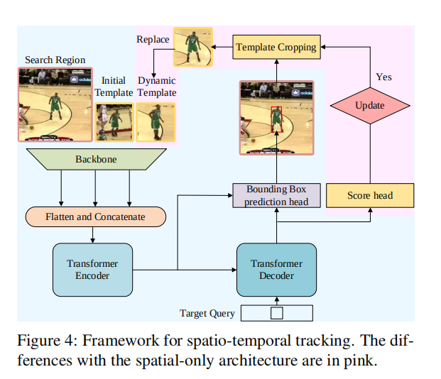
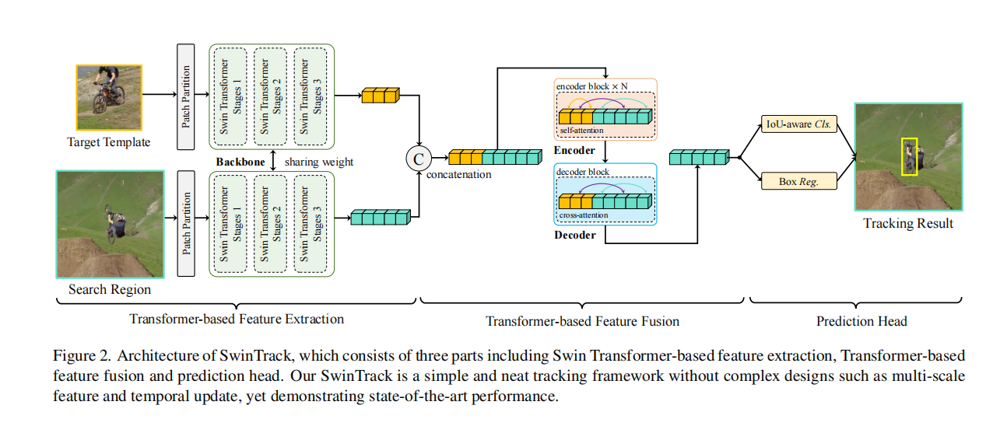
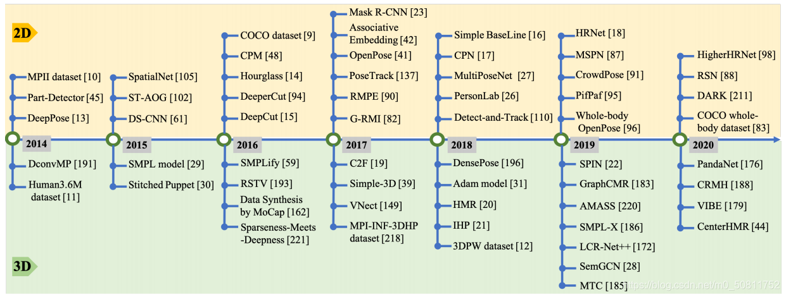
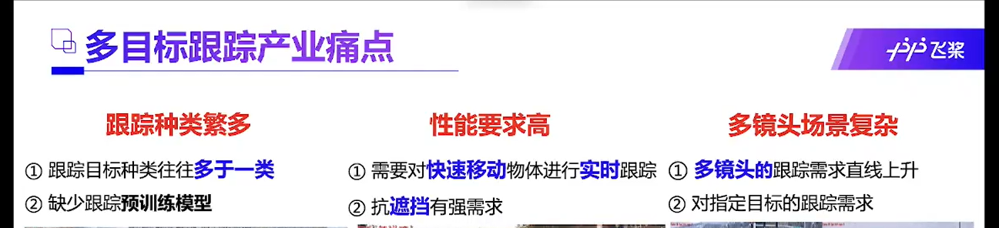
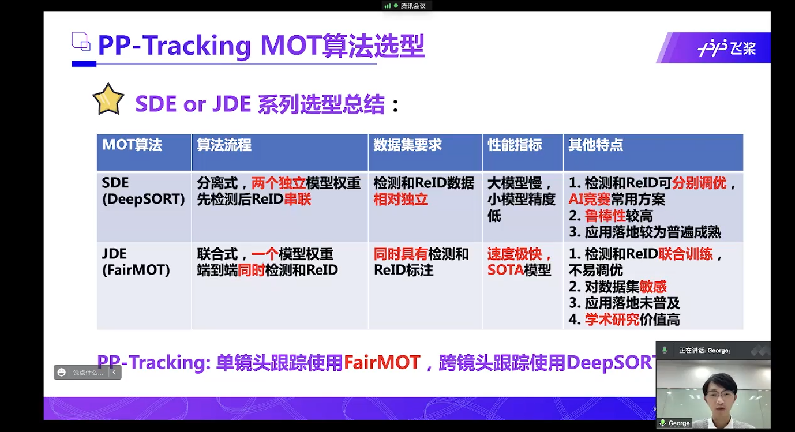
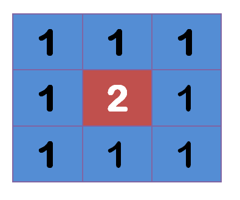
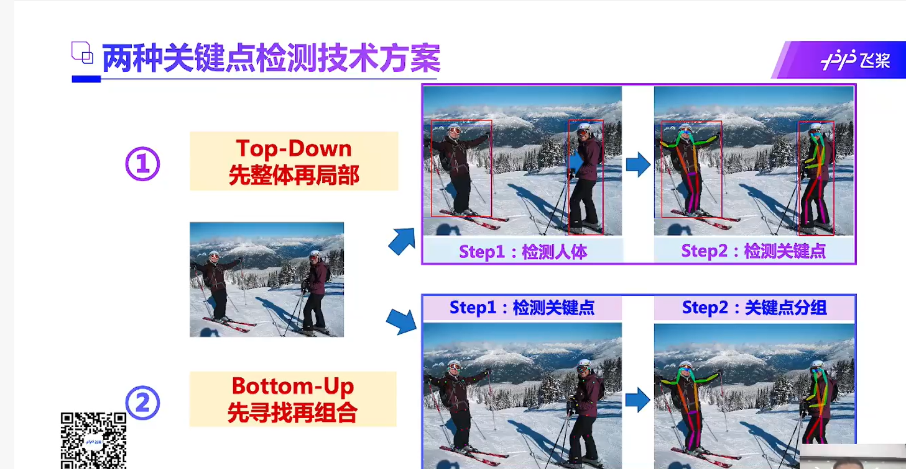

# 基本原则：
 1、不可能自己想出什么新的模型，基本上都是用现有的
 2、寻求大神的帮助是必须的
 
# 研究目标和内容，需求审视，非算法方面的更大层面的设计，优化 
## 视频跟踪技术
一开始想的是视频动态贴纸，实际上视频动态贴纸更本质的技术 就是视频跟踪，在现在的手机视频编辑APP上，视频跟踪功能他们没怎么做，实际上在电脑端软件这是一个很大的功能。
总结一下：
1. 视频跟踪是视频编辑里面很大的一项功能，只是现在的手机APP没做而已。
2. 跟踪之后不只是可以用来贴图，还有很多其它的操作可以做，比如各种P图操作都可以用上去，比如绘图，文字，扭曲这些灯等等。
3. 跟踪过程中可以发挥想象接入更多的用户操作来提升跟踪效果。
4、既然专注于跟踪式贴图，对于视频，那么是可以加入预处理的，这样对实时性要求就更低了，这方面还有专门的离线追踪的算法，现在没时间研究了

需要一个数据，用户手机里面的视频时长，目前估计对于用户的绝大多数视频，应该可以增加双倍的时间

# 应用

## 活动识别
跟踪身体姿势随时间的变化也可用于活动，手势和步态识别。这些用例是：

用于检测人是否摔倒或生病的应用程序。

可以自主地教授正确的运动机制，运动技术和舞蹈活动的应用。

可以理解全身手语的应用（例如：机场跑道信号，交警信号等）。

可以增强监控的安全性和应用程序。

跟踪一个人的步态对于安全和监视区域非常有用
## 动作捕捉和增强现实

CGI应用程序是一种有趣的应用程序类型，它也利用了人体姿势估计。如果您可以估计一个人的姿势，您可以在人物上叠加图形，样式，设备和艺术品。通过跟踪这种人体姿势的变化，渲染的图形可以在人移动时“自然地适应”。

Animoji就是一个很好的例子。虽然上述研究仅追踪了脸部的结构，但这种想法可以扩展到人类的关键跟踪。相同的概念也可用于渲染模仿人体运动的增强现实（AR）元素。

## 虚拟人技术
通过人来控制的虚拟人需要这个

 
### 视频动态贴纸
视频动态贴纸目前用得最多的就是抖音 或者 很多直播里面的那种贴纸，比如一个墨镜贴纸，视频中人运动，然后
墨镜贴纸跟随人的眼睛在视频中运动

但是看到目前的动态贴纸基本上只实现了单人大头的效果，对于多人的情景不能区分不同的人

所以想实现的是，能够对多人，复杂运动情景下的，针对人的那种动态贴纸

## 其它应用
低算力平台上部署
军事上 跟踪特定目标人物
安防领域：跟踪特定目标，低算力平台，危险人物，走失人物
运动：各种运动分析

## 研究目标：
实时的单人追踪和姿势检测

# 现有技术分析对比 

## 现有姿势追踪算法:
目前很少有研究单人姿势追踪的，LightTrack论文提供了相应的算法，我们会超过它很多
研究多集中于多人姿势追踪，而多人姿势追踪目前运行速度很慢，不具备边缘设备上实时运行的能力
还有一类算法，提供单人姿势检测，但是无法实现追踪效果，画面出现其它人就会导致姿态检测检测到其它人身上去了

## 单目标追踪算法:
1、不能满足同时追踪用户姿势的需求
2、没有针对人体优化，效果较差
3、实时性，现在是有很多已经实现了的，典型的mediapipe的相关算法，目前排名第二的 stark 轻量版 3090测试不算前后处理单帧耗时 17ms

## 目标追踪算法:
多目标追踪算法，运行速度很慢，不具备边缘设备上实时运行的能力

## 市场上成熟产品
google的mediapipe库提供人体姿势和关键点检测，但是它这个似乎没有追踪功能（当然也不能指定检测的人）

目前测试的效果就是多人情况下很容易丢失，比如人脸消失，人被挡住等，很容易就切换到其它人身上去了。

我们需要实现最终的效果是可以追踪的那种

# 参考文献和实现方法
## 单目标跟踪
### 单目标跟踪排行：
https://paperswithcode.com/sota/visual-object-tracking-on-lasot

https://paperswithcode.com/sota/visual-object-tracking-on-vot201718

### 最新论文sota
2021年的单目标跟踪综述
https://www.arocmag.com/article/02-2021-10-003.html

目前排名第二的论文-主要是cnn和transformer结合的
https://paperswithcode.com/paper/learning-spatio-temporal-transformer-for
主要实现思路，相比如传统的单目标追踪，增加了一个时空信息网络，将目标图像和搜索区域图像，时空信息网络获取的数据，一起送入cnn的backbone，然后拼接backbone输出的特征，输入transformer，再从transformer输出的特征中利用fcn预测目标框。

这篇论文的作者在github还提供了轻量版的设计，在使用ONNXRUNTIME来进一步加速推理，加速后的STARK-Lightning在RTX TITAN上的运行速度可达200+ FPS 

2021.12.2 出的最新的sota,基于纯transformer架构
https://arxiv.org/abs/2112.00995

这个大概就是使用swin-transformer结构的多头只注意力堆叠的网络提取特征，然后使用transformer来融合特征，最后预测

2021多目标跟踪上实现了大步前进的sota，可能有借鉴意义
https://arxiv.org/abs/2110.06864
 
 
 
## 单人目标跟踪
找到一篇这样的文章了
http://guanghan.info/projects/LightTrack/
展示没有找到相关的论文

## 多人目标跟踪
https://arxiv.org/pdf/2112.04477.pdf
2021.12出的多人目标跟踪sota，它的思路和一般的多目标跟踪类似，但是结合了人类的特征，具体的说
先利用人体分割网络分割出人体，然后用3D相关的网络提取人体的3D位置，3D关键点，3D外貌，然后根据上述3种对象的多帧的状态，预测未来若干帧的状态，然后与当前帧中提取的位置，关键点，外貌等进行对比，利用一些贝叶斯概率之类的计算，判断它们是否属于同一个人，从而实现跟踪。

## 人体关键点检测
BlazePose 专门为移动端优化了人体姿势检测，能够在移动端实时检测单人姿势
会先检测人脸，然后根据人脸推断整个人体为范围，然后人体关键点，没有人脸的情况下怎么检测似乎没看到，实际效果是能检测的
然后没有重新识别的机制的，只是简单的在相邻区域寻找人脸（人体），如果出现遮挡或者另一个人靠近就容易出现丢失。

论文总结

拟采用人体关键点检测，采用google开源的mediapipe库
https://google.github.io/mediapipe/solutions/holistic

## 综合检测  多任务学习
https://google.github.io/mediapipe/solutions/holistic.html
MediaPipe的Hostlic检测流程是，用BlazePose先检测姿势，然后根据姿势判断和预测人手，人脸的区域，然后把该区域的图像裁剪下来检测人脸人手的关键点。
这个Hostlic是基于BlazePose，所以同样是没有重新识别的机制的，只是简单的在相邻区域寻找人体，如果出现遮挡或者另一个人靠近就容易出现丢失。

Whole-body human pose estimation in the wild 全身关键点估计，还提供了数据集
将人体姿势估计器、手/脸检测器和手/脸姿势估计器统一到一个网络中。该网络首先定位身体关键点，然后放大手/脸区域，以预测具有更高分辨率的关键点。

## 整体流程
单目标人体跟踪-根据检测到的目标框调用mediapipe的hostlic算法-根据算法给出的关键点实现动态贴纸

## 姿势追踪
现有的方法通常连续进行人体检测、姿态估计和跟踪这几个阶段，其中姿态跟踪被视为一个离线的二分图匹配问题。 [LightTrack]
LightTrack 的方法流程
详见 

## 身份关联
身份关联要解决的问题：
检测算法的漏检，误检
运动模糊也是漏检的原因

DetTrack中的通过前后传递检测框避免漏检

High-Speed Multi-person Tracking Method Using Bipartite Matching 2022 这篇文章也提到用线性回归预测姿势

First, linear regression is used to estimate the movement of a pose root point, allowing the tracker to better preserve identity recognition despite missing detections.

UniTrack 关联 使用特定的一个计算公式
### ByteTracker 
低检测分数的物体，例如被遮挡的物体，被简单地丢弃，这导致不可忽略的真实物体丢失和碎片轨迹。为了解决这一问题，我们提出了一种简单、有效、通用的关联方法，即通过关联每个检测框而不是高分检测框进行跟踪。对于分数较低的检测框，我们利用它们与小轨迹的相似性来恢复真实目标，并过滤掉背景检测。
流程
（1）分两类：高分框+低分框

（2）第一次先用高分框和之前的轨迹匹配

（3）第二次用低分框与第一次没有匹配上的高分框的跟踪轨迹进行匹配

（4）对于没有匹配上轨迹的高分框，建立一个新的跟踪轨迹。对于没有匹配检测框的跟踪轨迹，保留30帧，以便于后面再次匹配

此外，我们删除了非常短的轨迹（<5帧）和微小的边界框（W）∗ H<3200），因为它们通常捕捉到背景中未注释的小人物。

（i）将每个边界框沿两个维度放大25%；

传播关键帧人体框避免了漏检问题

比较姿势之间的相似度，用的是标准的OKS算法
### StrongSORT 2022 在部分指标上超过ByteTrack的算法
跟踪里面有两个经典的分支，外观分支和轨迹分支
这个文章在DeepSort基础上改进了这个分支
采用一个更强的外观特征提取器B o T BoTBoT来代替原来的简单CNN。以ResNeSt50为骨干，对DukeMTMCreID数据集进行预训练，可以提取出更多的鉴别特征。此外，用JDE中提出的特征更新策略替换特征集合，该策略以指数移动平均(EMA)的方式更新第t  帧的第i 条轨迹的外观状态 

对于运动分支，我们采用ECC进行摄像机运动补偿。此外，vanilla Kalman fifilter是不健壮的，忽略了检测噪声尺度上的信息。为了解决这一问题，我们借用了中的NSA卡尔曼算法在我上一篇博客上的GIAOTracker也使用了NSA，提出了一个自适应计算噪声协方差 
​ 此外，我们没有在匹配过程中只使用外观特征距离，而是同时解决了使用外观和运动信息的分配问题。 成本矩阵C CC是外观成本  和运动成本  的加权和 
### 基于以上，目前三个思路
### - 运动轨迹相似度关联，
这个应该是最重要的，尤其轻量化检测模型会有很多漏检误检等
使用卡尔曼滤波，卡尔曼滤波主要在匀速直线上，那么可以使用图神经网络或者简单的FCN预测方向
轨迹匹配应该参考byteTrack，这个论文在这方面做得比较全了。
注意主要是要预测人体框，不是单个位置

### - 外观相似度关联，使用reid相关技术
主要应对跨境头跟踪问题

### - 姿态相似度关联，使用oks
根据人体跟踪的特性而来，在特定任务下使用tricky是十分合理和常见的，尤其工业界。

姿态关联

## 实例分割
目前看到的实例分割，似乎只能在手机上做到接近实时的性能
2020.12 出的
https://github.com/haotian-liu/yolact_edge
2080ti 175fps

## 更多参考：
实时语义分割，可以参考实现方法
2021.6 出的
https://github.com/search?q=STDC-Seg
1080ti 250 fps

# 本文的工作
1、单人目标跟踪算法的轻量化，能够在消费级产品上实时运行-目前看到的效果好算法存在模型文件太大或者速度等问题），
2、算法性能优化，前面的sota比可能有些难，不知道可不可以在人这个专门的数据集上优化），
3、可能的化提出一些创新
4、结合单人跟踪和人体关键点检测，实现目前实际项目上尚未看到的，多人和复杂场景下的视频动态贴纸
5、更多可能的应用

# 难点
1、人物外貌出现巨大变化，如转身姿势等出现巨大变化  
2、处理遮挡问题：结合实例分割进行跟踪 
处理遮挡问题用一个实例分割来做可能不好，用一般的遮挡算法也不行，因为这些基本上只能得出人体之类的区域，人体之外的区域不能得出，这对于贴图应用来说就意义不大了，对于其它应用来说比较有用
有一个专门的课题，行人遮挡，一些行人遮挡甚至还用了姿势检测的算法，可借鉴其中的方法  
3、镜头切换或者摄像头切换--这个先不考虑  
借鉴行人重识别处理镜头切换问题 

# 实现思路 
1、结合姿势进行跟踪

3、搜索区域，根据姿势轨迹等的预测选择搜索区域，并且缩小搜索区域范围，如果出现目标丢失等情况再扩大或者选择其它区域，而不是使用固定的搜索区域
4、共用backbone
共用特征提取是可行的，甚至还有共用检测头作为外观模型的嵌入网络的 论文 towards real-time multi-object tracking知乎 

不能用多目标的思路，多目标思路基本上是不一样的，全图检测，然后对比跟踪，单目标用不着，的算力消耗高太多了，需要单目标的

单目标，我们还需要重识别

最好能加上目标遮挡判断

对于人，从3D的角度考虑，人体转身的会造成对比式跟踪出现问题。

## 人体检测算法
实际测试 nanodet 在自己的vivo iqoo z5 机器上 320 * 320 速度大约最快能到40-50fps 不知道为啥，因为是调试版本的原因?
另一个picodet 在 416 * 224 的尺寸上速度可以达到文档中所说的一帧10ms左右
另外，实测picodet检测效果也是要比nanodet好些，
然后注意picodet提供的行人检测算法只能支持320P，这个大小的模型的效果不是很好，不如它提供的完全版的目标检测，但是它提供的完全版速度和内存上面有劣势，这个可以作为优化点
注意到它们都有漏检的情况，因为基于相同的训练集合，大部分漏检相同，少部分不同，但是不要看到一个picodet没检测到，nano检测到了就判定picodet不行，总体还是picodet好些

## 关键点检测算法
目前只找到Paddle提供的tinypose
姿态检测 使用
### 移动端实时3d姿态检测的
目前最好的，google mlkit 提供了包，直接使用，很方便了
2、mediapipe，和google mlkit同源，使用麻烦
3、ONNX-Mobile-Human-Pose-3D 
https://github.com/ibaiGorordo/ONNX-Mobile-Human-Pose-3D
## 其它论文提到的思路，技巧等质量在通过检测进行跟踪的方案中起着关键作用，许多作品共同学习或微调自己的
https://cloud.tencent.com/developer/article/1897561
##  目标跟踪
目标跟踪产业痛点

trick
性能

轻量级

reid模型等可以根据不同对象专门化

光流估计
http://www.c-s-a.org.cn/html/2018/12/6665.html
## 关键点检测 
https://aistudio.baidu.com/aistudio/education/group/info/23670
关键点检测可以看做目标检测的复杂版

应用：安防应用，智慧交通-交警姿势，健身，互动娱了，工业应用

## 多任务学习
Multi-task Learning
刚刚我们讲到，2D以及3D人体姿态估计可以联合training，从而提升整体结果。同样，其实可以把人体姿态估计跟人体相关的其他任务一起联合做数据的标注以及训练。这里可以考虑的包括人体分割(human segmentation)，人体部位的parse (human parse)等。可以这么理解，human seg本身的标注可以认为是多边形的标注，我们可以在多边形轮廓上面进行采点，这几个任务可以很自然的联合起来。人体多任务的联合训练我觉得对于充分理解行人是非常有意义的，同时也可以提升各个任务本身的精度。当然潜在的问题是数据标注的成本会增加。另外可以考虑的是跨数据集的联合training，比如某个数据集只有skeleton标注，有个数据集只有seg标注等，这个问题其实也是工业界中很常见的一个问题。

## 优化思路
### 高斯分布，只对3倍的Sigma的区域进行高斯分布(为什么是3sigma，我理解的是高斯分布数值%99.8的概率会落在-3sigma-3sigma区域)，加快了计算速度。
至于高斯分布权重矩阵，就是对二维正态分布的密度函数（也就是高斯函数）采样再做归一化的产物。
需要对高斯模糊算法的详细解释，可以参考：
http://www.ruanyifeng.com/blog/2012/11/gaussian_blur.html
使用cv2做高斯模糊，只要一行代码调用GaussianBlur函数，给出高斯矩阵的尺寸和标准差就可以：
blur = cv2.GaussianBlur(img,(5,5),0)

这里(5, 5)表示高斯矩阵的长与宽都是5，标准差取0时OpenCV会根据高斯矩阵的尺寸自己计算。概括地讲，高斯矩阵的尺寸越大，标准差越大，处理过的图像模糊程度越大。

## 工程优化

 
关键点检测的两种方案

top-down 先目标检测 再找关键点
bottom-up 先找到关键点 再检测
当前比较领先的方案：

关键点检测算力远大于目标检测

百度的模型速度 122fps
优化思路

质量在通过检测进行跟踪的方案中起着关键作用，许多作品共同学习或微调自己的
数据增强：
遮挡关键点

低分辨率输入，高精度输入（大概就是二阶泰勒展开用离散位置预测连续位置）

工程优化质量在通过检测进行跟踪的方案中起着关键作用，许多作品共同学习或微调自己的

手臂正反面似乎需要3D Pose

问题点，优化点：
多人场景下单目标跟踪相似物体问题

思路：
引入下一帧距离上一帧中心点的距离，轨迹参数等是否会好，方法类似于前面的空间自适应归一化，或者bytetracking里面的

# 数据集：
## 姿态估计数据集
- COCO
T.-Y. Lin, M. Maire, S. Belongie, J. Hays, P. Perona, D. Ramanan, P. Dollár, and C.-L. Zitnick, “Microsoft coco: Common objects in context,” in ECCV, 2014.

- MPII
M. Andriluka, L. Pishchulin, P. Gehler, and B. Schiele, “2d human pose estimation: New benchmark and state of the art analysis,” in CVPR, 2014.

- Human3.6M
C. Ionescu, D. Papava, V. Olaru, and C. Sminchisescu, “Human3.6M: Large scale datasets and predictive methods for 3D human sensing in natural environments,” IEEE Transactions on Pattern Analysis and Machine Intelligence, vol. 36, no. 7, pp. 1325–1339, 2014.

- 3DPW
T. von Marcard, R. Henschel, M.-J. Black, B. Rosenhahn, and G. PonsMoll, “Recovering accurate 3d human pose in the wild using imus and a moving camera,” in ECCV, 2018.
## 人体姿态跟踪数据集
- PoseTrack2017： 
PoseTrack2018： 
最新的关于人体骨骼关键点的数据集，多人人体关键点跟踪数据集，包含单帧关键点检测、多帧关键点检测、多人关键点跟踪三个人物，多于500个视频序列，帧数超过20K，关键点个数为15。

PoseTrack2018进一步将2017版的视频数量增加到593个用于培训，170个用于验证，375个用于测试。
每个关节定义为一个点，并与一个唯一的个人id关联。训练视频用30帧的单一密集序列进行注释，而验证视频也为每四帧提供注释，以便对更长距离的跟踪进行评估。

目前的数据集都是为多种类别的目标准备的，我们可以只取数据集中的一类，然后结合多个数据集

另外，还可以从MOT里面取数据

这两个数据集官网的冠军是simple baseLine for pose track  不是paper with code的

## 单目标数据集
- LaSOT 2019年出的 
优点：
1、时长100s左右，比其它数据集提供的更长
2、数据量更大，种类更多
https://www.leiphone.com/category/academic/NhOeLVXzIdLVSxyU.html

所以结合姿势追踪的来做这个。
收录到的姿势追踪效果最好的
https://paperswithcode.com/paper/combining-detection-and-tracking-for-human
不要想大而全，实现关键点就好

可以学习的：
https://github.com/PaddlePaddle/PaddleDetection/tree/release/2.3/configs/keypoint/tiny_pose

挑战点：镜头切换时追踪 == 行人追踪过程中的行人重识别
跟踪算法有两类：基于检测的跟踪，不基于检测的跟踪
目前的好的都是基于检测的跟踪，一个原因是可以从检测算法中受益

# 实验对比：
人体检测器的AP
YOLOv5 AP = 33.0
DETTrack用的人体检测器 CoCo精度为 AP = 57.9

PicoDet 系列
PicoDet-XS	320*320	23.5
PicoDet-XS	416*416	26.2
PicoDet-S	320*320	29.1
PicoDet-S	416*416	32.5
PicoDet-M	320*320	34.4
PicoDet-M	416*416	37.5
PicoDet-L	320*320	36.1
PicoDet-L	416*416	39.4
PicoDet-L	640*640	42.6

PPYOLOe 系列 
PP-YOLOE-s	 640	42.7
PP-YOLOE-m	 640	48.6
PP-YOLOE-l	 640	50.9
PP-YOLOE-x	 640	51.9

# 引文
[1] Tracking People by Predicting 3D Appearance, Location & Pose