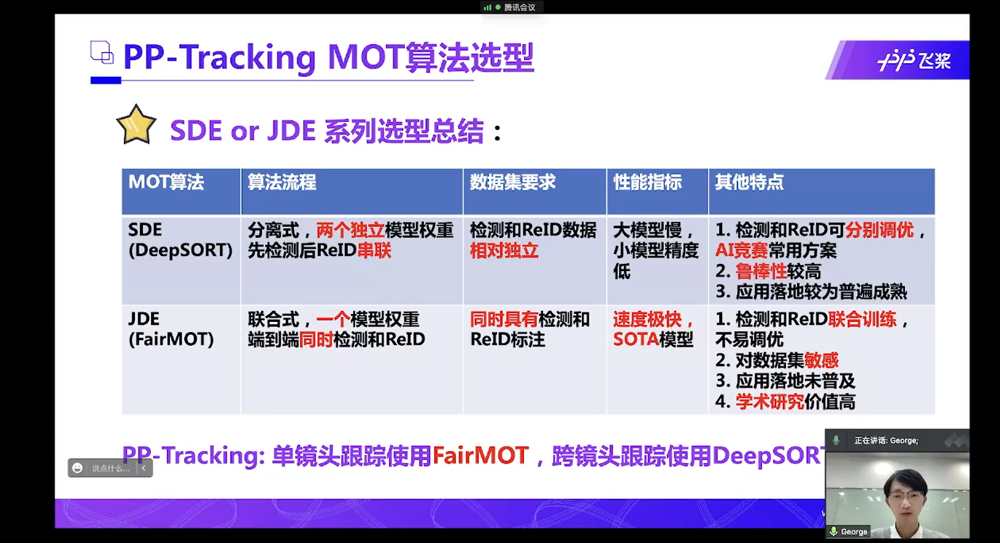
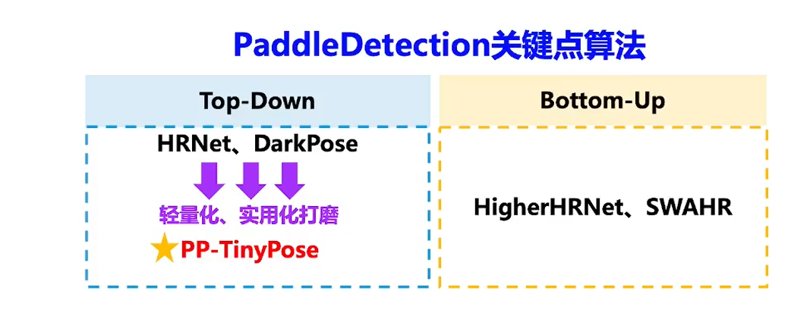

# 基本原则：
 1、不可能自己想出什么新的模型，基本上都是用现有的
 2、寻求大神的帮助是必须的
 
# 审视需求：
不能用多目标的思路，多目标思路基本上是不一样的，全图检测，然后对比跟踪，单目标用不着，的算力消耗高太多了，需要单目标的

单目标，我们还需要重识别 = 基本上等于行人跟踪

最好能加上目标遮挡判断

 
 google的mediapipe提供人体姿势和关键点检测，但是它这个似乎没有追踪功能（当然也不能指定检测的人）
 
 目前测试的效果就是多人情况下很容易丢失，比如人脸消失，人被挡住等，很容易就切换到其它人身上去了。
 
 我们需要实现最终的效果是可以追踪的那种。
 
 那么现在基本上就是只需要加一个目标追踪就行了
 
 
 所以结合姿势追踪的来做这个。
 收录到的姿势追踪效果最好的
 https://paperswithcode.com/paper/combining-detection-and-tracking-for-human
 不要想大而全，实现关键点就好
 
基本的流程和mp中的holistic就是：
姿势追踪-根据姿势判断人脸，人手的ROI-在ROI中检测人脸人手关键点

目前看到的追踪的基本思路都是：先检测然后追踪，tracking-by-detection

可以学习的：
https://github.com/PaddlePaddle/PaddleDetection/tree/release/2.3/configs/keypoint/tiny_pose

挑战点：镜头切换时追踪 == 行人追踪过程中的行人重识别
 

跟踪算法有两类：基于检测的跟踪，不基于检测的跟踪
目前的好的都是基于检测的跟踪，一个原因是可以从检测算法中受益

单目标跟踪排行：
https://paperswithcode.com/sota/visual-object-tracking-on-vot201718 

https://paperswithcode.com/sota/visual-object-tracking-on-lasot 

目标跟踪产业痛点

trick
性能

轻量级

reid模型等可以根据不同对象专门化

光流估计
http://www.c-s-a.org.cn/html/2018/12/6665.html
# 关键点检测
关键点检测可以看做目标检测的复杂版

应用：安防应用，智慧交通-交警姿势，健身，互动娱了，工业应用

关键点检测的两种方案

top-down 先目标检测 再找关键点
bottom-up 先找到关键点 再检测
当前比较领先的方案：

关键点检测算力远大于目标检测

百度的模型速度 122fps
优化思路

数据增强：
遮挡关键点

低分辨率输入，高精度输入（大概就是二阶泰勒展开用离散位置预测连续位置）

工程优化
把前后处理操作放到模型中，可以利用模型框架优化速度

手臂正反面似乎需要3D Pose

# 数据集：
目前的数据集都是为多种类别的目标准备的，我们可以只取数据集中的一类，然后结合多个数据集

另外，还可以从MOT里面取数据

比较先进的一个单目标数据集
LaSOT 2019年出的 
优点：
1、时长100s左右，比其它数据集提供的更长
2、数据量更大，种类更多
https://www.leiphone.com/category/academic/NhOeLVXzIdLVSxyU.html