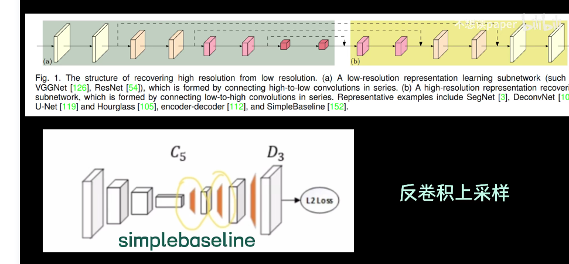
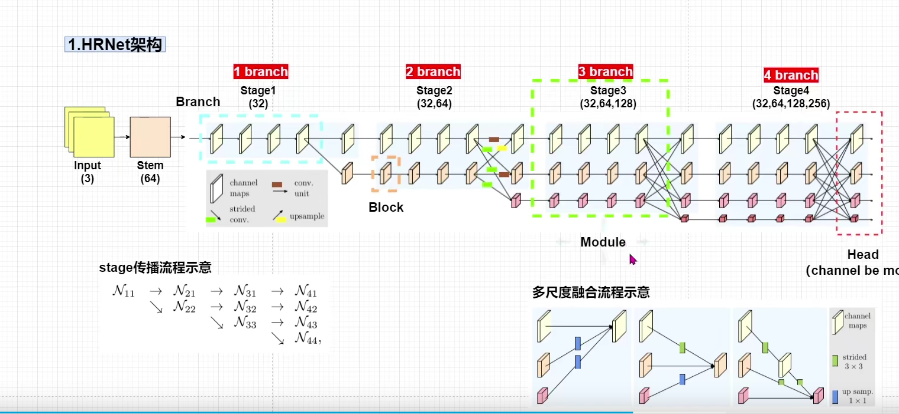
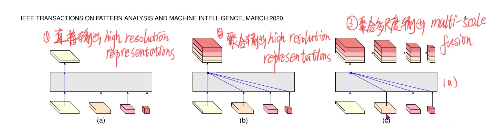

想法，框优化思想，就是现在的目标检测和我们人类的不太一样
人类一般都是先识别对象和大概位置，然后再去精确化对象框
现在的检测算法是直接预测了框然后分类处理的 
这篇论文似乎是采用的类似方法
End-to-End Semi-Supervised Object Detection with Soft Teacher

# 简介
位置敏感的任务对分辨率要求高。
比如图像分割，显然的对于分割显然的低分辨率的输出很难复原分割对象的范围
对于对象检测，论文中说的是对于位置敏感，原因没明白，大概是因为现有的模型架构会丢失这类信息，记住就好，对应现在自己，不用非得想清楚，想清楚了你就没精力学会其它的点了

要注意位置敏感不止是检测，分割，还有姿态估计等

所以要**恢复分辨率**
恢复分辨率现在的方式之一就是原来常常接触的沙漏结构
下采样，再上采样

上面一个加了跳跃链接
下面的没加

hrnet采用了不同的方式

如图，注意每个地方的名字，代码中会用到
这种方式的两个核心的点是
1、并行的连接从高到低的卷积流。没太明白，不过注意这个名词，卷积流，把一条路径称为一个卷积流。

2、在不同的分辨率中重复的交互信息，这使得特征图里面有更多的语义信息和更准确的空间信息。
（感觉上就是用这种方式结合高低分辨率中的语义信息和空间信息更科学，在保持和结合上都更科学）

传统的模型主要沿用了分类模型的架构，主干会被压缩到低分辨率，虽然采用了恢复+跳跃链接，但是对高分辨率的信息保留依然不够。其实最开始学的时候直觉上就会觉得上采样的方式怪怪的。

hrnet有不同分辨率多个输出头，可以根据任务需要选择使用不同的输出头，比如分类就选择低分辨率的就行，由此延伸出hrnet的三个变体或者说三个版本，原始版直接输出最高分辨率的那个分支，v2 对多个分支进行上采样，然后融合成一个输出，v2p 在融合之后再下采样输出多个分辨率的结果，实验显示v2p尤其在小目标检测上有很大改善

# hrnet网络结构
首先经过一个stem，两个步长为2的3*3卷积，将分辨率缩小为原来的1/4，输出也是原来的1/4

分支下采样时一级是变成原来的1/2，通道数增加，多级就进行多次下采样，上采样反之
 
# 分析
融合的部分就像一个全连接一样，只是每个链接的端点是一个个特征图，是一个更大尺度的全连接