Transformer 英文翻译 变形 变压器 李宏毅 = 变形金刚
SelfAttention 是nn里面的一种层，就像卷积层
Transformer里面大量用到了SelfAttention的层

SelfAttention 起源于自然语言翻译nlp任务 原来nlp里面最常用的是rnn 但是rnn存在不容易并行化的缺陷，如下：
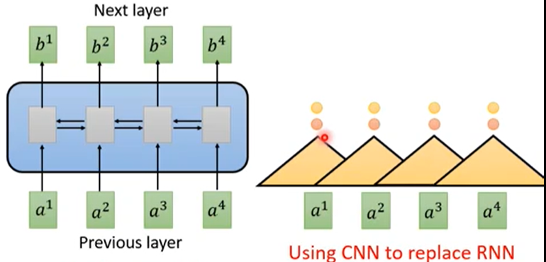
没太搞明白执行过程，反正就是节点需要依次计算，先b1，再b2，，， 最后b4
接下来，有用CNN替换RNN的。CNN在卷积核层面和通道层面都可以直接并行。 
这样的话，rnn时间为序列长度个单位，而cnn只需要k个单位。这样对吗？还是每个节点都要走k个。

但是cnn能看到的长度只有k，否则就要堆叠cnn的层，但这样同样时空复杂度都高了，且效果不一定好。

于是，进一步的人们想出来self-attention  
 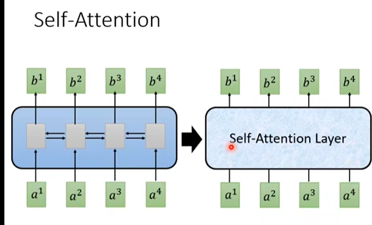  
 sa内部流程和原理比较复杂，先简单的记住，它就是一种层，输入一个序列，然后输出一个序列。但是它具有看过整个序列，并且是并行化计算的优点，就是每个输入节点同时计算。整体上和rnn类似的，使用的时候直接替代rnn就行了。
 
 另外注意，attention是一种通用的东西，当时的self-attention论文开篇就是attention is all you need，注意这句话不是随口说的或者夸大其词，论文严肃的说的真实的情况（现在这么多的应用，甚至把cv领域的经典cnn都挤掉了就是证明）。大佬就是大佬，一个巨大的发现就这样就出来了。题外话，一个通用的新技术点出来之后，可以用来洗论文，就是它替代了某某，那就把以前使用某某的地方，都换成这个新技术点，就是一篇论文。所有相关的论文都可以这样洗一遍，就是洗论文了。李宏毅的话，self-attention出来之后，所有的相关论文都被洗了一遍，几乎没有没洗过的。
 
 具体做法：  
 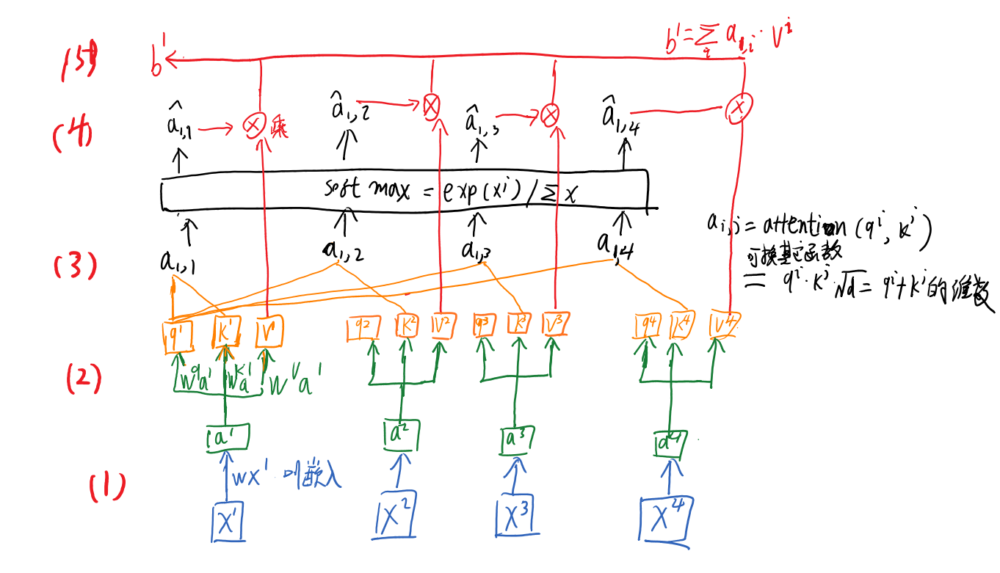  
 如上图，大概可以分为5步，还是不是很复杂的
 1 嵌入，就是矩阵w乘上每个x^i
 2 算出q，k，v，同样适用矩阵乘得到
 3 attention操作，如图，其中attention函数可以是其它的，注意输出的结果是数字了
 4 a_{1, j}做softmax 注意不是所有的a_{i,j}一起
 5 a_{1, j}与v^j相乘再相加得到b^1
 完了
 
 上述过程可以用矩阵乘法表示出来，首先，得到qkv的过程   
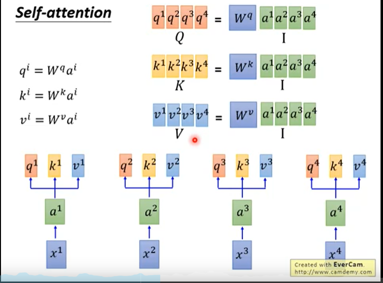  
 代表序列的向量串起来就是矩阵了，然后就是矩阵相乘
 然后，attention过程   
 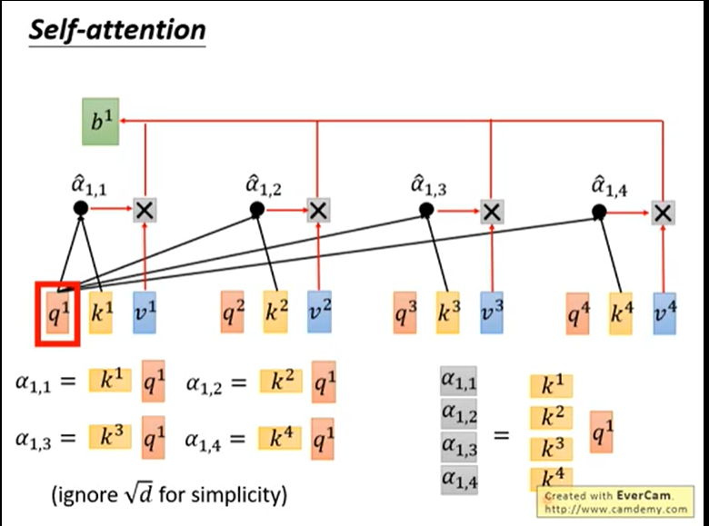  
 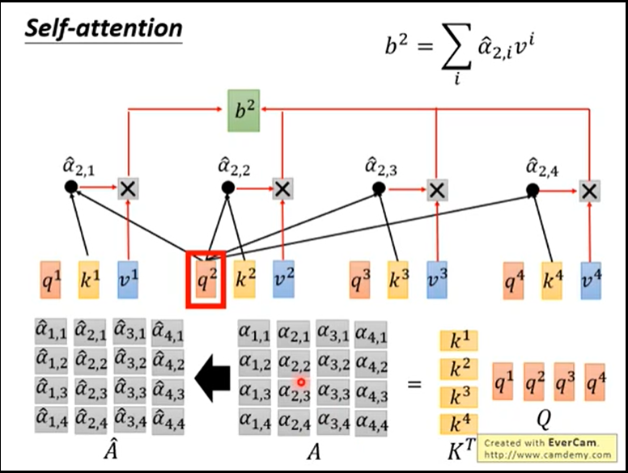   
   
attention函数里面就是乘，将k转置一下，乘上q就完了，然后对矩阵的列应用soft-max。 A的尺寸=序列长度平方 n*n

最后的b 为：  
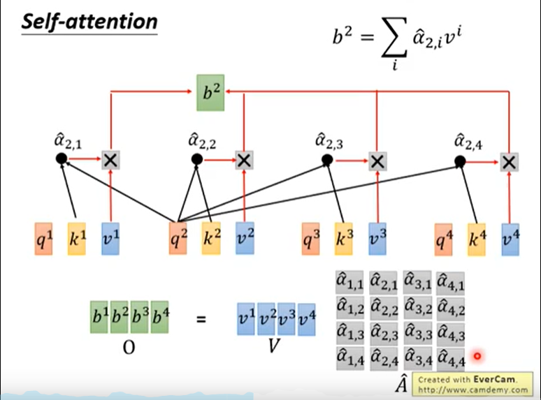  

总的流程
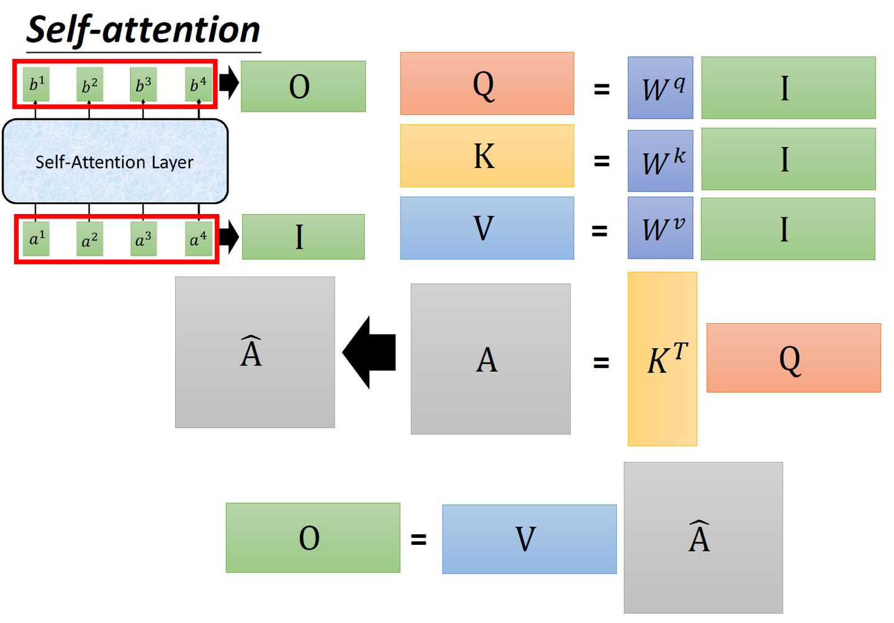
self-attention就是一堆矩阵乘法，就易于用GPU加速

self-attenttion有一个变形，multi-head self-attention 多头自注意力
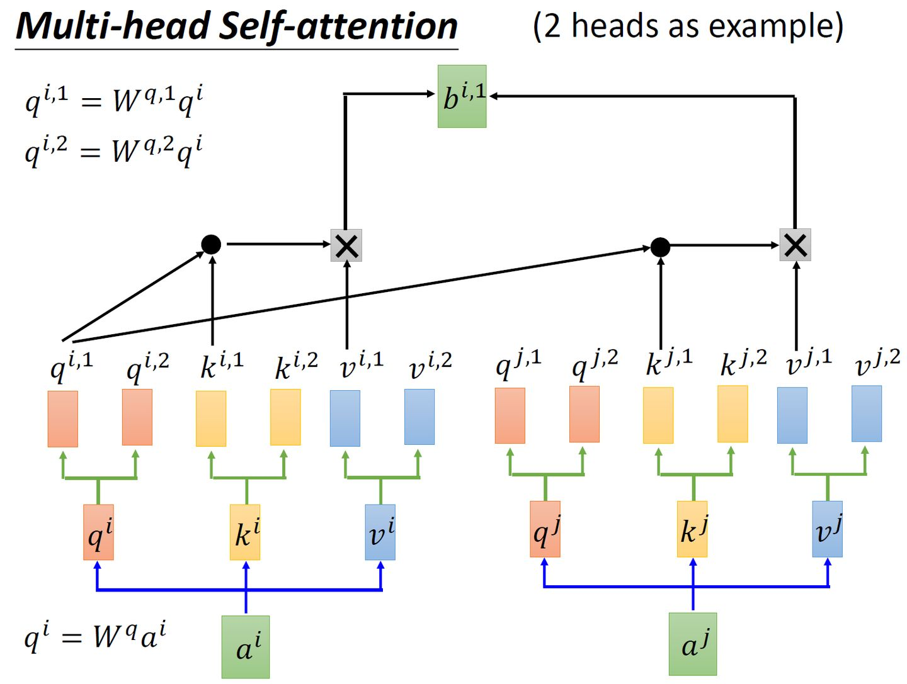
以两个为例子，原来的qkv都分裂为两个，它们由原来的qkv乘上矩阵得到。
下面的步骤就是每个对应的二级头之间，使用原始的attention一样方式计算出b的二级头b^{i,j},所以名字叫头，知识头那里分裂了，其它位置操作没变。
然后b的二级头直接连接起来或者再乘上一个矩阵降低维度，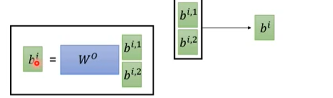  
多头的意义，在于，每个头可以关注不同的点，比如局部的，全局的

# 位置参数
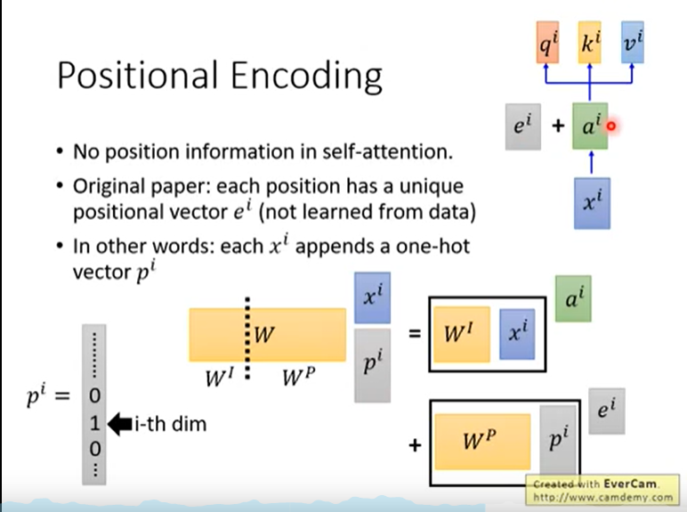  
前面的结构还有点问题，它无法得到位置信息。为什么，没想明白，暂略。
作者通过上图的方式添加位置信息，即a^i加上一个e^i,它等价于图中下面部分的在x后面接上一个0-1编码的位置参数。

# transformer结构
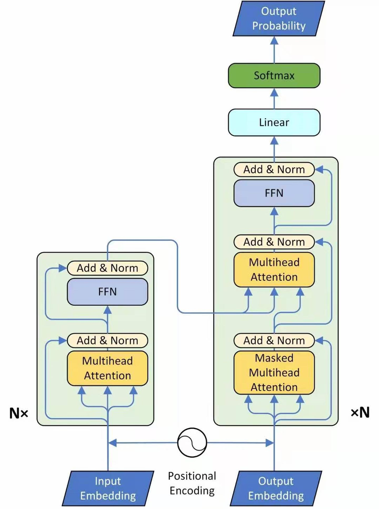  
左边编码器，右边是解码器
流程
输入->嵌入（类似词嵌入？）-> 加上位置参数 —> 多头attention（前面所述） ——> add（resnet类似结构了）和标准化（一般是层标准化）->  feedforwar（what？）nx表示重复n次

右边的也有一个输入，这是上一次的输出结果，然后进入的第一层是Masked multi-head attention。这是由于输出还没有得到

视觉transformer
Dert结构
主要方法就是把图像长宽和到一起形成一维序列，然后编码位置时考虑宽高，再和序列相加。attention机制是一样的，transformer大结构也是类似的。
值得一提的，transformer的模型大小比fasterRCNN小