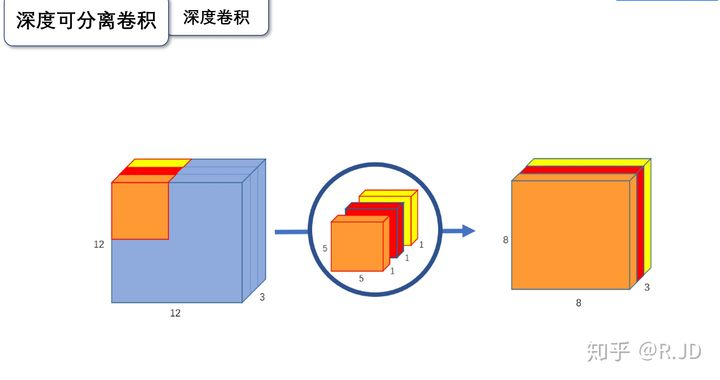
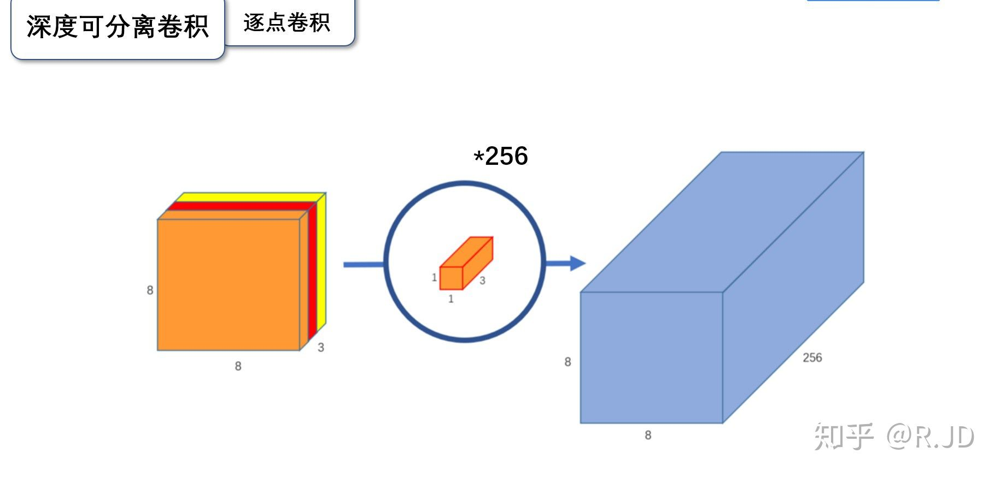
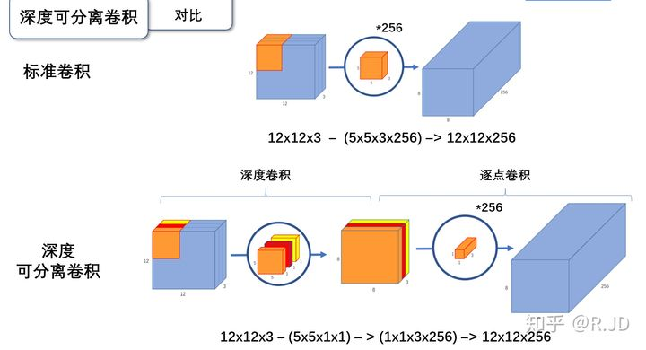
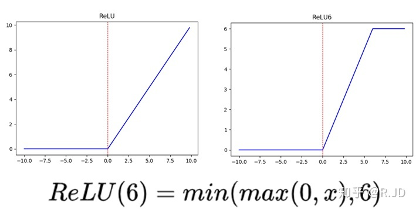
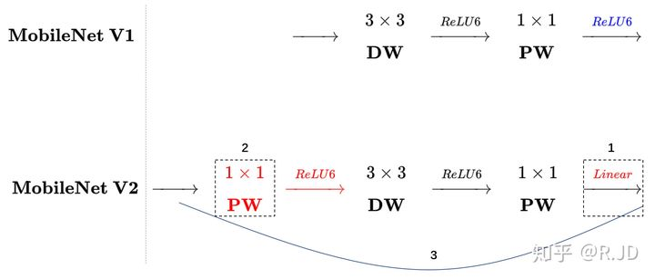
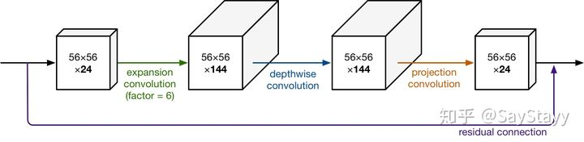

# v1 主要优化是深度可分离卷积

这个技术使得参数量和计算量大概降为一般卷积网络的 1 / k^2
深度可分离分为两部分:深度卷积和逐点卷积
深度卷积就是卷积和大小不变，但是只用卷积核一个通道和输入层一个通道卷积就得到输出层一个通道，而不是所有通道。相当于特征之间不交互了，交给后面逐点卷积。

逐点卷积就是1*1的卷积，这是为了特征通信  
 

  

小的地方还有优化relu的relu6激活函数 

ReLU6作为非线性激活函数，在低精度计算下具有更强的鲁棒性

实际效果比VGG速度参数都少30倍，精度只下降1个点

# v2  主要优化是借鉴ResNet，做了一个反向残差块结构
## 简述：
1、反向残差块结构这个结构是：
在深度卷积之前再加一个逐点卷积，先升维，再深度卷积，再逐点卷积降维，最后收尾短连接，通道中间大，两头小，与标准resnet残差块相反，详细见后面

2、小的点：把残差块最后的relu6换成线性的，解决其导致的一个问题

## 详细结构
  
注意这个短连接形成的残差块，先用逐点卷积将通道数增加，再深度卷积，再用逐点卷积降低通道数，最后收尾相加，例子如下面
  
这会形成一个中间大，两头小的结构，这和resnet残差块的变体相反，resnet残差块变体叫做Bottleneck，中间小，两头大，即它是先降通道，再一般卷积，再升通道，最后相加。

然后，更resnet一样，若干个block组成一个大层，大层类通道数不变，到下一层的时候通道变化

如何减小参数量的：  
说对于网络整体，只把中间部分通道达到原来V1的大小来做处理，而两边小了，文中中间通道数取两边通道数的6倍，因为中间部分是深度卷积，参数量和计算量都少，主要的参数和计算位置，逐点卷积，现在只需要是原来的1/6了。对于网络整体来说，就是通过这种操作，参数量减少了很多。当然V2增加了深度，但最终还是更少一些，这也就是v2,相对v1更轻量的原因

## 结果:
大号版参数计算量少量增加 精度提高 4个点 
小号版参数计算量减少，精度提高2个点 

# v3：待学习
比v2大号版提示3个点左右，小号版提升6个点左右

  
图中的MobileNetV2 应该是小号版

细节：
每个conv后面是有bn的，很多地方默认了，没有列出来