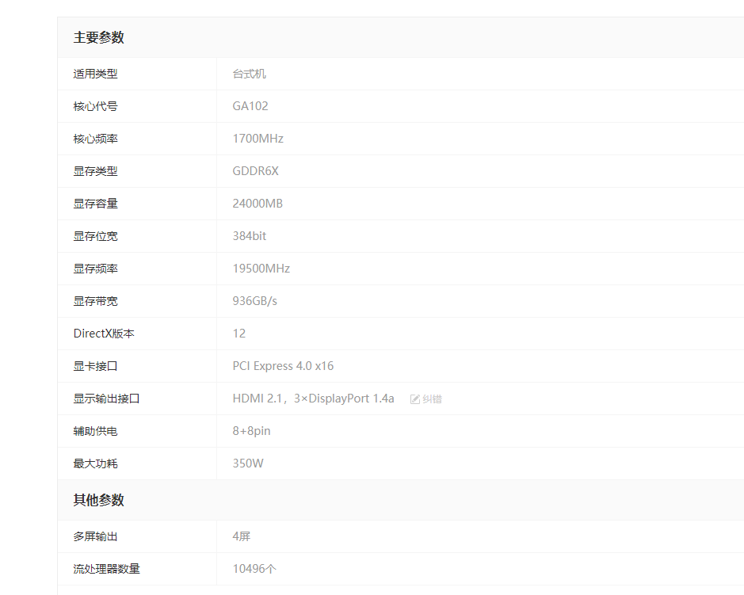
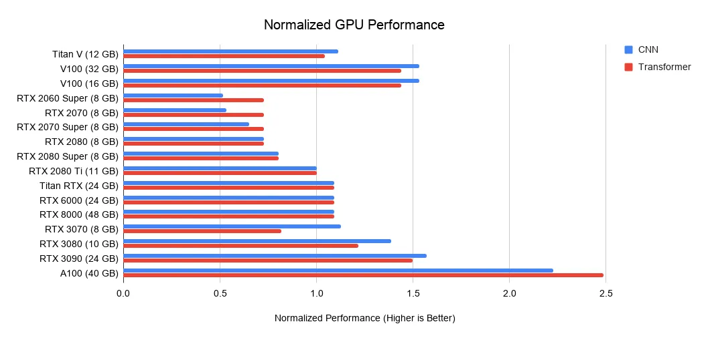
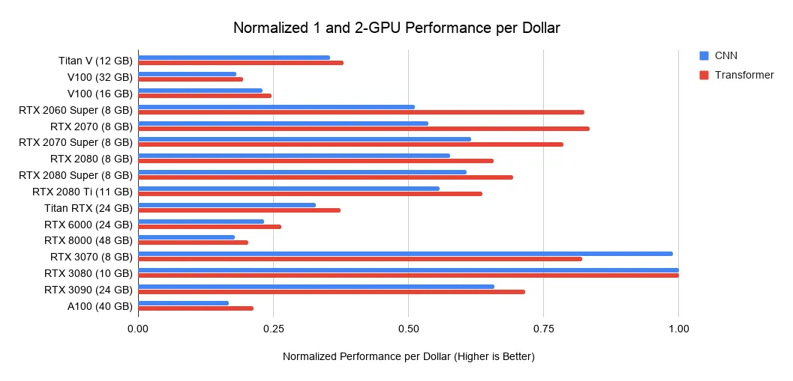

# 看了一天 想自己搭配 实际上有专门的解决方案 
京东淘宝直接搜 哎 浪费时间了 
# 教训！浪费一天时间！对社会商业化原理理解不够深
社会越商业化，很多的需要都有商品或者服务来满足，包括这个工作站，看似比较个性化，实际上有成熟商品了  那么自己更多的需求 其实也有相应的商业方案解决的
# 工作站配置

1、一定计算好需要多大功率的电源！我们配置深度学习主机最核心的就是显卡，GPU的功耗往往很大

## 内存：
内存大小不会影响深度学习性能，但是它可能会影响你执行GPU代码的效率。内存容量大一点，CPU就可以不通过磁盘，直接和GPU交换数据。
如果有一个24GB显存的Titan RTX，应该至少有24GB的内存。但是，如果有更多的GPU，则不一定需要更多内存。

## CPU：
一个人说的：
就深度学习而言，AMD CPU 通常比 Intel CPU 更便宜且更好。

CPU 瓶颈没有那么大，一般以一个 GPU 对应 2~4 个 CPU 核比较好，比如单卡机器买四核 CPU，四卡机器买十核 CPU。

当你在训练的时候，只要数据生成器（DataLoader）的产出速度比 GPU 的消耗速度快，那么 CPU 就不会成为瓶颈，也就不会拖慢训练速度。

### PCI-E
PCI-Express是继ISA和PCI总线之后的第三代I/O总线，即3GIO。 由Intel在2001年的IDF上提出，由PCI-SIG（PCI特殊兴趣组织）认证发布后才改名为“PCI-Express”。它的主要优势就是数据传输速率高，另外还有抗干扰能力强，传输距离远，功耗低等优点。
 PCI-E接口根据总线位宽不同而有所差异，一个PCI Express连接可以被配置成x1， x2， x4， x8， x12， x16和x32的数据带宽。 (x2 and x12 link widths are optional) PCI-E 各种位宽Device可以自由搭配使用，比如x1 的卡可以插到x8的插槽中使用， x8 的卡可以插到x16的插槽中使用，即低位宽的可以放到高位宽的接口上用，升级方便。
 
pci-e 5.0 2019年面世 
6.0预计2021
目前每一代增速2倍左右 
是向下兼容的，也就是说不管哪一方版本低都可以接入，最终速度=低版本的

## 硬盘：
典型数据集大小 压缩了的
coco 2017  44GB 
StyleGAN的ffhq 2.56TB
要使用
NVMe 的 SSD 采用m.2接口 比原来的sata块很多
1200 / TB 左右
 
## 内存：
64GB 2500左右

## 显卡：
 内存是第一要求：使用预训练 transformer 和从头训练小型 transformer：>= 11GB；

训练大型 transformer 或卷积网络：>= 24 GB；

原型神经网络（transformer 或卷及网络）：>= 10 GB；

Kaggle 比赛：>= 8 GB；

应用计算机视觉：>= 10GB。

 GPU参数的选择优先级是不一样的，总体来说分两条路线：
卷积网络和Transformer：张量核心(GPU)>FLOPs（每秒浮点运算次数）>显存带宽>16位浮点计算能力
循环神经网络：显存带宽>16位浮点计算能力>张量核心(GPU)>FLOPs
### 张量核心
首先是 Tensor Core，它可以让你在计算乘法和加法时将时钟周期降至 1/16，减少重复共享内存访问，让计算不再是整个流程中的瓶颈（瓶颈变成了获取数据的速度）。现在安培架构一出，更多的人可以用得起带 Tensor Core 的显卡了。

因为处理任务方法的特性，显存是使用 Tensor Core 进行矩阵乘法的周期成本中最重要的部分。具体说来，需要关注的参数是内存带宽（Bandwidth）。如果可以减少全局内存的延迟，我们可以进一步拥有更快的 GPU。

在一些案例中，我们可以体验到 Tensor Core 的强大，它是如此之快，以至于总是在等内存传来的数据——在 BERT Large 的训练中，Tensor Core 的 TFLOPS 利用率约为 30％，也就是说，70％的时间里 Tensor Core 处于空闲状态。这意味着在比较两个具有 Tensor Core 的 GPU 时，最重要的单一指标就是它们的内存带宽。A100 的内存带宽为 1555 GB/s，而 V100 的内存带宽为 900 GB/s，因此 A100 与 V100 的加速比粗略估算为 1555/900 = 1.73x。

带有张量核心的有： RTX GPU
最佳GPU：RTX 2070 2019.10 之后推荐rtx3090
他会向所有买得起 RTX 3090 的人推荐这款 GPU，因为在未来 3-7 年内，这是一款将始终保持强大性能的显卡
### 避免的坑：
不建议买 RTX Founders Edition（任何一个）或 RTX Titan，除非你有 PCIec 扩展器能解决散热问题。

不建议买 Tesla V100 或 A100，因为性价比不高，除非你被逼无奈或者想在庞大的 GPU 群集上训练非常大的网络。

不建议买 GTX 16 系列，这些卡没有张量核心，因此在深度学习方面性能较差，不如选 RTX 2070 / RTX 2060 / RTX 2060 Super

 ## 使用多块GPU
 通常GPU是可以用多块的，
 RTX 3090的例子4x RTX 3090 EVGA Hydro Copper
 多个不同型号的 GPU，可以。这种情况下正常运行是没问题的，但这些 GPU 上的并行化处理将会非常低效，因为速度最快的 GPU 需要等待最慢的 GPU 来赶上一个同步点（通常是梯度更新）。
 
 电脑机箱的设计对于散热是否重要？并不。

如果 GPU 之间存在间隙的话，通常能够很好地冷却。如果 GPU 之间没有空间，则需要好的散热器设计（风扇）和其他解决方案（水冷、PCIe 扩展）。

总而言之，散热与机箱设计和机箱风扇都没关系。

### 最终选择RTX 3090
 **RTX3090 24G 20000左右 2020年9月上市 
 目前来说没得选，就这个咯 **
 他会向所有买得起 RTX 3090 的人推荐这款 GPU，因为在未来 3-7 年内，这是一款将始终保持强大性能的显卡
 参数： 
 
 主要参数：
 pci-e 4.0  16位宽
 
##电源
GPU功耗 RTX3090 1个 官网最高 350w

## 购买
购买平台：买有保障的，京东之类，太贵了，维修什么的
厂家：网上的说的，主板，显卡，几个大厂的基本面上质量差不多，具体看那个有特别的优势，比如性价比，某个优化。

价格清单：
显卡 rtx 3090 京东最低价 2021.4 19000
cpu  至强® 金牌 5218R  8k-9k 功耗 125w
主板 4k-5k
2t固态硬盘 1500-2500
内存 64G 2500左右 其它大小的不好说 它们不成比例
硬盘 130元/T 4T = 550
电源 2000w 2k - 3k
机箱+水冷 1k-2k
其它：3k
总价：3.3 - 3.7k + cpu

戴尔配置：
算下来价格差不多 毕竟牌子厂 用的人多 不好骗人
是水冷的吗 好像不是 
配件清单有吗 
硬盘是什么牌子的呀 
电源 似乎不够大 才1400w 两个3090 700 2个cpu 250 其它算400 满了 至少得留20%吧
后面可以自己家cpu gpu这些是吧
能装双系统吗 cuda之类的能配好吗

把网升上去

# 显卡算力：
图表： 
算力对比 2080ti为基准
  
性价比 每一美元能买到的算力 现在价格已变  

TeslaV100 5120个CUDA核心，640个Tensor辅助单元，据称Tsela V100用来挖以太坊时效率高达94MH/s
RTX3090 10496 cuda核心
 