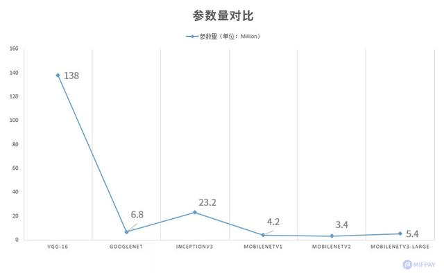
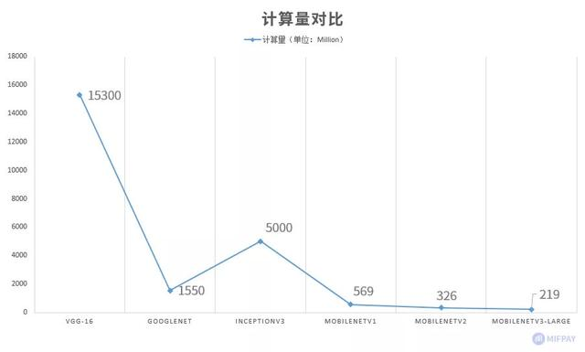

pytorch提供的移动端性能优化：
https://pytorch.org/tutorials/recipes/mobile_perf.html
重用前向传播的tensor节省内存，详解网页

pytorch的文档有些分散 不能只看一篇 搜索寻找效果更好

资料：
https://blog.csdn.net/c9Yv2cf9I06K2A9E/article/details/113488003

# 量化
## 动态量化：
它目前只支持 nn.Linear 和 nn.LSTM，这意味着您必须使用静态量化或量化感知训练(稍后将讨论)来量化其他模块，如 nn.Conv2d.
静态 需要训练 样本层次和通道层次 通道层次精度高很多
感知 要训练，就是低精度训练，损失很小

mobileNet优势  

一个大佬的实现：
https://github.com/xiaolai-sqlai/mobilenetv3
   
MobileNet替换VGG大部分情况是可行的，很多时候主要是没人做，比如styletransfer 
[DIN-MobileNet替代vgg的-没代码.pdf](file:///E:\读研相关\研究课题\GAN知识\风格迁移\DIN-MobileNet替代vgg的-没代码.pdf)
这个速度快了好多倍，看上去效果也很好，作者没开源代码

TNN一些知识：
TNN可以直接下载下来，进入Android demo 的目录，点击工程的build.gradle， 项目很完善，可以直接编译成功

编译成功之后，查看示例和c++代码可以了解如何使用，不是很难

