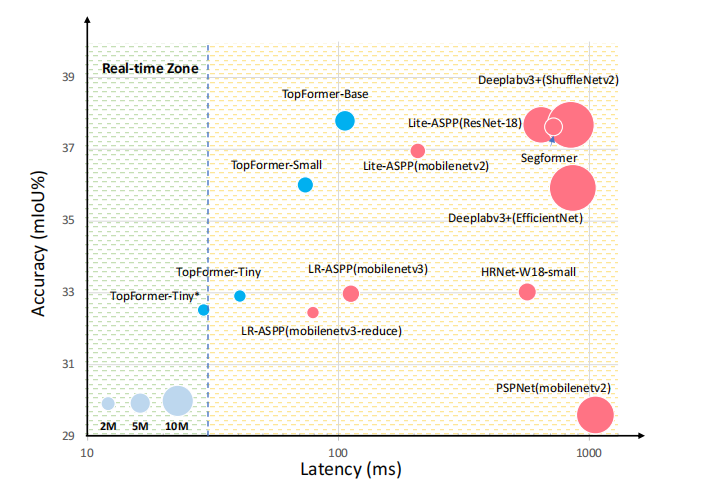
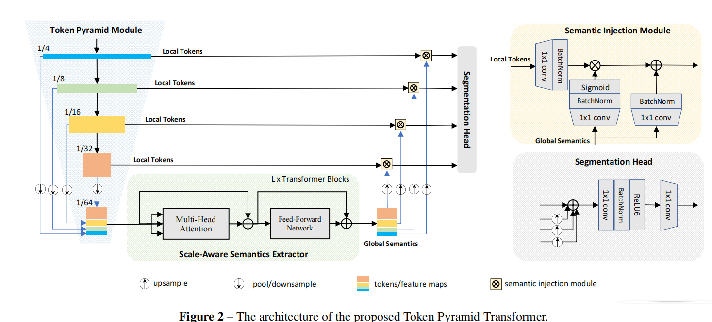
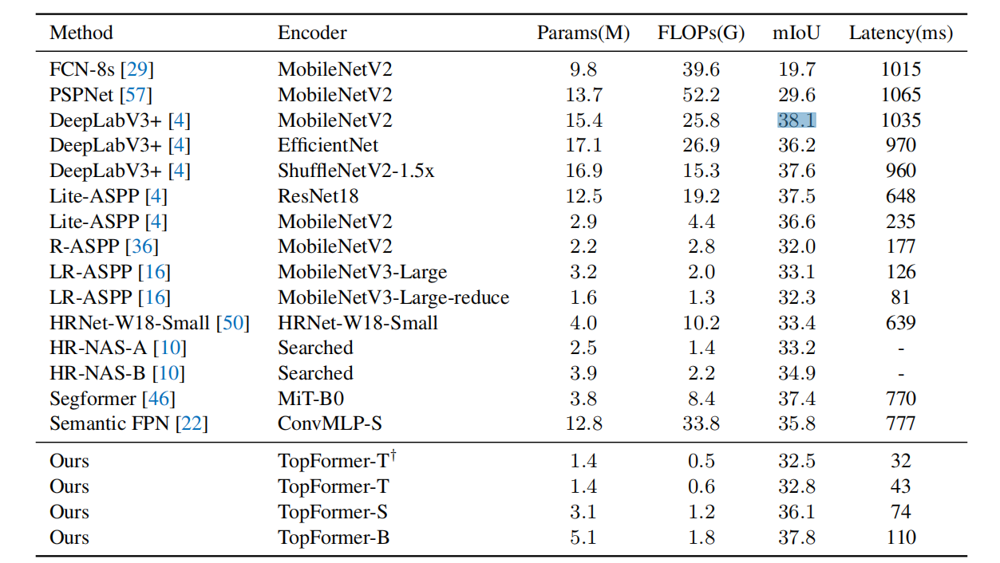

TopFormer: Token Pyramid Transformer for Mobile Semantic Segmentation

# Abstract 
Although vision transformers (ViTs) have achieved great success in computer vision, the heavy computational cost hampers their applications to dense prediction tasks such as semantic segmentation on mobile devices. In this paper, we present a mobile-friendly architecture named Token Pyramid Vision Transformer (TopFormer). The proposed TopFormer takes Tokens from various scales as input to produce scale-aware semantic features, which are then injected into the corresponding tokens to augment the representation. Experimental results demonstrate that our method significantly outperforms CNN- and ViT-based networks across several semantic segmentation datasets and achieves a good trade-off between accuracy and latency.

尽管视觉转换器（VIT）在计算机视觉领域取得了巨大的成功，但其庞大的计算成本阻碍了其在移动设备语义分割等密集预测任务中的应用。在本文中，我们提出了一个移动友好的体系结构，名为Token Pyramid Vision Transformer（TopFormer）。本文提出的TopFormer将来自不同尺度的标记作为输入，生成感知尺度的语义特征，然后将这些语义特征注入相应的标记中以增强表示。实验结果表明，在多个语义分割数据集上，我们的方法明显优于基于CNN和ViT的网络，并在准确性和延迟之间实现了良好的权衡。
On the ADE20K dataset, TopFormer achieves 5% higher accuracy in mIoU than MobileNetV3 with lower latency on an ARM-based mobile device. Furthermore, the tiny version of TopFormer achieves real-time inference on an ARMbased mobile device with competitive results. The code and models are available at: https://github.com/hustvl/TopFormer
在ADE20K数据集上，TopFormer在mIoU中的准确率比MobileNetV3高5%，在基于ARM的移动设备上的延迟更低。此外，TopFormer的微型版本在基于ARM的移动设备上实现了实时推理，具有竞争性的结果。有关代码和型号，请访问：https://github.com/hustvl/TopFormer

Figure 1 – The latency, mIoU performance versus model size on the ADE20K val. set. Previous models are marked as red points, and our models are shown in blue points. Our methods achieve a better latency/accuracy trade-off. The latency is measured on a single Qualcomm Snapdragon 865 with input size 512×512, and only an ARM CPU core is used for speed testing. No other means of acceleration, e.g., GPU or quantification, is used. * indicates the input size is 448×448.
图1–ADE20K val.set上的延迟、mIoU性能与型号大小。以前的型号标记为红点，我们的型号显示为蓝点。我们的方法实现了更好的延迟/准确性权衡。延迟是在单个高通Snapdragon 865上测量的，输入大小为512×512，只有一个ARM CPU内核用于速度测试。没有使用其他加速方式，例如GPU或量化。*指示输入大小为448×448。

1.Introduction
1.导言
Vision Transformers (ViTs) have shown considerably stronger results for a few vision tasks, such as image classification [11], object detection [28], and semantic segmentation [58]. Despite the success, the Transformer architecture with the full-attention mechanism [42] requires powerful computational resources beyond the capabilities of many mobile and embedded devices. In this paper, we aim to explore a mobile-friendly Vision Transformer specially designed for dense prediction tasks, e.g., semantic segmentation. *Equal contribution. This work was done when W. Zhang was an intern at Tencent GY-Lab.
视觉转换器（VIT）在一些视觉任务中表现出了相当强的效果，如图像分类[11]、目标检测[28]和语义分割[58]。尽管取得了成功，但具有全注意力机制的Transformer架构[42]需要强大的计算资源，超出了许多移动和嵌入式设备的能力。在本文中，我们的目标是探索一个移动友好的视觉转换器，专门设计用于密集预测任务，例如语义分割*同等贡献。这项工作是在W.Zhang在腾讯GY-Lab实习时完成的。

To adapt Vision Transformers to various dense prediction tasks, most recent Vision Transformers such as PVT [43], CvT [45], LeViT [12], MobileViT [31] adopt a hierarchical architecture, which is generally used in Convolution Neural Networks (CNNs), e.g., AlexNet [23], ResNet [15]. These Vision Transformers apply the global self-attention and its variants on the high-resolution tokens, which bring heavy computation cost due to the quadratic complexity in the number of tokens.
为了使视觉变换器适应各种密集的预测任务，最新的视觉变换器，如PVT[43]、CvT[45]、LeViT[12]、MobileViT[31]采用了一种层次结构，通常用于卷积神经网络（CNN），例如AlexNet[23]、ResNet[15]。这些视觉转换器将全局自我注意及其变体应用于高分辨率token，由于 token数量的二次复杂性，这会带来沉重的计算成本。
To improve the efficiency, some recent works, e.g., Swin Transformer [28], Shuffle Transformer [19], Twins [7] and HR-Former [51], compute self-attention within the local/windowed region. However, the window partition is surprisingly time-consuming on mobile devices. Besides, Token slimming [40] and Mobile-Former [6] decrease calculation capacity by reducing the number of tokens, but sacrifice their recognition accuracy.
为了提高效率，最近的一些工作，例如Swin Transformer[28]、Shuffle Transformer[19]、Twins[7]和HR-Former[51]在局部/窗口区域内计算自我注意。然而，在移动设备上，窗口分区非常耗时。此外，Token slimming[40]和Mobile Former[6]通过减少Token的数量来降低计算能力，但牺牲了它们的识别精度。
Among these Vision Transformers, MobileViT [31] and Mobile-Former [6] are specially designed for mobile devices. They both combine the strengths of CNNs and ViTs.
在这些视觉转换器中，MobileViT[31]和Mobile Former[6]是专门为移动设备设计的。它们都结合了CNN和VIT的优势。
For image classification, MobileViT achieves better performance than MobileNets [16, 36] with a similar number of parameters. Mobile-Former achieves better performance than MobileNets with a fewer number of FLOPs. However, they do not show advantages in actual latency on mobile devices compared to MobileNets, as reported in [31]. It raises a question: Is it possible to design mobile-friendly networks which could achieve better performance on mobile semantic segmentation tasks than MobileNets with lower latency? Inspired by MobileViT and Mobile-Former, we also make use of the advantages of CNNs and ViTs. A CNNbased module, denoted as Token Pyramid Module, is used to process high-resolution images to produce local features1 pyramid quickly. Considering the very limited computing power on mobile devices, here we use a few stacked lightweight MobileNetV2 blocks with a fast down-sampling strategy to build a token pyramid. To obtain rich semantics and large receptive field, the ViT-based module, denoted as Semantics Extractor, is adopted and takes the tokens as input. To further reduce the computational cost, the average pooling operator is used to reduce tokens to an extremely small number, e.g., 1/(64×64) of the input size.
在图像分类方面，MobileViT比MobileNets[16,36]在参数数量相似的情况下取得了更好的性能。与MobileNet相比，MobileFormer的性能更好，失败次数更少。然而，与MobileNet相比，它们在移动设备上的实际延迟方面并没有显示出优势，如[31]所述。它提出了一个问题：是否有可能设计出移动友好型网络，与延迟较低的MobileNet相比，该网络在移动语义分割任务上能获得更好的性能？受MobileViT和Mobile Former的启发，我们还利用了CNN和VIT的优势。基于CNN的模块被称为 token金字塔模块，用于处理高分辨率图像以快速生成局部特征1金字塔。考虑到移动设备上的计算能力非常有限，这里我们使用几个堆叠的轻量级MobileNetV2块，并采用快速下采样策略来构建 token金字塔。为了获得丰富的语义和大的接受域，采用了基于ViT的模块，称为语义提取器，并将 token作为输入。为了进一步降低计算成本，使用平均池操作符将 token减少到极少量，例如输入大小的1/（64×64）。
Different from ViT [11], T2T-ViT [49] and LeViT [12] use the last output of the embedding layer as input tokens, we pool the tokens from different scales (stages) into the very small numbers (resolution) and concatenate them along the channel dimension. Then the new tokens are fed into the Transformer blocks to produce global semantics. Due to the residual connections in the Transformer block, the learned semantics are related to scales of tokens, denoted as scaleaware global semantics.
与ViT[11]不同，T2T ViT[49]和LeViT[12]使用嵌入层的最后一个输出作为输入 token，我们将来自不同规模（阶段）的 token汇集到非常小的数字（分辨率）中，并沿通道维度连接它们。然后，新的标记被输入转换器块以产生全局语义。由于Transformer块中的剩余连接，学习的语义与标记的规模有关，称为scaleaware全局语义。
To obtain powerful hierarchical features for dense prediction tasks, scale-aware global semantics is split by the channels of tokens from different scales, then the scaleaware global semantics are fused with the corresponding tokens to augment the representation. The augmented tokens are used as the input of the segmentation head.
为了获得密集预测任务的强大层次特征，通过不同尺度的标记通道分割尺度感知的全局语义，然后将scaleaware全局语义与相应的标记融合以增强表示。增强的标记被用作分段头的输入。
To demonstrate the effectiveness of our approach, we conduct experiments on the challenging segmentation datasets: ADE20K [59], Pascal Context [33] and COCOStuff [1]. We examine the latency on hardware, i.e., an offthe-shelf ARM-based computing core. As shown in Figure 1, our approach obtains better results than MobileNets with lower latency. To demonstrate the generalization of our approach, we also conduct experiments of object detection on the COCO [27] dataset. To summarize, our contributions are as follows. 1We use ‘features’ and ‘tokens’ interchangeably here. • The proposed TopFormer takes tokens from different scales as input, and pools the tokens to the very small numbers, in order to obtain scale-aware semantics with very light computation cost. • The proposed Semantics Injection Module can inject the scale-aware semantics into the corresponding tokens to build powerful hierarchical features, which is critical to dense prediction tasks. • The proposed base model can achieve 5% mIoU better than that of MobileNetV3, with lower latency on an ARM-based mobile device on the ADE20K dataset.
为了证明我们的方法的有效性，我们在具有挑战性的分割数据集上进行了实验：ADE20K[59]、Pascal Context[33]和COCOStuff[1]。我们研究了硬件上的延迟，即基于ARM的现成计算核心。如图1所示，我们的方法比延迟更低的MobileNet获得更好的结果。为了证明我们方法的通用性，我们还在COCO[27]数据集上进行了目标检测实验。总而言之，我们的贡献如下。1我们在这里交替使用“功能”和“代币”提出的TopFormer将来自不同规模的 token作为输入，并将 token汇集到非常小的数字中，以便以非常低的计算成本获得规模感知语义提出的语义注入模块可以将尺度感知语义注入到相应的 token中，以构建强大的层次特征，这对于密集预测任务至关重要与MobileNetV3相比，所提出的基本模型可以实现5%的mIoU，在基于ARM的移动设备上，在ADE20K数据集上的延迟更低。
The tiny version can perform real-time segmentation on an ARM-based mobile device, with competitive results.
这个微型版本可以在基于ARM的移动设备上执行实时分割，结果极具竞争力。 

2 Related Work
2.相关工作
In this section, we review recent approaches in terms of three aspects: 1) Light-weight Vision Transformer, 2) Efficient Convolutional Neural Networks, 3) Mobile Semantic Segmentation. 2.1. Light-weight Vision Transformers There are many explorations [18, 44, 55] for the use of transformer structures in image recognition. ViT [11] is the first work to apply a pure transformer to image classification, achieving state-of-the-art performance. Following that, DeiT [41] introduces token-based distillation to reduce the amount of data necessary for training the transformer.
在本节中，我们从三个方面回顾了最近的方法：1）轻型视觉转换器，2）高效卷积神经网络，3）移动语义分割。2.1. 轻型视觉变压器在图像识别中使用变压器结构有很多探索[18,44,55]。ViT[11]是第一部将纯变压器应用于图像分类的作品，实现了最先进的性能。之后，DeiT[41]引入了基于 token的蒸馏，以减少培训变压器所需的数据量。
T2T-ViT [49] structures the image to tokens by recursively aggregating neighboring tokens into one token to reduce tokens length. Swin Transformer [28] computes self-attention within each local window, resulting in linear computational complexity in the number of input tokens. However, these Vision Transformers and the follow-ups are often of a large number of parameters and heavy computation complexity.
T2T ViT[49]通过递归地将相邻 token聚合为一个 token来减少 token长度，从而将图像构造为 token。Swin Transformer[28]在每个局部窗口内计算自我注意，导致输入 token数量的线性计算复杂性。然而，这些视觉变换器和后续操作通常具有大量参数和沉重的计算复杂性。
To build a light-weight Vision Transformer, LeViT [12] designs a hybrid architecture that uses stacked standard convolution layers with stride-2 to reduce the number of tokens, then appends an improved Vision Transformer to extract semantics. For classification task, LeViT can significantly outperform EfficientNet on CPU. MobileViT [31] adopts the same strategy and uses the MobilenetV2 block instead of the standard convolution layer for downsampling the feature maps. Mobile-Former takes parallel structure with a bidirectional bridge and leverages the advantage of both MobileNet and transformer. However, the MobileViT and other ViT-based networks are significantly slower than MobileNets [16, 17, 36] on mobile devices, as reported in [31]. For the segmentation task, the input images are always of high-resolution. Thus it is even more challenging for ViT-based networks to execute faster than MobileNets.
为了构建一个轻量级的视觉转换器，LeViT[12]设计了一个混合架构，使用标准卷积层和stride-2来减少标记的数量，然后附加一个改进的视觉转换器来提取语义。对于分类任务，LeViT在CPU上的性能明显优于EfficientNet。MobileViT[31]采用了相同的策略，并使用MobilenetV2块而不是标准卷积层对特征图进行下采样。Mobile-Former采用双向桥并联结构，充分利用了MobileNet和transformer的优点。然而，正如[31]中所述，移动设备上的MobileViT和其他基于ViT的网络要比MobileNet[16,17,36]慢得多。对于分割任务，输入图像总是高分辨率的。因此，基于ViT的网络要比MobileNet执行得更快就更具挑战性。

In this paper, we aim to design a light-weight Vision Trans-former which can outperform MobileNets with lower latency for the segmentation task. 
在本文中，我们的目标是设计一种轻量级的视觉转换器，它可以比MobileNet更好地完成分割任务，并且具有更低的延迟。

2.2. Efficient Convolutional Neural Networks The increasing need of deploying vision models on mobile and embedded devices encourages the study on efficient Convolutional Neural Networks designs. MobileNet [16,17,36] proposes an inverted bottleneck structure which stacks depth-wise and point-wise convolutions. IGCNet [53] and ShuffleNet [30,54] use channel shuffle/permutation operators to the channel to make cross-group information flow for multiple group convolution layers. GhostNet [13] uses the cheaper operator, depth-wise convolutions, to generate more features. AdderNet [2] utilizes additions to trade massive multiplications. MobileNeXt [60] flips the structure of the inverted residual block and presents a building block that connects high-dimensional representations instead. EfficientNet [38, 39] and TinyNet [14] study the compound scaling of depth, width and resolution.
2.2. 高效卷积神经网络在移动和嵌入式设备上部署视觉模型的需求日益增长，这鼓励了高效卷积神经网络设计的研究。MobileNet[16,17,36]提出了一种反向瓶颈结构，它将深度卷积和点卷积叠加在一起。IGCNet[53]和ShuffleNet[30,54]使用通道洗牌/置换运算符对通道进行洗牌，以使多个组卷积层的跨组信息流。GhostNet[13]使用更便宜的操作符，深度卷积，生成更多的特征。AdderNet[2]利用加法进行大规模乘法交易。MobileNeXt[60]翻转了反向剩余块的结构，并呈现了一个连接高维表示的构建块。EfficientNet[38,39]和TinyNet[14]研究深度、宽度和分辨率的复合缩放。

2.3. Mobile Semantic Segmentation The most accurate segmentation networks usually require computation at billions of FLOPs, which may exceed the computation capacity of the mobile and embedded devices. To speed up the segmentation and reduce the computational cost, ICNet [56] uses multi-scale images as input and a cascade network to be more efficient.
2.3. 移动语义切分最精确的切分网络通常需要数十亿次的计算，这可能超过移动和嵌入式设备的计算能力。为了加快分割速度并降低计算成本，ICNet[56]使用多尺度图像作为输入，并使用级联网络来提高效率。

DFANet [24] utilizes a light-weight backbone to speed up its network and proposes a cross-level feature aggregation to boost accuracy. SwiftNet [35] uses lateral connections as the cost-effective solution to restore the prediction resolution while maintaining the speed. BiSeNet [47] introduces the spatial path and the semantic path to reduce computation. AlignSeg [20] and SFNet [25] align feature maps from adjacent levels and further enhances the feature maps using a feature pyramid framework. ESPNets [32] save computation by decomposing standard convolution into pointwise convolution and spatial pyramid of dilated convolutions. AutoML techniques [5, 10, 34] are used to search for efficient architectures for scene parsing. NRD [52] dynamically generates the neural representations with dynamic convolution filter networks. LRASPP [16] adopts MobileNetV3 as encoder and proposes a new efficient segmentation decoder Lite Reduced Atrous Spatial Pyramid Pooling (LR-ASPP), and it still serves as a strong baseline for mobile semantic segmentation.
DFANet[24]利用轻量级主干网来加速其网络，并提出了一种跨级别的特征聚合来提高准确性。SwiftNet[35]使用横向连接作为经济高效的解决方案，在保持速度的同时恢复预测分辨率。BiSeNet[47]引入了空间路径和语义路径，以减少计算量。AlignSeg[20]和SFNet[25]从相邻级别对齐特征地图，并使用特征金字塔框架进一步增强特征地图。ESPNET[32]通过将标准卷积分解为逐点卷积和扩展卷积的空间金字塔来节省计算量。AutoML技术[5,10,34]用于搜索场景解析的有效架构。NRD[52]使用动态卷积滤波网络动态生成神经表示。LRASPP[16]采用MobileNetV3作为编码器，提出了一种新的高效的分段解码器Lite-Reduced Atrus Spatial Pyramid Pooling（LR-ASPP），它仍然是移动语义分段的有力基线。

3 Architecture
3建筑
Our overall network architecture is shown in Figure 2.
我们的整体网络架构如图2所示。
As we can see, our network consists of several parts: Token Pyramid Module, Semantics Extractor, Semantics Injection Module and Segmentation Head. The Token Pyramid Module takes an image as input and produces the token pyramid.
我们可以看到，我们的网络由几个部分组成： token金字塔模块、语义提取器、语义注入模块和分段头。 token金字塔模块将图像作为输入，并生成 token金字塔。
The Vision Transformer is used as a semantics extractor, which takes the token pyramid as input and produces scaleaware semantics. The semantics are injected into the tokens of the corresponding scale for augmenting the representation by the Semantics Injection Module. Finally, Segmentation Head uses the augmented token pyramid to perform the segmentation task. Next, we present the details of these modules. 3.1. Token Pyramid Module Inspired by MobileNets [36], the proposed Token Pyramid Module consists of stacked MobileNet blocks [36].
Vision Transformer用作语义提取器，它将 token金字塔作为输入并生成scaleaware语义。语义被注入到相应规模的标记中，以通过语义注入模块增强表示。最后，分割头使用扩展的 token金字塔执行分割任务。接下来，我们将介绍这些模块的详细信息。3.1.  token金字塔模块受MobileNet[36]的启发，提出的 token金字塔模块由堆叠的MobileNet块组成[36]。
Different from MobileNets, the Token Pyramid Module does not aim to obtain rich semantics and large receptive field, but uses fewer blocks to build a token pyramid. We show the layer settings of the Token Pyramid Module in Subsection 3.4.
与MobileNet不同，Token Pyramid模块的目标不是获得丰富的语义和大的接受域，而是使用较少的块来构建Token Pyramid。我们在第3.4小节中展示了 token金字塔模块的层设置。
As shown in Figure 2, taking an image I ∈ R3×H×W as input, where 3, H, W indicate the RGB channels, height, width of I respectively, our Token Pyramid Module first passes the image through some MobileNetV2 blocks [36] to produce a series of tokens {T1 , ..., TN }, where N indicates the number of scales2 . Afterwards, the tokens {T1 , ..., TN }, are average pooled to the target size, e.g., R H 64 × W 64 . Finally, the tokens from different scales are concatenated along the channel dimension to produce the new tokens. The new tokens will be fed into the Vision Transformer to produce Scale-aware Semantics. Because the new tokens are of small quantity, the Vision Transformer can run with very low computation cost even if the new tokens have large channels. 3.2. Vision Transformer as Scale-aware Semantics Extractor The Scale-aware Semantics Extractor consists of a few stacked Transformer blocks. The number of Transformer blocks is L. The Transformer block consists of the multihead Attention module, the Feed-Forward Network (FFN) and residual connections. To keep the spatial shape of tokens and reduce the numbers of reshape, we replace the Linear layers with a 1 × 1 convolution layer. Besides, all of TopFormer’s non-linear activations are ReLU6 [17] instead of GELU function in ViT.
如图2所示，拍摄一张照片∈ R3×H×W作为输入，其中3，H，W分别表示RGB通道、高度和宽度I，我们的 token金字塔模块首先将图像通过一些MobileNetV2块[36]来生成一系列 token{T1，…，TN}，其中N表示标度2的数量。之后， token{T1，…，TN}被平均汇集到目标大小，例如rh64×w64。最后，来自不同规模的 token沿着通道维度连接起来，以生成新的 token。新的标记将被输入到Vision Transformer中，以产生规模感知语义。由于新 token的数量很小，因此即使新 token具有较大的通道，Vision Transformer也可以以非常低的计算成本运行。3.2. 视觉转换器作为尺度感知语义提取器尺度感知语义提取器由几个堆叠的转换器块组成。变压器模块的数量为L。变压器模块由多头注意模块、前馈网络（FFN）和剩余连接组成。为了保持 token的空间形状并减少重塑的次数，我们将线性层替换为1×1卷积层。此外，TopFormer的所有非线性激活都是ReLU6[17]，而不是ViT中的GELU功能。

For the Multi-head Attention module, we follow the settings of LeViT [12], and set the head dimension of keys K and queries Q to have D = 16, the head of values V to have 2D = 32 channels. Decreasing the channels of K and Q will reduce computational cost when calculating attention maps and output. Meanwhile, we also drop the Layer normalization layer and append a batch normalization to each convolution. The batch normalization can be merged with the preceding convolution during inference, which can run faster over layer normalization.
对于多头注意模块，我们遵循LeViT[12]的设置，将键K和Q的头部尺寸设置为D=16，将值V的头部设置为2D=32通道。减少K和Q通道将减少计算注意图和输出时的计算成本。同时，我们还删除了层标准化层，并在每个卷积中添加了一个批标准化。在推理过程中，批处理规范化可以与前面的卷积合并，从而在层规范化上运行得更快。
For the Feed-Forward Network, we follow [19, 48] to enhance the local connections of Vision Transformer by inserting a depth-wise convolution layer between the two 1×1 convolution layers. The expansion factor of FFN is set to 2 to reduce the computational cost. The number of Transformer blocks is L and then the number of heads will be given in subsection 3.4.
对于前馈网络，我们遵循[19,48]的方法，通过在两个1×1卷积层之间插入深度卷积层来增强视觉转换器的局部连接。FFN的扩展因子设置为2，以降低计算成本。变压器组的数量为L，然后在第3.4小节中给出磁头的数量。
As shown in Figure 2, the Vision Transformer takes the tokens from different scales as input. To further reduce the computation, the average pooling operator is used to reduce the numbers of tokens from different scales to 1 64×64 of the input size. The pooled tokens from different scales have the same resolution, and they are concatenated together as the input of the Vision Transformer. The Vision Transformer can obtain full-image receptive field and rich semantics. To be more specific, the global self-attention exchanges information among tokens along the spatial dimension. The 1×1 convolution layer will exchange information among tokens from different scales. In each Transformer block, the residual mapping is learned after exchanging information of tokens from all scales, then residual mapping is added into tokens to augment the representation and semantics. Finally, the scale-aware semantics are obtained after passing through several transformer blocks. 3.3. Semantics Injection Module and Segmentation Head After obtaining the scale-aware semantics, we add them with the other tokens T N directly. However, there is a significant semantic gap between the tokens {T1 , ..., TN } and the scale-aware semantics. To this end, the Semantics Injection Module is introduced to alleviate the semantic gap before fusing these tokens. As shown in Fig. 2, the Semantics Injection Module (SIM) takes the local tokens of the Token Pyramid module and the global semantics of the Vision Transformer as input. The local tokens are passed through the 1 × 1 convolution layer, followed by a batch normalization to produce the feature to be injected. The global semantics are fed into the 1 × 1 convolution layer followed by a batch normalization layer and a sigmoid layer to produce semantics weights, meanwhile, the global semantics also passed through the 1×1 convolution layer followed by a batch normalization. The three outputs have the same size.
如图2所示，Vision Transformer将来自不同规模的 token作为输入。为了进一步减少计算量，使用平均池运算符将不同规模的 token数减少到输入大小的1 64×64。来自不同规模的集合标记具有相同的分辨率，它们被连接在一起作为Vision Transformer的输入。视觉转换器可以获得完整的图像感受域和丰富的语义。更具体地说，全球自我注意沿着空间维度在标记之间交换信息。1×1卷积层将在不同规模的 token之间交换信息。在每个变换块中，在交换来自所有尺度的标记信息后学习剩余映射，然后将剩余映射添加到标记中以增强表示和语义。最后，通过几个变换块得到了尺度感知语义。3.3. 语义注入模块和切分头在获得尺度感知语义后，我们直接将它们与其他标记tn一起添加。然而，在标记{T1，…，TN}和尺度感知语义之间存在显著的语义差异。为此，在融合这些标记之前，引入语义注入模块来缓解语义鸿沟。如图2所示，语义注入模块（SIM）将 token金字塔模块的本地 token和视觉转换器的全局语义作为输入。本地 token通过1×1卷积层，然后进行批量标准化，以生成要注入的特征。全局语义被送入1×1卷积层，然后是批量归一化层和sigmoid层，以产生语义权重，同时，全局语义也经过1×1卷积层，然后是批量归一化层。三个输出具有相同的大小。
Then, the global semantics are injected into the local tokens by Hadamard production and the global semantics are also added with the feature after the injection. The outputs of the several SIMs share the same number of channels, denoted as M.
然后，通过Hadamard生成将全局语义注入到局部标记中，并在注入后将全局语义与特征一起添加。多个SIM的输出共享相同数量的通道，表示为M。
After the semantics injection, the augmented tokens from different scales capture both rich spatial and semantic information, which is critical for semantic segmentation.
语义注入后，来自不同尺度的增广标记捕获了丰富的空间和语义信息，这对语义分割至关重要。
Besides, the semantics injection alleviates the semantic gap among tokens. The proposed Segmentation head firstly upsamples the low-resolution tokens to the same size as the high-resolution tokens and element-wise sums up the tokens from all scales. Finally, the feature is passed through two convolutional layers to produce the final segmentation map. 3.4. Architecture and Variants To customize the network of various complexities, we introduce TopFormer-Tiny (TopFormer-T), TopFormer-Small (TopFormer-S) and TopFormer-Base (TopFormer-B), respectively.
此外，语义注入缓解了标记之间的语义鸿沟。该分割头首先将低分辨率标记向上采样到与高分辨率标记相同的大小，然后对所有尺度的标记进行元素级汇总。最后，特征通过两个卷积层生成最终的分割图。3.4. 架构和变体为了定制各种复杂的网络，我们分别介绍了TopFormer Tiny（TopFormer-T）、TopFormer Small（TopFormer-S）和TopFormer Base（TopFormer-B）。
The model size and FLOPs of the base, small and tiny models are given in the Table 1. The base, small and tiny models have 8, 6 and 4 heads in each multi-head self-attention module, respectively, and have M = 256, M = 192 and M = 128 as the target numbers of channels. For more details of network configures, please refer to the supplementary materials.
表1给出了基本模型、小型模型和微型模型的模型尺寸和触发器。基本模型、小型模型和微型模型在每个多头自我注意模块中分别有8个、6个和4个头部，并以M=256、M=192和M=128作为通道的目标数量。有关网络配置的更多详细信息，请参阅补充资料。
To achieve better trade-offs between accuracy and the actual latency, we choose the tokens from last three scales T2 , T3 and T4 as the inputs of SIM and the segmentation head.
为了在准确度和实际延迟之间实现更好的权衡，我们从最后三个量表T2、T3和T4中选择 token作为SIM和分段头的输入。

4.Experiments 
In this section, we first conduct experiments on several public datasets. We describe implementation details and compare results with other works for semantic segmentation tasks. We then conduct ablation studies to analyze the effectiveness and efficiency of different parts. Finally, we report the performance on object detection task to show the generalization ability of our method.
在本节中，我们首先在几个公共数据集上进行实验。我们描述了实现细节，并将结果与语义分割任务的其他工作进行了比较。然后我们进行消融研究，分析不同部位的有效性和效率。最后，我们报告了在目标检测任务上的性能，以显示我们的方法的泛化能力。

4.1. Semantic Segmentation 语义分割
4.1.1 Datasets We perform experiments over three datasets, ADE20K [59], PASCAL Context [33] and COCO-Stuff [1]. The mean of class-wise intersection over union (mIoU) is set as our evaluation metric. The full-precision TopFormer models are converted to TNN [9], the latency is then measured on an ARM-based computing core. ADE20K: The ADE20K dataset contains 25K images in total, covering 150 categories. All images are split into 20K/2K/3K for training, validation, and testing. PASCAL Context: The Pascal Context dataset has 4998 scene images for training and 5105 images for testing. There are 59 semantic labels and 1 background label. COCO-Stuff: The COCO-Stuff [1] dataset augments COCO dataset with pixel-level stuff annotations. There are 10000 complex images selected from COCO. The training set and test set consist of 9K and 1K images respectively.
4.1.1数据集我们在三个数据集上进行实验，ADE20K[59]、PASCAL Context[33]和COCO Stuff[1]。将并集上的类相交平均值（mIoU）设置为我们的评估指标。将全精度TopFormer模型转换为TNN[9]，然后在基于ARM的计算核心上测量延迟。ADE20K：ADE20K数据集共包含25K幅图像，涵盖150个类别。所有图像都分为20K/2K/3K，用于培训、验证和测试。PASCAL上下文：PASCAL上下文数据集有4998个场景图像用于训练，5105个图像用于测试。共有59个语义标签和1个背景标签。COCO Stuff:COCO Stuff[1]数据集使用像素级的内容注释来扩充COCO数据集。有10000张复杂的图片选自COCO。训练集和测试集分别由9K和1K图像组成。

4.1.2 Implementation Details Our implementation is built upon MMSegmentation [8] and Pytorch. It utilizes ImageNet pre-trained TopFormer3 as the backbone. The standard BatchNorm [21] layer is replaced by the Synchronize BatchNorm to collect the mean and standard-deviation of BatchNorm across multiple GPUs during training. For ADE20K dataset, we follow Segformer to use 160K scheduler and batch size is 16. The training iteration of COCO-Stuff and PASCAL Context is 80K. For all methods and datasets, the initial learning rate is set as 0.00012 and weight decay is 0.01. A “poly” learning rate scheduled with factor 1.0 is used. On ADE20K, we adopt the same data augmentation strategy as [46] for fair comparison.

4.1.2实施细节我们的实施基于MMSegmentation[8]和Pytorch。它使用ImageNet预先培训的TopFormer3作为主干。将标准BatchNorm[21]层替换为Synchronize BatchNorm，以在训练期间跨多个GPU收集BatchNorm的平均值和标准偏差。对于ADE20K数据集，我们遵循Segformer使用160K调度程序，批大小为16。COCO Stuff和PASCAL上下文的训练迭代是80K。对于所有方法和数据集，初始学习率设置为0.00012，权重衰减为0.01。使用系数为1.0的“多边形”学习率。在ADE20K上，我们采用与[46]相同的数据扩充策略进行公平比较。

The training images are augmented by first randomly scaling and then randomly cropping out the fixed size patches from the resulting images. In addition, we also apply random resize, random horizontal flipping, random cropping etc. On COCO-Stuff and PASCAL Context, we use the default augmentation strategy of [8]. We resize and crop the images to 480 × 480 for PASCAL Context and 512 × 512 for COCO-Stuff during training. Finally, we report the single scale results on validation set to compare with other methods. During inference, we follow the common strategy to rescale the short side of images to training cropping size for ADE20K and COCO-Stuff. As for PASCAL Context, the images are resized to 480 × 480 and then fed into our network.
训练图像通过首先随机缩放，然后从生成的图像中随机裁剪出固定大小的补丁来增强。此外，我们还应用了随机调整大小、随机水平翻转、随机裁剪等。在COCO Stuff和PASCAL上下文中，我们使用了[8]的默认增强策略。在训练期间，我们调整图像大小并将其裁剪为480×480（PASCAL上下文）和512×512（COCO内容）。最后，我们报告了验证集上的单尺度结果，以与其他方法进行比较。在推断过程中，我们遵循常规策略，将图像的短边重新缩放为ADE20K和COCO内容的训练裁剪大小。至于PASCAL上下文，图像被调整为480×480，然后输入我们的网络。

4.1.3 Experiments 
on ADE20K We compare our TopFormer with the previous approaches on the ADE20K validation set in Table 1. Actual latency is measured on the mobile device with a single Qualcomm Snapdragon 865 processor. Here, we choose light-weight vision transformers (ViT) [10, 22, 30, 46] and efficient convolution neural networks (CNNs) [15, 16, 36, 37] as the encoder. Besides, the various decoders are also included in Table 1. Among all methods in Table 1, Deeplabv3+ based on MobilenetV2 achieve best mIoU (38.1%), however, the latency is more than 1000 ms, which restrict its application on mobile devices.
4.1.3在ADE20K上的实验我们将TOPFORM与表1中ADE20K验证集的先前方法进行比较。实际延迟是在配备单一高通Snapdragon 865处理器的移动设备上测量的。在这里，我们选择轻型视觉转换器（ViT）[10,22,30,46]和高效卷积神经网络（CNN）[15,16,36,37]作为编码器。此外，各种解码器也包括在表1中。在表1中的所有方法中，基于MobilenetV2的Deeplabv3+实现了最好的mIoU（38.1%），但延迟超过1000毫秒，这限制了其在移动设备上的应用。

Table 1 – Results on ADE20K val set. Latency and GFLOPs calculation adopt images with 512 × 512 resolution as input. † indicates results are obtained with 448×448 resolution as input. Latency is measured based on a single Qualcomm Snapdragon 865 processor. All results are evaluated with single thread. Following the settings in MMSegmentation, batch size=32 is used for the CNN-based methods. For a fair comparison with Segformer, the batch size=16 is used for TopFormer. The mIoU is reported with single-scale inference.
表1-ADE20K val集合的结果。延迟和GFLOPs计算采用512×512分辨率的图像作为输入。†指示以448×448分辨率作为输入获得结果。延迟基于单个高通Snapdragon 865处理器进行测量。所有结果均采用单线程进行评估。按照MMSegmentation中的设置，batch size=32用于基于CNN的方法。为了与Segformer进行公平比较，TopFormer使用批量=16。mIoU是通过单尺度推断报告的。

Among these CNNs based baselines, the approach which takes mobilenetV3-large [16] as encoder and LR-ASPP as decoder, achieves good trade-off between computation (2.0 GFLOPs) and accuracy (33.1 mIoU). Following [16], we also reduce the channel counts of all feature layers in the last stage for further reducing the computation cost, denoted as MobileNetV3-Large-reduce. Based on the lighter backbone, LR-ASPP could achieve 32.3% mIoU with the lower latency (81 ms). Our small version of TopFormer is 3.8% more accurate compared to a LR-ASPP model with comparable latency. The tiny version of TopFormer could achieve comparable performance compared to LR-ASPP with 2× less computation (0.6G vs. 1.3G). Lite-ASPP [4] is the reduced channel version of Deeplabv3+.
在这些基于CNN的基线中，采用mobilenetV3 large[16]作为编码器，LR-ASPP作为解码器的方法在计算（2.0千兆次）和精度（331兆次）之间实现了良好的权衡。在[16]之后，我们还在最后阶段减少所有特征层的通道数，以进一步降低计算成本，称为MobileNetV3 Large reduce。基于较轻的主干，LR-ASPP可以在较低的延迟（81毫秒）下实现32.3%的mIoU。我们的小版本TopFormer与延迟相当的LR-ASPP模型相比，准确率高出3.8%。与LR-ASPP相比，TopFormer的微型版本可以实现相当的性能，计算量减少2倍（0.6G vs.1.3G）。Lite ASPP[4]是Deeplabv3+的简化通道版本。
Among these ViT based baselines, HR-NAS-B [10] uses Model Params(M) FLOPs(M) mIoU Baseline

Ablation studies on Scale-aware Semantics Extractor.
在这些基于ViT的基线中，HR-NAS-B[10]使用模型参数（M）触发器（M）mIoU基线尺度感知语义提取器的消融研究。
search techniques to introduce Transformer block into the HRNet [37] design, also achieves good trade-off between computation amount (2.2 GFLOPs) and accuracy (34.9 mIoU). Our small version of TopFormer is 1.2% more accurate compared to HR-NAS-B model with fewer computation. SegFormer [46] achieves great performance (37.4 mIoU) with fewer parameters (3.8M), although SegFormer adopts the efficient multi-head self-attention, the computation is still heavy due to a large number of tokens. Our base version of TopFormer could achieve comparable performance compared to SegFormer with more than 4× less computation (1.8 GFLOPs vs. 8.4 GFLOPs).
将变压器模块引入HRNet设计的搜索技术[37]也在计算量（2.2千兆次）和精度（349百万次）之间取得了良好的平衡。与HR-NAS-B模型相比，我们的小版本TopFormer的精确度提高了1.2%，计算量更少。SegFormer[46]以较少的参数（3.8M）实现了出色的性能（3740万），尽管SegFormer采用了高效的多头自我注意，但由于大量token，计算仍然很繁重。我们的TopFormer基础版本可以实现与SegFormer相当的性能，计算量减少4倍以上（1.8 GFLOPs vs.8.4 GFLOPs）。
To achieve real-time segmentation on the ARM-based mobile device, we resize the input image to 448 × 448 and feed it into TopFormer-tiny, the inference time is reduced to 32ms with a slight performance drop. To the best of our knowledge, it is the first ViT based method could achieve real-time segmentation on the ARM-based mobile device with competitive results.  4.1.4 Ablation Study We first conduct ablation experiments to discuss the influence of different components, including the token pyramid, Semantic Injection Module and Segmentation Head. Without loss of generality, all results are obtained by training on the training set and evaluation on the validation (val) set.
为了在基于ARM的移动设备上实现实时分割，我们将输入图像的大小调整为448×448，并将其输入TopFormer tiny，推理时间减少到32ms，性能略有下降。据我们所知，这是第一个基于ViT的方法能够在基于ARM的移动设备上实现实时分割，并取得有竞争力的结果。

4.1.4消融研究

我们首先进行消融实验，讨论不同组件的影响，包括标记金字塔、语义注入模块和分割头。在不丧失通用性的情况下，所有结果都是通过在训练集上进行训练和在验证（val）集上进行评估获得的。
The influence of the Token Pyramid. Here, we discuss the Token Pyramid from two aspects, the influence of taking Token Pyramid as input and the influence of choosing Tokens from different scales as output. As reported in Table 2, we conduct the experiments that take stacked tokens from different scales as input of the Semantics Extractor, and take the last token as input of the Semantics Extractor, respectively. For fair comparison, we append a 1×1 convolution layer to expand the channels as same as the stacked tokens. The experimental results demonstrate the effectiveness of using the token pyramid as input.
象征金字塔的影响。在这里，我们从两个方面讨论了token金字塔，即以token金字塔作为输入的影响和从不同规模选择token作为输出的影响。如表2所示，我们进行了实验，分别将来自不同规模的堆叠标记作为语义提取器的输入，并将最后一个标记作为语义提取器的输入。为了公平比较，我们添加了一个1×1卷积层来扩展通道，就像堆叠的token一样。实验结果证明了使用token金字塔作为输入的有效性。
After obtaining scale-aware semantics, the SIM will inject the semantics into the local Tokens. To pursuit better trade-off between the accuracy and the computation cost, we try to choose tokens from different scales for injecting. As shown in Table 3, using tokens from { 14 , 18 , 1 16 , 1 32 } could achieve the best performance with the heaviest computation. Using tokens from { 1 16 , 1 32 } achieves worse performance with the lightest computation. To achieve a good trade-off between the accuracy and the computation cost, we choose to use the tokens from { 18 , 1 16 , 1 32 } in all other experiments.
在获得规模感知语义后，SIM将语义注入本地token。为了在精度和计算成本之间寻求更好的权衡，我们尝试从不同的规模中选择token进行注入。如表3所示，使用来自{14,18,116,132}的token可以在计算量最大的情况下获得最佳性能。使用来自{1 16，1 32}的token会在计算量最轻的情况下获得更差的性能。为了在精度和计算成本之间取得良好的平衡，我们选择在所有其他实验中使用{18,1 16,1 32}中的标记。
The influence of the Scale-aware Semantics Extractor.
规模感知语义提取器的影响。
Here, we have conducted experiments on Topformer-T to check the SASE. The results are shown in the Table 4. Here, we use Topformer without SASE as the baseline. Adding SASE brings about 10% mIoU gains, which is a significant improvement. To verify the multi-head self-attention module (MHSA) in the Transformer block, we remove all MHSA modules and add more FFNs for a fair comparison.
在这里，我们在Topformer-T上进行了实验，以检查SASE。结果如表4所示。在这里，我们使用不含SASE的Topformer作为基线。加入SASE将带来10%的mIoU收益，这是一个显著的改善。为了验证Transformer block中的多头自我注意模块（MHSA），我们移除了所有MHSA模块，并添加了更多FFN以进行公平比较。

The results demonstrate the MHSA could bring about 2.4% mIoU gains, which is an efficient and effective module under the careful architecture design. Meanwhile, we compare the SASE with the popular contextual models, such as ASPP and PPM, on the top of TPM. As shown in Table 4, “+SASE” could achieve better performance with much less computation cost than “+PSP” and “+ASPP”. The experimental results demonstrate that the SASE is more appropriate for use in mobile devices.
结果表明，MHSA可以带来2.4%的mIoU增益，在仔细的架构设计下，这是一个高效的模块。同时，我们将SASE与TPM上流行的上下文模型（如ASPP和PPM）进行了比较。如表4所示，“+SASE”可以在比“+PSP”和“+ASPP”低得多的计算成本下获得更好的性能。实验结果表明，SASE更适合在移动设备中使用。

The influence of the Semantic Injection Module and Segmentation Head. Due to the close relationship of Semantic Injection Module and Segmentation Head, we discuss these two together. Here, we discuss the design of Semantic Injection Module at first. As shown in Table 5, multiplying the local tokens and the semantics after a Sigmoid layer, denoted as “SigmoidAttn”. Adding the semantics from Semantics Extractor into the corresponding local tokens, deFigure 4 – Different segmentation heads in Token Pyramid Transformer. The Batch-norm layer and activation layer are omitted in the Figure.
语义注入模块和切分头的影响。由于语义注入模块和切分头的密切关系，我们将两者结合起来讨论。本文首先讨论了语义注入模块的设计。如表5所示，将本地标记和语义乘以一个Sigmoid层，表示为“SigmoidAttn”。将语义提取器中的语义添加到相应的本地标记中，图4–标记金字塔转换器中的不同分段头。图中省略了批次规范层和激活层。
Setting Params(M) mIoU Concat Head 5.044 37.1 Sum Head 4.978 37.0 Ours 5.063 37.8 Table 6 – Ablation studies on Segmentation Head.
设置参数（M）mIoU Concat头5.044 37.1和头4.978 37.0我们的5.063 37.8表6——分段头的消融研究。
noted as “SemInfo”. Compared with “SigmoidAttn” and “SemInfo”, adding “SigmoidAttn” and “SemInfo” simultaneously could bring pretty improvement with a little extra computation.
被称为“SemInfo”。与“SigmoidAttn”和“SemInfo”相比，同时添加“SigmoidAttn”和“SemInfo”可以带来相当大的改进，只需少量额外的计算。
Here, we discuss the design of Segmentation Head. After passing the feature into Semantic Injection Module, the output hierarchical features are with both strong semantics and rich spatial details. The proposed segmentation head simply adds them together and then uses two 1 × 1 convolution layers to predict the segmentation map. We also design the other two Segmentation Heads, as shown in Figure 4. The “Sum Head” is identical to only adding “SemInfo” in SIM.
在这里，我们讨论分割头的设计。将特征传递到语义注入模块后，输出的层次特征语义强，空间细节丰富。提出的分割头只需将它们相加，然后使用两个1×1卷积层来预测分割图。我们还设计了另外两个分割头，如图4所示。“总和”等同于在SIM卡中只添加“SemInfo”。
The “Concat Head” uses a 1×1 convolution layer to reduce the channels of the outputs of SIM, then the features are concatenated together. Compared with “Concat Head” and “Sum Head”, the current segmentation head could achieve better performance.
“Concat Head”使用1×1卷积层来减少SIM输出的通道，然后将特征串接在一起。与“Concat Head”和“Sum Head”相比，当前的分段头可以实现更好的性能。

The influence of the width in SIM. In the paper, we donate the number of channels in SIM as M. Here, we study the influence of different M in SIM and find a suitable M to achieve a good trade-off. As shown in Table 7, the M = 256, 192, 128 achieve similar performance with very close computation. Thus, we set M = 128, 192, 256 in tiny, small and base model, respectively.
SIM中宽度的影响。在本文中，我们将SIM卡中的信道数作为M。在这里，我们研究了SIM卡中不同M的影响，并找到一个合适的M来实现良好的权衡。如表7所示，M=256、192、128通过非常接近的计算实现了类似的性能。因此，我们分别在微型、小型和基础模型中设置M=128、192和256。

The influence of output stride. The tokens from different stages are pooled to fixed resolution, namely the output stride. The results of different resolutions are shown in Table 8. s32, s64, s128 are denoted that the resolution of pooled tokens are 1 32×32 , 1 64×64 , 1 128×128 of input size.
输出步幅的影响。来自不同阶段的标记被汇集到固定分辨率，即输出步幅。不同分辨率的结果如表8所示。s32、s64、s128表示池token的分辨率为输入大小的132×32、164×64、1128×128。
Considering the trade-off of computation and accuracy, we choose s64 as the output stride of input tokens of the Se- The statistics of the computation, parameters and latency. Here, we make the statistics of the computation, parameters and latency of the proposed TopFormer-Tiny.
考虑到计算和准确性的权衡，我们选择s64作为Se输入标记的输出步长——计算、参数和延迟的统计数据。在这里，我们对所提出的TopFormer的计算、参数和延迟进行了统计。

As shown in Figure 3, although the Semantics Extractor has most parameters (74%), the FLOPs and actual latency of the Semantics Extractor is relatively low (about 10%). 4.1.5 Experiments on Pascal Context We compare our TopFormer with the previous approaches on the Pascal Context test set in Table 9. We evaluate the performance over 59 categories and 60 categories (including background), respectively. It is obvious that our approach achieves better performance than all previous approaches based on CNNs or ViT with fewer computation.
如图3所示，尽管语义提取器具有大多数参数（74%），但语义提取器的失败次数和实际延迟相对较低（约10%）。4.1.5帕斯卡语境实验我们将TopFormer与表9中帕斯卡语境测试集的先前方法进行了比较。我们分别评估了59个类别和60个类别（包括背景）的绩效。很明显，我们的方法比以前所有基于CNN或ViT的方法在计算量较少的情况下获得了更好的性能。
For better understanding, the FLOPs of the backbone and the head are measured, respectively. The proposed method can achieve best performance with the lightest backbone and head. 4.1.6 Experiments on COCO-Stuff We compare our TopFormer with the previous approaches on the COCO-Stuff validation set in Table 10. The FLOPs of the backbone and the head are measured, respectively.
为了更好地理解，我们分别测量了脊柱和头部的下垂。该方法以最轻的主干和头部达到最佳性能。4.1.6可可原料实验我们将TopFormer与表10中可可原料验证集的先前方法进行比较。分别测量脊柱和头部的翻腾。

 It can be seen that our approach achieves the best performance, and the base version of TopFormer is 8% more accurate compared to a MobileNetV3 model with comparable computation. 

可以看出，我们的方法实现了最好的性能，与具有可比计算的MobileNetV3模型相比，TopFormer的基本版本的精度提高了8%。

4.2. Object Detection  目标检测

To further demonstrate the generalization ability of the proposed TopFormer, we conduct object detection task on COCO dataset. COCO consists of 118K images for training, 5K for validation and 20K for testing. We train all models on train2017 split and evaluate all methods on val2017 set. We choose RetinaNet [26] as object detection methods and adopt different backbones to produce feature pyramid. Our implementation is built on MMdetection [3] and Pytorch. For the proposed TopFormer, we replace the segmentation head with the detection head in RetinaNet. As shown in Table 11, The RetinaNet based on TopFormer could achieve better performance than MobileNetV3 and ShuffleNet with lower computation.
为了进一步证明所提出的TopFormer的泛化能力，我们在COCO数据集上进行了目标检测任务。COCO由118K图像组成，用于培训，5K用于验证，20K用于测试。我们在train2017 split上培训所有模型，并在val2017 set上评估所有方法。我们选择视网膜网[26]作为目标检测方法，并采用不同的主干生成特征金字塔。我们的实现基于MMdetection[3]和Pytork。对于所提出的TopFormer，我们将分割头替换为视网膜网中的检测头。如表11所示，基于TopFormer的RetinaNet可以实现比MobileNetV3和ShuffleNet更好的性能，并且计算量更低。

5 Conclusion and Limitations
5结论和局限性
In this paper, we present a new architecture for mobile vision tasks. With a combination of the advantages of CNNs and ViT, the proposed TopFormer achieves a good trade-off between accuracy and the computational cost. The tiny version of TopFormer could yield real-time inference on an ARM-based mobile device with competitive result.
在本文中，我们提出了一种新的移动视觉任务体系结构。结合CNNs和ViT的优点，提出的TopFormer在精度和计算成本之间实现了良好的折衷。TopFormer的微型版本可以在基于ARM的移动设备上产生实时推断，并获得有竞争力的结果。
The experimental results demonstrate the effectiveness of the proposed method. The major limitation of TopFormer is the minor improvements on object detection. We will continue to promote the performance of object detection.We will continue to promote the performance of object detection.
实验结果证明了该方法的有效性。TopFormer的主要局限性在于对目标检测的微小改进。我们将继续提升目标检测的性能。我们将继续提升目标检测的性能。
Besides, we will explore the application of TopFormer in dense prediction in the future work.
此外，我们将在未来的工作中探索TopFormer在密集预测中的应用。

Acknowledgement
确认

This work was in part supported by NSFC (No. 61733007, No. 61876212, No. 62071127 and No. 8 61773176) and the Zhejiang Laboratory Grant (No. 2019NB0AB02 and No. 2021KH0AB05). 1
确认本研究部分得到了国家自然科学基金（61733007号、61876212号、62071127号和61773176号）和浙江省实验室基金（2019NB0AB02号和2021KH0AB05号）的支持。1.